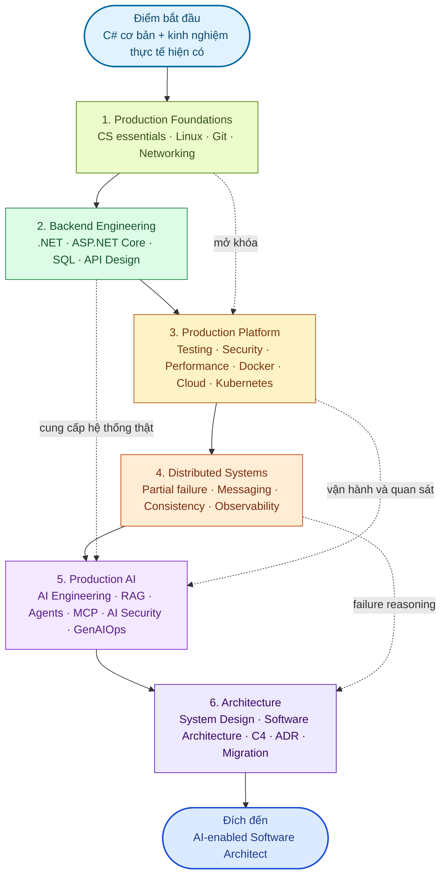
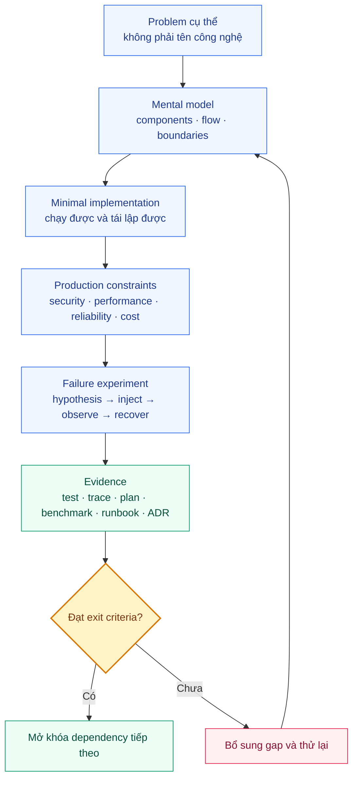
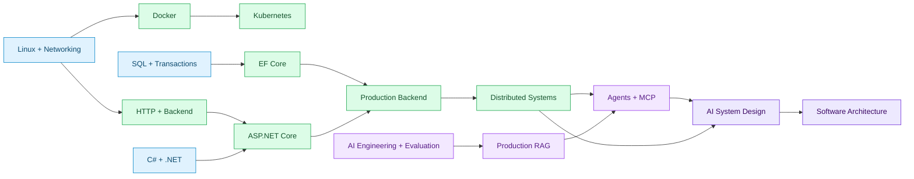

# AI-Enabled Software Architect Knowledge Roadmap

> Lộ trình thực chiến bằng tiếng Việt: từ nền tảng C#/.NET và production engineering đến thiết kế, vận hành và bảo vệ hệ thống AI ở quy mô lớn.

Repository này không phải danh sách công nghệ cần học thuộc. Đây là một hệ thống học dựa trên dependency và bằng chứng, giúp trả lời ba câu hỏi:

1. Cần học gì trước để không chỉ nhớ syntax?
2. Làm sao chứng minh mình có thể implement, operate và design?
3. Khi nào một công nghệ là lựa chọn đúng, và khi nào không nên dùng?

## Roadmap trong một hình

Chi tiết đầy đủ của 27 module và 7 project nằm trong [Master Roadmap](docs/00-roadmap/master-roadmap.md). Thứ tự trên là dependency path, không phải lịch học cứng.

## Học để tạo ra năng lực gì?

| Giai đoạn | Câu hỏi phải trả lời được | Bằng chứng điển hình |
| --- | --- | --- |
| Foundations | Process, memory, filesystem và request path thực sự hoạt động thế nào? | Failure lab, diagnostic timeline, Git recovery |
| Backend | Request đi từ API đến SQL ra sao và contract nào phải được giữ? | Code, tests, API/data dossier, execution plan |
| Platform | Deploy, quan sát, bảo vệ, scale và rollback hệ thống thế nào? | Image/pipeline, threat review, load report, runbook |
| Distributed | Hệ thống phục hồi thế nào khi dependency chậm, mất hoặc trả duplicate? | Failure matrix, idempotency/outbox experiment, SLO |
| Production AI | Làm sao đo quality, kiểm soát data/tool access và rollback AI artifacts? | Eval gate, RAG ACL tests, agent audit, red-team report |
| Architecture | Vì sao chọn kiến trúc này và nó tiến hóa ở 10x/100x ra sao? | NFR, capacity model, C4, ADR, migration và DR plan |

## Trạng thái repository

Trạng thái dưới đây là tiến độ tài liệu, không phải level năng lực của người học.

| Phạm vi | Trạng thái | Điểm vào |
| --- | --- | --- |
| Roadmap foundation | Hoàn thành bản đầu | [Roadmap overview](docs/00-roadmap/README.md) |
| Baseline và source policy | Đã xác minh 2026-08-11 | [Technology baseline](docs/00-roadmap/technology-baseline.md) · [Source policy](docs/00-roadmap/source-policy.md) |
| Module 01 — Computer Science Essentials | Content v1 hoàn thành 4/4; learner evidence pending | [Module overview](docs/01-computer-science/README.md) |
| Module 02 — Linux, Git, Networking | Content v1 hoàn thành 7/7; learner evidence pending | [Module overview](docs/02-linux-git-networking/README.md) |
| Module 03–26 | Planned theo dependency | [Module map](docs/00-roadmap/master-roadmap.md#bản-đồ-module) |
| Project spine | Planned; phát triển dần từ Project 01 đến 07 | [Project spine](docs/00-roadmap/master-roadmap.md#project-spine) |

### Nội dung có thể học ngay

1. [Complexity và workload reasoning](docs/01-computer-science/complexity-and-workload-reasoning.md)
2. [Data structures cho backend systems](docs/01-computer-science/data-structures-for-backend-systems.md)
3. [Process, thread, scheduling và concurrency](docs/01-computer-science/process-thread-scheduling-and-concurrency.md)
4. [Memory, virtual memory, GC và CPU cache](docs/01-computer-science/memory-stack-heap-virtual-memory-and-cache.md)
5. [Production troubleshooting: Process → Socket → HTTP](docs/02-linux-git-networking/production-troubleshooting-foundations.md)
6. [Linux filesystem, permissions và identities](docs/02-linux-git-networking/filesystem-permissions-and-identities.md)
7. [Linux processes, signals và resource pressure](docs/02-linux-git-networking/process-signals-and-resource-pressure.md)
8. [DNS, TCP, TLS và HTTP deep dive](docs/02-linux-git-networking/dns-tcp-tls-http-deep-dive.md)
9. [Git mental model và safe recovery](docs/02-linux-git-networking/git-mental-model-and-safe-recovery.md)
10. [Proxy, NAT, load balancer và network boundaries](docs/02-linux-git-networking/proxy-nat-load-balancer-and-network-boundaries.md)
11. [.NET incident lab end to end](docs/02-linux-git-networking/incident-lab-dotnet-service.md)

Module 01 và 02 đã đủ content v1; bước hoàn thành năng lực tiếp theo là chạy WorkloadLab, incident/Git labs và lưu evidence bằng progress template.

## Cách bắt đầu

### Nếu muốn đi từ đầu

1. Đọc README này để nắm toàn cảnh.
2. Đọc [Learning Path](docs/00-roadmap/learning-path.md) để hiểu 15 phase và các phase gate.
3. Kiểm tra prerequisite tại [Knowledge Dependency Graph](docs/00-roadmap/prerequisites.md).
4. Bắt đầu [Module 01 — Computer Science Essentials](docs/01-computer-science/README.md).
5. Nối mental model sang [Module 02 — Linux, Git và Networking](docs/02-linux-git-networking/README.md).
6. Lưu kết quả bằng [Progress Template](docs/00-roadmap/progress-template.md).

### Nếu đã có kinh nghiệm backend/.NET

1. Mở [Skills Matrix](docs/00-roadmap/skills-matrix.md).
2. Chọn một topic P0 và làm lab/assessment trước khi đọc lại lý thuyết.
3. Bỏ qua nội dung chỉ khi evidence đạt exit criteria; số năm kinh nghiệm không tự nâng level.
4. Ưu tiên gap có ảnh hưởng production: cancellation, SQL plans, security, resource pressure và observability.

### Nếu đã có kinh nghiệm AI/Agents

Không bắt đầu lại bằng tutorial gọi model. Dùng một hệ thống đã làm để đánh giá:

- eval dataset và regression threshold;
- prompt/model/retrieval versioning và rollback;
- RAG ACL, deletion và data lineage;
- tool authorization, approval và audit;
- injection/exfiltration red-team cases;
- quality, latency, token và cost telemetry.

Checklist chi tiết nằm trong [AI experience policy](docs/00-roadmap/master-roadmap.md#ai-experience-policy).

## Một learning slice vận hành thế nào?

Nguyên tắc quan trọng: đọc xong không đồng nghĩa hoàn thành. Level chỉ tăng khi có artifact hoặc kết quả quan sát được.

## Sáu mức năng lực

| Level | Có thể làm gì? | Evidence tối thiểu |
| --- | --- | --- |
| L0 — Unknown | Chưa đánh giá | Chưa có |
| L1 — Awareness | Nhận biết use case và thuật ngữ | Giải thích phạm vi |
| L2 — Can Explain | Giải thích behavior, failure và trade-off | Review questions/diagram |
| L3 — Can Implement | Tạo implementation đúng | Code và test chạy |
| L4 — Can Operate | Deploy, quan sát, chẩn đoán và phục hồi | Failure lab, trace, runbook |
| L5 — Can Design/Review | Chọn hoặc loại phương án theo requirements | ADR, capacity, threat/failure review |

Nguồn chấm chính thức nằm trong [Skills Matrix](docs/00-roadmap/skills-matrix.md).

## Dependency quan trọng cần nhớ

Dependency graph đầy đủ và lý do của từng edge nằm tại [Prerequisites](docs/00-roadmap/prerequisites.md).

## Project spine

Roadmap dùng bảy project tiến hóa để tránh học rời rạc:

~~~text
01 Async File Processor
  → 02 Order Management
  → 03 Production Backend
  → 04 Distributed Notifications
  → 05 Enterprise RAG
  → 06 Production Agent Platform
  → 07 High-scale Multi-region AI System
~~~

Mỗi project giữ lại evidence của phase trước và thêm constraints mới. Đây không phải bảy toy projects độc lập.

## Cấu trúc tài liệu

~~~text
docs/
├── 00-roadmap/
│   ├── master-roadmap.md       phạm vi và đích nghề nghiệp
│   ├── learning-path.md        15 phase và phase gates
│   ├── prerequisites.md        dependency graph
│   ├── skills-matrix.md        level và evidence
│   ├── technology-baseline.md  phiên bản đã xác minh
│   ├── source-policy.md        quy tắc nghiên cứu
│   └── progress-template.md    nhật ký học và evidence
├── 01-computer-science/
│   ├── README.md
│   ├── complexity-and-workload-reasoning.md
│   ├── data-structures-for-backend-systems.md
│   ├── process-thread-scheduling-and-concurrency.md
│   ├── memory-stack-heap-virtual-memory-and-cache.md
│   └── references.md
└── 02-linux-git-networking/
    ├── README.md
    ├── production-troubleshooting-foundations.md
    ├── filesystem-permissions-and-identities.md
    ├── process-signals-and-resource-pressure.md
    ├── dns-tcp-tls-http-deep-dive.md
    ├── git-mental-model-and-safe-recovery.md
    ├── proxy-nat-load-balancer-and-network-boundaries.md
    ├── incident-lab-dotnet-service.md
    └── references.md

labs/
├── 01-computer-science/
│   └── workload-lab/           .NET 10 experiments: lookup, race, locality
└── 02-linux-git-networking/
    └── incident-service/       ứng dụng .NET 10 cho failure lab
~~~

Module Planned chỉ có link khi nội dung đã đủ hữu ích. [Technology Baseline](docs/00-roadmap/technology-baseline.md) phải được kiểm tra lại trước lab phụ thuộc phiên bản.

## Nguyên tắc kiến trúc của roadmap

- Mental model trước syntax.
- Official documentation và specifications quyết định behavior.
- Modular monolith trước microservices; Kubernetes chỉ xuất hiện khi có operational reason.
- Retry cần deadline, idempotency và load budget.
- AI là subsystem: authorization, reliability, privacy và observability vẫn áp dụng.
- Prompt, model, retrieval config, index và eval dataset là production artifacts có version.
- Mọi quyết định lớn phải nêu phương án đơn giản hơn, failure modes, cost và điều kiện xem xét lại.

## Tiếp tục từ đây

Điểm vào thực hành hiện tại là [WorkloadLab](labs/01-computer-science/workload-lab/Program.cs), sau đó [.NET incident lab](docs/02-linux-git-networking/incident-lab-dotnet-service.md). Thứ tự tiếp theo:

1. Chạy lookup, race và locality experiments; lưu prediction, output và interpretation.
2. Chạy Git recovery và incident scenarios; nối resource evidence với mental model Module 01.
3. Đối chiếu Phase 01 gate trong Learning Path.
4. Mở Module 03 — C#/.NET runtime khi prerequisite evidence đạt.

## Verification metadata

- README verified: 2026-08-11.
- Scope: repository navigation, current documentation status và dependency flow.
- Technology details: [Technology Baseline](docs/00-roadmap/technology-baseline.md).
- Source rules: [Source Policy](docs/00-roadmap/source-policy.md).
- Mermaid target: GitHub/CommonMark-compatible flowchart syntax; diagrams vẫn có phần chữ/bảng tương đương để tài liệu đọc được khi renderer không hỗ trợ Mermaid.

<!-- Mermaid.js Script CDN hỗ trợ tự động render sơ đồ Mermaid trên GitHub Pages (Jekyll) -->
