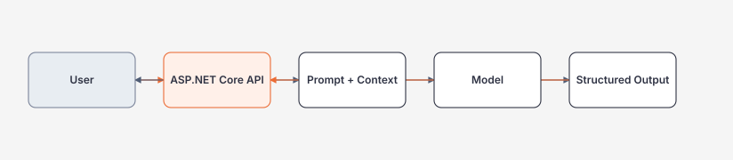
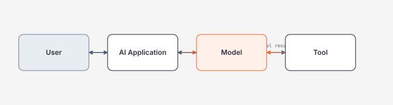

# Cách đọc tài liệu này mà không bị ngợp

Tài liệu này **không nên đọc như một cuốn sách từ đầu đến cuối**. Mỗi chủ đề nên đi theo vòng lặp ngắn: hiểu vấn đề → chạy ví dụ → quan sát kết quả → rồi mới đọc internals và architecture.

## Cách đọc một chapter trong 30–60 phút

### Bước 1 — Hiểu trong 5 phút

Chỉ trả lời ba câu:

1. Công nghệ/pattern này giải quyết vấn đề gì?
2. Input → processing → output đi qua những bước nào?
3. Nếu bỏ nó đi thì hệ thống hỏng hoặc khó ở đâu?

Nếu chưa trả lời được ba câu này, **chưa cần đọc Internals**.

### Bước 2 — Chạy code trước

Ưu tiên code có thể copy/chạy được. Ví dụ với AI:

```csharp
ChatResponse response = await chatClient.GetResponseAsync(
    "Giải thích idempotency bằng một ví dụ HTTP API",
    cancellationToken: cancellationToken);

Console.WriteLine(response.Text);
```

Sau đó tự thay prompt, timeout, model hoặc dữ liệu để xem behavior đổi thế nào.

### Bước 3 — Vẽ mental model

Ví dụ AI application:



Nếu có tool calling:



### Bước 4 — Cố tình làm hỏng

Học production bằng failure experiment:

- timeout model;
- trả JSON sai schema;
- tool trả 500;
- prompt chứa instruction độc hại;
- retrieval trả document sai tenant;
- agent cố gọi tool write ngoài quyền.

Quan sát logs, metrics, trace và recovery behavior.

### Bước 5 — Mới đọc Architect Perspective

Chỉ sau khi đã chạy code, trả lời:

- giải pháp đơn giản hơn là gì;
- failure mode lớn nhất là gì;
- operational burden là gì;
- 10x traffic thì bottleneck chuyển đi đâu;
- khi nào phải đổi kiến trúc.

## Cấu trúc dễ đọc mới

Các chapter mới ưu tiên thứ tự:

1. **Hiểu trong 5 phút**
2. **Code đầu tiên**
3. **Mental model**
4. **Giải thích từng dòng quan trọng**
5. **Production example**
6. **Failure experiment**
7. **Common mistakes**
8. **Performance / Security / Observability**
9. **Architect Perspective**
10. **Lab + Exit Criteria**

## Đọc tiếng Việt, giữ thuật ngữ tiếng Anh

Ví dụ:

| Tiếng Việt | Canonical English |
| --- | --- |
| đầu ra có cấu trúc | Structured Output |
| gọi công cụ | Tool Calling / Function Calling |
| truy xuất tăng cường | Retrieval-Augmented Generation (RAG) |
| đánh giá | Evaluation / Evals |
| truy vết phân tán | Distributed Tracing |
| tác nhân lập trình | AI Coding Agent |

Không cố dịch tên API, package, CLI command hoặc protocol.

## Nguyên tắc code example

Một chapter P0/P1 chỉ được xem là đủ sâu khi có ít nhất:

- một minimal code example;
- một production-oriented example;
- một failure example;
- một verification step;
- giải thích vì sao code được viết như vậy.

Generic prose không có code/behavior cụ thể chỉ được xem là **outline**, không phải `Content v1`.
