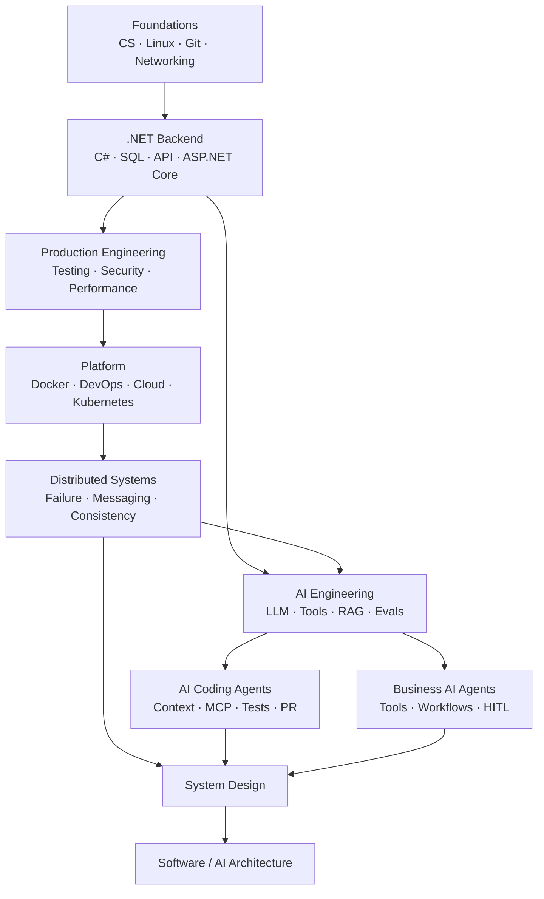

# Master Roadmap — .NET Backend → AI-enabled Software Architect

> Nếu trang này dài, đọc [Cách đọc tài liệu](how-to-read.md) trước. Không cần học tuần tự mọi module.

## Đích nghề nghiệp

```text
Business problem
  ↓
Requirements + NFR
  ↓
Simple design
  ↓
Code + tests
  ↓
Failure / Security / Performance
  ↓
Operations + Evidence
  ↓
Architecture decision
```

Đích đến là **AI-enabled Software Architect** có thể thiết kế và review hệ thống .NET + distributed systems + AI bằng evidence, không bằng tên pattern.

---

# 1. Roadmap trong một hình



---

# 2. Priority

| Priority | Nghĩa |
| --- | --- |
| **P0 — Core** | phải implement, debug, operate và design/review được |
| **P1 — Important** | phải dùng hoặc review tự tin |
| **P2 — Selective** | học đủ để ra quyết định; deep dive khi project cần |
| **P3 — Awareness** | biết use case, risk và nơi tra cứu |

---

# 3. Module map

| Module | Trọng tâm | Priority | Status |
| --- | --- | --- | --- |
| 00 Roadmap | dependency, baseline, source policy | P0 | v1 |
| 01 Computer Science | complexity, OS, memory, concurrency | P0/P2 | Content v1 |
| 02 Linux/Git/Networking | process, DNS/TCP/TLS/HTTP, troubleshooting | P0 | Content v1 |
| 03 .NET | C#, async, GC, ThreadPool, hosting, diagnostics | P0 | Content v1 |
| 04 Backend | request lifecycle, auth, pagination, jobs/webhooks | P0 | Content v1 |
| **05 SQL** | transactions, indexes, plans, EF→SQL | **P0** | **Code-first deep rewrite v1: 4 guides** |
| 06 API Design | contracts, evolution, REST/RPC/events | P0 | Structure v1; deep rewrite pending |
| **07 ASP.NET Core** | pipeline, resilience, deployment/OTel | **P0** | **Code-first deep rewrite v1: 3 guides** |
| 08 Testing/Review | test boundaries, integration/load, review | P0 | Structure v1; deep rewrite pending |
| 09 Security/DevSecOps | identity, API/app security, supply chain | P0/P1 | Structure v1; deep rewrite pending |
| 10 Performance | measurement, profiling, load/capacity | P0 | Structure v1; deep rewrite pending |
| 11 Redis/Caching | cache, data structures, HA/failure | P1 | Structure v1; deep rewrite pending |
| **12 Docker** | build, runtime/network/storage, Compose/security | **P0** | **Code-first deep rewrite v1: 3 guides** |
| 13 DevOps/IaC | CI/CD, artifacts, Terraform, safe delivery | P1 | Structure v1; deep rewrite pending |
| 14 Cloud | compute/network/data/identity/regions/DR/cost | P1 | Structure v1; deep rewrite pending |
| **15 Kubernetes** | reconciliation, workloads/network/storage/security | **P1** | **Code-first deep rewrite v1: 3 guides** |
| 16 Observability | logs, metrics, traces, OTel, SLI/SLO | P0/P1 | Foundation covered in ASP.NET/K8s; dedicated module planned |
| **17 Distributed Systems** | partial failure, messaging, consistency | **P0** | **Code-first v1: 4 guides + references** |
| 18 Data Engineering | ingestion, CDC, batch/stream, lineage | P2 | Planned |
| **19 AI Engineering** | provider abstraction, structured output, tools, eval | **P0** | **Code-first v1: 3 guides** |
| 20 RAG | full ingestion/retrieval lifecycle, ACL, deletion/versioning | P0 | Foundation covered in 19; dedicated module planned |
| 21 Business AI Agents/MCP | tools, workflow, state, HITL, authorization | P0 | Planned — advanced-first |
| **21A AI Coding Agents** | repo context, MCP, build/test/PR safety | **P0/P1** | **Code-first v1: 3 guides** |
| 22 AI Security | injection, exfiltration, tool abuse, red teaming | P0/P1 | Planned |
| 23 GenAIOps/MLOps | prompt/model/index lifecycle, eval gates, rollout | P0/P1/P2 | Planned |
| 24 System Design | requirements, capacity, distributed + AI design | P0 | Planned |
| 25 Software Architecture | boundaries, styles, evolution, migration | P0 | Planned |
| 26 Architecture Docs | C4, ADR, RFC, threat/failure/runbook | P1 | Planned |

`Code-first v1` nghĩa tài liệu đã có code/config, production reasoning và failure experiment. **Learner evidence vẫn phải tự chạy**; documentation status không đồng nghĩa người học đã đạt skill level.

---

# 4. Các module nên đọc ngay

## SQL

1. [SQL overview](../05-sql/README.md)
2. [Transactions, Isolation và Concurrency](../05-sql/transactions-isolation-and-concurrency.md)
3. [Indexes, Execution Plans và Operations](../05-sql/indexes-execution-plans-and-operations.md)
4. [EF Core → SQL → Execution Plan](../05-sql/ef-core-query-shape-and-sql.md)

Chuỗi bắt buộc:

```text
LINQ
→ Generated SQL
→ Actual Execution Plan
→ Index
→ Logical Reads / CPU / I/O
```

## ASP.NET Core

1. [ASP.NET Core overview](../07-aspnet-core/README.md)
2. [Pipeline, Hosting và Configuration](../07-aspnet-core/pipeline-hosting-and-configuration.md)
3. [Resilience, Security và Middleware](../07-aspnet-core/resilience-security-and-middleware.md)
4. [Deployment, Observability và Operations](../07-aspnet-core/deployment-observability-and-operations.md)

Có code cho middleware, DI, Options, cancellation, rate limiting, idempotency, `HttpClient`, OTel, health/readiness và rollout.

## Docker + Kubernetes

Docker:

- [overview](../12-docker/README.md)
- [image/build](../12-docker/images-builds-and-reproducibility.md)
- [runtime/network/storage/resources](../12-docker/runtime-networking-storage-and-resources.md)
- [Compose/security/operations](../12-docker/docker-security-compose-and-operations.md)

Kubernetes:

- [overview](../15-kubernetes/README.md)
- [architecture/reconciliation](../15-kubernetes/cluster-architecture-and-reconciliation.md)
- [workloads/network/storage](../15-kubernetes/workloads-networking-and-storage.md)
- [security/observability/operations](../15-kubernetes/kubernetes-security-observability-and-operations.md)

## Distributed Systems

1. [Overview](../17-distributed-systems/README.md)
2. [Partial Failure, Retry và Idempotency](../17-distributed-systems/partial-failure-timeouts-retries-and-idempotency.md)
3. [Messaging, Outbox, Inbox và Dedup](../17-distributed-systems/messaging-outbox-inbox-and-dedup.md)
4. [Consistency, Ordering, Saga và Backpressure](../17-distributed-systems/consistency-ordering-saga-and-backpressure.md)

Failure-first progression:

```text
Timeout = unknown outcome
→ retry only when semantics permit
→ idempotency
→ at-least-once delivery
→ outbox/inbox/dedup
→ ordering/consistency
→ saga/compensation
→ backpressure/capacity
```

## AI Engineering

1. [AI Engineering cho .NET](../19-ai-engineering/README.md)
2. [Structured Output và Tool Calling](../19-ai-engineering/structured-output-and-tool-calling.md)
3. [RAG, Evaluation và Observability](../19-ai-engineering/rag-evaluation-and-observability.md)

## AI Coding Agents

1. [AI Coding Agents](../21-ai-coding-agents/README.md)
2. [Repository Context, Instructions và MCP](../21-ai-coding-agents/repository-context-mcp-and-instructions.md)
3. [Safe Agentic Coding Workflow](../21-ai-coding-agents/safe-agentic-coding-workflow.md)

---

# 5. Code/readability quality gate

Một chapter P0/P1 implementation-heavy phải có, khi phù hợp:

```text
Hiểu trong 5 phút
+ mental model
+ minimal runnable code/config
+ production-oriented example
+ broken/failure example
+ command/test để verify
+ security/performance/observability
+ architect trade-offs
```

Generic prose có thể copy sang công nghệ khác = **outline**, không phải deep content.

Default reading order:

```text
Problem
→ Code
→ Mental Model
→ Failure
→ Internals
→ Operations
→ Architecture
```

---

# 6. Foundation scope

## .NET Backend

- C# type system, collections, LINQ, exceptions, `IDisposable`.
- `Task`, `async/await`, cancellation, ThreadPool, GC.
- Generic Host, DI, configuration, logging.
- HTTP request lifecycle, AuthN/AuthZ, validation.
- pagination/idempotency/rate limiting/cache/background work.
- SQL Server transactions/indexes/plans + EF query shape.
- API contract/evolution.

## Platform

- testing/code review/security/performance;
- Redis;
- Docker;
- CI/CD/Terraform/cloud;
- Kubernetes;
- observability/SLO.

## Distributed Systems

- timeout/retry/backoff/jitter;
- circuit breaker/bulkhead;
- idempotency/dedup/order;
- queue/pub-sub/backpressure/DLQ;
- outbox/inbox/saga;
- eventual consistency/recovery.

## Production AI

- provider/model abstraction;
- structured output;
- RAG;
- tool calling;
- evaluation/regression;
- AI observability/cost;
- AI/tool security;
- business agents + coding agents.

## Architecture

- requirements/NFR/capacity;
- modular monolith before microservices;
- data/security/deployment/migration architecture;
- C4/ADR/RFC/threat model/runbook.

---

# 7. Project spine

| Project | Trọng tâm | Evidence |
| --- | --- | --- |
| 01 Async File Processor | I/O, Channels, cancellation, concurrency | failure tests + resource measurement |
| 02 Order Management | ASP.NET Core, SQL, EF, API/security | contract + data model + tests |
| 03 Production Backend | Redis, Docker, workers, observability, CI | SLO + load report + runbook |
| 04 Distributed Notifications | broker, outbox, dedup, DLQ, K8s | ADR + outage/replay drills |
| 05 Enterprise RAG | ingestion, ACL, retrieval, deletion, eval | lineage + eval + threat model |
| 06 Production Agent Platform | tools, MCP, workflow, approval, audit | trust boundary + red-team gates |
| 07 High-scale AI System Design | multi-region/provider | C4 + capacity + cost + DR + migration |

---

# 8. Definition of Done

Evidence tốt:

```text
code chạy
unit/integration test
execution plan
trace
load/eval report
failure experiment
PR review
ADR/runbook
```

“Đã đọc xong” không phải evidence.

## Verification metadata

- Verified: 2026-08-12
- Scope discovery: https://roadmap.sh/roadmaps/
- Technology baseline: [technology-baseline.md](technology-baseline.md)
- Source policy: [source-policy.md](source-policy.md)
