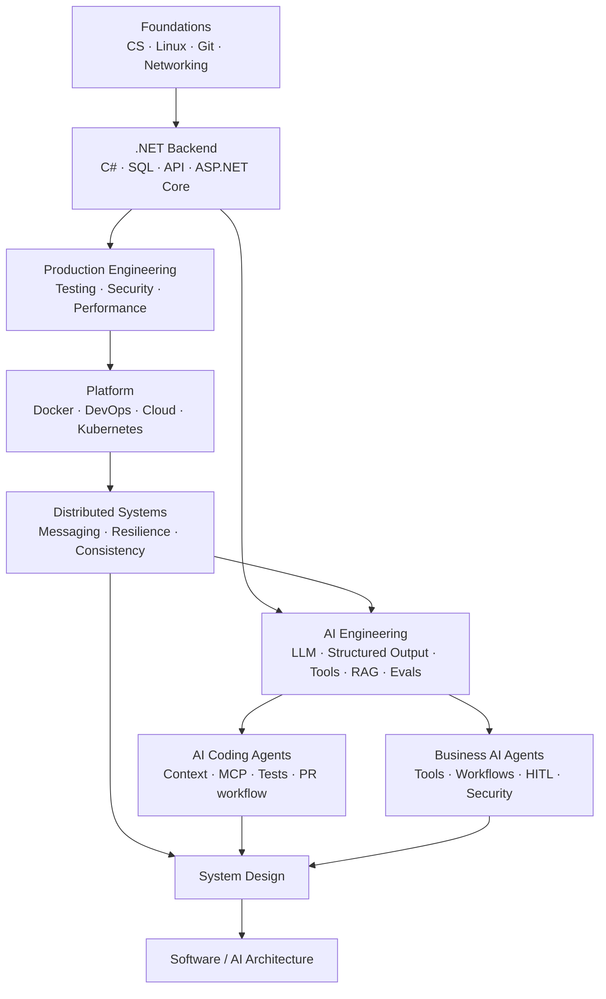

# Master Roadmap — .NET Backend → AI-enabled Software Architect

## Đích nghề nghiệp

Mục tiêu không phải “biết thật nhiều tên công nghệ”. Mục tiêu là có thể đi từ:

```text
Business problem
  ↓
Requirements + NFR
  ↓
Simple design
  ↓
Implementation
  ↓
Failure / Security / Performance
  ↓
Operations + Evidence
  ↓
Architecture decision
```

Đích đến: **AI-enabled Software Architect** có thể thiết kế, triển khai, vận hành, bảo vệ và tiến hóa hệ thống .NET + distributed systems + AI.

Nếu trang này quá dài, đọc [Cách đọc tài liệu](how-to-read.md) trước.

---

# 1. Roadmap ngắn gọn



---

# 2. Priority

| Priority | Nghĩa |
| --- | --- |
| **P0 — Core** | Phải hiểu sâu, implement/operate/design được |
| **P1 — Important** | Phải dùng hoặc review tự tin |
| **P2 — Selective** | Học đủ để quyết định kiến trúc; deep dive khi project cần |
| **P3 — Awareness** | Biết use case, risk và nơi tra cứu |

---

# 3. Module map

| Module | Trọng tâm | Priority | Status |
| --- | --- | --- | --- |
| 00 Roadmap | dependency, baseline, source policy | P0 | v1 |
| 01 Computer Science | complexity, OS, memory, concurrency | P0/P2 | Content v1 |
| 02 Linux/Git/Networking | process, DNS/TCP/TLS/HTTP, troubleshooting | P0 | Content v1 |
| 03 .NET | C#, async, GC, ThreadPool, hosting, diagnostics | P0 | Content v1 |
| 04 Backend | request lifecycle, auth, pagination, jobs/webhooks | P0 | Content v1 |
| 05 SQL | relational, transactions, indexes, plans, operations | P0 | Structure v1; deep rewrite pending |
| 06 API Design | contracts, evolution, REST/RPC/events | P0 | Structure v1; deep rewrite pending |
| 07 ASP.NET Core | pipeline, hosting, resilience, deployment | P0 | Structure v1; deep rewrite pending |
| 08 Testing/Review | test boundaries, integration/load, review | P0 | Structure v1; deep rewrite pending |
| 09 Security/DevSecOps | identity, API/app security, supply chain | P0/P1 | Structure v1; deep rewrite pending |
| 10 Performance | measurement, profiling, load/capacity | P0 | Structure v1; deep rewrite pending |
| 11 Redis/Caching | cache, data structures, HA/failure | P1 | Structure v1; deep rewrite pending |
| 12 Docker | images, runtime, network, storage, security | P0 | Structure v1; deep rewrite pending |
| 13 DevOps/IaC | CI/CD, artifacts, Terraform, safe delivery | P1 | Structure v1; deep rewrite pending |
| 14 Cloud | compute/network/data/identity/regions/DR/cost | P1 | Structure v1; deep rewrite pending |
| 15 Kubernetes | reconciliation, workload/network/storage/security | P1 | Structure v1; deep rewrite pending |
| 16 Observability | logs, metrics, traces, OTel, SLI/SLO | P0/P1 | Planned |
| 17 Distributed Systems | partial failure, messaging, consistency | P0 | Planned |
| 18 Data Engineering | ingestion, CDC, batch/stream, lineage | P2 | Planned |
| **19 AI Engineering** | provider abstraction, structured output, tools, eval | **P0** | **Code-first v1: 3 guides available** |
| 20 RAG | full ingestion/retrieval lifecycle, ACL, deletion/versioning | P0 | Foundation covered in 19; dedicated deep module planned |
| 21 Business AI Agents/MCP | tools, workflow, state, HITL, authorization | P0 | Planned — advanced-first |
| **21A AI Coding Agents** | repo context, instructions, MCP, build/test/PR safety | **P0/P1** | **Code-first v1: 3 guides available** |
| 22 AI Security | injection, exfiltration, tool abuse, red teaming | P0/P1 | Planned |
| 23 GenAIOps/MLOps | prompt/model/index lifecycle, eval gates, rollout | P0/P1/P2 | Planned |
| 24 System Design | requirements, capacity, distributed + AI design | P0 | Planned |
| 25 Software Architecture | boundaries, styles, evolution, migration | P0 | Planned |
| 26 Architecture Docs | C4, ADR, RFC, threat/failure/runbook | P1 | Planned |

---

# 4. AI Engineering đã có thể học ngay

Bắt đầu:

1. [AI Engineering cho .NET](../19-ai-engineering/README.md)
2. [Structured Output và Tool Calling](../19-ai-engineering/structured-output-and-tool-calling.md)
3. [RAG, Evaluation và Observability](../19-ai-engineering/rag-evaluation-and-observability.md)

Trọng tâm:

```text
IChatClient / provider abstraction
→ structured business contract
→ tool calling
→ authorization + idempotency
→ RAG retrieval boundary
→ eval dataset/regression gate
→ latency/token/cost/observability
```

Không học kiểu:

```text
prompt → model → string → xong
```

---

# 5. AI Coding Agents đã có thể học ngay

Bắt đầu:

1. [AI Coding Agents](../21-ai-coding-agents/README.md)
2. [Repository Context, Instructions và MCP](../21-ai-coding-agents/repository-context-mcp-and-instructions.md)
3. [Safe Agentic Coding Workflow](../21-ai-coding-agents/safe-agentic-coding-workflow.md)

Track này dành cho workflow Codex/Copilot/Claude Code và các coding agent tương tự.

Mental model:

```text
Task
→ repository discovery
→ plan
→ scoped edits
→ targeted tests
→ full build/test
→ diff/security review
→ draft PR
→ human review
```

Coding agent được xem như **privileged automation actor có LLM planner**, không phải developer có quyền vô hạn.

---

# 6. Scope theo track

## Foundations

- Big-O/data structures đủ dùng cho backend/system design.
- Process, thread, scheduling, memory, filesystem, CPU/cache.
- Linux resources, permissions, signals.
- DNS, TCP, TLS, HTTP, NAT, proxy/load balancer.
- Git history, branch, recovery, review.

## .NET Backend

- C# type system, collections, LINQ, exceptions, `IDisposable`.
- `Task`, `async/await`, `CancellationToken`, ThreadPool, GC.
- Generic Host, DI, config, logging.
- HTTP request lifecycle, AuthN/AuthZ, validation.
- pagination, idempotency, rate limiting, cache, background work.
- SQL/SQL Server: transaction, index, plan, Query Store, EF query shape.
- API contract/evolution.

## Production Platform

- testing/code review;
- API/app security + DevSecOps;
- performance/load/capacity;
- Redis;
- Docker;
- CI/CD/Terraform;
- cloud/Kubernetes;
- OpenTelemetry/SLI/SLO.

## Distributed Systems

- timeout/retry/backoff/jitter;
- circuit breaker/bulkhead/rate limit;
- idempotency/dedup/order;
- queue/pub-sub/stream/backpressure/DLQ;
- outbox/inbox/saga;
- eventual consistency/replication/partitioning;
- partial failure/recovery.

## Production AI

- model/provider abstraction;
- structured output;
- embeddings/RAG;
- tool calling;
- evaluation dataset/gates;
- prompt/model/index versioning;
- AI observability/cost;
- prompt injection/data leakage/tool authorization;
- business agent workflows/HITL;
- coding-agent repository/tool/CI boundaries.

## Architecture

- functional requirements + NFR;
- capacity;
- architecture styles;
- modular monolith before microservices;
- data/security/deployment/migration architecture;
- C4/ADR/RFC/threat model/runbook.

---

# 7. Readability + Code Quality Gate

Đây là rule mới cho repository.

Một chapter P0/P1 **không được** gọi là deep content chỉ vì có đủ heading.

Tối thiểu cần, khi phù hợp:

```text
Hiểu trong 5 phút
+ mental model
+ minimal code/config
+ production example
+ failure experiment
+ verification
+ common mistakes
+ security/performance/observability
+ architect trade-offs
```

### Code gate

Một chapter implementation-heavy nên có ít nhất:

- 1 minimal example;
- 1 production-oriented example;
- 1 broken/failure example;
- command/test để verify.

### Readability gate

Nếu người đọc phải hiểu internals trước mới biết công nghệ giải quyết vấn đề gì, chapter đang viết sai thứ tự.

Thứ tự mặc định:

```text
Problem
→ Code
→ Mental Model
→ Explanation
→ Failure
→ Internals
→ Architecture
```

Xem [Cách đọc tài liệu](how-to-read.md).

---

# 8. AI experience policy

Người đọc đã có kinh nghiệm AI Engineering, Agents và Prompt Engineering.

Vì vậy không lặp quá nhiều tutorial “first chat completion”. Deep track tập trung vào:

- eval/regression;
- provider/model portability;
- RAG ACL/deletion/versioning;
- tool authorization/idempotency;
- prompt injection;
- AI observability/cost;
- coding-agent permissions/sandbox/context;
- rollout/rollback.

Kinh nghiệm dự án là input cho gap analysis, không tự động chứng minh L5 architecture.

---

# 9. Project spine

| Project | Học gì | Evidence |
| --- | --- | --- |
| 01 Async File Processor | I/O, Channels, cancellation, concurrency | failure tests + resource measurement |
| 02 Order Management | ASP.NET Core, SQL, EF, API/security | API contract + data model + tests |
| 03 Production Backend | Redis, Docker, workers, observability, CI | SLO + load report + runbook |
| 04 Distributed Notifications | broker, outbox, dedup, DLQ, K8s | ADR + failure/replay procedure |
| 05 Enterprise RAG | ingestion, ACL, retrieval, deletion, eval | lineage + eval + threat model |
| 06 Production Agent Platform | tools, MCP, workflow, approval, audit | trust boundary + red-team gates |
| 07 High-scale AI System Design | multi-region/provider, cost/reliability | full C4 + capacity + DR + migration |

Thêm một cross-cutting exercise cho mọi project:

```text
Cho AI Coding Agent implement một scoped change
→ bắt nó chạy tests
→ inspect diff
→ review security/architecture
→ đo human rework
```

---

# 10. Definition of Done

Module/chapter chỉ hoàn thành khi có **observable evidence**, ví dụ:

- code chạy;
- test;
- execution plan;
- trace;
- benchmark có phương pháp;
- failure experiment;
- eval report;
- PR review;
- ADR/runbook.

Không dùng “đã đọc xong” làm evidence.

## Verification metadata

- Verified: 2026-08-12
- Scope discovery: https://roadmap.sh/roadmaps/
- AI Engineer: https://roadmap.sh/ai-engineer
- AI Agents: https://roadmap.sh/ai-agents
- Technology baseline: [technology-baseline.md](technology-baseline.md)
- Source policy: [source-policy.md](source-policy.md)
