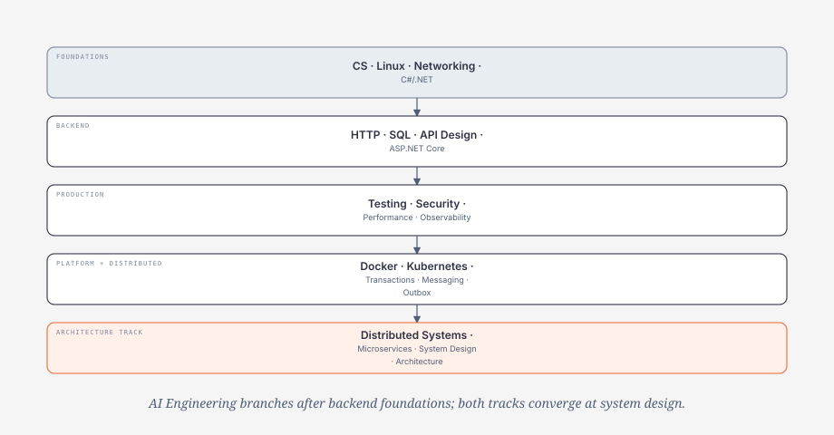

# Knowledge Dependency Graph

> Một topic đứng trước topic khác khi thiếu nó khiến người học chỉ nhớ syntax mà không giải thích được behavior, failure hoặc trade-off.



## Dependency rules quan trọng

| Học sau | Prerequisite tối thiểu | Vì sao |
|---|---|---|
| ASP.NET Core | HTTP, process/socket, DI, async/cancellation | middleware syntax không giải thích request lifecycle/saturation |
| EF Core performance | SQL, indexes, execution plan | LINQ không cho biết database thực sự làm gì |
| Security/AuthZ | HTTP/API identity + resource ownership | token syntax không thay authorization model |
| Performance | workload + telemetry + SQL/runtime basics | optimization không có baseline dễ tối ưu sai layer |
| Redis caching | performance bottleneck + source of truth + staleness tolerance | cache thêm consistency/failure cost |
| Docker | Linux process/filesystem/signals/networking | container là process isolation, không phải “VM nhẹ” |
| DevOps/IaC | Git + tests + artifact/container concepts | pipeline phải promote evidence/artifact, không chạy command mù |
| Kubernetes | Docker/container model, DNS/networking, resources, health semantics | YAML không giải thích reconciliation/readiness/scheduling |
| AKS | Kubernetes core + Azure identity/networking | provider mapping không thay Kubernetes mental model |
| Outbox | local transaction, messaging, idempotency | pattern vô nghĩa nếu chưa hiểu atomic boundary và duplicate |
| Microservices | modular boundaries + Distributed Systems + observability/delivery | tách process tạo network/data/deployment/operations cost |
| System Design | FR/NFR, capacity, data/distributed fundamentals | component choice phải theo requirement/scale/failure |
| Software Architecture | system behavior + boundaries/ownership + migration | pattern không phải recipe; structure phải bảo vệ quality attributes |
| Production RAG | data lifecycle, retrieval, AuthZ, evaluation | vector search demo không đủ cho ACL/deletion/regression |
| AI tools/agents | tool contracts, identity/AuthZ, distributed side-effect reasoning | prompt/tool discovery không thay security/correctness boundary |

---

# Dependency stack

```text
CS + Linux/Git/Networking
        ↓
.NET Runtime
        ↓
Backend + SQL + API + ASP.NET Core
        ↓
Testing + Security + Performance
        ↓
Redis only when justified
        ↓
Docker
        ↓
DevOps / IaC
        ↓
Azure provider knowledge
        ↘
         Kubernetes core when needed
        ↓
Distributed Systems
        ↓
Microservices when justified
        ↓
System Design
        ↓
Software Architecture
```

AI Engineering can branch after Backend/Production foundations and then reuse Cloud, Distributed, System Design and Architecture depth as the product demands.

---

# Entry criteria theo major track

## Backend Core

Before deep ASP.NET Core:

```text
HTTP semantics
C# async/cancellation
DI/config/logging
SQL basics
API contract basics
```

Evidence:

- trace one request;
- explain cancellation propagation;
- design one transaction invariant;
- distinguish authentication vs authorization.

---

## Performance / Redis

Before cache optimization:

```text
representative workload
P95/P99 or other target
source of truth
measured bottleneck
allowed staleness
```

Anti-shortcut:

```text
SQL query slow
→ first inspect query/index/plan
not automatically
→ add Redis
```

---

## Docker

Need:

```text
Linux process
filesystem
signals
ports/DNS/network
CPU/memory basics
```

Must explain:

```text
image != container
container != VM
container filesystem != durable storage
localhost inside container != another container
```

---

## DevOps / IaC

Need:

```text
Git commit/branch/diff
quality tests
artifact identity
container build basics
```

Then reason:

```text
PR
→ gates
→ immutable artifact
→ promotion
→ deployment
→ verification
→ rollback/recovery
```

Terraform is easier to learn correctly after understanding resource lifecycle/state and environment boundaries.

---

## Kubernetes

Need:

```text
Linux/network diagnostics
container image/runtime/lifecycle
configuration/secrets concepts
CPU/memory requests intuition
health/readiness semantics
artifact/deployment lifecycle
```

Minimum mental model before advanced YAML:

```text
Control Plane manages desired state
Worker runs workloads
kube-apiserver is API boundary
scheduler chooses node
kubelet materializes Pod on node
```

And:

```text
Deployment → ReplicaSet → Pod → Container
Client → DNS → Service → selector → Ready Pods
```

Do not start with Helm/service mesh/GitOps before these flows are clear.

---

## Azure / AKS

Azure service selection needs cloud primitives:

```text
identity
network
compute
data
messaging
availability
cost
```

AKS needs both:

```text
Kubernetes core
+
Azure identity/network/compute/observability
```

Avoid learning AKS as a list of Azure blades while Kubernetes concepts remain unclear.

---

## Distributed Systems

Entry knowledge:

```text
network timeout
local transaction boundary
idempotency basics
API/message contracts
logs/metrics/traces
```

Before Microservices, explain:

- timeout can mean unknown outcome;
- retry can amplify/duplicate;
- Outbox/Inbox/Dedup;
- at-least-once delivery;
- eventual consistency;
- Saga/compensation/reconciliation;
- backpressure/order scope.

→ [Module 17](../17-distributed-systems/README.md)

---

## Microservices Architecture

Prerequisite:

```text
Distributed Systems
+
module/domain boundaries
+
data ownership
+
API/event compatibility
+
observability/deployment basics
```

Entry evidence:

```text
[ ] design idempotent side effect
[ ] explain DB + broker dual-write gap
[ ] distinguish authoritative state vs projection
[ ] trace across network boundaries
[ ] explain rolling compatibility
[ ] identify why one capability actually needs independent lifecycle
```

Do not call this learning complete because three APIs run in Docker Compose.

---

## System Design

Need enough foundation to quantify:

```text
FR/NFR
RPS/concurrency/data volume
latency/SLO
source of truth
consistency
failure modes
```

Then component selection becomes a response to pressure rather than a pattern quiz.

---

## Software Architecture

Need:

```text
system behavior/failure
quality attributes
business/data ownership
integration/deployment constraints
```

Architecture must answer why a boundary/style protects a quality attribute and what complexity it buys.

---

## Production AI

Before advanced AI orchestration, know:

```text
backend/API
AuthN/AuthZ
data lifecycle
timeout/cancellation
observability
release/test discipline
```

RAG adds:

```text
retrieval quality
ACL/security trimming
freshness/deletion/versioning
evaluation
```

Tools/agents add:

```text
application authorization
side-effect idempotency/unknown outcome
least privilege
audit/human review where appropriate
```

---

# Anti-shortcut checks

- Không đọc được execution plan → chưa tối ưu EF query bằng “best practice”.
- Không có baseline/workload → chưa justify cache/autoscaling.
- Không giải thích SIGTERM/readiness → chưa thiết kế rolling shutdown tốt.
- Không hiểu container DNS/ports → chưa sẵn sàng Kubernetes networking.
- Không có idempotency boundary → chưa thêm retry cho side effect.
- Không hiểu timeout = unknown outcome → chưa thiết kế payment workflow phân tán.
- Service share DB/domain model + lock-step release → chưa có microservice autonomy thật.
- Không có trace/SLO/runbook → distributed/microservice operations chưa production-ready.
- Không có eval dataset → chưa tuyên bố model/prompt/retrieval mới “tốt hơn”.
- Không có NFR/capacity → chưa chọn Kubernetes/microservices/sharding/multi-region.

---

# Recommended path

```text
CS
→ Linux/Git/Networking
→ .NET
→ Backend + SQL + API + ASP.NET Core
→ Testing + Security + Performance
→ Redis only when justified
→ Docker
→ DevOps/IaC
→ Azure and/or Kubernetes according to role
→ Distributed Systems
→ Microservices when justified
→ System Design
→ Software Architecture
```

For a shorter role-specific path:
→ [Role-based Learning Paths](role-based-learning-paths.md)

## Verification metadata

- Reviewed: 2026-08-28.
- Dependency graph aligned with current DevOps/Kubernetes separation and actual repository modules.
- Quality principle: prerequisite exists to protect mental model/failure reasoning, not to force sequential reading.
