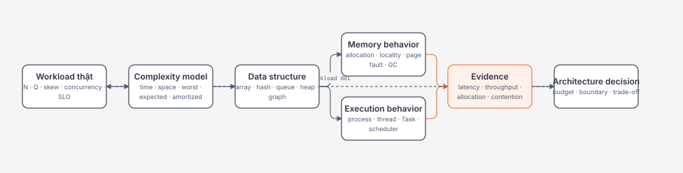
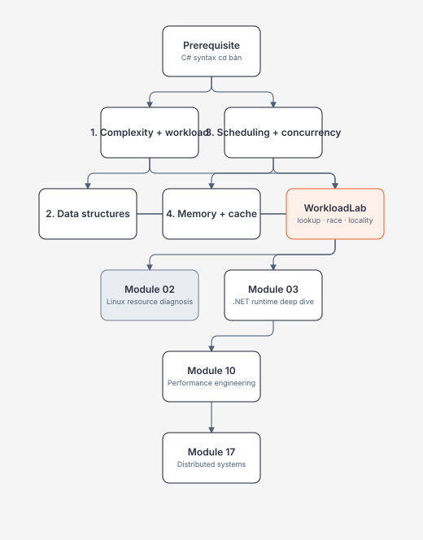
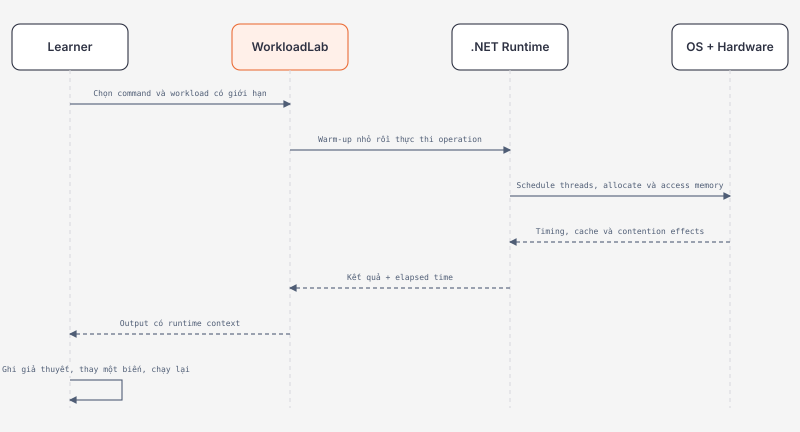

# Module 01 — Computer Science Essentials cho Backend và System Design

> [← README tổng quan](../../README.md) · [Roadmap](../00-roadmap/README.md) · [Module 02](../02-linux-git-networking/README.md)

Module này xây nền để giải thích vì sao một hệ thống nhanh, chậm, sai hoặc không ổn định. Phạm vi cố ý chọn lọc: chỉ học Computer Science có tác động trực tiếp đến backend, .NET, production troubleshooting và system design; không biến roadmap thành một bằng Computer Science hay bộ đề phỏng vấn thuật toán.

## Module trong một hình



Đọc sơ đồ từ trái sang phải: Big-O chỉ hữu ích sau khi định nghĩa đúng input và operation. Data structure quyết định cả complexity lẫn memory layout. Runtime và OS quyết định work được chạy khi nào. Chỉ evidence trên workload đại diện mới đủ để đưa ra quyết định kiến trúc.

## Phạm vi và trạng thái

| Learning slice | Priority | Trạng thái nội dung | Evidence người học |
| --- | --- | --- | --- |
| [Complexity và workload reasoning](complexity-and-workload-reasoning.md) | P1 | Content v1 | Pending |
| [Data structures cho backend](data-structures-for-backend-systems.md) | P1/P2 | Content v1 | Pending |
| [Process, thread, scheduling và concurrency](process-thread-scheduling-and-concurrency.md) | P0 | Content v1 | Pending |
| [Memory, virtual memory, GC và cache](memory-stack-heap-virtual-memory-and-cache.md) | P0 | Content v1 | Pending |
| [WorkloadLab .NET 10](../../labs/01-computer-science/workload-lab/Program.cs) | P0/P1 | Buildable lab | Pending run report |

Content v1 nghĩa là tài liệu đã có mental model, production constraints, failure experiment, nguồn và exit criteria. Nó không có nghĩa người học đã đạt level trong Skills Matrix.

## Dependency map



Không cần đợi học hết lý thuyết mới chạy lab. Vòng học phù hợp là: dự đoán → chạy → giải thích kết quả → thay workload → kiểm tra lại giả thuyết.

## Bốn mental model phải giữ lại

### 1. Complexity là mô hình tăng trưởng, không phải đồng hồ

`O(1)` không bảo đảm nhanh; `O(n)` không mặc định chậm. Hãy định nghĩa `n`, operation, distribution và constraint trước. Wall time còn chịu constant factor, cache locality, allocation, vectorization, I/O, contention và runtime state.

### 2. Data structure là tập hợp invariant và cost

Không chọn `Dictionary` chỉ vì “O(1)”. Hãy hỏi cần lookup, order, duplicate, priority, range query, boundedness hay concurrent access. Mỗi invariant mua tốc độ ở một operation bằng memory, maintenance cost hoặc semantics ở operation khác.

### 3. Task không phải thread

Process là isolation/resource boundary; thread là execution context được OS schedule; `Task` biểu diễn một asynchronous operation. `async` giúp không giữ thread khi chờ I/O, nhưng không biến CPU work thành miễn phí và không tự làm shared state an toàn.

### 4. Allocated, resident và retained là ba câu hỏi khác nhau

Virtual address space không phải RAM. Managed heap không phải toàn bộ process memory. GC có thể thu hồi object nhưng process working set chưa giảm ngay. Memory diagnosis phải nối allocation rate, live/retained heap, RSS, page faults, native memory và container limit.

## Cách chạy lab

Yêu cầu: .NET SDK 10 theo [technology baseline](../00-roadmap/technology-baseline.md).

```powershell
cd E:\Documents\Dev\labs\01-computer-science\workload-lab
dotnet build -c Release

dotnet run -c Release --no-build -- lookup
dotnet run -c Release --no-build -- race
dotnet run -c Release --no-build -- locality
```

Ba experiment có seed cố định và hard limit để tránh vô tình tạo tải quá lớn. `Stopwatch` phù hợp để quan sát định hướng trong lab, nhưng kết quả một lần chạy không phải benchmark có thể công bố.



## Evidence tối thiểu

Lưu một báo cáo ngắn theo [progress template](../00-roadmap/progress-template.md) gồm:

1. Runtime, OS, architecture, logical processor count và command chính xác.
2. Dự đoán trước mỗi experiment.
3. Output của ba command với ít nhất hai workload sizes.
4. Giải thích vì sao cùng Big-O vẫn có thể khác wall time.
5. Một failure observation: lost update, memory limit rejection hoặc workload bị từ chối bởi safety bound.
6. Một quyết định production: chọn structure/synchronization/budget nào và điều kiện xem xét lại.

## Exit criteria của module

Người học chỉ hoàn thành Module 01 khi có thể:

- định nghĩa input size và cost model cho một backend operation cụ thể;
- phân biệt worst-case, expected và amortized cost mà không biến Big-O thành benchmark;
- chọn array/list/hash/queue/heap/graph theo dominant operations và invariant;
- phân biệt process, thread, `Task`, concurrency và parallelism;
- tái hiện race condition rồi sửa bằng primitive phù hợp;
- giải thích virtual memory, page fault, RSS, managed heap, GC generations và cache locality;
- đo một workload có warm-up/context, nêu giới hạn diễn giải và tránh kết luận từ một lần chạy;
- nối quyết định local với performance, security, reliability, operability và cost.

## Tiếp tục từ đây

Sau khi có evidence, học tiếp [Module 02 — Linux, Git và Networking](../02-linux-git-networking/README.md) để quan sát các khái niệm này ở process/resource/network boundary, rồi mở Module 03 cho C#/.NET runtime chuyên sâu. Nguồn dùng cho module được quản lý tại [references.md](references.md).

## Verification metadata

- Verified: 2026-08-11.
- Technology version: .NET 10 target; Linux scheduler details distinguish EEVDF current direction from historical CFS documentation.
- Official sources: Microsoft Learn, Linux Kernel documentation, Linux man-pages, MIT OpenCourseWare; xem [references.md](references.md).
- Context7 queries used: không có Context7 tool khả dụng trong run này; API .NET được đối chiếu trực tiếp với Microsoft Learn `net-10.0`.
- Notes: scope selective theo backend/system design; learner level chưa tăng cho đến khi có evidence.

<!-- Mermaid.js Script CDN hỗ trợ tự động render sơ đồ Mermaid trên GitHub Pages (Jekyll) -->
<script type="module">
  import mermaid from 'https://cdn.jsdelivr.net/npm/mermaid@10/dist/mermaid.esm.min.mjs';
  mermaid.initialize({ startOnLoad: true, theme: 'default' });

  document.addEventListener("DOMContentLoaded", function () {
    const elements = document.querySelectorAll("pre.language-mermaid, code.language-mermaid, .language-mermaid pre, pre code.language-mermaid");
    elements.forEach((el) => {
      const container = el.tagName.toLowerCase() === "code" ? el.parentElement : el;
      const div = document.createElement("div");
      div.className = "mermaid";
      div.textContent = el.textContent;
      if (container && container.parentNode) {
        container.parentNode.replaceChild(div, container);
      }
    });
    mermaid.run({ querySelector: '.mermaid' });
  });
</script>
