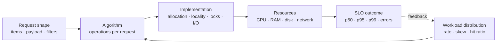

# Complexity và Workload Reasoning cho Production Backend

> [← Module overview](README.md) · Tiếp theo: [Data structures cho backend](data-structures-for-backend-systems.md)

## Mục tiêu / Learning Objectives

Sau chương này, người học có thể:

- định nghĩa input size và operation thay vì gắn Big-O mơ hồ vào cả hệ thống;
- phân biệt upper bound, tight bound, lower bound, worst-case, expected và amortized cost;
- lập workload model có cardinality, distribution, concurrency, payload và SLO;
- nối complexity với CPU, allocation, cache, I/O, lock contention và dependency calls;
- thiết kế measurement có warm-up, baseline, repeat và giới hạn diễn giải;
- phát hiện algorithmic complexity attack hoặc request có amplification không được giới hạn.

## Tại sao cần học? / Why It Matters

Một endpoint có thể đúng với 100 bản ghi nhưng sụp ở 100.000; một job `O(n)` có thể hoàn toàn phù hợp nếu chạy tuần tự trên array nhỏ; một hash lookup expected `O(1)` có thể tốn hơn binary search khi index construction, memory và locality chi phối. Architect cần dùng complexity để loại quyết định không thể scale, rồi dùng measurement để chọn giữa các phương án còn hợp lệ.

Sai lầm nguy hiểm nhất không phải nhớ nhầm một bảng Big-O. Đó là chọn sai biến tăng trưởng: phân tích theo số request nhưng bỏ qua số item/request, số tenant, fan-out, retry và duplicate work.

## Tổng quan / Overview

Mỗi performance claim phải hoàn chỉnh theo mẫu:

~~~text
Operation
  trên input có kích thước N
  với distribution D và concurrency C
  dưới resource budget B
  tạo time/space/dependency cost như thế nào
  và có đạt SLO hay không?
~~~

Big-O trả lời hình dạng tăng trưởng khi input lớn. Nó không trả lời milliseconds, p99 hay chi phí cloud. Production reasoning cần cả hai lớp:

| Lớp | Câu hỏi |
| --- | --- |
| Analytical model | Work tăng theo `n`, `q`, fan-out hay depth như thế nào? |
| Empirical evidence | Trên runtime/hardware/data thật, latency, allocation và saturation là bao nhiêu? |

## Mental Model

### Từ request đến resource cost



### Ba tầng phán đoán

1. **Feasibility:** complexity có làm workload bất khả thi khi scale không?
2. **Fitness:** implementation nào phù hợp distribution và constraints hiện tại?
3. **Proof:** evidence nào chứng minh nó đạt SLO và giữ resource headroom?

Không dùng tầng 3 để cứu một design có tầng 1 sai; cũng không dùng tầng 1 thay benchmark ở tầng 3.

## Thuật ngữ / Terminology

| Thuật ngữ | Ý nghĩa thực dụng |
| --- | --- |
| Input size `n` | Biến mô tả kích thước workload liên quan operation; phải định nghĩa cụ thể |
| Big-O `O(g(n))` | Upper bound tiệm cận; growth không nhanh hơn một bậc sau ngưỡng nào đó |
| Big-Theta `Θ(g(n))` | Tight asymptotic bound |
| Big-Omega `Ω(g(n))` | Lower asymptotic bound |
| Worst-case | Cost lớn nhất trong miền input đã định nghĩa |
| Expected/average | Kỳ vọng dưới một distribution/assumption cụ thể |
| Amortized | Cost trung bình trên một chuỗi operation, không cần xác suất input |
| Time complexity | Số primitive operations theo input model |
| Space complexity | Additional memory theo input; nói rõ có tính input storage hay không |
| Cardinality | Số giá trị/record phân biệt hoặc tổng phần tử tùy ngữ cảnh |
| Skew | Phân bố lệch, ví dụ 1% keys nhận 80% traffic |
| Selectivity | Tỷ lệ dữ liệu được filter chọn |
| Fan-out | Một operation tạo bao nhiêu operation downstream |
| Throughput | Số work hoàn thành trên đơn vị thời gian |
| Tail latency | Latency ở percentile cao như p95/p99 |

## Prerequisites

- C# cơ bản: loop, collection và method.
- Biết đọc latency/throughput ở mức khái niệm.
- Sau chương này học [data structures](data-structures-for-backend-systems.md) để gắn cost model với implementation cụ thể.

## How It Works

### 1. Định nghĩa operation và input

Không viết “API có complexity `O(n)`”. Viết:

> Kiểm tra `q` product IDs có nằm trong allow-list `n` phần tử bằng linear scan có worst-case `Θ(nq)` equality comparisons.

Một hệ thống thường có nhiều biến:

- `n`: records trong tenant;
- `q`: queries/request hoặc requests/interval;
- `p`: payload bytes;
- `f`: downstream fan-out;
- `c`: concurrent in-flight operations;
- `d`: graph/tree depth.

Nếu tất cả cùng tăng, expression đa biến như `O(qn + fp)` hữu ích hơn ép về một chữ `n`.

### 2. Chọn cost model

Cost model là approximation có chủ đích:

- equality/hash comparisons cho in-memory lookup;
- rows/pages read cho database query;
- bytes copied/serialized cho payload;
- dependency calls cho fan-out;
- allocations và retained bytes cho runtime pressure;
- critical-section duration cho contention.

Chọn unit gần bottleneck. Đếm loop iterations không đủ nếu mỗi iteration gọi network.

### 3. Phân biệt bounds và cases

- `List<T>.Contains` là linear scan: worst-case khi không tìm thấy hoặc phần tử ở cuối.
- Hash lookup thường được mô tả expected/near `O(1)` dưới quality/distribution assumptions; collision và resize vẫn tồn tại.
- Append vào dynamic array có thể occasional resize `O(n)`, nhưng amortized append là `O(1)` trên chuỗi operation.
- Sorting comparison-based thường `O(n log n)`; nếu input đã có invariant khác, algorithm khác có thể phù hợp.

Worst-case không phải lúc nào cũng quyết định, nhưng với input do attacker kiểm soát hoặc hard deadline, nó quan trọng hơn average của traffic lành tính.

### 4. Viết workload model

| Dimension | Câu hỏi bắt buộc |
| --- | --- |
| Volume | `n`, `q`, payload và state lớn đến đâu hôm nay/10x/100x? |
| Mix | Read/write, hit/miss, create/update/delete ratio? |
| Distribution | Uniform, Zipf-like/hot key, tenant skew, burst? |
| Concurrency | In-flight, worker count, connection/queue limit? |
| Locality | Data có được access tuần tự/repeated không? |
| Deadline | p50/p95/p99, timeout và batch window? |
| Failure | Retry, duplicate, partial completion làm work tăng bao nhiêu? |
| Boundary | Per request, process, pod, node hay fleet? |

### 5. Chuyển thành budget

Ví dụ endpoint có budget p99 200 ms. Nếu dependency chiếm 120 ms và network/serialization 30 ms, thuật toán local không có toàn bộ 200 ms. Tạo sub-budget có headroom; không dùng average latency để lập tail budget.

Ở steady state, số work in-flight liên hệ với arrival rate và thời gian ở hệ thống. Dùng quan hệ queueing như một sanity check, không coi traffic bursty và retry storm là steady state.

### 6. Đo và đối chiếu

Quy trình tối thiểu:

1. Ghi hypothesis và expected growth.
2. Warm up runtime/code path.
3. Thay một biến mỗi lần; giữ seed/data distribution rõ ràng.
4. Lặp samples; báo median/tails khi phù hợp.
5. Thu elapsed time cùng allocation, CPU, GC, I/O, contention.
6. Xác minh result correctness để optimizer hoặc bug không làm phép đo vô nghĩa.
7. So growth curve và resource limit, không chỉ một con số thắng/thua.

## Minimal Example

Một request kiểm tra nhiều ID bằng scan lặp:

```csharp
static int CountAllowed(List<int> allowedIds, int[] requestedIds)
{
    var matches = 0;

    foreach (var id in requestedIds)
    {
        if (allowedIds.Contains(id))
        {
            matches++;
        }
    }

    return matches;
}
```

Nếu `n = allowedIds.Count` và `q = requestedIds.Length`, worst-case có bậc `Θ(nq)`. Với một query nhỏ và list nhỏ, đây vẫn có thể là lựa chọn đơn giản đúng.

Nếu cùng allow-list được query nhiều lần, build index một lần:

```csharp
var allowedIndex = new HashSet<int>(allowedIds);
var matches = requestedIds.Count(allowedIndex.Contains);
```

Model: build `O(n)`, sau đó `q` expected constant-time lookups; tổng expected `O(n + q)`. Nhưng index cần memory và hashing; nếu chỉ có một query hoặc list cực nhỏ, construction cost có thể không hoàn vốn.

## Production Example

### Bulk authorization endpoint

Giả sử client gửi 1.000 resource IDs, service load 50.000 quyền từ cache rồi kiểm tra từng ID.

Naive shape:

~~~text
1,000 requested IDs
  × up to 50,000 permission comparisons
  = up to 50,000,000 comparisons/request
~~~

Ở 200 concurrent requests, logical work ceiling trở thành 10 tỷ comparisons trước khi tính JSON, network, GC và contention. Các option:

| Option | Lợi ích | Chi phí/constraint |
| --- | --- | --- |
| Linear scan | Zero extra index; rất đơn giản | Amplification `n × q` |
| Per-request `HashSet` | Giảm lookup work | Rebuild/allocation mỗi request |
| Cached immutable index | Reuse build cost; safe reads | Invalidation, memory, staleness |
| Database set-based query | Push filter đến data/index | Round trip, plan/index, parameter/cardinality limits |
| Cap batch size | Bounded blast radius | Client cần paginate/batch |

Kiến trúc hợp lý thường kết hợp cap request, reusable index hoặc set-based query, metrics theo batch size và load test với tenant skew.

## .NET Integration

- `List<T>` phù hợp với iteration và dataset nhỏ; `Contains` là linear search.
- `HashSet<T>` biểu diễn membership/uniqueness; expected lookup tốt phụ thuộc equality/hash quality.
- `Dictionary<TKey,TValue>` map key → value; Microsoft mô tả retrieval gần `O(1)` và phụ thuộc hashing của `TKey`.
- `Stopwatch` dùng underlying high-resolution counter khi OS/hardware hỗ trợ; luôn ghi runtime context.
- JIT, tiered compilation, GC và ThreadPool state có thể làm cold/warm samples khác nhau.

Lab trong repository cố ý không thêm BenchmarkDotNet để giữ dependency tối thiểu. Với performance decision quan trọng, Module 10 sẽ dùng harness/statistics/profiling nghiêm ngặt hơn.

## Internals

### Constant factor và locality

Hai algorithm cùng `O(n)` có thể khác lớn vì:

- contiguous array access dễ prefetch và ít pointer chasing;
- branch predictability khác nhau;
- một implementation allocate object cho mỗi item;
- vectorization có hoặc không xảy ra;
- working set vừa hoặc vượt cache;
- page faults hoặc NUMA remote access xuất hiện.

### Amortization không loại latency spike

Dynamic growth có amortized cost tốt nhưng một request cụ thể vẫn có thể trả resize/rehash/copy cost. Nếu tail latency là NFR, pre-sizing, pooling hoặc moving work khỏi request path có thể quan trọng.

### Expected cost cần assumption

Hash lookup expected constant time giả định hash distribution đủ tốt và load được kiểm soát. Không biến expected bound thành security guarantee với adversarial input.

## Common Mistakes

- Không định nghĩa `n` hoặc operation.
- Gọi Big-O là milliseconds.
- Chỉ phân tích happy-path average, bỏ miss, skew và worst tenant.
- Tối ưu loop nhỏ trong khi mỗi iteration gây database/network call.
- So hai algorithm trên data size duy nhất.
- Benchmark Debug build, cold start hoặc không kiểm tra kết quả.
- Dùng p50 để kết luận đạt p99 SLO.
- Bỏ construction, allocation, serialization và invalidation cost.
- Dùng microbenchmark để tuyên bố end-to-end capacity.
- Tối ưu trước khi có bottleneck hypothesis nhưng lại không đặt input cap.

## Performance Considerations

Thu thập ít nhất:

- latency distribution, không chỉ average;
- throughput và concurrency;
- CPU time/utilization và saturation;
- allocation rate, GC counts/pause;
- working set/RSS;
- disk/network bytes và dependency calls;
- queue depth, rejected/throttled work;
- workload dimensions như batch size/cardinality/hit ratio.

Tách **service time** khỏi **queueing time**. Algorithm nhanh hơn không cứu được unbounded arrival rate nếu admission control không tồn tại.

## Security Considerations

Algorithmic complexity denial of service xuất hiện khi attacker điều khiển input làm cost tăng phi tuyến hoặc buộc worst-case path:

- batch/filter/query depth không giới hạn;
- regex/backtracking hoặc parser input độc hại;
- graph traversal không giới hạn depth/node count;
- hash/equality implementation đắt hoặc collision-prone;
- compressed payload nhỏ giải nén thành dữ liệu rất lớn;
- retry/fan-out biến một request thành nhiều downstream calls.

Mitigation gồm validation trước allocation, hard cap, timeout/deadline, cancellation, rate/concurrency limit, bounded queue, cost-based quota và degradation. Không dựa riêng vào autoscaling: autoscaling cũng có delay và cost ceiling.

## Reliability / Failure Modes

| Failure mode | Signal | Recovery/design response |
| --- | --- | --- |
| Work tăng superlinear | latency/CPU tăng nhanh theo batch | cap, index, partition hoặc đổi algorithm |
| Queue không bounded | queue age và memory cùng tăng | admission control, backpressure, shed load |
| Hot tenant/key | tail latency và shard imbalance | per-tenant budget, repartition, isolate |
| Retry amplification | request/dependency ratio tăng | deadline, retry budget, idempotency |
| Resize/GC spike | allocation/GC correlate p99 | pre-size/reuse, giảm retained data |
| Measurement sai | benchmark thắng nhưng production xấu | đại diện workload, profile end to end |

## Observability

Đặt workload dimensions vào telemetry có cardinality được kiểm soát:

- histogram latency theo endpoint/operation, không tag raw tenant ID nếu cardinality cao;
- request batch size/payload size distribution;
- records scanned/returned, cache hit/miss;
- dependency call count trên request;
- queue length/age và active concurrency;
- allocation/GC/CPU metrics;
- rejection do budget hoặc validation.

Trace exemplar nên cho thấy work amplification nhưng tránh log toàn bộ dữ liệu nhạy cảm.

## Operational Considerations

- Capacity plan phải nêu traffic shape, không chỉ requests/second.
- Guardrail cần configurable nhưng có maximum an toàn; thay đổi phải audit.
- Load test có ramp, burst, soak và skew; rollback nếu resource headroom mất.
- Canary so cùng workload class; tránh so hai cohort có tenant/data khác hẳn.
- Alert trên SLO/resource saturation và queue age, không alert chỉ vì một complexity estimate.
- Lưu command, seed, runtime, hardware và commit khi tạo evidence.

## Architect Perspective

### Câu hỏi quyết định

- Growth variable nào thuộc quyền client, tenant hoặc dependency?
- Có hard upper bound nào được enforce trước khi work bắt đầu?
- Cost được trả khi write/build hay mỗi read/request?
- Có thể reuse/precompute mà không phá freshness/security không?
- Khi overload, hệ thống queue, reject, degrade hay crash?
- Ai sở hữu capacity model và trigger xem xét lại?

### 10x và 100x

Ở 10x, algorithmic slope, allocation và hot-key thường lộ rõ; index, batching, bounds và profiling có thể đủ. Ở 100x, data/traffic có thể không vừa một process hoặc một partition; cần thay boundary, partition strategy, asynchronous workflow hoặc data model. Không nhảy thẳng đến distributed system nếu local bound/index giải quyết constraint hiện tại.

Complexity kiến trúc cũng là cost: thêm cache/service/queue tạo invalidation, deployment, observability, security và on-call responsibility.

## Trade-offs

| Quyết định | Mua được | Trả giá |
| --- | --- | --- |
| Precompute/index | Read latency/throughput | Memory, build, invalidation |
| Batch | Ít overhead/call | Tail latency, blast radius, payload cap |
| Cache | Tránh repeated work | Staleness, consistency, stampede |
| Parallelize | Giảm wall time CPU-bound có đủ work | Scheduling, contention, memory bandwidth |
| Approximation | Bounded cost | Precision/correctness semantics |
| Reject/limit | Bảo vệ SLO và system | Client complexity, product policy |

## When NOT to Use It

Không dùng Big-O đơn độc để:

- chọn giữa hai implementation cùng bậc tăng trưởng;
- dự đoán absolute latency/cost;
- kết luận một database query nhanh mà không xem plan/data distribution;
- quyết định parallelism;
- bỏ qua correctness, security hoặc maintainability;
- tối ưu cold path hiếm khi chạy khi hot path chưa đo.

Với bounded small data, giải pháp đơn giản và dễ kiểm chứng thường tốt hơn index/cache phức tạp.

## Alternatives

Big-O không có “alternative” duy nhất; các công cụ bổ sung gồm:

- exact operation/cost counting cho bound nhỏ;
- profiling để tìm nơi CPU/allocation thực sự đi đâu;
- load test để thấy queueing/saturation;
- tracing để thấy dependency/fan-out;
- queueing/capacity model cho concurrency;
- database execution plan cho relational workload;
- property/fuzz/security test cho adversarial input.

## Review Questions

1. `O(1)` khác “mất 1 operation” thế nào?
2. Expected và amortized cost khác nhau ở assumption nào?
3. Với membership queries, khi nào build `HashSet` không đáng?
4. Tại sao cùng `O(n)` nhưng sequential access có thể nhanh hơn random access?
5. Workload model tối thiểu cho bulk endpoint gồm những dimension nào?
6. Retry biến complexity end-to-end ra sao?
7. Tại sao p50 không chứng minh đạt p99 SLO?
8. Guardrail nào chống algorithmic complexity DoS?

## Hands-on Lab

### Problem

So sánh repeated membership lookup bằng `List<int>` và `HashSet<int>`; xác định điểm construction cost được hoàn vốn trên máy của bạn.

### Constraints

- Chỉ dùng project [WorkloadLab](../../labs/01-computer-science/workload-lab/Program.cs).
- Không bỏ hard limit hoặc chạy workload gây ảnh hưởng máy dùng chung.
- Thay một biến mỗi lần; dùng Release build.

### Implementation steps

```powershell
cd E:\Documents\Dev\labs\01-computer-science\workload-lab
dotnet build -c Release
dotnet run -c Release --no-build -- lookup 5000 1000
dotnet run -c Release --no-build -- lookup 20000 5000
```

### Expected outcome

- `list_hits` bằng `hashset_hits`.
- HashSet có build time riêng.
- Khi repeated query work tăng, list time thường tăng mạnh hơn; exact ratio phụ thuộc máy/runtime/data.

### Verification

Ghi runtime line, input, ba timing fields và correctness result. Chạy mỗi case ít nhất năm lần; không cherry-pick một sample.

### Failure experiment

Thử workload vượt safety budget:

```powershell
dotnet run -c Release --no-build -- lookup 200000 20000
```

Chương trình phải reject trước khi chạy 4 tỷ comparison ceiling. Giải thích vì sao input validation là reliability/security feature.

### Questions

- Kết quả đổi thế nào khi giữ `size` và tăng `queries`?
- Build cost được hoàn vốn ở khoảng nào trên máy bạn?
- Workload này khác production data ở distribution/equality cost nào?

## Exit Criteria

- Viết được cost expression có `n` và `q` cho experiment.
- Có output của hai workload hợp lệ và một workload bị safety bound reject.
- Giải thích được construction cost, expected lookup và giới hạn của phép đo.
- Đề xuất một production guardrail và metric chứng minh nó hoạt động.

## Related Topics

- [Data structures cho backend](data-structures-for-backend-systems.md)
- [Memory và cache locality](memory-stack-heap-virtual-memory-and-cache.md)
- [Scheduling và concurrency](process-thread-scheduling-and-concurrency.md)
- [Linux process/resource pressure](../02-linux-git-networking/process-signals-and-resource-pressure.md)
- Module 10 — Performance Engineering (planned)
- Module 24 — System Design (planned)

## Official English Sources

- [MIT 6.006 asymptotic complexity notes](https://ocw.mit.edu/courses/6-006-introduction-to-algorithms-fall-2011/ce8348ec64dce3841ced6a9d0c9e48f2_MIT6_006F11_rec01.pdf)
- [C# collections reference](https://learn.microsoft.com/en-us/dotnet/csharp/language-reference/builtin-types/collections)
- [Dictionary<TKey,TValue> remarks — .NET 10](https://learn.microsoft.com/en-us/dotnet/api/system.collections.generic.dictionary-2?view=net-10.0)
- [Stopwatch — .NET 10](https://learn.microsoft.com/en-us/dotnet/api/system.diagnostics.stopwatch?view=net-10.0)
- [Module references](references.md)

## Vietnamese Resources

Không dùng bản dịch/community tutorial làm source of truth. Đọc chương tiếng Việt này cùng các link English official; dùng language switch của Microsoft Learn khi cần hỗ trợ thuật ngữ và quay lại bản English để kiểm tra behavior/version.

## Verification Metadata

- Verified: 2026-08-11.
- Technology version: stable CS concepts; code/lab target .NET 10.
- Official sources: MIT OpenCourseWare và Microsoft Learn, liệt kê ở trên và [references.md](references.md).
- Context7 queries used: none; tool unavailable in this run.
- Notes: timing trong lab là directional experiment, không phải published benchmark; hard comparison budget được kiểm tra trong code.
