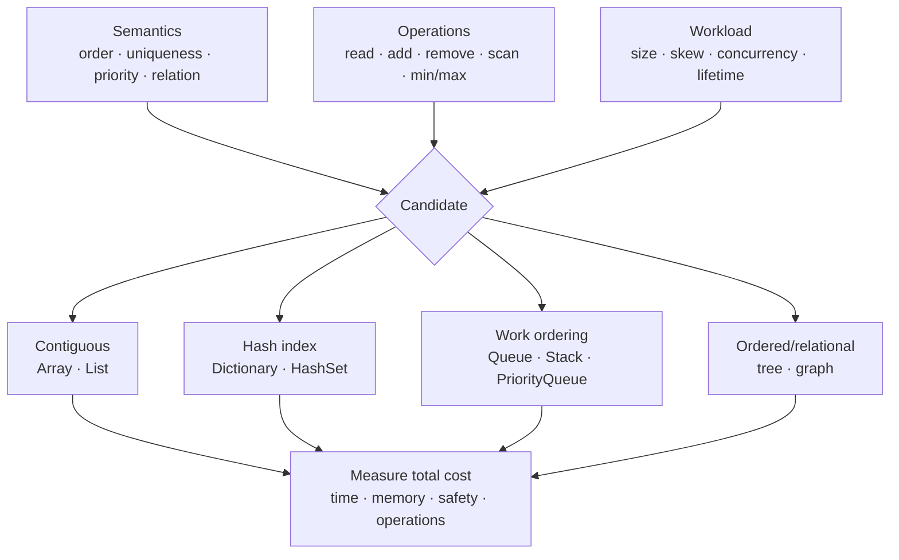

# Data Structures cho Backend Systems

> [← Complexity và workload](complexity-and-workload-reasoning.md) · [Module overview](README.md) · Tiếp theo: [Scheduling và concurrency](process-thread-scheduling-and-concurrency.md)

## Mục tiêu / Learning Objectives

Sau chương này, người học có thể:

- chọn data structure từ dominant operations, invariants và workload distribution;
- giải thích cost/semantics của array, list, hash table, queue, stack, heap, tree và graph;
- map các concept đó sang collection .NET mà không dựa vào internal detail không có contract;
- nhận diện mutable hash key, unbounded queue, unstable priority ordering và unsafe concurrent access;
- cân bằng time, memory, locality, consistency, boundedness và operational complexity;
- thiết kế measurement và migration trigger khi workload thay đổi.

## Tại sao cần học? / Why It Matters

Data structure là quyết định kiến trúc ở quy mô nhỏ. Một `List<T>` có thể là lựa chọn nhanh và rõ nhất cho vài chục item; một `Dictionary` có thể biến repeated scan thành lookup; một unbounded queue có thể biến traffic burst thành OutOfMemory; một heap có thể lấy next job tốt hơn sort toàn bộ mỗi lần nhưng không bảo đảm FIFO cho cùng priority.

Chọn sai không chỉ làm CPU chậm. Nó có thể làm mất order, giữ memory vô hạn, phá equality semantics, tạo race condition hoặc mở đường cho resource exhaustion.

## Tổng quan / Overview

Không bắt đầu bằng bảng Big-O. Bắt đầu bằng contract:

~~~text
Data semantics
  uniqueness? order? priority? hierarchy? relationship?
        ↓
Dominant operations
  lookup? append? remove? min/max? traversal? range?
        ↓
Workload and bounds
  size? read/write? skew? concurrency? lifetime?
        ↓
Representation
  array/list/hash/queue/heap/tree/graph
        ↓
Evidence
  correctness + latency + allocation + memory + contention
~~~

## Mental Model

Mỗi structure duy trì một hoặc nhiều **invariant**. Invariant làm một operation rẻ hơn nhưng phải được duy trì khi dữ liệu đổi.



Data structure không thay business boundary. Nếu dataset không thể vừa một process hoặc cần durability/cross-node coordination, in-memory collection chỉ là một phần của solution.

## Thuật ngữ / Terminology

| Thuật ngữ | Mental model |
| --- | --- |
| Contiguous storage | Elements gần nhau trong memory, thường có locality tốt |
| Dynamic array | Contiguous buffer có thể grow/copy; `List<T>` là ví dụ |
| Linked structure | Node trỏ sang node khác; flexible links nhưng pointer/memory overhead |
| Hash table | Dùng hash/equality để map key vào storage location |
| Collision | Nhiều keys cùng vùng/bucket; implementation phải phân giải |
| Load/capacity | Mức lấp đầy và số phần tử structure có thể chứa trước khi grow |
| FIFO / LIFO | First-in-first-out / last-in-first-out |
| Heap | Partial-order tree structure để lấy min/max priority hiệu quả |
| Balanced tree | Duy trì height có bound để lookup/update ordered keys |
| Graph | Vertices và edges mô tả quan hệ tổng quát |
| Adjacency list | Map vertex → neighbors, phù hợp graph sparse |
| Invariant | Điều luôn phải đúng, ví dụ unique key hoặc heap order |
| Bounded | Có hard capacity/depth/node limit |
| Equality comparer | Quy tắc hash và equality của key |

## Prerequisites

- [Complexity và workload reasoning](complexity-and-workload-reasoning.md).
- C# generics, iteration và basic collection APIs.
- Học [memory/cache](memory-stack-heap-virtual-memory-and-cache.md) sau chương này để hiểu layout/allocation cost sâu hơn.

## How It Works

### Array và `List<T>`

Array có fixed length và contiguous elements. Index access có constant-time addressing; scan thường có locality tốt. `List<T>` bọc dynamic array, giữ `Count` và capacity; append thường rẻ nhưng grow có thể allocate/copy.

Phù hợp khi:

- iteration/index access là dominant;
- dataset nhỏ hoặc order quan trọng;
- append nhiều hơn insert/remove giữa list;
- snapshot/read-mostly có thể lưu contiguous.

Không mặc định linked list để insert `O(1)`: tìm vị trí vẫn có thể `O(n)`, node overhead/locality kém và .NET workload thực tế thường có lựa chọn rõ hơn.

### `Dictionary<TKey,TValue>` và `HashSet<T>`

Hash table dùng comparer để tính hash và equality. `Dictionary` lưu mapping; `HashSet` lưu membership/uniqueness. Lookup được mô tả near/expected `O(1)` dưới assumptions tốt; resize, collision, expensive comparer và memory overhead vẫn tồn tại.

Key contract:

- equal keys phải có compatible hash codes;
- fields tham gia equality không được thay đổi khi key đang nằm trong collection;
- comparer phải khớp semantics, ví dụ case sensitivity/normalization;
- compound operation vẫn cần API atomic phù hợp trong concurrent collection.

### Queue và stack

- `Queue<T>`: FIFO work/order.
- `Stack<T>`: LIFO, undo/traversal state.
- Một in-memory queue không tự có durability, retry, cross-process delivery hay backpressure.

Capacity là phần contract production. Queue dài bao nhiêu, khi đầy thì wait, reject, drop hay spill?

### Heap và `PriorityQueue<TElement,TPriority>`

Heap duy trì partial order: phần tử priority thấp nhất/cao nhất ở root, không sort toàn bộ collection. .NET `PriorityQueue` là array-backed quaternary min-heap; lowest priority dequeued first và không bảo đảm FIFO giữa elements có priority bằng nhau.

Phù hợp cho scheduler, top-K, shortest-next-job candidate và merge streams. Nếu cần stable order, thêm sequence number vào priority/comparer hoặc chọn structure khác.

### Ordered tree/set/map

`SortedDictionary`, `SortedSet` duy trì order để iteration/range-like operations và min/max có semantics khác hash. Trả giá bằng update/lookup có logarithmic growth và node/memory overhead. Không dùng chỉ vì “tree là advanced”.

### Graph

Graph không phải một .NET collection duy nhất. Với graph sparse, biểu diễn thường là:

```csharp
Dictionary<string, HashSet<string>> adjacency;
```

Traversal BFS dùng queue; DFS dùng stack/recursion. Production graph cần bound depth/nodes/edges, cycle handling, visited set, cancellation và authorization theo mỗi node/edge nếu dữ liệu có access policy.

### Concurrent, immutable và snapshot structures

- Concurrent collections cung cấp thread-safe operations cụ thể; không tự làm một workflow nhiều bước atomic.
- Immutable/read-only snapshot đơn giản hóa reasoning và safe publication nhưng update có copy/build cost.
- Bounded channel phù hợp producer/consumer async có backpressure; chi tiết ở chương concurrency và Module 03.

## Minimal Example

Chọn next job bằng priority thay vì sort lại toàn bộ list:

```csharp
var jobs = new PriorityQueue<string, (int Priority, long Sequence)>();

jobs.Enqueue("generate-report", (2, 1));
jobs.Enqueue("security-alert", (0, 2));
jobs.Enqueue("send-email", (2, 3));

while (jobs.TryDequeue(out var job, out var priority))
{
    Console.WriteLine($"{priority}: {job}");
}
```

Tuple thêm `Sequence` để tạo tie-break rõ ràng. Đây chỉ là in-memory ordering; process crash làm mất queue.

## Production Example

### Idempotency record lookup

Một worker nhận message có `MessageId` và cần bỏ duplicate trong một batch.

```csharp
var seen = new HashSet<Guid>();

foreach (var message in batch)
{
    if (!seen.Add(message.MessageId))
    {
        continue;
    }

    Process(message);
}
```

`HashSet` giải quyết uniqueness trong batch/process. Nó **không** tạo durable idempotency qua restart, multi-replica hoặc replay ngày sau. Production contract có thể cần unique database constraint/durable inbox với retention. In-memory structure vẫn hữu ích để giảm duplicate work trong boundary hẹp.

### Top-K slow operations

Để giữ 100 slowest samples trong một cửa sổ lớn, min-heap bounded 100 phần tử tiết kiệm hơn sort mọi sample và giữ toàn bộ. Nhưng metrics backend thường cung cấp histogram/quantile có semantics tốt hơn raw top-K; structure phải phục vụ requirement, không phải phô diễn thuật toán.

## .NET Integration

| Requirement | Candidate .NET | Cảnh báo |
| --- | --- | --- |
| Fixed contiguous data | `T[]`, `Span<T>`, `Memory<T>` | lifetime/ownership khác nhau; `Span<T>` bị giới hạn use context |
| Ordered iteration/index | `List<T>` | middle insert/remove và repeated `Contains` có thể đắt |
| Key → value | `Dictionary<TKey,TValue>` | equality, mutable keys, not safe for concurrent writes |
| Unique membership | `HashSet<T>` | no order contract |
| FIFO/LIFO | `Queue<T>`, `Stack<T>` | unbounded growth nếu producer vượt consumer |
| Priority | `PriorityQueue<TElement,TPriority>` | min-heap; equal priority not FIFO |
| Sorted keys | `SortedDictionary`, `SortedSet` | higher allocation/cache cost than contiguous structures |
| Concurrent key map | `ConcurrentDictionary<TKey,TValue>` | workflow nhiều call không mặc định atomic |
| Async producer/consumer | `Channel<T>` | chọn bounded capacity/full mode có chủ đích |

Public API nên trả abstraction phù hợp (`IReadOnlyList<T>`, `IReadOnlyDictionary<,>`) khi caller không cần mutate, nhưng interface không tự làm backing data immutable/thread-safe.

## Internals

### Layout matters

Array/List đặt elements liên tiếp; CPU có thể prefetch và cache nhiều elements trên cùng cache line. Node-based tree/list cần dereference pointers, tăng metadata và dễ tạo cache misses. Big-O không phản ánh trực tiếp khác biệt này.

### Hash table growth

Capacity growth/rehash là implementation detail; đừng phụ thuộc exact thresholds. Nếu cardinality đã biết và profiling chứng minh benefit, pre-size bằng public API để giảm grow/copy. Không over-allocate vô cớ trong per-request path.

### Heap is partially ordered

Heap chỉ bảo đảm root theo priority relation, không bảo đảm toàn bộ backing array đã sort. Enumerating `UnorderedItems` không tạo dequeue order contract.

### Graph cost depends on representation

Adjacency matrix cần space theo `V²`, adjacency list gần `V + E`; nhưng dense graph, bit operations hoặc hardware pattern có thể đổi lựa chọn. Luôn gắn representation với density và operation.

## Common Mistakes

- Chọn collection từ bảng Big-O mà không nêu semantics/workload.
- Dùng `List.Contains` lặp lại trên dataset lớn dù có thể reuse membership index.
- Dùng mutable object làm dictionary key rồi đổi field tham gia equality.
- Giả định `Dictionary`/`HashSet` có deterministic iteration order như business contract.
- Giả định equal-priority `PriorityQueue` là FIFO.
- Dùng concurrent collection rồi thực hiện check-then-act qua nhiều call không atomic.
- Dùng unbounded in-memory queue cho traffic không bounded.
- Recursion graph/tree không bound depth, cycle hoặc cancellation.
- Chọn linked list vì insert theoretical `O(1)` nhưng bỏ search/locality/allocation.
- Dùng in-memory set thay durable idempotency store.

## Performance Considerations

Đo total lifecycle cost:

- construction/index build;
- lookup/update/remove distribution;
- iteration cost;
- resize/rehash spikes;
- allocations và retained capacity;
- cache locality;
- synchronization/contention;
- serialization hoặc crossing process boundary;
- invalidation/rebuild frequency.

Small collections có thể làm linear scan thắng vì setup/locality. Large repeated lookup thường làm index hoàn vốn. Không đặt threshold toàn cục không có evidence.

## Security Considerations

- Bound collection size trước allocation; validate length/count/graph depth.
- Equality/hash không được thực hiện unbounded expensive work trên attacker-controlled keys.
- Normalize keys theo security semantics; case folding/culture/Unicode có thể ảnh hưởng identity.
- Không đưa secret/PII vào key/log/diagnostic dump không cần thiết.
- Graph traversal phải enforce authorization, không suy ra access từ một root đã được phép.
- Priority do client cung cấp cần policy; nếu không, attacker có thể starve work khác.
- Cache/index multi-tenant phải có tenant boundary trong key và invalidation.

## Reliability / Failure Modes

| Failure mode | Nguyên nhân | Response |
| --- | --- | --- |
| OOM từ queue/map | Unbounded producer/cardinality | hard capacity, eviction/retention, backpressure |
| Lost/duplicate work | In-memory state qua crash hoặc multiple replicas | durable store/broker, idempotency constraint |
| Missing lookup | Mutable/inconsistent key equality | immutable key, explicit comparer, tests |
| Starvation | Priority policy không aging/fairness | quota, aging, separate queues |
| Race/corruption | Unsynchronized shared mutation | ownership, lock/concurrent/immutable structure |
| Traversal runaway | cycle/unbounded graph | visited set, max depth/nodes, cancellation |
| Rebuild latency spike | large index refresh in request path | background build, atomic snapshot swap, budget |

## Observability

Quan sát behavior chứ không xuất internal buckets:

- item count/capacity where public and meaningful;
- queue depth, oldest item age, enqueue/dequeue/reject rates;
- hit/miss/eviction/rebuild duration;
- graph nodes/edges visited và cut-off reason;
- priority class wait time/starvation;
- allocation/GC và contention;
- durable vs in-memory dedupe hit ratio.

Tránh label per key/tenant trong metrics nếu cardinality không controlled.

## Operational Considerations

- Xác định lifecycle: per request, singleton, cache snapshot hay durable state.
- Đặt capacity/retention và behavior khi đầy.
- Rebuild index phải có cancellation, timeout, atomic publish và fallback snapshot.
- Warm-up/preload chỉ khi startup budget và readiness semantics rõ.
- Schema/equality/comparer change có thể yêu cầu rebuild/migration.
- Memory dump có thể chứa dữ liệu nhạy cảm; bảo vệ access/retention.
- Với multi-replica, ghi rõ consistency model; local collection không shared state.

## Architect Perspective

### Decision checklist

1. Semantics nào là bắt buộc: order, unique, priority, range, relationship?
2. Operation nào chiếm phần lớn cost ở traffic thật?
3. Bound lớn nhất và growth owner là ai?
4. Data sống bao lâu, ở một thread/process hay nhiều node?
5. Update/read ratio và skew ra sao?
6. Khi process crash/redeploy, state có được phép mất không?
7. Full behavior là reject, wait, drop, evict hay persist?
8. Migration trigger ở cardinality/latency/memory nào?

### 10x và 100x

Ở 10x, pre-sizing, better index, bounded queue và snapshot ownership thường đủ. Ở 100x, state có thể vượt memory/boundary một process; partition, durable external index/queue/database hoặc approximate structure có thể cần thiết. Externalizing state thêm network, consistency, security, deployment và on-call cost; chỉ làm khi requirement vượt local solution.

## Trade-offs

| Structure | Tối ưu chính | Chi phí/semantics |
| --- | --- | --- |
| Array/List | Index/scan/locality/simplicity | middle mutation, repeated search |
| Hash map/set | Membership/key lookup | memory, equality, unordered, worst-case nuance |
| Queue/stack | Explicit work/traversal order | capacity/durability not automatic |
| Priority heap | Efficient next-priority | partial order, fairness/tie semantics |
| Sorted tree | Ordered keys/range/min-max | pointer/allocation/cache cost |
| Graph representation | Relationship traversal | cycle, explosion, complex authorization |
| Immutable snapshot | Simple reads/publication | rebuild/copy/update latency |
| Concurrent structure | Safe supported operations | contention and multi-step atomicity limits |

## When NOT to Use It

- Không build hash index nếu dataset rất nhỏ, single scan và memory/simplicity quan trọng hơn.
- Không dùng priority queue nếu FIFO/business ordering là contract duy nhất.
- Không dùng graph database/complex graph model cho quan hệ có thể giải bằng foreign key/query đơn giản.
- Không dùng concurrent collection khi single ownership/message passing đơn giản hơn.
- Không đưa durable workflow vào process-local queue.
- Không giữ toàn bộ dataset in memory nếu bound, startup, restart hoặc multi-tenant isolation không chấp nhận được.

## Alternatives

- Database index/constraint cho durable shared lookup/uniqueness.
- Broker/durable queue cho delivery, replay và cross-process work.
- Streaming/iterator để tránh materialize toàn bộ data.
- Bloom filter hoặc approximate sketch khi false-positive/approximation được cho phép và scale biện minh.
- Sorted file/index hoặc search engine cho query semantics chuyên biệt.
- Immutable snapshot/message passing thay shared mutation.

Alternative phải được đánh giá cả network, consistency, operations và cost; external service không làm complexity biến mất.

## Review Questions

1. Tại sao `List<T>` đôi khi nhanh hơn hash structure dù lookup complexity xấu hơn?
2. Mutable dictionary key gây lỗi thế nào?
3. `PriorityQueue` bảo đảm và không bảo đảm ordering nào?
4. Khi nào in-memory `HashSet` đủ cho dedup, khi nào không?
5. Unbounded queue chuyển traffic problem thành memory problem ra sao?
6. Concurrent collection có làm check-then-act tự động atomic không?
7. Graph traversal cần guardrail security/reliability nào?
8. Bạn sẽ chọn structure gì cho top-100 slow samples và vì sao?

## Hands-on Lab

### Problem

Chứng minh selection phụ thuộc operation count: linear list và reusable hash index trả cùng kết quả nhưng có cost profile khác.

### Constraints

- Release build, fixed seed của lab.
- Không thay implementation trước khi ghi prediction.
- Không suy rộng timing sang production dataset chưa đại diện.

### Implementation steps

```powershell
cd E:\Documents\Dev\labs\01-computer-science\workload-lab
dotnet build -c Release
dotnet run -c Release --no-build -- lookup 100 10
dotnet run -c Release --no-build -- lookup 20000 5000
```

Đọc `Program.cs`, tìm nơi `List<int>`, `HashSet<int>` và query distribution được tạo.

### Expected outcome

Small workload có thể không bù được build overhead; repeated lookup lớn thường làm hash lookup vượt linear scan. Correctness phải giống nhau.

### Verification

Ghi build time của index riêng với lookup time. Tính tổng cost nếu index chỉ dùng 1, 10 và 1.000 batch.

### Failure experiment

Trong một branch/scratch copy, tưởng tượng key equality thay đổi sau insert hoặc priority ties không có sequence. Không cần phá project chính; viết test/pseudocode chỉ ra invariant bị vi phạm và mitigation.

### Questions

- Dominant operation nào đổi lựa chọn?
- Index có lifetime nào để amortize build cost?
- Nếu index chứa per-tenant data, boundary/eviction cần gì?

## Exit Criteria

- Chọn và biện minh structure cho ít nhất bốn workload backend khác nhau.
- Output lab cho small/large workloads kèm total lifecycle cost.
- Giải thích mutable key, equal-priority ordering và unbounded capacity risks.
- Phân biệt process-local dedupe với durable idempotency.
- Nêu trigger chuyển từ in-memory structure sang external durable component.

## Related Topics

- [Complexity và workload reasoning](complexity-and-workload-reasoning.md)
- [Scheduling và concurrency](process-thread-scheduling-and-concurrency.md)
- [Memory, GC và cache locality](memory-stack-heap-virtual-memory-and-cache.md)
- Module 03 — C#/.NET runtime (planned)
- Module 11 — Redis/caching (planned)
- Module 17 — Distributed systems/messaging (planned)
- Module 05 — SQL/indexes/constraints (planned)

## Official English Sources

- [C# collections reference](https://learn.microsoft.com/en-us/dotnet/csharp/language-reference/builtin-types/collections)
- [Dictionary<TKey,TValue> — .NET 10](https://learn.microsoft.com/en-us/dotnet/api/system.collections.generic.dictionary-2?view=net-10.0)
- [HashSet<T> — .NET 10](https://learn.microsoft.com/en-us/dotnet/api/system.collections.generic.hashset-1?view=net-10.0)
- [PriorityQueue<TElement,TPriority> — .NET 10](https://learn.microsoft.com/en-us/dotnet/api/system.collections.generic.priorityqueue-2?view=net-10.0)
- [Thread-safe collections](https://learn.microsoft.com/en-us/dotnet/standard/collections/thread-safe/)
- [Module references](references.md)

## Vietnamese Resources

Không có nguồn tiếng Việt đủ mạnh được chọn làm canonical. Có thể dùng Microsoft Learn localization để đọc nhanh thuật ngữ, nhưng API contract và implementation remarks được kiểm tra ở bản English `net-10.0`.

## Verification Metadata

- Verified: 2026-08-11.
- Technology version: .NET 10 API surface; complexity/invariant concepts are stable.
- Official sources: Microsoft Learn pages above và [references.md](references.md).
- Context7 queries used: none; tool unavailable in this run.
- Notes: `PriorityQueue` documented as array-backed quaternary min-heap and does not guarantee FIFO for equal priority; lab does not rely on internal capacity/load-factor constants.
