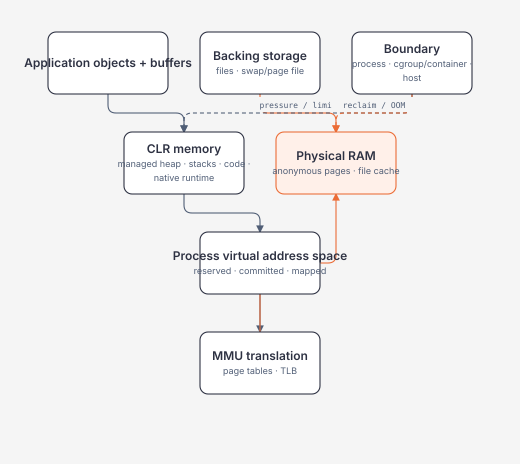

# Memory: Stack, Heap, Virtual Memory, GC và CPU Cache

> [← Scheduling và concurrency](process-thread-scheduling-and-concurrency.md) · [Module overview](README.md) · Tiếp theo: [Module 02 production resources](../02-linux-git-networking/process-signals-and-resource-pressure.md)

## Mục tiêu / Learning Objectives

Sau chương này, người học có thể:

- phân biệt virtual address space, committed/resident memory, working set/RSS và managed heap;
- giải thích pages, page tables, TLB, page faults, file mappings/page cache và swap ở mức production-useful;
- mô tả stack frame, managed/native heap và tránh quy tắc sai “value type luôn stack, reference type luôn heap”;
- giải thích .NET allocation, roots, generations, LOH, promotion, pinning và unmanaged resources;
- nối locality, cache lines, false sharing và memory bandwidth với wall time;
- điều tra memory pressure theo đúng process/container/host boundary và đặt hard budget.

## Tại sao cần học? / Why It Matters

Dashboard “memory 80%” không cho biết managed leak, native leak, file cache, mmap, fragmentation hay container hard limit. GC thu hồi object không đồng nghĩa OS phải giảm RSS ngay. Một algorithm cùng `O(n)` có thể chậm nhiều lần khi access random thay sequential. Một object nhỏ sống quá lâu có thể giữ cả graph lớn; một unmanaged handle không được giải phóng không chờ GC như memory bình thường.

Architect cần hiểu memory như một chuỗi translation và ownership, không phải một con số duy nhất.

## Tổng quan / Overview



Các số liệu trả lời câu hỏi khác nhau:

| Signal | Câu hỏi gần đúng |
| --- | --- |
| Virtual size/address space | Process đã reserve/map bao nhiêu address range? |
| Committed memory | Bao nhiêu memory có backing commitment? |
| RSS/working set | Bao nhiêu pages của process đang resident trong RAM? |
| Managed heap size | CLR đang quản lý bao nhiêu heap memory? |
| Live/retained objects | Object graph nào vẫn reachable? |
| Allocation rate | App tạo bytes mới nhanh thế nào? |

## Mental Model

### Địa chỉ code dùng là virtual

CPU instruction tạo virtual address. MMU dịch qua TLB/page tables sang physical frame. Nếu mapping/data/permission chưa sẵn sàng, CPU trap vào kernel bằng page fault; kernel có thể map zero page, thực hiện copy-on-write, đọc file/swap hoặc báo access violation.

### Managed memory là một phần của process memory

Process còn có:

- thread stacks;
- JITted/native code và runtime structures;
- native heaps/allocators;
- loaded assemblies/shared libraries;
- memory-mapped files;
- socket/file/kernel-accounted resources;
- GC reserved nhưng chưa resident/used regions.

Vì vậy `GC.GetTotalMemory` không giải thích toàn bộ RSS.

### Liveness khác usefulness

GC chỉ biết object có reachable từ roots không; nó không biết object còn hữu ích về business. Cache entry không expire vẫn “live” và đúng theo GC nhưng là logical retention/leak với hệ thống.

## Thuật ngữ / Terminology

| Thuật ngữ | Mental model |
| --- | --- |
| Virtual address space | Không gian địa chỉ riêng của process |
| Page | Đơn vị mapping/protection/reclaim của virtual memory |
| Page table | Data structure map virtual pages → physical frames/metadata |
| MMU | Hardware thực hiện address translation/protection |
| TLB | Cache nhỏ cho address translations |
| Page fault | Exception khi translation/access không sẵn sàng hoặc không được phép |
| Minor fault | Thường không cần đọc storage; exact accounting phụ thuộc OS |
| Major fault | Cần I/O để đưa page vào memory |
| RSS | Resident Set Size; resident pages được account cho process |
| Working set | Pages process đang resident/actively used theo OS definition |
| Anonymous memory | Memory không trực tiếp backed bởi regular file, ví dụ heap/stack |
| Page cache | Kernel cache file data trong RAM |
| Swap/page file | Backing storage cho memory pressure; không phải RAM |
| Stack frame | Per-call locals/control data trong thread stack, subject to JIT layout |
| Managed heap | Object memory do CLR GC quản lý |
| Native heap | Memory do native allocator/runtime/library quản lý |
| GC root | Reference source làm object graph reachable |
| Generation | GC grouping theo observed lifetime: 0, 1, 2 |
| LOH | Large Object Heap; current default threshold thường 85,000 bytes, configurable in modern .NET |
| Pinning | Ngăn object được move, thường cho interop/I/O |
| Locality | Tái dùng data/code gần nhau theo thời gian/địa chỉ |
| False sharing | Threads ghi independent values nhưng cùng cache line, gây coherence traffic |

## Prerequisites

- [Complexity và workload](complexity-and-workload-reasoning.md).
- [Data structures](data-structures-for-backend-systems.md) cho layout/invariant.
- [Scheduling/concurrency](process-thread-scheduling-and-concurrency.md) cho thread stacks và false sharing.
- [Linux process/resource pressure](../02-linux-git-networking/process-signals-and-resource-pressure.md) cho command-level evidence.

## How It Works

### 1. Reserve, commit, touch, become resident

Một process có thể reserve/map address range lớn mà chưa dùng tương ứng lượng RAM. Khi code touch pages, OS tạo/resolve mappings và physical backing theo policy. RSS thay đổi theo residency/reclaim, không chỉ allocation/free trong application.

Không suy ra leak chỉ từ virtual size lớn. Cũng không bỏ qua RSS/commit chỉ vì managed heap nhỏ.

### 2. Address translation và page faults

MMU kiểm tra TLB/page-walk caches; khi miss, hardware page-walk đọc page tables. Nếu page không present hoặc permission sai, page fault handler xử lý. Fault hợp lệ có thể là demand paging/copy-on-write; fault dày đặc gây latency/CPU/I/O pressure. Huge pages có thể giảm TLB/page-table pressure nhưng tăng waste/allocation trade-offs.

### 3. Stack và heap theo storage context

Mỗi thread có stack với frames cho calls/locals theo JIT/runtime decisions. Stack có bounded size; recursion sâu/unbounded có thể `StackOverflowException` và không phải failure dễ recover trong cùng process.

Không dùng rule:

~~~text
value type = stack
reference type = heap
~~~

Đúng hơn:

- object instance của class được cấp phát trên managed heap theo normal managed semantics;
- variable giữ reference có thể ở register/stack/field;
- value type local có thể ở register/stack, nhưng value-type field nằm inline trong containing object/array;
- boxing/capture/async state machine có thể đưa data vào heap allocation;
- JIT optimization có thể thay physical layout/lifetime quan sát được.

Reason từ ownership/lifetime/allocation evidence, không từ slogan.

### 4. .NET allocation và GC roots

Managed allocation thường nhanh vì runtime cấp memory liên tiếp từ allocation region. Khi collection xảy ra, GC xác định roots (stack/register info, statics, handles, finalization structures), trace reachable object graph, reclaim unreachable objects và compact/move khi appropriate.

Generational hypothesis: phần lớn objects chết trẻ. Gen 0 thu thường xuyên; survivors promote tới gen 1/2. Full/gen 2 collection phải xem nhiều long-lived state hơn. Allocation rate và survived/retained size cùng quyết định GC cost.

### 5. Large objects, pinning và native ownership

Large object allocation vào LOH; copying/compaction có trade-off lớn. Frequent large transient buffers có thể tăng GC/fragmentation pressure. Pooling chỉ phù hợp khi memory cap, zeroing/security, lifetime và misuse risk được kiểm soát.

Pinned objects hạn chế GC move và có thể tăng fragmentation. Unmanaged resource như file/socket/native allocation phải release deterministically qua `IDisposable`/`IAsyncDisposable`/SafeHandle patterns; GC không tự gọi `Dispose` vì business lifetime đã kết thúc.

### 6. Cache hierarchy và locality

CPU access registers/cache nhanh hơn main memory. Sequential contiguous traversal thường tận dụng cache lines/prefetch tốt hơn random pointer chasing. Khi working set vượt cache, miss rate và memory bandwidth trở thành bottleneck.

Multiple threads ghi cùng cache line có thể tạo false sharing, dù mỗi thread sở hữu field riêng. Thêm parallelism có thể làm chậm khi memory bandwidth/coherence đã saturated.

### 7. Pressure, reclaim và OOM boundary

Host còn free memory không chứng minh container còn headroom. Cgroup/container limit có thể trigger reclaim/throttle/OOM trong scope riêng. Ngược lại, process có RSS lớn nhưng mostly reclaimable page cache có behavior khác anonymous live heap.

Investigation phải cùng timeline với allocation, GC, page faults, swap/reclaim, cgroup events và workload.

## Minimal Example

Tránh materialize allocation không cần thiết khi chỉ cần tổng:

```csharp
static long SumPositive(ReadOnlySpan<int> values)
{
    long sum = 0;

    foreach (var value in values)
    {
        if (value > 0)
        {
            sum += value;
        }
    }

    return sum;
}
```

`ReadOnlySpan<int>` cho phép view contiguous không tạo collection mới trong appropriate synchronous scope. Không dùng Span như “performance decoration”; API/lifetime constraint phải phù hợp và measurement phải chứng minh allocation nằm trên hot path.

## Production Example

### Memory tăng sau traffic burst nhưng không giảm như kỳ vọng

Symptom: RSS tăng từ 500 MB lên 2 GB trong import; sau khi complete vẫn 1.6 GB, GC heap metric chỉ 700 MB.

Không kết luận ngay “GC leak”. Tách hypotheses:

| Hypothesis | Evidence |
| --- | --- |
| Managed retention | heap size/live objects/gen2 tăng; roots giữ graph |
| High allocation, heap reserved | allocation/GC high nhưng live heap thấp; runtime giữ segments |
| Large buffers/LOH fragmentation | LOH size/free space, allocation profile |
| Native allocation | RSS-private tăng ngoài managed heap; native profiler/dump |
| Memory-mapped/file cache | mappings/shared/file-backed accounting |
| Thread explosion | thread count và stack reservation/residency |
| Container limit/reclaim | cgroup memory.current/events/pressure/OOM |

Quy trình:

1. Xác nhận boundary, deployment và workload timeline.
2. Correlate RSS/commit với managed heap/allocation/GC/thread count.
3. Capture bounded trace/dump khi symptom tồn tại; bảo vệ sensitive data.
4. Phân tích roots/retention hoặc native mappings theo hypothesis.
5. Reproduce với fixed workload; sửa ownership/lifetime/bounds.
6. Load/soak lại và kiểm tra plateau/headroom, không chỉ “GC đã chạy”.

## .NET Integration

- GC là automatic manager của managed heap, không quản lý toàn bộ process memory.
- Managed heap chia generations 0/1/2; LOH được collect logic cùng gen 2.
- Current default LOH threshold thường 85,000 bytes; threshold/config/segment details là runtime-specific, không đưa exact internals vào business contract.
- `using`/`await using` giải phóng unmanaged resource deterministically; GC reachability không thay resource ownership.
- `ArrayPool<T>`/pooling có thể giảm allocation nhưng làm lifetime, retention, zeroing và misuse phức tạp hơn.
- `Span<T>`/`Memory<T>` giúp làm việc với slices/buffers; chọn theo lifetime/async boundary.
- `GC.Collect()` hầu như không phải production fix; Microsoft khuyên để collector chọn thời điểm trong đa số trường hợp.
- `dotnet-counters`, `dotnet-trace`, dumps/profilers giúp quan sát; dùng tool/version phù hợp runtime và scope capture.

## Internals

### GC phases and pauses

GC xác định live graph, update references và reclaim/compact theo generation/mode. Managed threads có suspension ở các phase; background/server/workstation behavior khác nhau. Đừng dự đoán pause chỉ từ gen count; đo pause/duration, allocation rate và survival.

### Retained size is graph-shaped

Một root nhỏ có thể giữ dictionary/cache lớn. “Object count của type X” chưa đủ; cần dominator/retention path để biết cái gì giữ memory.

### TLB and working-set effects

Dataset lớn/random access làm TLB/cache miss nhiều hơn. Page-table walks cũng dùng memory/cache. Huge pages có thể giảm translation overhead nhưng không phải universal toggle; fragmentation/waste/latency và deployment control phải đo.

### False sharing

Hai counters logic độc lập trên cùng cache line vẫn tranh coherence ownership giữa cores. Fix có thể là per-worker aggregation, batching hoặc layout/padding có evidence; manual padding phụ thuộc hardware/runtime details và cần benchmark/profiling.

## Common Mistakes

- Đồng nhất virtual size, RSS và managed heap.
- Gọi mọi memory growth là leak hoặc ép `GC.Collect()`.
- Dùng “value type stack/reference type heap” như rule tuyệt đối.
- Chỉ nhìn snapshot, không nhìn rate/trend/workload timeline.
- Bỏ native allocation, mappings, stacks và page cache.
- Cache/queue không capacity hoặc retention.
- Pool buffers không return trong `finally`, hoặc giữ buffer quá lâu.
- Log/dump chứa secrets rồi lưu không bảo vệ.
- Tăng container limit trước khi tìm retained graph/concurrency.
- Chọn random/node-heavy structure nhưng chỉ phân tích Big-O.
- Parallelize memory-bound loop đến khi contention/bandwidth xấu hơn.
- Giả định `Dispose` được GC gọi đúng lúc.

## Performance Considerations

Tách bốn loại cost:

1. **Allocation rate:** bytes created/time; ảnh hưởng GC frequency.
2. **Live/retained set:** bytes survive; ảnh hưởng full GC/working set.
3. **Access pattern:** locality, cache/TLB misses, bandwidth.
4. **Boundary pressure:** RSS/commit/cgroup limit/reclaim/swap.

Measurement nên có:

- heap/LOH size, allocation rate, gen counts và pause time;
- RSS/private/commit, native mappings và thread count;
- page fault/reclaim/swap/pressure;
- CPU/cache counters khi hypothesis justify;
- request/job dimensions và latency tails;
- peak, steady-state plateau và post-workload behavior.

Pooling/preallocation đổi allocation thành retained capacity. Đây là trade-off, không phải free optimization.

## Security Considerations

- Bound payload, decompression ratio, collection size, graph depth và concurrent buffers trước allocation.
- Per-tenant memory budget ngăn noisy-neighbor/resource exhaustion.
- Clear sensitive pooled buffers khi threat model cần; return-to-pool không đồng nghĩa xóa data.
- Dumps, heap snapshots và swap/page file có thể chứa credentials/PII; hạn chế quyền, encrypt/retain/delete theo policy.
- Không serialize/log arbitrary object graph để debug production.
- Use-after-dispose/unsafe/native interop có thể phá memory safety; minimize unsafe boundary.
- Allocation bomb có thể xảy ra trước authorization nếu parse/materialize quá sớm; validate/authenticate ở boundary phù hợp.

## Reliability / Failure Modes

| Failure | Mechanism | Response |
| --- | --- | --- |
| Managed retention | Root/cache/event handler giữ graph | retention path, lifecycle/eviction fix |
| Native leak | Unreleased native allocation/handle | ownership, `Dispose`/SafeHandle, native evidence |
| OOM under burst | In-flight buffers/queue vượt limit | bounds, streaming, backpressure, shed load |
| GC pause/CPU | high allocation/survival/large objects | reduce allocation/retention, measure GC mode |
| Swap/reclaim thrash | working set > available memory | reduce set/concurrency, capacity/limits |
| Stack overflow | unbounded recursion/depth | iterative traversal, depth cap |
| Fragmentation/pinning | large/pinned lifetimes | shorten pin, pool cautiously, inspect |
| False sharing/bandwidth | parallel access pattern | partition/local aggregate/reduce workers |

OOM recovery trong cùng process không đáng tin nếu system không thể allocate để handle/log. Supervisor restart, admission control và durable work/idempotency phải được thiết kế trước.

## Observability

### Application/runtime

- allocation rate;
- managed heap và LOH size;
- gen 0/1/2 collections, pause/% time in GC;
- thread count/ThreadPool queue;
- cache/queue item count, estimated size, eviction/rejection;
- per-operation bytes processed/allocated khi sampling phù hợp.

### OS/container

- RSS/working set/private/commit;
- page faults, reclaim/swap và memory pressure;
- cgroup `memory.current`, `memory.max`, events/OOM;
- file mappings, native heap và thread stacks khi hypothesis yêu cầu.

Không alert một metric đứng riêng. Alert SLO + pressure/headroom/trend; capture diagnostic artifact có trigger và expiry.

## Operational Considerations

- Set memory request/limit từ measured peak + headroom + failure behavior, không copy mặc định.
- Capacity model gồm per-request/job buffer × concurrency + long-lived baseline + runtime/native overhead.
- Startup preload/cache rebuild phải nằm trong readiness/startup budget.
- Graceful shutdown cần stop intake, drain bounded work và dispose resources.
- Dump/trace có thể tăng disk/memory/latency; capture một lần có timeout và storage budget.
- Soak test để thấy slow retention; burst test để thấy peak concurrency.
- Nếu dùng pooling/cache, expose capacity, hit/eviction và reset behavior qua deployment.
- Verify container boundary; host `free` không đại diện memory headroom của pod/service.

## Architect Perspective

### Memory budget model

~~~text
process baseline
+ long-lived state/cache
+ active concurrency × per-operation working set
+ queues/buffers
+ runtime/native/thread overhead
+ diagnostic/headroom
<= enforced memory boundary
~~~

Nếu một thành phần không có bound hoặc owner, model không đóng được.

### Câu hỏi quyết định

- State nào phải resident, state nào có thể stream/page/recompute?
- Lifetime/owner/eviction của mỗi cache/buffer là gì?
- Peak concurrency nhân working set ra bao nhiêu?
- OOM/reclaim ở process/container/host boundary nào?
- Diagnostic plan phân biệt managed/native/file-backed ra sao?
- Failure có thể replay/retry an toàn sau restart không?
- Data trong dump/pool/swap chịu privacy policy nào?

### 10x và 100x

Ở 10x, streaming, bounded concurrency, better layout, cache retention và pooling có kiểm soát thường đủ. Ở 100x, working set có thể cần partition/external storage/distributed cache. Externalization giảm local RAM nhưng thêm network latency, serialization, consistency, availability, security và cost.

## Trade-offs

| Option | Lợi ích | Giá phải trả |
| --- | --- | --- |
| Materialize | Simple/repeatable access | Peak memory/allocation |
| Stream | Bounded working set | One-pass complexity, backpressure, partial failure |
| Cache | Lower repeated compute/I/O | Retention, staleness, eviction, privacy |
| Pool | Lower allocation churn | Ownership, retained capacity, data clearing |
| Compact contiguous layout | Locality/memory density | Mutation/flexibility cost |
| Mmap/page cache | OS-managed file access | Fault latency/accounting/flush semantics |
| More GC heap/headroom | Fewer collections/burst tolerance | Larger footprint and potential full-collection cost |
| More parallelism | Potential throughput | Per-worker memory, bandwidth, false sharing |

## When NOT to Use It

- Không pool small/rare allocations khi complexity/misuse risk vượt benefit.
- Không cache data không có bound, eviction, freshness và tenant policy.
- Không force full GC theo timer/request.
- Không tăng memory limit như permanent fix khi working set growth không được giải thích.
- Không dùng huge pages/manual padding/unsafe memory vì lý thuyết mà thiếu profiling.
- Không materialize toàn file/result set nếu stream đáp ứng semantics.
- Không giữ dump production lâu hơn cần thiết.
- Không dùng stack recursion cho attacker-controlled/unbounded depth.

## Alternatives

- Streaming/pipelines thay whole-buffer materialization.
- Pagination/chunking/batching có hard bound.
- External durable storage/cache khi state vượt process boundary.
- Recompute thay retain nếu compute rẻ và freshness quan trọng.
- Immutable compact snapshot thay object graph mutable lớn.
- Per-worker aggregation thay shared hot counters.
- Process isolation/restart cho untrusted/native work.

## Review Questions

1. Virtual address space khác RSS thế nào?
2. Page fault có luôn là lỗi application không?
3. Vì sao managed heap nhỏ hơn RSS là bình thường?
4. Tại sao “value type trên stack” là mental model thiếu?
5. Allocation rate và retained size tác động GC khác nhau ra sao?
6. LOH/pinning/pooling tạo trade-off nào?
7. Sequential và random access cùng `O(n)` nhưng timing khác vì sao?
8. False sharing khác data race thế nào?
9. Container memory limit thay diagnosis/capacity model ra sao?
10. Vì sao `GC.Collect()` hiếm khi là fix đúng?

## Hands-on Lab

### Problem

Quan sát cùng số phần tử/cùng tổng phép cộng/cùng `O(n)` nhưng sequential và randomized access có wall time khác vì locality.

### Constraints

- Lab giữ hai `int[]`, báo approximate bytes và giới hạn 5 triệu elements/50 triệu visits.
- Seed shuffle cố định; Release build.
- Timing định hướng, không dùng để công bố hardware benchmark.

### Implementation steps

```powershell
cd E:\Documents\Dev\labs\01-computer-science\workload-lab
dotnet build -c Release
dotnet run -c Release --no-build -- locality 100000 5
dotnet run -c Release --no-build -- locality 2000000 5
```

### Expected outcome

Checksums bằng nhau. Với working set lớn, randomized access thường chậm hơn sequential; exact ratio phụ thuộc CPU/cache/runtime/background load.

### Verification

Chạy ít nhất năm lần/case. Ghi runtime context, bytes, timings, ratio và checksum. So median thay vì sample tốt nhất.

### Failure experiment

```powershell
dotnet run -c Release --no-build -- locality 5000000 20
```

Requested 100 triệu visits phải bị reject vì vượt 50 triệu. Giải thích relation giữa input validation, per-request working set và memory/CPU availability.

### Questions

- Ratio đổi thế nào khi data còn nhỏ so với lớn?
- Hai arrays làm working set tăng ra sao?
- Nếu thêm nhiều workers, memory bandwidth/false sharing có thể đổi kết quả thế nào?

## Exit Criteria

- Giải thích được VA → MMU/TLB/page table → RAM và page fault path.
- Phân biệt RSS, managed heap, allocation rate và retained graph.
- Có output locality ở hai sizes, checksum verification và giới hạn diễn giải.
- Có evidence safety bound reject workload quá lớn.
- Lập memory budget cho một API/job gồm baseline, per-operation × concurrency, queues và headroom.
- Nêu diagnostic path cho managed retention, native memory và cgroup pressure.

## Related Topics

- [Complexity và workload reasoning](complexity-and-workload-reasoning.md)
- [Data structures](data-structures-for-backend-systems.md)
- [Scheduling, contention và false sharing](process-thread-scheduling-and-concurrency.md)
- [Linux process/resource pressure](../02-linux-git-networking/process-signals-and-resource-pressure.md)
- [Linux filesystem/page-cache context](../02-linux-git-networking/filesystem-permissions-and-identities.md)
- Module 03 — .NET GC/allocations/diagnostics (planned)
- Module 10 — Performance engineering (planned)

## Official English Sources

- [Linux Memory Management](https://docs.kernel.org/admin-guide/mm/)
- [Page Tables, MMU, TLB and Page Faults](https://docs.kernel.org/mm/page_tables.html)
- [Fundamentals of .NET garbage collection](https://learn.microsoft.com/en-us/dotnet/standard/garbage-collection/fundamentals)
- [Garbage collection and performance](https://learn.microsoft.com/en-us/dotnet/standard/garbage-collection/performance)
- [Large object heap](https://learn.microsoft.com/en-us/dotnet/standard/garbage-collection/large-object-heap)
- [Using objects that implement IDisposable](https://learn.microsoft.com/en-us/dotnet/standard/garbage-collection/using-objects)
- [proc_pid_status(5)](https://man7.org/linux/man-pages/man5/proc_pid_status.5.html)
- [proc_meminfo(5)](https://man7.org/linux/man-pages/man5/proc_meminfo.5.html)
- [Module references](references.md)

## Vietnamese Resources

Không chọn nguồn community tiếng Việt làm canonical. Dùng chapter này để có mental model tiếng Việt, rồi đối chiếu behavior/version qua Linux Kernel documentation và Microsoft Learn English; localization có thể thiếu hoặc chậm hơn.

## Verification Metadata

- Verified: 2026-08-11.
- Technology version: .NET 10 lab/docs; Linux memory concepts current at verification date.
- Official sources: Linux Kernel documentation, Linux man-pages và Microsoft Learn links ở trên.
- Context7 queries used: none; tool unavailable in this run.
- Notes: exact GC segment/threshold/OS accounting details are treated as implementation-specific; lab bounds allocation and visits, validates equal checksums.
