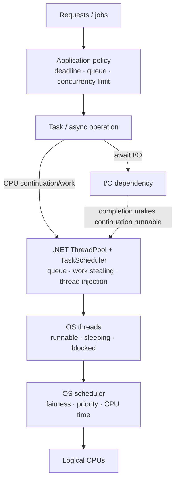
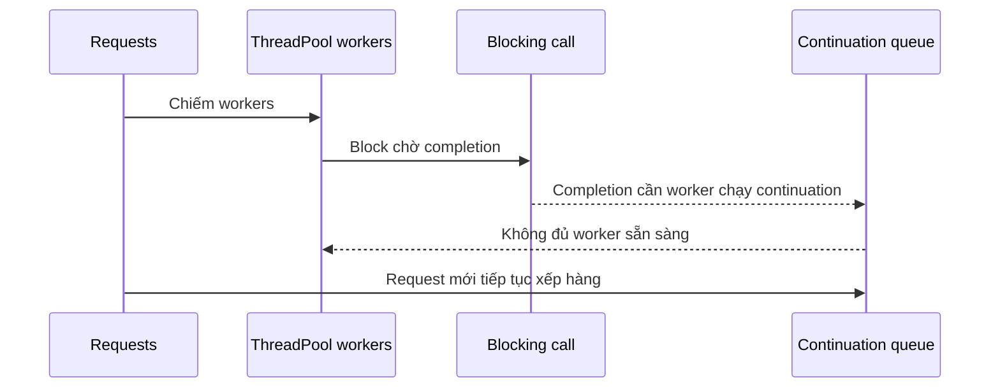

# Process, Thread, Scheduling và Concurrency

> [← Data structures](data-structures-for-backend-systems.md) · [Module overview](README.md) · Tiếp theo: [Memory và virtual memory](memory-stack-heap-virtual-memory-and-cache.md)

## Mục tiêu / Learning Objectives

Sau chương này, người học có thể:

- phân biệt process, OS thread, .NET ThreadPool worker, `Task` và asynchronous operation;
- phân biệt concurrency với parallelism và I/O-bound với CPU-bound work;
- giải thích scheduler state, fairness, preemption và Linux EEVDF ở mức production-useful;
- nhận diện race, atomicity, visibility/ordering, deadlock, livelock, starvation và priority inversion;
- chọn ownership, immutability, `Interlocked`, lock, semaphore hoặc bounded channel theo invariant;
- điều tra ThreadPool starvation/contention bằng evidence và thiết kế concurrency budget.

## Tại sao cần học? / Why It Matters

`async` không tự làm code thread-safe. Tạo nhiều `Task` không tạo thêm CPU. Tăng ThreadPool minimum không sửa dependency chậm. Một API có CPU thấp vẫn có thể bị thread starvation vì blocking; một counter có kiểu `int` vẫn mất update vì `counter++` là read-modify-write; một lock đúng correctness vẫn có thể phá tail latency nếu critical section chứa I/O.

Architect cần reasoning ở ba scheduler/boundary khác nhau:

1. Application quyết định tạo/chờ/bound concurrency thế nào.
2. .NET runtime quyết định queue và phân work lên ThreadPool threads thế nào.
3. OS quyết định thread runnable nào được CPU khi nào.

## Tổng quan / Overview



Nếu work đang chờ network, giữ thêm thread không làm dependency trả lời nhanh hơn. Nếu work CPU-bound, concurrency vượt CPU/resource budget thường chỉ tăng queueing, context switches và contention.

## Mental Model

### Process, thread và Task là ba abstraction

| Abstraction | Chịu trách nhiệm chính |
| --- | --- |
| Process | Virtual address space, handles/resources và isolation boundary |
| OS thread | Execution context được kernel scheduler phân CPU |
| `Task` | Đại diện operation có eventual completion/result/failure/cancellation |

Một `Task` có thể hoàn thành mà không giữ thread suốt thời gian chờ I/O. Một thread có thể thực thi nhiều task continuations theo thời gian. Một process có nhiều threads cùng truy cập managed heap.

### Concurrency không đồng nghĩa parallelism

- **Concurrency:** nhiều operation cùng in-flight và tiến triển xen kẽ.
- **Parallelism:** nhiều operations thực thi cùng thời điểm trên nhiều compute units.
- Async I/O tăng khả năng xử lý concurrent waits; CPU parallelism cần cores và work đủ lớn.

### Shared mutable state tạo coordination tax

Nếu nhiều execution contexts có thể đọc/ghi cùng invariant, bạn cần ownership hoặc synchronization. Tax gồm correctness reasoning, contention, memory ordering, failure/cancellation và observability. Giảm shared state thường tốt hơn chọn primitive phức tạp.

## Thuật ngữ / Terminology

| Thuật ngữ | Ý nghĩa |
| --- | --- |
| Runnable | Thread sẵn sàng chạy nhưng có thể đang chờ CPU |
| Blocked/sleeping | Thread đang chờ event, lock, timer hoặc I/O path |
| Preemption | Scheduler ngắt/chuyển CPU sang task khác |
| Context switch | Thay execution context trên CPU |
| Fairness | Chính sách chia CPU/progress giữa runnable entities |
| EEVDF | Earliest Eligible Virtual Deadline First, fair-class scheduler direction hiện đại của Linux |
| ThreadPool | Runtime-owned reusable worker/I/O completion infrastructure |
| Work stealing | Worker lấy work từ queue khác để cân bằng |
| Race condition | Result phụ thuộc timing/interleaving không được kiểm soát |
| Atomic operation | Operation quan sát như một indivisible state transition ở scope contract |
| Critical section | Vùng code cần exclusive/controlled access |
| Contention | Nhiều workers tranh cùng resource/lock |
| Deadlock | Cycle chờ khiến không participant nào tiến triển |
| Livelock | Participants hoạt động/retry nhưng không hoàn thành |
| Starvation | Work không có đủ cơ hội/resource để tiến triển |
| Priority inversion | High-priority work chờ resource do lower-priority work giữ |
| Backpressure | Consumer truyền capacity pressure về producer |

## Prerequisites

- [Complexity/workload reasoning](complexity-and-workload-reasoning.md).
- [Data structures](data-structures-for-backend-systems.md), đặc biệt queue/boundedness.
- C# method, exception và `Task` syntax cơ bản.
- [Linux process/resource chapter](../02-linux-git-networking/process-signals-and-resource-pressure.md) bổ sung command-level diagnosis.

## How It Works

### 1. OS làm thread chạy

Thread chuyển giữa running, runnable và waiting. Scheduler chọn runnable thread theo policy/priority/fairness và CPU availability. Linux default time-sharing policy là `SCHED_OTHER`/`SCHED_NORMAL`; nice ảnh hưởng relative scheduling nhưng không tạo hard latency guarantee.

Linux bắt đầu chuyển fair-class scheduler từ CFS sang EEVDF từ kernel 6.6. EEVDF dùng lag để xác định eligibility và virtual deadline để chọn work; historical CFS `vruntime` vẫn hữu ích để hiểu fairness nhưng không nên mô tả là toàn bộ current implementation.

Application không điều khiển exact interleaving. Correctness không được phụ thuộc “thread A chắc chạy trước”.

### 2. .NET ThreadPool tái sử dụng threads

.NET có một managed ThreadPool cho process. TPL/Task APIs mặc định schedule CPU work/continuations vào pool. Default `TaskScheduler` dùng ThreadPool, local/global queues, work stealing và runtime thread injection/retirement.

Queued work có thể tăng lớn trong memory trong khi active thread count được runtime điều tiết. Blocking ThreadPool workers làm work mới chờ; tăng minimum threads quá mức có thể tăng contention/context switching/memory và che root cause.

### 3. Async I/O giải phóng thread trong thời gian chờ

`await` một truly asynchronous I/O operation đăng continuation và trả control; không cần một worker thread ngồi chờ socket. Khi I/O completion xảy ra, continuation trở thành schedulable work.

`Task.Run` quanh synchronous blocking I/O chỉ chuyển blocking sang ThreadPool; không biến API thành non-blocking.

### 4. Race xuất hiện ở compound operation

`counter++` conceptually là:

~~~text
read counter
compute counter + 1
write counter
~~~

Hai threads có thể đọc cùng old value rồi cả hai ghi cùng new value. Atomic read/write của một field không làm toàn bộ read-modify-write atomic.

### 5. Chọn coordination primitive nhỏ nhất đúng

| Need | Candidate | Boundary |
| --- | --- | --- |
| Single numeric/reference atomic transition | `Interlocked` | Operation hẹp, lock-free API contract |
| Protect multi-field invariant | private lock / `System.Threading.Lock` | Critical section phải ngắn; không await bên trong monitor lock |
| Limit concurrent async operations | `SemaphoreSlim` | Capacity, timeout/cancellation và release ownership |
| Producer/consumer + backpressure | bounded `Channel<T>` | Full mode và completion contract |
| Mostly-read snapshot | immutable snapshot + atomic publish | Rebuild/copy và freshness |
| No shared memory | message passing/single owner | Queue capacity và failure handling |

### 6. Cancellation và deadline là concurrency control

Cancellation không kill thread; cooperative code phải observe token và unwind safely. Deadline nên truyền qua layers, không tạo independent timeout/retry làm work sống sau request. Release semaphore/lock/resource trong `finally`/`using` paths.

## Minimal Example

Giới hạn tối đa 16 dependency calls in-flight:

```csharp
private static readonly SemaphoreSlim Gate = new(initialCount: 16, maxCount: 16);

static async Task<string> FetchAsync(HttpClient client, Uri uri, CancellationToken cancellationToken)
{
    await Gate.WaitAsync(cancellationToken);

    try
    {
        return await client.GetStringAsync(uri, cancellationToken);
    }
    finally
    {
        Gate.Release();
    }
}
```

Gate bảo vệ dependency/connections và memory in-flight. Nó không tự đặt queue bound cho mọi caller; outer admission/queue policy vẫn cần khi arrival rate có thể vượt capacity dài hạn.

## Production Example

### ThreadPool starvation trong API

Symptom:

- request rate ổn định nhưng p99 tăng theo bậc;
- CPU không saturated;
- ThreadPool queue length tăng, thread count tăng chậm;
- dependency latency bình thường;
- code gọi `.Result`, `.Wait()` hoặc synchronous I/O trong request path.

Mechanism:



Investigation:

1. Correlate request latency, ThreadPool queue/thread count và CPU.
2. Capture trace/stack, tìm blocking/sync-over-async và long-running callbacks.
3. Chuyển I/O chain thành async end-to-end, bound concurrency và load-test.
4. Chỉ tune ThreadPool sau khi chứng minh workload legitimately cần và không thể sửa blocking path.

## .NET Integration

- `Task` là higher-level asynchronous operation; default scheduling thường dùng ThreadPool nhưng task không đồng nghĩa thread.
- `Parallel.For` phù hợp CPU-bound data parallelism có đủ work; overhead làm small workloads chậm hơn sequential.
- `Interlocked` cung cấp atomic read-modify-write operations như increment/exchange/compare-exchange.
- `lock`/Monitor bảo vệ critical section; dùng private lock object, không lock `this`, string hoặc public object.
- `SemaphoreSlim.WaitAsync` phù hợp async concurrency gate.
- `ConcurrentDictionary` bảo vệ supported operations; dùng atomic APIs như `GetOrAdd`/`AddOrUpdate` cẩn thận với factory side effects.
- `Channel<T>` kết hợp queue, async wait và bounded backpressure.
- `CancellationToken` là cooperative signal, không phải rollback transaction tự động.

## Internals

### Scheduling is layered

Task scheduler chọn task → managed worker; OS scheduler chọn thread → CPU. Runtime có work-stealing/local queues để locality/load balance, nhưng OS vẫn có runnable competition từ process khác, interrupts và cgroup quota.

### Memory visibility và ordering

Compiler, JIT và CPU có thể reorder operations trong limits của memory model. Synchronization primitive không chỉ mutual exclusion; nó tạo ordering/visibility guarantees theo contract. Không tự viết double-checked/shared protocols từ casual assumptions; dùng library primitive đã document.

### Lock convoy và cache coherence

Lock contention làm threads wait/wake; shared counter dù atomic có thể ping-pong cache line giữa cores. Nhiều parallel workers có thể chậm hơn partition/local aggregation rồi combine.

### Thread creation has cost

Thread cần stack/address space và OS/runtime bookkeeping. ThreadPool tái sử dụng threads và điều tiết injection. “Một thread mỗi request” không phải scalable default cho wait-heavy backend.

## Common Mistakes

- Đồng nhất `Task`, thread và parallel work.
- Dùng `Task.Run` để bọc blocking I/O trong server.
- Gọi `.Result`/`.Wait()` trong async request path.
- Shared `List`/`Dictionary` mutate từ nhiều threads không synchronization.
- Giữ lock trong lúc network/database/file I/O.
- `await` giữa acquire/release nhưng thiếu `finally`.
- Tạo unlimited tasks rồi `WhenAll`, làm memory/dependency burst.
- Tăng ThreadPool minimum như fix đầu tiên.
- Dùng `volatile` để làm compound invariant atomic.
- Lock nhiều resources không có global order, gây deadlock.
- Retry lock/CAS vô hạn, tạo livelock/starvation.
- Bỏ cancellation, deadline và shutdown drain.

## Performance Considerations

Concurrency optimum là workload/resource-specific:

- CPU-bound: bắt đầu gần available CPU budget, đo cache/memory bandwidth/contention.
- I/O-bound: có thể in-flight cao hơn CPU count, nhưng bound theo dependency, memory, connections và deadline.
- Lock-heavy: thêm workers thường tăng wait chứ không tăng throughput.
- Mixed workload: tách queues/budgets để slow/CPU-heavy work không starve latency-sensitive work.

Đo throughput cùng tail latency, queue age, active concurrency, ThreadPool queue/thread count, context switches, lock contention, CPU quota/throttling và allocation.

## Security Considerations

- Unbounded concurrency là resource-exhaustion vector.
- Per-tenant/user quotas ngăn một principal chiếm toàn bộ workers/connections.
- Cancellation/timeout phải propagate đến outbound calls; orphan work có thể tiếp tục tiêu resource sau client disconnect.
- Không giữ lock khi gọi untrusted/plugin/tool code; callback có thể block hoặc re-enter.
- Shared authorization/cache state cần safe publication và tenant-aware keys.
- Deadlock/queue dump có thể chứa secrets; bảo vệ diagnostic artifact.
- Priority từ client không được vượt policy và starve security/system work.

## Reliability / Failure Modes

| Failure | Dấu hiệu | Design response |
| --- | --- | --- |
| Race/lost update | nondeterministic wrong count/state | atomic op, lock, ownership, invariant tests |
| Deadlock | no progress, waits form cycle | lock order, avoid nested locks, timeout only as detection/recovery aid |
| Livelock | retries/CPU high, no completion | randomized/backoff/bounded attempts, simplify protocol |
| Starvation | queue age grows for class of work | fairness, separate pool/queue, remove blocking |
| Priority inversion | urgent work waits low-priority holder | short critical section, avoid app-level priority assumptions |
| ThreadPool starvation | queue/thread grow, CPU not full | async end-to-end, remove blocking, bound work |
| Over-parallelization | CPU/context switch/contention rise | reduce degree, partition/local aggregate |
| Cancellation leak | work continues after deadline | token propagation, finally cleanup, idempotent abort |

Timeout không sửa invariant và force-kill thread không phải safe recovery. Recovery có thể cần process restart sau capture evidence nếu deadlock/corruption khiến state không đáng tin.

## Observability

Telemetry tối thiểu:

- ThreadPool thread count, queue length và completed work item rate;
- active/queued/rejected work per logical workload class;
- semaphore wait duration và permits in use;
- lock contention duration/count (qua runtime tracing khi cần);
- CPU usage, run queue/context switches và cgroup throttling;
- task failure/cancellation/timeout rate;
- dependency latency và connection pool wait;
- shutdown drain duration và abandoned work.

Trace nên phân biệt queue time, service time và dependency wait. Không tạo span/log cho mỗi spin/atomic operation.

## Operational Considerations

- Configuration concurrency limit phải có safe min/max và rollout/rollback.
- Readiness chỉ bật sau khi worker/queue dependencies sẵn sàng; shutdown dừng nhận work rồi drain trong grace period.
- Capacity test gồm burst, slow dependency, cancellation và partial shutdown.
- Thread dump/trace có overhead; capture có thời hạn và bảo vệ data.
- Container CPU quota là effective compute budget, không phải host logical CPU count.
- Long-running dedicated work có thể cần dedicated thread/scheduler, nhưng phải sở hữu lifecycle/error/shutdown rõ.
- Alert queue age và SLO trước khi queue length đạt memory crisis.

## Architect Perspective

### Câu hỏi thiết kế

- Concurrency nhằm che I/O wait hay dùng CPU parallelism?
- Resource nào thực sự giới hạn: CPU, memory, DB connections, rate quota hay downstream capacity?
- Work có hard deadline/cancellation và idempotency không?
- Queue/budget đặt ở request, tenant, process hay fleet boundary?
- Shared mutable invariant có thể thay bằng immutable snapshot/single owner không?
- Overload behavior: wait, reject, shed, degrade hay spill durable?
- Crash giữa operation để lại side effect/permit/state gì?

### 10x và 100x

Ở 10x, bounded concurrency, async I/O, remove contention và capacity-aware pooling thường giải quyết. Ở 100x, một process có thể không đủ; partition work/state, broker và multiple replicas xuất hiện. Nhưng distributed concurrency thêm duplicates, ordering, leases, clock và partial failure; không phải phiên bản “to hơn” của lock local.

## Trade-offs

| Option | Lợi ích | Cost/risk |
| --- | --- | --- |
| Single owner/sequential | Reasoning đơn giản, deterministic | Throughput/core limit |
| `Interlocked` | Fast narrow atomic transition | Khó compose multi-field invariant; contention vẫn có |
| Lock | General critical section | Blocking/contention/deadlock risk |
| Semaphore | Bound concurrency | Queueing, permit leak nếu cleanup sai |
| Bounded channel | Backpressure/decoupling | Queue policy, latency, shutdown semantics |
| Immutable snapshot | Safe reads/publication | Rebuild/copy/freshness |
| Parallelism | CPU wall-time reduction | Overhead, nondeterminism, memory bandwidth |
| More threads | May mask short blocking burst | Stack/memory/context switch/contention; not root-cause fix |

## When NOT to Use It

- Không parallelize small/fast work chưa đo.
- Không dùng shared state khi per-request/local state đủ.
- Không dùng lock-free custom algorithm nếu library primitive/lock đáp ứng SLO.
- Không tạo background fire-and-forget task khi không có owner, error path và shutdown contract.
- Không tăng concurrency vượt downstream limit.
- Không dùng application priority để hứa hard real-time behavior trên general-purpose OS/runtime.
- Không dùng timeout như substitute cho cancellation/idempotency/correctness.

## Alternatives

- Sequential processing và batching.
- Partitioned single-owner workers.
- Immutable snapshot/copy-on-write.
- Actor/message-passing model khi ownership/lifecycle justify framework cost.
- Durable broker khi work phải survive process crash/cross nodes.
- Database atomic constraint/transaction thay in-memory coordination cho shared durable state.
- OS process isolation khi untrusted/crash-prone work không nên share address space.

## Review Questions

1. `Task` khác OS thread ở contract nào?
2. Async I/O giúp scalability bằng cơ chế gì?
3. Vì sao `counter++` không atomic dù `int` read/write có thể atomic?
4. ThreadPool starvation khác CPU saturation thế nào?
5. `Interlocked`, lock và semaphore giải quyết ba loại need nào?
6. Tại sao unbounded `Task.WhenAll` nguy hiểm?
7. EEVDF/CFS nằm ở layer nào so với TaskScheduler?
8. Deadlock, livelock và starvation khác dấu hiệu/progress thế nào?
9. Container CPU quota thay đổi degree-of-parallelism decision ra sao?

## Hands-on Lab

### Problem

Tái hiện lost update khi nhiều workers mutate shared counter, rồi sửa bằng `Interlocked.Increment`.

### Constraints

- Tổng operations bị giới hạn 20 triệu; workers tối đa 64.
- Không dùng kết quả một lần để nói unsafe code “luôn mất đúng X updates”.
- Verify safe counter bằng expected value.

### Implementation steps

```powershell
cd E:\Documents\Dev\labs\01-computer-science\workload-lab
dotnet build -c Release
dotnet run -c Release --no-build -- race 2 100000
dotnet run -c Release --no-build -- race 8 100000
```

### Expected outcome

`interlocked_actual` bằng `expected`. `unsafe_actual` thường thấp hơn vì deliberate yield mở rộng race window; exact lost updates nondeterministic.

### Verification

Chạy mỗi case năm lần. Ghi expected, unsafe, lost, safe và timings; giải thích correctness trước performance.

### Failure experiment

Thử input vượt budget:

```powershell
dotnet run -c Release --no-build -- race 64 1000000
```

Chương trình phải reject. Sau đó mô tả production overload policy tương đương: concurrency cap, bounded queue và deadline.

### Questions

- Vì sao unsafe result thay đổi giữa runs?
- Vì sao `Interlocked` có thể chậm hơn một unsafe operation nhưng vẫn là lựa chọn đúng?
- Khi invariant gồm hai fields, `Interlocked.Increment` có còn đủ không?

## Exit Criteria

- Phân biệt đúng process/thread/Task/concurrency/parallelism.
- Có output race ở hai worker counts và giải thích lost update.
- Safe result luôn được verify bằng expected value trong evidence.
- Đưa ra concurrency budget cho một API/job cụ thể, gồm full behavior và cancellation.
- Chẩn đoán được CPU saturation vs ThreadPool starvation bằng signal cần thu.
- Nêu recovery và operational ownership cho deadlock/queue backlog/shutdown.

## Related Topics

- [Complexity/workload reasoning](complexity-and-workload-reasoning.md)
- [Data structures và bounded queues](data-structures-for-backend-systems.md)
- [Memory, GC và false sharing](memory-stack-heap-virtual-memory-and-cache.md)
- [Linux process/signals/resource pressure](../02-linux-git-networking/process-signals-and-resource-pressure.md)
- Module 03 — .NET async/ThreadPool/runtime deep dive (planned)
- Module 17 — Distributed coordination and messaging (planned)

## Official English Sources

- [Managed thread pool](https://learn.microsoft.com/en-us/dotnet/standard/threading/the-managed-thread-pool)
- [Task Parallel Library](https://learn.microsoft.com/en-us/dotnet/standard/parallel-programming/task-parallel-library-tpl)
- [Task-based asynchronous programming](https://learn.microsoft.com/en-us/dotnet/standard/parallel-programming/task-based-asynchronous-programming)
- [TaskScheduler supplementary remarks](https://learn.microsoft.com/en-us/dotnet/fundamentals/runtime-libraries/system-threading-tasks-taskscheduler)
- [Synchronization primitives](https://learn.microsoft.com/en-us/dotnet/standard/threading/overview-of-synchronization-primitives)
- [Synchronizing data for multithreading](https://learn.microsoft.com/en-us/dotnet/standard/threading/synchronizing-data-for-multithreading)
- [Interlocked — .NET 10](https://learn.microsoft.com/en-us/dotnet/api/system.threading.interlocked?view=net-10.0)
- [Linux EEVDF scheduler](https://docs.kernel.org/scheduler/sched-eevdf.html)
- [sched(7)](https://man7.org/linux/man-pages/man7/sched.7.html)
- [Module references](references.md)

## Vietnamese Resources

Không chọn community concurrency tutorial làm canonical vì nhiều bài đồng nhất Task/thread hoặc dùng behavior cũ. Có thể dùng Microsoft Learn localization để hỗ trợ từ vựng, nhưng kiểm tra contract ở bản English current.

## Verification Metadata

- Verified: 2026-08-11.
- Technology version: .NET 10 lab/API; Linux scheduler documentation current at verification date.
- Official sources: Microsoft Learn, Linux Kernel docs và Linux man-pages; xem links trên.
- Context7 queries used: none; tool unavailable in this run.
- Notes: EEVDF is presented as current Linux fair-scheduler direction; CFS is historical context. Lab bounds workers and total operations.
