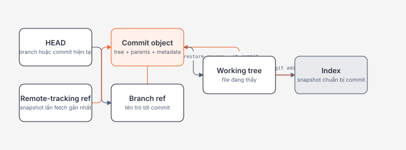

# Git Mental Model and Safe Recovery

## Mục tiêu / Learning Objectives

Sau chương này, người học có thể:

- giải thích working tree, index, commit graph, HEAD, branches, tags và remote-tracking refs;
- dùng status, diff, log và show để xác định state trước khi thay đổi repository;
- phân biệt restore, revert, reset, stash, reflog và worktree theo boundary bị tác động;
- phục hồi staged change, uncommitted work, published commit và commit mất ref mà không đoán;
- xử lý merge/rebase conflict với verification thay vì chỉ xóa conflict markers;
- thiết kế Git workflow có provenance, review, rollback và secret-response contract.

## Tại sao cần học? / Why It Matters

Git hiếm khi “tự làm mất code”. Mất dữ liệu thường xảy ra khi người dùng chưa biết mình đang thay đổi working tree, index hay branch ref, rồi chạy một command có phạm vi rộng hơn dự định.

Trong production engineering, Git còn là nguồn nối giữa:

- source code và artifact đã deploy;
- migration/config/IaC và change timeline;
- incident và commit gây regression;
- review/approval và supply-chain provenance;
- prompt, eval dataset, retrieval config và AI release.

Mục tiêu không phải thuộc lệnh. Mục tiêu là dự đoán chính xác object/ref nào thay đổi trước khi chạy lệnh.

## Tổng quan / Overview

Ba nguyên tắc:

1. Commit là snapshot trong directed acyclic graph, không phải “diff file” đứng độc lập.
2. Branch/tag/remote-tracking ref là tên có thể di chuyển hoặc được cập nhật để trỏ đến object.
3. Recovery bắt đầu bằng inspection và tạo ref/backup mới, không bắt đầu bằng reset hard hoặc clean.

## Mental Model

### Bốn vùng cần phân biệt

| Vùng | Chứa gì? | Command quan sát |
| --- | --- | --- |
| Working tree | Nội dung file hiện tại | git diff |
| Index/staging area | Snapshot dự kiến cho commit kế tiếp | git diff --cached |
| HEAD/current commit | Snapshot branch hiện tại đang trỏ tới | git show HEAD |
| Other refs/history | Branch, tag, remote-tracking ref và commit graph | git log --all, git show-ref |

git status tổng hợp quan hệ giữa các vùng, nhưng diff mới cho biết nội dung cụ thể.

### Objects và refs

Object database chứa blob, tree, commit và annotated tag objects. Object ID được tính từ content/type representation. Hash giúp content addressing và integrity detection, nhưng một hash tự nó không chứng minh author identity hoặc repository source đáng tin.

Branch thường là ref di chuyển tới commit mới. HEAD thường là symbolic ref tới current branch; detached HEAD trỏ trực tiếp đến commit. Remote-tracking ref như origin/main là local record của trạng thái remote tại lần fetch gần nhất, không phải live pointer.

### Recovery boundary

~~~text
Chưa commit?          → working tree / index tools
Đã commit, chưa share? → ref movement có thể phù hợp nếu chỉ mình sở hữu
Đã share/publish?      → tạo corrective commit bằng revert
Commit không còn ref?  → reflog/fsck, tạo branch/tag ngay
Secret đã commit?      → rotate/revoke trước; rewrite chỉ là cleanup phối hợp
~~~

## Thuật ngữ / Terminology

| Thuật ngữ | Mental model |
| --- | --- |
| Working tree | Checkout materialized để người dùng/tool sửa |
| Index | Staging snapshot giữa working tree và commit |
| Blob | File content object; không tự mang filename |
| Tree | Mapping tên/path đến blob/tree và mode |
| Commit | Tree, parent commit(s), author/committer metadata và message |
| Ref | Tên trỏ tới object ID, thường là commit |
| HEAD | Vị trí checkout hiện tại; symbolic hoặc detached |
| Remote-tracking ref | Local snapshot của remote ref sau fetch |
| Reflog | Local log ghi lịch sử cập nhật ref/HEAD gần đây |
| Reachable | Object có đường đi từ một ref/root đang giữ |
| Merge | Kết hợp histories, có thể tạo merge commit |
| Rebase | Replay commits trên base mới, tạo commit IDs mới |
| Fast-forward | Di chuyển ref về phía trước khi không cần merge commit |
| Pathspec | Cú pháp chọn path mà Git command tác động |
| Worktree | Một working tree/index/HEAD gắn với shared repository object store |

## Prerequisites

- Terminal và filesystem cơ bản.
- [Linux Filesystem, Permissions, and Identities](filesystem-permissions-and-identities.md).
- Git CLI; lab dùng repository tạm, không dùng repository công việc.
- Có thể đọc unified diff ở mức line addition/removal/context.

## How It Works

### 1. Inspection gate

Trước mọi recovery/change-history command:

~~~bash
git status --short --branch
git diff --
git diff --cached --
git log --graph --decorate --oneline --all -n 30
git reflog --date=iso -n 30
~~~

Ghi lại current branch, upstream, staged/unstaged/untracked paths và commit IDs liên quan. Với path do user nhập, dùng separator -- để tránh Git hiểu filename bắt đầu bằng dấu gạch là option.

### 2. Từ working tree đến commit

~~~bash
git add -- src/App.cs
git diff --cached -- src/App.cs
git commit -m "Handle dependency cancellation"
~~~

git add cập nhật index, không “lưu tạm file” theo nghĩa backup. Một file có thể đồng thời có staged version và unstaged changes mới hơn.

### 3. Fetch trước khi integrate

~~~bash
git fetch --prune origin
git log --left-right --graph --oneline HEAD...origin/main
git diff --stat HEAD..origin/main
~~~

fetch cập nhật remote-tracking refs và tải objects; nó không tự merge/rebase current branch. Tách fetch khỏi integrate giúp review state trước khi thay history/working tree.

### 4. Chọn công cụ phục hồi đúng boundary

| Tình huống | Công cụ ưu tiên | Vì sao |
| --- | --- | --- |
| Stage nhầm một file | git restore --staged -- path | Chỉ cập nhật index, giữ working tree |
| Muốn xem bản cũ mà không đổi state | git show REV:path | Read-only |
| Muốn giữ work dang dở | commit WIP có chủ đích, stash hoặc linked worktree | Tạo recovery handle trước |
| Commit xấu đã publish | git revert COMMIT | Tạo commit mới, không rewrite shared history |
| Commit local bị mất branch/ref | git reflog rồi git branch recovered COMMIT | Tạo ref mới giữ object |
| Cần thử hotfix song song | git worktree add PATH BRANCH | Không trộn working tree hiện tại |
| Tìm commit gây regression | git bisect với test tái lập | Binary search có evidence |

### 5. Hiểu restore, revert và reset

- restore thay content ở working tree và/hoặc index từ source; có thể ghi đè local content.
- revert áp inverse change và ghi commit mới; phù hợp shared history nhưng có thể conflict.
- reset với commit di chuyển current branch/HEAD và tùy mode thay index/working tree; hard có thể ghi đè tracked và untracked paths cản đường.

Tên gần giống nhưng boundary khác nhau. Luôn nêu source, destination và path/commit cụ thể trước khi dùng.

## Minimal Example

~~~bash
lab_dir=$(mktemp -d)
printf 'git-lab=%s\n' "$lab_dir"
cd "$lab_dir"

git init -b main
git config user.name "Roadmap Learner"
git config user.email "learner@example.invalid"

printf 'version=1\n' > app.txt
git add -- app.txt
git commit -m "Add application baseline"

printf 'version=2\n' > app.txt
git status --short --branch
git diff -- app.txt
git add -- app.txt
git diff --cached -- app.txt
git restore --staged -- app.txt
git status --short
~~~

Kết quả cuối: app.txt vẫn chứa version=2 trong working tree nhưng không còn staged. Đây là recovery của index, không phải xóa work.

## Production Example

Symptom: commit mới trên main làm production error rate tăng.

Quy trình:

1. Xác định artifact/deployment revision thực tế, không đoán theo branch hiện tại.
2. Correlate SLO/error timeline với commit/release/deployment.
3. Dùng git show, diff và tests để xác nhận regression scope.
4. Nếu commit đã publish, tạo branch mitigation từ đúng release ref.
5. Dùng git revert COMMIT, review inverse patch, chạy targeted/full gates phù hợp.
6. Deploy theo pipeline chuẩn, verify SLO và giữ original commit cho root-cause analysis.

~~~bash
git fetch --prune origin
git switch -c revert-regression origin/main
git show --stat --oneline BAD_COMMIT
git revert --no-commit BAD_COMMIT
git diff --cached --

# Chạy test/build/review ở đây trước khi tạo commit.
git commit -m "Revert regression in dependency timeout handling"
~~~

--no-commit cho phép review/test inverse change trước commit. Nếu nhiều commit phụ thuộc nhau hoặc commit là merge, cần hiểu dependency/mainline parent; không tự động revert một dải commit trong incident mà không review result.

## .NET Integration

Git evidence nên đi cùng .NET artifact:

- build gắn commit SHA, repository URL và dirty-state policy vào provenance;
- Source Link cho phép debugger map assembly về source đúng revision;
- package/image sử dụng version/digest immutable, không deploy branch name;
- database migration được review cùng application compatibility/rollback;
- test result, SBOM và signed provenance tham chiếu cùng revision;
- dotnet format/generated files có version/tool pin để tránh diff không ổn định.

Ví dụ lấy revision trong CI:

~~~bash
revision=$(git rev-parse --verify HEAD)
test -n "$revision" || exit 1
printf 'revision=%s\n' "$revision"
dotnet build --configuration Release -p:SourceRevisionId="$revision"
~~~

Không để application production chạy git command trong source checkout để suy ra version. Inject revision khi build/deploy; image/runtime có thể không chứa .git và không nên cần nó.

## Internals

### Snapshot graph

Mỗi commit trỏ đến một root tree và parent commit(s). Merge commit có nhiều parent. Diff là phép so sánh hai states được tính khi cần, không phải payload duy nhất của commit.

### Reachability và garbage collection

Xóa branch chỉ xóa ref; object có thể còn reachable từ ref khác hoặc reflog. Unreachable object không được bảo đảm tồn tại mãi vì reflog expiration/garbage collection. Khi tìm thấy commit cần cứu, tạo branch/tag mới ngay.

### Rebase tạo identity mới

Replay cùng patch trên parent khác tạo commit object IDs mới vì parent/metadata thay đổi. Rebase shared history làm người khác phải reconcile hai histories. Chỉ rewrite history trong ownership boundary đã thống nhất.

### Index có nhiều stages khi conflict

Trong conflict, index có thể giữ base, ours và theirs entries. Ours/theirs phụ thuộc operation context; trong rebase chúng dễ gây hiểu nhầm. Đọc ancestor/base và intended behavior thay vì chọn cả file theo nhãn.

## Common Mistakes

- Chạy reset hard/clean để “đồng bộ” trước khi đọc status/diff.
- Nhầm git restore --staged là xóa working changes, hoặc restore working tree là unstage.
- Nhầm origin/main là state live của remote khi chưa fetch.
- Dùng pull mơ hồ mà không biết merge hay rebase policy.
- Force-push shared branch mà không lease/review/coordination.
- Resolve conflict bằng cách chọn toàn bộ ours/theirs rồi không test behavior.
- Dùng stash như archive dài hạn; quên stash không thay remote backup.
- Cho rằng revert xóa secret khỏi history.
- Dùng commit hash làm bằng chứng danh tính/tính tin cậy duy nhất.
- Chạy code, hooks hoặc build của repository chưa tin cậy bằng credential mạnh.

## Performance Considerations

- Repository lớn chịu object count, pack, history và working-tree scan cost.
- Monorepo cần path ownership, sparse checkout/partial clone hoặc build graph trước khi tách repo chỉ vì clone chậm.
- Generated/binary artifacts làm diff kém và history phình; dùng artifact registry phù hợp.
- CI fetch depth quá nông có thể phá versioning, bisect, changelog và security scan history.
- git gc/maintenance cần disk headroom; không chạy aggressive maintenance tùy tiện trong incident.
- File watcher, antivirus và case-insensitive filesystem có thể ảnh hưởng Windows checkout performance.

## Security Considerations

- Git history không phải secret store. Nếu secret xuất hiện: revoke/rotate trước, đánh giá exposure, rồi mới phối hợp rewrite/purge.
- Không đặt safe.directory=* để chữa mọi ownership error; chỉ trust exact shared repository đã xác minh.
- Repository có thể ảnh hưởng config, filters, submodules, build scripts và hooks; coi clone/build là xử lý untrusted code.
- Dùng least-privilege credential helper/token và không nhúng token vào remote URL/log.
- Protected branches, review, signed commits/tags hoặc artifact attestations giải quyết các trust questions khác nhau; không xem một control thay thế tất cả.
- Verify submodule source/commit và dependency lockfiles.
- Secret scanning cần pre-commit feedback và server-side gate; client hook có thể bị bypass.

## Reliability / Failure Modes

| Failure mode | Evidence | Recovery |
| --- | --- | --- |
| Stage nhầm | status + diff --cached | restore --staged cho exact path |
| Ghi đè working file | editor backup, stash/ref/reflog tùy operation | Phục hồi từ handle còn tồn tại |
| Commit mất branch | reflog, fsck | branch/tag exact object ID ngay |
| Bad published commit | deployment SHA + diff/test | revert và deploy corrective commit |
| Diverged history | log --left-right/graph | Chọn merge/rebase theo ownership policy |
| Conflict resolution sai | tests, diff, behavior | Abort/retry hoặc corrective commit |
| Secret trong history | scanner/audit/provider logs | Revoke, assess, coordinated rewrite |
| Corrupt object store | fsck, clone/backup/remote | Restore từ trusted replica/backup |
| Wrong artifact deployed | image/package digest khác commit mapping | Rollback artifact; sửa provenance gate |

## Observability

Git/change observability cho production gồm:

- commit SHA và dirty-state policy tại build;
- artifact digest/package version và build run ID;
- PR/review/approval references;
- deployment environment, timestamp và actor;
- migration/config/feature-flag revisions;
- rollback/revert commit liên kết incident;
- bisect/test evidence cho regression.

Không log repository credentials, signed token hoặc secret diff vào CI artifacts.

## Operational Considerations

- Protected default branch cần required checks và review phù hợp risk.
- Release dựa trên immutable commit/tag/artifact, không branch head thay đổi.
- Revert path phải được diễn tập; rollback app có thể không rollback schema/data.
- Force push policy cần ownership, lease, audit và recovery procedure.
- Backup bare mirror không thay artifact registry/database backup; mỗi system có recovery contract riêng.
- Cross-platform repo nên định nghĩa .gitattributes, line endings, executable bit và case naming rõ ràng.
- Git LFS/submodules tăng operational dependency; cần availability và retention plan.

## Architect Perspective

Git là change-control primitive, không chỉ developer tool. Kiến trúc cần xác định:

- source of truth cho code, config, IaC, schemas, prompts và policies;
- mapping revision → build → artifact → deployment;
- review/approval boundary cho loại thay đổi khác nhau;
- compatibility khi app/schema/event contract thay đổi độc lập;
- rollback vs forward-fix decision;
- repository/monorepo ownership và blast radius;
- retention, legal/audit và secret-response requirements.

## Trade-offs

| Quyết định | Lợi ích | Đổi lại |
| --- | --- | --- |
| Merge commit | Giữ topology/integration event | History nhiều nhánh hơn |
| Rebase local | History tuyến tính dễ đọc | Commit IDs đổi; không phù hợp shared ownership |
| Squash merge | Một commit per change | Mất granular commits/topology ở main |
| Monorepo | Atomic cross-component change | Tooling/ownership/CI scale phức tạp |
| Multi-repo | Isolation và autonomy | Version coordination/discovery khó hơn |
| Signed commits/tags | Thêm identity/integrity signal | Key lifecycle và verification operations |
| Linked worktree | Parallel context không stash | Shared repo metadata, tool/submodule caveats |

## When NOT to Use It

- Không dùng Git làm runtime configuration distribution nếu cần immediate consistency/secret rotation mà không có deployment controller.
- Không lưu large mutable datasets/model binaries trực tiếp trong normal Git history.
- Không dùng history rewrite như incident response duy nhất cho leaked secret.
- Không dùng branch name như immutable release identifier.
- Không chọn micro-repository chỉ để tránh học monorepo tooling và ownership.

## Alternatives

- Artifact/package/container registry cho build outputs.
- Secret manager cho credentials và rotation.
- Database/object storage cho mutable/large data.
- Feature flag/config service cho controlled runtime change.
- Patch file, stash hoặc linked worktree cho short-lived local work, tùy recovery needs.
- Revert hoặc forward fix cho shared history; reset/rebase chỉ trong private ownership boundary.

## Review Questions

1. Working tree, index và HEAD khác nhau như thế nào?
2. Vì sao một file có thể vừa staged vừa modified?
3. restore, revert và reset thay đổi boundary nào?
4. Vì sao origin/main có thể stale?
5. Khi nào reflog cứu được commit và tại sao không phải backup vĩnh viễn?
6. Rebase tạo commit IDs mới vì những field nào thay đổi?
7. Vì sao revert secret commit không giải quyết exposure?
8. Artifact provenance cần nối những identifiers nào?
9. Khi nào linked worktree tốt hơn stash?
10. Merge strategy nào phù hợp với ownership và audit requirements của team?

## Hands-on Lab

### Mục tiêu

Thực hành inspection, unstage, stash, revert và reflog recovery trong repository tạm do chính người học tạo.

### Bước 1: tạo baseline

Chạy Minimal Example và giữ exact lab_dir được in ra.

### Bước 2: giữ work dang dở

~~~bash
git stash push -m "lab: version 2 work" -- app.txt
git status --short
git stash list
git stash show --patch stash@{0}
git stash pop
git diff -- app.txt
~~~

Xác nhận work trở lại working tree. Stash có thể conflict khi base thay đổi; đọc output trước khi drop bất kỳ stash nào.

### Bước 3: revert published-style change

~~~bash
git add -- app.txt
git commit -m "Change application to version 2"
bad_commit=$(git rev-parse HEAD)
test -n "$bad_commit" || exit 1

git revert --no-edit "$bad_commit"
git log --graph --decorate --oneline -n 4
cat app.txt
~~~

Xác nhận history có cả bad commit và revert commit; app.txt trở lại version=1.

### Bước 4: cứu detached commit

~~~bash
git switch --detach HEAD
printf 'diagnostic-note\n' > investigation.txt
git add -- investigation.txt
git commit -m "Capture detached investigation"
detached_commit=$(git rev-parse HEAD)
test -n "$detached_commit" || exit 1

git switch main
git reflog --date=iso -n 10
git branch recovered-investigation "$detached_commit"
git show --stat recovered-investigation
~~~

Không xóa branch recovered trong lab. Việc tạo ref mới là bước làm commit reachable rõ ràng.

### Bước 5: báo cáo

Nộp:

- git version;
- status/diff evidence ở từng boundary;
- commit graph sau revert;
- reflog entry và recovered branch;
- bảng quyết định cho staged mistake, local commit, published commit và leaked secret;
- reflection về command nào có thể mất dữ liệu và precondition cần kiểm tra.

Repository lab nằm ở exact mktemp path. Sau khi review evidence, chuyển đúng directory này vào Trash/Recycle Bin bằng cơ chế của OS; không dùng recursive wildcard cleanup.

## Exit Criteria

Hoàn thành khi người học có thể:

- vẽ working tree → index → commit → refs/HEAD;
- giải thích output của status, diff, diff --cached và log graph;
- unstage mà không làm mất working changes;
- revert bad published commit và review inverse patch;
- phục hồi detached/lost commit bằng reflog và ref mới;
- chọn merge/rebase/worktree theo ownership boundary;
- mô tả secret-response và artifact-provenance workflow.

## Related Topics

- [Production Troubleshooting Foundations](production-troubleshooting-foundations.md)
- [Linux Filesystem, Permissions, and Identities](filesystem-permissions-and-identities.md)
- CI/CD artifact promotion and rollback
- Database migration compatibility
- Supply-chain security and SBOM/provenance
- ADR and change-management practices

## Official English Sources

- [Git reference](https://git-scm.com/docs/git)
- [Git restore](https://git-scm.com/docs/git-restore)
- [Git revert](https://git-scm.com/docs/git-revert)
- [Git reset](https://git-scm.com/docs/git-reset)
- [Git reflog](https://git-scm.com/docs/git-reflog)
- [Git worktree](https://git-scm.com/docs/git-worktree)
- [Git bisect](https://git-scm.com/docs/git-bisect)
- [Pro Git — Plumbing and Porcelain](https://git-scm.com/book/en/v2/Git-Internals-Plumbing-and-Porcelain)
- [Pro Git — Maintenance and Data Recovery](https://git-scm.com/book/en/v2/Git-Internals-Maintenance-and-Data-Recovery)
- [git-config safe.directory](https://git-scm.com/docs/git-config#Documentation/git-config.txt-safedirectory)

## Vietnamese Resources

Chưa tìm thấy bản dịch tiếng Việt chính thức, còn được duy trì, trên git-scm.com tại thời điểm xác minh. Dùng English reference của Git version đang chạy làm source of truth; có thể tự ghi chú thuật ngữ Việt–Anh bằng [glossary chung](../00-roadmap/glossary.md).

## Verification Metadata

- Last verified: 2026-08-11.
- Official documentation snapshot: Git manuals exposed versions through 2.55.0; local CLI is git 2.49.0.windows.1.
- Stable scope: object/ref/index model, restore/revert/reset boundaries và reflog recovery.
- Runtime note: lab sequence is verified separately in an isolated temporary repository; workspace root is intentionally not initialized because its existing .git directory is incomplete and user-owned.
