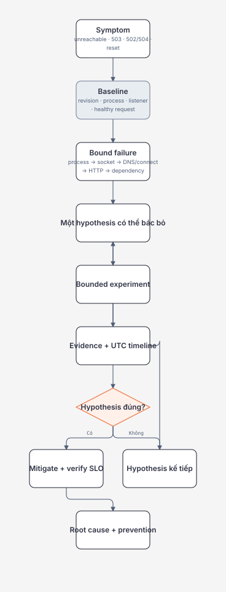

# Incident Lab: Diagnose a .NET Service End to End

## Mục tiêu / Learning Objectives

Sau lab này, người học có thể:

- dựng baseline cho một ASP.NET Core service trước khi inject failure;
- chẩn đoán process, listener, DNS/connect, HTTP status, readiness và dependency timeout;
- phân biệt transport identity với raw forwarded metadata;
- quan sát graceful SIGTERM trong khi có in-flight request;
- lập incident timeline với hypothesis, evidence, mitigation và prevention;
- nối Git revision, build result và runtime behavior thành production evidence.

## Tại sao cần học? / Why It Matters

Các chương riêng lẻ dễ tạo cảm giác “đã biết lệnh”. Incident thực tế không báo sẵn layer lỗi. Người vận hành nhận symptom như “API down”, “pod không ready”, “502 tăng” hoặc “deploy bị reset”, rồi phải xác định:

- component/hop nào tạo symptom;
- state trước failure là gì;
- evidence nào phân biệt các giả thuyết;
- mitigation có làm mất evidence hoặc tăng blast radius không;
- sau recovery cần thay architecture/runbook/gate nào.

Lab này dùng một service nhỏ, không có package ngoài shared framework, để failure behavior nhìn thấy được mà không bị business code che khuất.

## Tổng quan / Overview

Service source:

- [IncidentService.csproj](../../labs/02-linux-git-networking/incident-service/IncidentService.csproj)
- [Program.cs](../../labs/02-linux-git-networking/incident-service/Program.cs)

## Mental Model

### Lab topology

~~~text
curl/client
  ↓ TCP loopback :5080
Kestrel incident-service
  ├─ /health/live
  ├─ /health/ready          controlled by READINESS_MODE
  ├─ /diagnostics/request   transport + raw headers
  ├─ /work                  bounded delay, honors cancellation
  └─ /dependency            HttpClient → UPSTREAM_URL
~~~

/dependency có:

- connect timeout 2 giây;
- request deadline 3 giây;
- pooled connection lifetime 5 phút;
- kết quả phân loại configuration, transport, timeout hoặc HTTP response.

Các giá trị này phục vụ lab, không phải default khuyến nghị cho mọi production system.

### Evidence ladder

| Câu hỏi | Evidence |
| --- | --- |
| Revision/build nào? | git rev-parse, dotnet build output |
| Process có sống? | PID, ps, /proc/PID/status, process start time |
| Listener ở đâu? | ss trong đúng namespace |
| Request tới HTTP chưa? | curl verbose/timing, status, app log |
| App ready không? | readiness contract và reason |
| Dependency hỏng lớp nào? | category, elapsed time, direct endpoint test |
| Shutdown có drain không? | signal time, stopping log, in-flight result, exit time |

## Thuật ngữ / Terminology

| Thuật ngữ | Ý nghĩa trong lab |
| --- | --- |
| Baseline | State healthy đã đo trước failure |
| Symptom | Điều user/monitor thấy; chưa phải root cause |
| Hypothesis | Giải thích cụ thể có prediction có thể kiểm tra |
| Failure injection | Thay đổi có chủ đích, bounded và reversible |
| Control | Request/state không bị inject để so sánh |
| Mitigation | Giảm impact trước khi root cause hoàn tất |
| Root cause | Điều kiện/cơ chế tạo failure, không chỉ component cuối báo lỗi |
| Prevention | Thay đổi test/design/operation làm giảm recurrence/impact |
| Readiness | Có nên nhận traffic mới tại thời điểm này |
| Liveness | Process có cần restart vì không thể tiến triển |
| In-flight request | Request đã được nhận nhưng chưa hoàn tất |
| Timeline | Chuỗi event theo UTC/correlation ID |

## Prerequisites

- .NET SDK 10.x; kiểm tra bằng dotnet --version.
- Linux VM/WSL2 cho signal và /proc/ss portions.
- curl, ps, ss; jq optional.
- Hoàn thành hoặc đọc:
  - [Production Troubleshooting Foundations](production-troubleshooting-foundations.md)
  - [Processes, Signals, and Resource Pressure](process-signals-and-resource-pressure.md)
  - [DNS, TCP, TLS, and HTTP Deep Dive](dns-tcp-tls-http-deep-dive.md)
  - [Proxy, NAT, Load Balancer, and Network Boundaries](proxy-nat-load-balancer-and-network-boundaries.md)
  - [Git Mental Model and Safe Recovery](git-mental-model-and-safe-recovery.md)

## How It Works

### Safety contract

- Chỉ bind loopback 127.0.0.1 trong lab mặc định.
- Không dùng port production hoặc gửi request tới production service.
- Chỉ signal PID do chính shell lab tạo và xác minh.
- Mọi delay bị giới hạn tối đa 30 giây; dependency deadline là 3 giây.
- Không chạy memory stress, fork bomb, recursive cleanup hoặc privileged namespace mutation.
- Lưu output trước khi dừng process.
- LAB_ALLOW_STOP endpoint bị tắt mặc định và chỉ dùng cho automated smoke test local.

### Build gate

Từ repository root:

~~~bash
dotnet --version
dotnet build \
  labs/02-linux-git-networking/incident-service/IncidentService.csproj \
  --configuration Release \
  --nologo
~~~

Không tiếp tục nếu build có warning/error chưa hiểu. Ghi SDK version, build time và output summary.

### Start baseline trên Linux

~~~bash
service_dll="$(pwd)/labs/02-linux-git-networking/incident-service/bin/Release/net10.0/IncidentService.dll"
test -f "$service_dll" || exit 66

ASPNETCORE_URLS=http://127.0.0.1:5080 \
UPSTREAM_URL=http://127.0.0.1:5080/health/live \
dotnet "$service_dll" &
app_pid=$!

case "$app_pid" in
  ''|*[!0-9]*) printf 'invalid pid\n' >&2; exit 64 ;;
esac
printf 'app_pid=%s\n' "$app_pid"
~~~

Giữ terminal này để xem lifecycle logs. Không chạy nhiều instance trên cùng port.

### Baseline capture

Trong terminal khác:

~~~bash
date --utc --iso-8601=seconds
curl --silent --show-error http://127.0.0.1:5080/health/live
curl --silent --show-error http://127.0.0.1:5080/health/ready
curl --silent --show-error http://127.0.0.1:5080/dependency

ss -lntp '( sport = :5080 )'
ps -o pid,ppid,user,stat,etime,pcpu,pmem,comm -p APP_PID
~~~

Thay APP_PID bằng số đã ghi, không paste placeholder nguyên dạng. Baseline đạt khi live/ready/dependency đều success và listener là 127.0.0.1:5080.

## Minimal Example

Smoke test ngắn nhất sau khi service chạy:

~~~bash
curl --fail-with-body --silent --show-error \
  http://127.0.0.1:5080/health/live

curl --fail-with-body --silent --show-error \
  http://127.0.0.1:5080/work?delayMs=100
~~~

Nếu fail, thu curl -v, ss và process evidence trước khi restart.

## Production Example

Symptom: sau rollout, edge trả 504 tăng nhưng readiness vẫn xanh.

Áp dụng lab model:

1. Edge 504 chứng minh edge hết gateway deadline, không chứng minh app không chạy.
2. Readiness xanh chỉ chứng minh probe contract; dependency dùng bởi request có thể chậm.
3. So proxy upstream timing, application dependency span và HttpClient error category.
4. Kiểm tra retry ở client/proxy/app và remaining deadline.
5. Mitigate bằng rollback/shed load/disable path tùy evidence, không chỉ tăng gateway timeout.
6. Prevention có thể là readiness contract tốt hơn, dependency timeout ngắn hơn, circuit/bulkhead, SLO alert hoặc rollout canary.

Lab tái tạo cùng shape với UPSTREAM_URL trỏ vào /work?delayMs=5000, trong khi /dependency chỉ có deadline 3 giây.

## .NET Integration

### Endpoint contract

| Endpoint | Mục đích | Failure control |
| --- | --- | --- |
| /health/live | Process response tối thiểu | Không phụ thuộc upstream |
| /health/ready | Có nhận traffic mới không | READINESS_MODE=fail trả 503 |
| /diagnostics/request | Thấy transport/request metadata | Client có thể spoof raw headers |
| /work | Request có delay/cancellation | delayMs từ 0 đến 30000 |
| /dependency | Phân loại outbound call | UPSTREAM_URL |
| POST /lab/stop | Automated local stop | Chỉ bật khi LAB_ALLOW_STOP=true |

### HttpClient behavior

Service dùng IHttpClientFactory và SocketsHttpHandler để:

- tránh tạo client/connection mới cho từng request;
- tách connect timeout khỏi total request deadline;
- refresh pooled connections theo lifetime;
- không buffer dependency body khi chỉ cần status.

Response không trả full upstream URL hoặc exception message để giảm lộ dữ liệu. Production telemetry vẫn cần trace/route identifiers và redaction policy mạnh hơn.

### Graceful lifecycle

ApplicationStarted, ApplicationStopping và ApplicationStopped được log cùng PID. /work dùng RequestAborted. Khi SIGTERM tới Generic Host/Kestrel:

- host bắt đầu shutdown;
- listener ngừng nhận work theo lifecycle;
- active request có cơ hội hoàn tất trong shutdown budget;
- forced kill vẫn có thể xảy ra nếu supervisor grace period ngắn hơn.

## Internals

### Tại sao failure category có thể khác theo môi trường?

Một port không listen thường tạo connection refused, nhưng firewall, NAT, proxy policy hoặc OS stack có thể silent-drop và dẫn tới timeout. Lab assertion không được ép “unused port luôn là 502”. Phải ghi elapsed time và error category thực tế.

### Self-upstream

Trỏ UPSTREAM_URL về cùng service tạo nested request qua loopback. Kestrel xử lý concurrent request nên đây là cách local, deterministic để mô phỏng:

- success: /health/live;
- HTTP failure: /missing;
- slow upstream: /work?delayMs=5000.

Không dùng self-call như production architecture pattern.

### Cancellation layers

/dependency liên kết caller RequestAborted với deadline 3 giây. Nếu caller disconnect, local work được cancel. Nếu deadline hết trước, service trả 504 category timeout nếu response channel còn tồn tại. HTTP 499 được dùng trong lab cho caller-abort path và không phải IETF standard status.

## Common Mistakes

- Inject failure trước khi có healthy baseline.
- Restart ngay khi symptom xuất hiện và mất PID/socket/log evidence.
- Dùng curl từ host để kết luận route trong container namespace.
- Chỉ nhìn health status, bỏ elapsed time và status producer.
- Mặc định unused port phải refused trên mọi network path.
- Tin raw X-Forwarded-For là client identity.
- Gửi SIGKILL thay SIGTERM rồi kết luận app không graceful.
- Để request stress chạy không bound.
- Thay nhiều variables cùng lúc nên không biết điều gì gây result.
- Ghi conclusion mà không gắn command/output/UTC.

## Performance Considerations

- Lab không phải benchmark; debug logging và loopback làm số liệu không đại diện production.
- /work mô phỏng wait, không mô phỏng CPU saturation.
- Self-upstream chia sẻ process/resources, khác remote dependency.
- Một sample không mô tả percentile hoặc capacity.
- Khi mở rộng load test, phải bound concurrency, duration và output; ghi RPS, latency percentiles, errors và resource scope.
- Trace/counters chỉ bật duration đủ trả lời hypothesis.

## Security Considerations

- Chỉ bind loopback; không expose diagnostic endpoints công khai.
- /diagnostics/request phản chiếu host/forwarded metadata; production endpoint như vậy cần auth/redaction hoặc không tồn tại.
- LAB_ALLOW_STOP phải tắt ngoài automated local smoke test.
- Không đưa secret/token vào UPSTREAM_URL, command history hoặc output.
- Không chạy service/repository chưa tin cậy bằng privileged user.
- Client IP/header không phải authorization identity.
- Failure injection production cần change authorization và blast-radius guard; lab local không cấp quyền đó.

## Reliability / Failure Modes

### Scenario A — No listener

1. Ghi baseline.
2. Gửi SIGTERM cho exact app_pid và wait.
3. Chạy lại curl với connect/max timeout bounded.
4. Xác nhận ss không có listener.

~~~bash
kill -TERM "$app_pid"
wait "$app_pid"

curl --connect-timeout 1 --max-time 3 -v \
  http://127.0.0.1:5080/health/live
ss -lntp '( sport = :5080 )'
~~~

Expected layer: TCP connect không thể tới listener. Error cụ thể có thể refused hoặc timeout theo path/policy.

### Scenario B — Not ready nhưng vẫn live

Restart service với:

~~~bash
ASPNETCORE_URLS=http://127.0.0.1:5080 \
READINESS_MODE=fail \
UPSTREAM_URL=http://127.0.0.1:5080/health/live \
dotnet "$service_dll" &
app_pid=$!
~~~

~~~bash
curl --silent --show-error -i http://127.0.0.1:5080/health/live
curl --silent --show-error -i http://127.0.0.1:5080/health/ready
~~~

Expected: live 200, ready 503. Explain why supervisor không nhất thiết restart process và load balancer nên ngừng traffic mới.

### Scenario C — Dependency matrix

Restart một lần cho mỗi UPSTREAM_URL, giữ các variable khác cố định:

| UPSTREAM_URL | Failure/behavior muốn quan sát |
| --- | --- |
| http://127.0.0.1:5080/health/live | Success |
| http://127.0.0.1:5080/missing | HTTP 404 upstream → lab 502 |
| http://127.0.0.1:5080/work?delayMs=5000 | Deadline 3 giây → lab 504 |
| http://service-does-not-exist.invalid/ | Name resolution/transport failure |
| http://127.0.0.1:UNUSED_PORT/ | Refusal hoặc timeout theo environment |

Với UNUSED_PORT, chọn port sau khi chứng minh không có listener bằng ss. Không dùng endpoint production.

### Scenario D — Spoofed forwarding metadata

~~~bash
curl --silent --show-error \
  -H 'X-Forwarded-For: 203.0.113.50' \
  -H 'X-Forwarded-Proto: https' \
  http://127.0.0.1:5080/diagnostics/request
~~~

So remoteIp với rawForwardedFor và giải thích trust boundary.

### Scenario E — Graceful shutdown có in-flight request

Chạy với readiness bình thường. Sau đó:

~~~bash
curl --silent --show-error \
  http://127.0.0.1:5080/work?delayMs=5000 &
request_pid=$!

sleep 1
kill -TERM "$app_pid"

wait "$request_pid"
request_exit=$?
wait "$app_pid"
app_exit=$?

printf 'request_exit=%s app_exit=%s\n' "$request_exit" "$app_exit"
~~~

Chỉ signal app_pid đã xác minh. Ghi thời điểm ApplicationStopping, response completion và ApplicationStopped. Nếu request bị reset, kiểm tra shutdown timeout/supervisor/process target trước khi kết luận framework behavior.

## Observability

### Evidence packet

Mỗi scenario lưu:

- UTC start/end;
- Git SHA và git status state nếu repository hợp lệ;
- dotnet/git/OS version;
- command và exact endpoint/config;
- app PID, listener, process state;
- curl status/timings/error;
- structured app logs;
- dependency category/elapsed time;
- hypothesis trước experiment;
- result: supported/rejected/inconclusive;
- mitigation và prevention.

### Timing command

~~~bash
curl --silent --show-error --output /dev/null \
  --write-out 'code=%{http_code} dns=%{time_namelookup} connect=%{time_connect} first_byte=%{time_starttransfer} total=%{time_total}\n' \
  --connect-timeout 2 --max-time 10 \
  http://127.0.0.1:5080/dependency
~~~

## Operational Considerations

- Chạy mỗi scenario từ fresh documented state.
- Không reuse process/config mà quên environment variable cũ.
- Một người inject, một người quan sát trong team exercise; giữ communication timeline.
- Time sync và UTC bắt buộc khi ghép proxy/app/platform logs.
- Mitigation verification dùng user-facing symptom/SLO, không chỉ process restart.
- Sau lab, dừng exact process và xác nhận port không còn LISTEN.
- Build outputs nằm trong bin/obj và có thể cleanup bằng dotnet clean; không dùng recursive delete trên workspace.

## Architect Perspective

Sau mỗi scenario, review ở năm vai:

| Vai | Câu hỏi |
| --- | --- |
| Senior Engineer | Mental model/code contract nào sai hoặc thiếu? |
| Security | Trust boundary/header/diagnostic exposure nào bị mở? |
| Performance | Queue/deadline/resource nào quyết định tail latency? |
| Operations | Có detect, diagnose, mitigate, recover và verify được không? |
| Architect | Boundary/ownership/topology nào cần đổi; cost/trade-off là gì? |

Lab đạt L4/L5 reasoning khi người học có thể loại bỏ một “fix” hấp dẫn nhưng sai bằng evidence, không chỉ làm endpoint xanh lại.

## Trade-offs

| Thiết kế lab | Lợi ích | Giới hạn |
| --- | --- | --- |
| Không external package | Build ổn định, ít noise | Không mô phỏng proxy/orchestrator thật |
| Loopback only | An toàn, deterministic hơn | Không chứng minh remote firewall/NAT |
| Self-upstream | Tạo success/slow/404 local | Chia sẻ process, không phải failure domain thật |
| Env-controlled failure | Reversible, explicit | Restart cần thiết để giữ scenario rõ |
| JSON diagnostic response | Evidence dễ đọc | Không được expose như production API |
| Fixed short deadlines | Lab nhanh | Không phải production sizing guidance |

## When NOT to Use It

- Không dùng service lab làm production starter/template.
- Không expose /diagnostics/request hoặc /lab/stop ra mạng thật.
- Không suy rộng loopback latency thành capacity production.
- Không chạy failure injection này trên shared environment nếu chưa có authorization.
- Không dùng readiness failure để mô phỏng mọi dependency policy; production readiness cần requirement riêng.

## Alternatives

- Testcontainers/Docker Compose cho multi-process proxy/backend topology khi Docker module đã đạt prerequisite.
- Kubernetes kind/minikube cho readiness/drain/Service/namespace behavior ở module Kubernetes.
- Toxiproxy hoặc network emulation cho latency/drop/reset có kiểm soát ở resilience lab.
- Load generator và OpenTelemetry collector cho performance/observability module.
- Unit/integration tests dùng fake handler cho deterministic HttpClient branches, nhưng không thay transport lab.

## Review Questions

1. Baseline tối thiểu cần những evidence nào?
2. Vì sao readiness 200 không chứng minh dependency path healthy?
3. Khi unused port timeout thay vì refused, hypothesis nào thay đổi?
4. Self-upstream khác remote dependency ở failure domain nào?
5. Vì sao raw X-Forwarded-For không phải identity?
6. /work honor RequestAborted giúp reliability/resource usage ra sao?
7. SIGTERM timeline cần correlate những event nào?
8. 504 do /dependency tạo khác edge 504 như thế nào?
9. Khi nào mitigation nên là rollback thay vì tăng timeout?
10. Evidence nào đủ để nâng skill từ Can Explain lên Can Operate?

## Hands-on Lab

### Deliverable

Hoàn thành Scenario A–E và nộp một report:

~~~markdown
# Incident Lab Report

## Environment and revision
## Healthy baseline
## Topology
## Scenario results
### A — No listener
### B — Live but not ready
### C — Dependency matrix
### D — Forwarded-header spoof
### E — Graceful shutdown
## UTC timeline
## Hypotheses rejected
## Mitigation and verification
## Root causes and prevention actions
## Security / performance / operations / architecture review
## Evidence links
~~~

Mỗi conclusion phải trỏ tới command output, log, trace hoặc test result.

## Exit Criteria

Hoàn thành khi người học có thể:

- build service sạch và tạo healthy baseline;
- tách no-process/no-listener/not-ready/dependency failure;
- phân loại DNS/connect/HTTP/timeout bằng evidence và elapsed time;
- chứng minh forwarded header spoof và nêu trust fix;
- gửi SIGTERM đúng PID, quan sát in-flight request và shutdown timeline;
- viết incident report có hypothesis bị bác bỏ, không chỉ final answer;
- đề xuất prevention ở code, test, telemetry, deployment và architecture;
- cập nhật skills matrix bằng link đến evidence packet.

## Related Topics

- [Module Overview](README.md)
- [Git Mental Model and Safe Recovery](git-mental-model-and-safe-recovery.md)
- [Proxy, NAT, Load Balancer, and Network Boundaries](proxy-nat-load-balancer-and-network-boundaries.md)
- [Production Troubleshooting Foundations](production-troubleshooting-foundations.md)
- .NET diagnostics and ASP.NET Core hosting
- Docker/Kubernetes networking and lifecycle
- Observability, SLOs and incident response

## Official English Sources

- [.NET Generic Host](https://learn.microsoft.com/en-us/dotnet/core/extensions/generic-host)
- [ASP.NET Core proxy and load balancer configuration](https://learn.microsoft.com/en-us/aspnet/core/host-and-deploy/proxy-load-balancer?view=aspnetcore-10.0)
- [.NET HttpClient guidelines](https://learn.microsoft.com/en-us/dotnet/fundamentals/networking/http/httpclient-guidelines)
- [dotnet-counters](https://learn.microsoft.com/en-us/dotnet/core/diagnostics/dotnet-counters)
- [Linux signal semantics](https://man7.org/linux/man-pages/man7/signal.7.html)
- [Linux network namespaces](https://man7.org/linux/man-pages/man7/network_namespaces.7.html)
- [HTTP Semantics RFC 9110](https://www.rfc-editor.org/rfc/rfc9110.html)

## Vietnamese Resources

- [Tổng quan WSL](https://learn.microsoft.com/vi-vn/windows/wsl/about)
- [Truy cập ứng dụng mạng với WSL](https://learn.microsoft.com/vi-vn/windows/wsl/networking)

## Verification Metadata

- Last verified: 2026-08-11.
- Project target: net10.0; local SDK 10.0.301.
- Build result: Release build succeeded with 0 warnings and 0 errors.
- Smoke tests: live 200, ready 200, ready failure 503, bounded work 200, unconfigured dependency 503, healthy self-upstream 200, raw forwarded-header spoof observed while transport remote IP remained loopback.
- Environment-specific finding: the tested Windows path to an unused loopback port reached the 2-second connect timeout and produced lab 504; Linux/network-policy behavior must be recorded rather than assumed.
- Linux signal scenarios: source-reviewed and bounded; require learner execution on Linux/WSL2 because this workspace did not have an active general-purpose Linux runtime.
