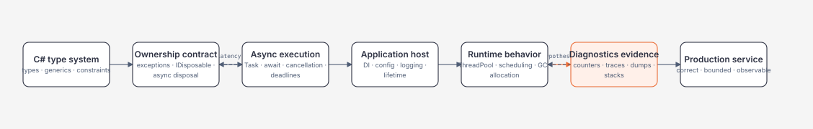
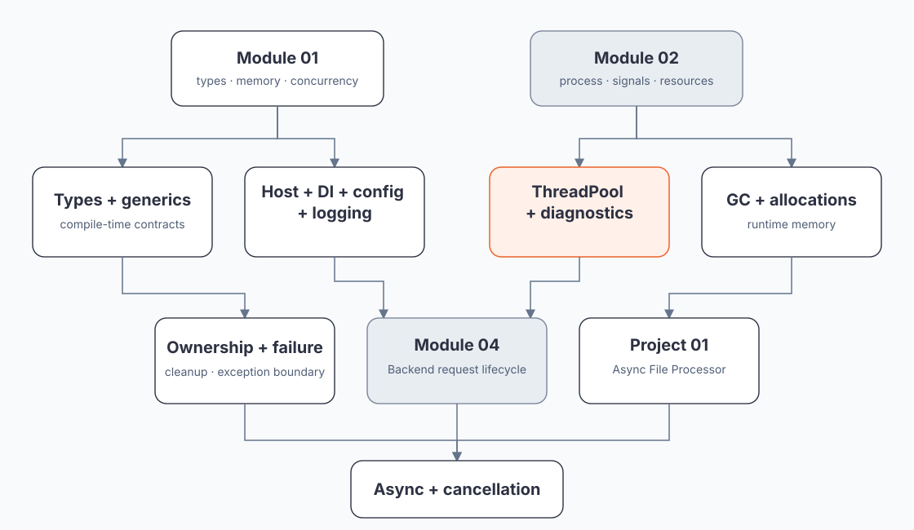
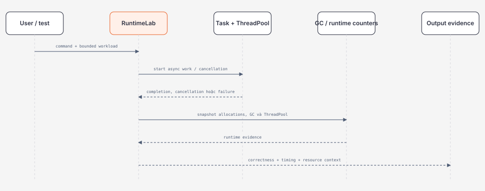

# Module 03 — C#/.NET Runtime và Production Execution

> [← Module 01](../01-computer-science/README.md) · [← Module 02](../02-linux-git-networking/README.md) · [Roadmap](../00-roadmap/README.md)

Module này nối C# syntax với behavior observable của .NET runtime. Mục tiêu là hiểu ownership, exception, async state machine, cancellation, ThreadPool, host lifetime, GC và diagnostics đủ để implement, operate và review một service production.

## Module trong một hình



## Phạm vi

| Learning slice | Priority | Evidence |
| --- | --- | --- |
| [C# types, generics và collections](csharp-types-generics-and-collections.md) | P0 | code + contract reasoning |
| [Exceptions, IDisposable và ownership](exceptions-disposable-and-resource-ownership.md) | P0 | cleanup/failure experiment |
| [Async/await, cancellation và Task lifecycle](async-await-cancellation-and-task-lifecycle.md) | P0 | cancellation experiment |
| [ThreadPool, concurrency và diagnostics](threadpool-concurrency-and-diagnostics.md) | P0 | counters/traces/thread evidence |
| [GC, allocations và runtime memory](gc-allocations-and-runtime-memory.md) | P0 | allocation/GC evidence |
| [RuntimeLab source](https://github.com/Trinhduyet/trinhduyet.github.io/tree/main/labs/03-dotnet/runtime-lab) | P0 | build + run report |

## Dependency map



## Bốn boundary cần giữ rõ

### Type boundary

Generics và interfaces làm contract explicit ở compile time; runtime vẫn phải xử lý boxing, casts, reflection, variance và serialization boundaries.

### Resource boundary

GC quản lý memory managed nhưng không biết business lifetime và không tự `Dispose` unmanaged resources. Owner phải định nghĩa acquire, transfer, cleanup và failure behavior.

### Execution boundary

`Task` biểu diễn operation; `await` là suspension point; cancellation là cooperative signal. Không coi `Task` là thread hoặc `CancellationToken` là rollback.

### Host boundary

Generic Host gom DI, configuration, logging, hosted services và lifetime. Host không thay domain design; nó là lifecycle composition root và operational boundary.

## Cách chạy lab — portable path

Clone repo một lần:

```powershell
git clone https://github.com/Trinhduyet/trinhduyet.github.io.git
cd trinhduyet.github.io
```

Sau đó, từ **repository root**:

```powershell
cd labs/03-dotnet/runtime-lab
dotnet build -c Release

dotnet run -c Release --no-build -- cancellation
dotnet run -c Release --no-build -- allocation
dotnet run -c Release --no-build -- diagnostics
```

Không dùng absolute path theo máy cá nhân. Forward slash chạy được trong PowerShell và Bash. Mọi command trong tài liệu phải được hiểu tương đối từ repository root trừ khi trang nói rõ working directory khác.

RuntimeLab không dùng external NuGet package, có hard bounds và in runtime context. Diagnostics production vẫn cần permission, sampling, privacy và tool/version policy.



## Evidence tối thiểu

1. Cancellation output có số item produced/consumed và trạng thái task.
2. Allocation command có checksum, allocated bytes và GC collection delta.
3. Diagnostics command có runtime/GC/ThreadPool snapshot.
4. Một failure experiment: cancellation giữa chừng, vượt safety bound hoặc dispose ownership sai.
5. Một decision record nối code shape với deadline, resource budget, observability và recovery.

## Exit criteria

Người học hoàn thành Module 03 khi có thể:

- chọn type/generic/collection contract rõ ràng;
- thiết kế exception boundary có recovery và logging;
- implement async end-to-end với cancellation/deadline/cleanup;
- phân biệt CPU-bound, I/O-bound, Task, ThreadPool và concurrency limit;
- compose Generic Host với DI/config/logging/lifetime;
- giải thích allocation rate, retained heap và GC generations;
- dùng counters/trace/stack/dump theo hypothesis;
- review runtime behavior qua correctness, performance, reliability và operations.

## Tiếp tục

Tiếp tục [Module 04 — Backend](../04-backend/README.md), rồi nối request lifecycle với SQL/API ở các module sau.
