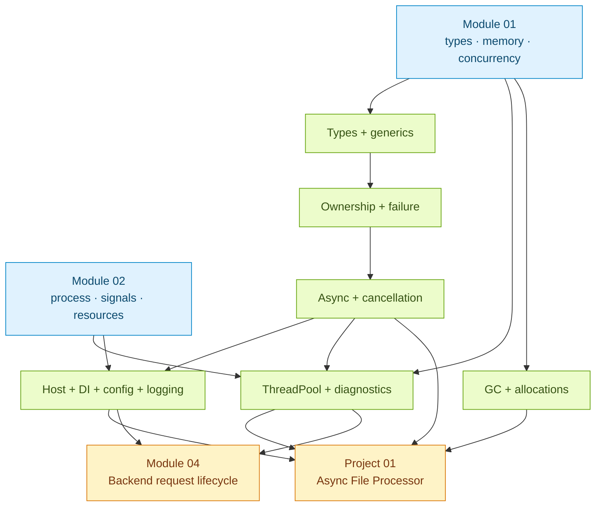
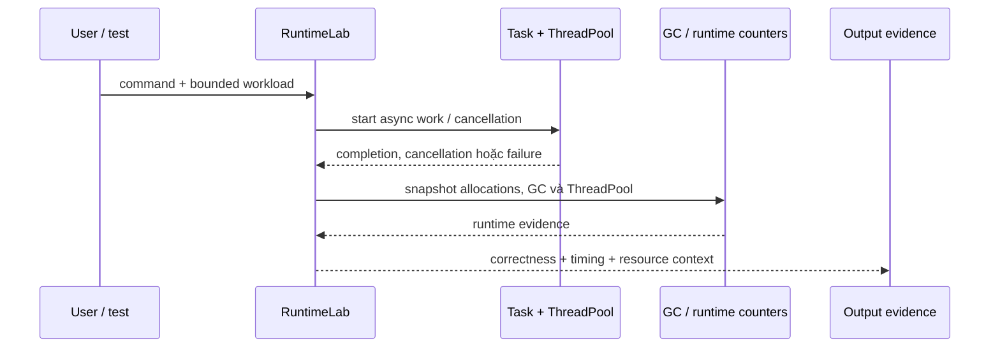

# Module 03 — C#/.NET Runtime và Production Execution

> [← Module 01](../01-computer-science/README.md) · [← Module 02](../02-linux-git-networking/README.md) · [Roadmap](../00-roadmap/README.md)

Module này nối C# syntax với behavior observable của .NET runtime. Mục tiêu không phải học thêm API rời rạc, mà hiểu ownership, exception, async state machine, cancellation, ThreadPool, host lifetime, GC và diagnostics đủ để implement, operate và review một service production.

## Module trong một hình

```mermaid
flowchart LR
    C["C# type system<br/>types · generics · constraints"]
    O["Ownership contract<br/>exceptions · IDisposable · async disposal"]
    A["Async execution<br/>Task · await · cancellation · deadlines"]
    H["Application host<br/>DI · config · logging · lifetime"]
    R["Runtime behavior<br/>ThreadPool · scheduling · GC · allocation"]
    D["Diagnostics evidence<br/>counters · traces · dumps · stacks"]
    P["Production service<br/>correct · bounded · observable"]

    C --> O --> A --> H --> R --> D --> P
    A -. "failure/latency feedback" .-> O
    D -. "hypothesis" .-> R

    classDef foundation fill:#e0f2fe,stroke:#0284c7,color:#0c4a6e;
    classDef runtime fill:#fef3c7,stroke:#d97706,color:#78350f;
    classDef evidence fill:#dcfce7,stroke:#16a34a,color:#14532d;
    classDef target fill:#ede9fe,stroke:#7c3aed,color:#4c1d95,stroke-width:2px;
    class C,O,A,H foundation;
    class R runtime;
    class D evidence;
    class P target;
```



## Phạm vi và trạng thái

| Learning slice | Priority | Trạng thái nội dung | Evidence người học |
| --- | --- | --- | --- |
| [C# types, generics và collections](csharp-types-generics-and-collections.md) | P0 | Content v1 | Pending |
| [Exceptions, IDisposable và ownership](exceptions-disposable-and-resource-ownership.md) | P0 | Content v1 | Pending |
| [Async/await, cancellation và Task lifecycle](async-await-cancellation-and-task-lifecycle.md) | P0 | Content v1 | Pending |
| [ThreadPool, concurrency và diagnostics](threadpool-concurrency-and-diagnostics.md) | P0 | Content v1 | Pending |
| [GC, allocations và runtime memory](gc-allocations-and-runtime-memory.md) | P0 | Content v1 | Pending |
| [RuntimeLab .NET 10](../../labs/03-dotnet/runtime-lab/Program.cs) | P0 | Buildable lab | Pending run report |

## Dependency map



## Bốn boundary cần giữ rõ

### Type boundary

Generics và interfaces làm contract explicit ở compile time; runtime vẫn phải xử lý boxing, casts, reflection, variance và serialization boundaries.

### Resource boundary

GC quản lý memory managed nhưng không biết business lifetime và không tự `Dispose` unmanaged resources. Owner phải định nghĩa acquire, transfer, cleanup và failure behavior.

### Execution boundary

`Task` biểu diễn operation; `await` là suspension point; cancellation là cooperative signal. Không coi `Task` là thread hoặc `CancellationToken` là rollback.

### Host boundary

Generic Host gom DI, configuration, logging, hosted services và lifetime. Host không thay domain design; nó là lifecycle composition root và operational boundary.

## Cách chạy lab

Yêu cầu: .NET SDK 10 theo [technology baseline](../00-roadmap/technology-baseline.md).

```powershell
cd E:\Documents\Dev\labs\03-dotnet\runtime-lab
dotnet build -c Release

dotnet run -c Release --no-build -- cancellation
dotnet run -c Release --no-build -- allocation
dotnet run -c Release --no-build -- diagnostics
```

RuntimeLab không dùng external NuGet package, có hard bounds và in runtime context. Nó là executable experiment; diagnostics production cần thêm permission, sampling, privacy và tool/version policy.



## Evidence tối thiểu

1. Output của cancellation có số item produced/consumed và trạng thái task.
2. Allocation command có correctness checksum, allocated bytes và GC collection delta.
3. Diagnostics command có runtime/GC/ThreadPool snapshot.
4. Một failure experiment: cancellation giữa chừng, vượt safety bound hoặc dispose ownership sai trong test.
5. Một decision record nối code shape với deadline, resource budget, observability và rollback.

## Exit criteria của module

Người học hoàn thành Module 03 khi có thể:

- chọn type/generic/collection contract rõ ràng và tránh boxing/cast không cần thiết;
- thiết kế exception boundary có recovery, logging và không nuốt lỗi;
- implement async end-to-end với cancellation, deadline, cleanup và no sync-over-async;
- phân biệt CPU-bound, I/O-bound, Task, ThreadPool và concurrency limit;
- compose Generic Host với DI, config, logging, hosted-service startup/shutdown;
- giải thích allocation rate, retained heap, GC generations và memory evidence;
- dùng counters/trace/stack/dump theo hypothesis, không thu diagnostic artifact vô hạn;
- review production code qua correctness, performance, security, reliability và operations.

## Tiếp tục từ đây

Sau module này, tiếp tục [Module 04 — Backend](../04-backend/README.md), rồi nối request lifecycle với SQL/API ở các module tiếp theo. Project 01 là evidence spine: async file processing, cancellation, bounded concurrency và cleanup.

## Verification metadata

- Verified: 2026-08-11.
- Technology version: .NET 10 target; local smoke runtime may be an installed servicing patch such as 10.0.9.
- Official sources: Microsoft Learn pages in [references.md](references.md).
- Context7 queries used: không có Context7 callable tool trong run này; API/version claims được đối chiếu trực tiếp với Microsoft Learn.
- Notes: content v1 không tự nâng learner level; evidence remains pending.

<!-- Mermaid.js Script CDN hỗ trợ tự động render sơ đồ Mermaid trên GitHub Pages (Jekyll) -->
<script type="module">
  import mermaid from 'https://cdn.jsdelivr.net/npm/mermaid@10/dist/mermaid.esm.min.mjs';
  mermaid.initialize({ startOnLoad: true, theme: 'default' });

  document.addEventListener("DOMContentLoaded", function () {
    const elements = document.querySelectorAll("pre.language-mermaid, code.language-mermaid, .language-mermaid pre, pre code.language-mermaid");
    elements.forEach((el) => {
      const container = el.tagName.toLowerCase() === "code" ? el.parentElement : el;
      const div = document.createElement("div");
      div.className = "mermaid";
      div.textContent = el.textContent;
      if (container && container.parentNode) {
        container.parentNode.replaceChild(div, container);
      }
    });
    mermaid.run({ querySelector: '.mermaid' });
  });
</script>
