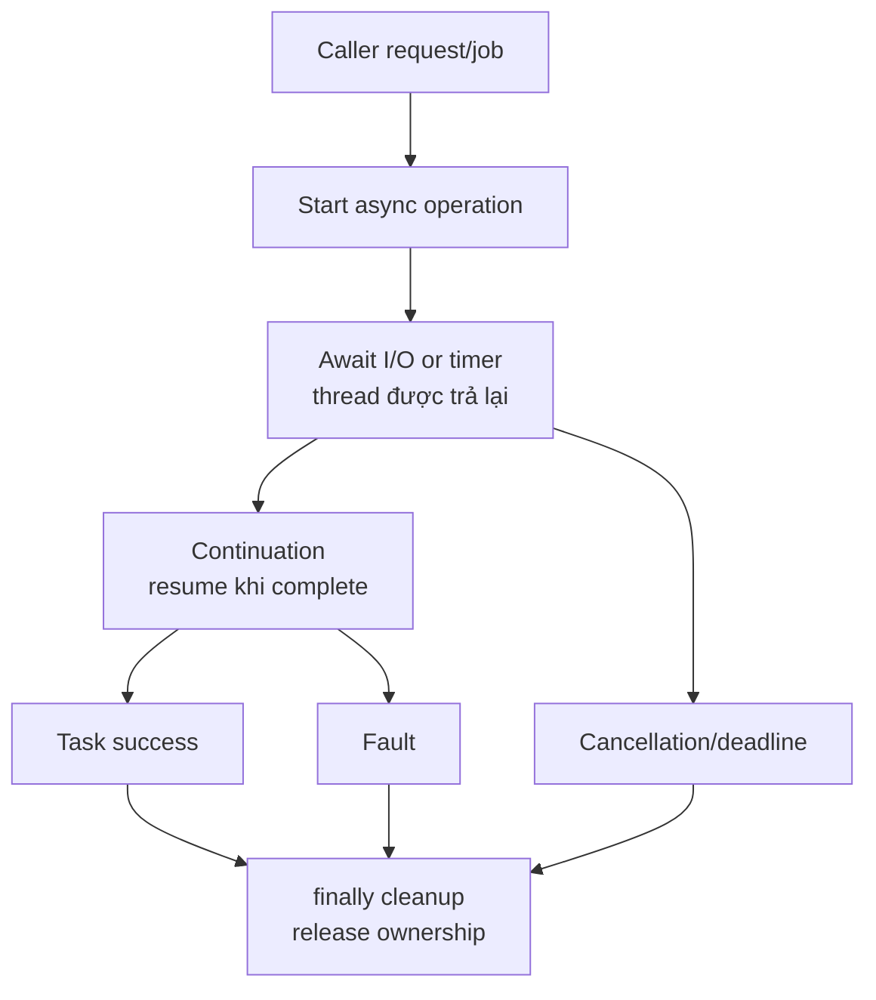

# Async/Await, Cancellation và Task Lifecycle

> [← Exceptions và ownership](exceptions-disposable-and-resource-ownership.md) · [Module overview](README.md) · Tiếp theo: [ThreadPool và diagnostics](threadpool-concurrency-and-diagnostics.md)

## Mục tiêu / Learning Objectives

Sau chương này, người học có thể:

- giải thích TAP, `Task`, `ValueTask`, `async`/`await` và compiler-generated state machine;
- phân biệt I/O-bound async với CPU-bound parallelism;
- truyền cancellation/deadline xuyên suốt call chain và cleanup đúng khi dừng;
- dùng `WhenAll`, `WhenAny`, timeout và linked token mà không tạo orphan work;
- tránh sync-over-async, `async void`, fire-and-forget không owner và unbounded fan-out;
- thiết kế async API có failure, retry, idempotency và observability rõ.

## Tại sao cần học? / Why It Matters

Backend hiện đại thường chờ network, disk, database hoặc broker nhiều hơn tính CPU. Async đúng giúp thread không bị giữ trong thời gian chờ, nhưng async sai có thể tạo deadlock, ThreadPool starvation, task leak, duplicate side effect hoặc request đã timeout nhưng work vẫn chạy.

`await` làm code dễ đọc hơn; nó không làm operation nhanh hơn một cách thần kỳ và không tự bảo vệ shared state.

## Tổng quan / Overview



## Mental Model

### Task là promise của completion

`Task`/`Task<T>` mô tả operation chưa hoàn thành, có thể success, fault hoặc canceled. Nó không bảo đảm có một thread riêng và không nói operation có parallel hay I/O.

### Await là suspension point

Compiler tách method thành state machine. Nếu awaitable chưa complete, method trả task cho caller; continuation tiếp tục sau await khi result sẵn sàng. Locals cần qua await được giữ theo state machine, có thể tạo allocation tùy path.

### Cancellation là request, không phải kill

Caller gọi `Cancel`; callee phải observe token ở safe points hoặc pass token vào API hỗ trợ. Callee dừng, cleanup và thường throw `OperationCanceledException` với token để Task vào Canceled state. Side effect đã commit không tự rollback.

### Deadline là resource budget

Timeout/deadline giới hạn tổng thời gian request, gồm queue, dependency, retry và cleanup. Timeout riêng từng layer có thể vượt outer deadline và tạo orphan work.

## Thuật ngữ / Terminology

| Thuật ngữ | Ý nghĩa |
| --- | --- |
| TAP | Task-based Asynchronous Pattern |
| `Task` | Async operation không có result |
| `Task<T>` | Async operation có result |
| `ValueTask<T>` | Có thể tránh allocation khi result synchronous; có usage restrictions |
| `awaitable` | Type có pattern `GetAwaiter` phù hợp |
| Continuation | Phần code tiếp tục sau await |
| Suspension point | Điểm method nhường control |
| I/O-bound | Chờ external resource, không cần CPU trong wait |
| CPU-bound | Work cần compute; async không tự giảm CPU |
| CancellationToken | Signal cooperative cancellation |
| CancellationTokenSource | Owner phát signal và tạo token |
| Deadline | Thời điểm/timeout tổng phải hoàn tất |
| Linked token | Token kết hợp nhiều cancellation sources |
| Fan-out | Một operation khởi tạo nhiều child tasks |
| Structured concurrency | Parent owns/lifecycle child work rõ |
| Sync-over-async | Block thread chờ Task bằng `.Result`/`.Wait()` |
| Fire-and-forget | Start task nhưng không await/own/observe |
| `async void` | Async method không trả Task, chỉ phù hợp event handler |
| `ConfigureAwait` | Điều khiển context capture khi await |

## Prerequisites

- C# methods, exceptions, `using`/`finally`.
- [Scheduling/concurrency Module 01](../01-computer-science/process-thread-scheduling-and-concurrency.md).
- [Exceptions/ownership](exceptions-disposable-and-resource-ownership.md).

## How It Works

### 1. I/O-bound async

API như `Stream.ReadAsync`, `HttpClient` async hoặc database async khởi tạo I/O và trả Task. Trong thời gian chờ, thread có thể phục vụ work khác. Khi completion xảy ra, continuation được schedule.

Nếu underlying API synchronous/blocking, đặt nó trong `Task.Run` chỉ chuyển nơi block; dùng async end-to-end hoặc dedicated bounded worker khi không có async API.

### 2. CPU-bound work

CPU-bound work cần CPU. `Task.Run`/Parallel có thể schedule lên ThreadPool để không block caller/UI, nhưng server phải bound degree of parallelism và memory. Async syntax không làm CPU work non-blocking với máy.

### 3. Task states và exception

Task có thể `RanToCompletion`, `Faulted`, `Canceled` hoặc đang chạy/waiting. Exception trong async method được lưu vào Task và throw khi caller await. `WhenAll` hoàn thành sau child tasks; caller cần inspect failures/cancellation theo policy.

### 4. Cancellation propagation

Pass token vào mọi API hỗ trợ:

```csharp
static async Task<byte[]> ReadAsync(
    Stream stream,
    CancellationToken cancellationToken)
{
    using var buffer = new MemoryStream();
    await stream.CopyToAsync(buffer, cancellationToken);
    return buffer.ToArray();
}
```

Không tạo `new CancellationToken()` ở mỗi layer làm mất caller signal. Nếu operation không hỗ trợ cancellation, đặt boundary rõ và tránh hứa dừng ngay.

### 5. Deadline với linked CTS

```csharp
static async Task<T> WithDeadlineAsync<T>(
    Func<CancellationToken, Task<T>> operation,
    TimeSpan deadline,
    CancellationToken callerToken)
{
    using var timeout = CancellationTokenSource.CreateLinkedTokenSource(callerToken);
    timeout.CancelAfter(deadline);
    return await operation(timeout.Token);
}
```

Đừng tạo timeout ngắn hơn outer budget ở mỗi helper mà không trừ elapsed time. Nếu cần distinguish caller cancel vs timeout, giữ references/flags riêng và map ở boundary.

### 6. Fan-out và structured ownership

Tạo child tasks trong loop rồi `WhenAll` có thể tạo unbounded memory/downstream load. Use bounded semaphore/channel/partition; parent phải await hoặc cancel/drain child tasks trước trả request.

### 7. `WhenAny` và abandoned tasks

`Task.WhenAny` chỉ báo task đầu tiên complete; tasks còn lại vẫn chạy. Nếu race/timeout, cancel losers và await cleanup/failure observation. Không bỏ Task reference sau timeout nếu nó có side effect/resource.

### 8. Async streams

`IAsyncEnumerable<T>` yield từng item và backpressure tự nhiên theo consumer nhưng resource owner/lifetime cần bao quanh enumeration. Pass cancellation via `[EnumeratorCancellation]`/`WithCancellation` khi API hỗ trợ.

## Minimal Example

```csharp
static async Task<string> DownloadAsync(
    HttpClient client,
    Uri uri,
    TimeSpan timeout,
    CancellationToken callerToken)
{
    using var timeoutSource = CancellationTokenSource.CreateLinkedTokenSource(callerToken);
    timeoutSource.CancelAfter(timeout);

    using var response = await client.GetAsync(
        uri,
        HttpCompletionOption.ResponseHeadersRead,
        timeoutSource.Token);

    response.EnsureSuccessStatusCode();
    return await response.Content.ReadAsStringAsync(timeoutSource.Token);
}
```

Production cần content-size limit, decompression policy, retry classification, metrics và disposal semantics; sample chỉ minh họa token/deadline propagation.

## Production Example

### Bounded parallel file work

```csharp
static async Task ProcessBatchAsync(
    IReadOnlyList<string> paths,
    int maxConcurrency,
    CancellationToken cancellationToken)
{
    using var gate = new SemaphoreSlim(maxConcurrency, maxConcurrency);
    var tasks = new List<Task>(paths.Count);

    foreach (var path in paths)
    {
        await gate.WaitAsync(cancellationToken);
        tasks.Add(ProcessOneAsync(path, gate, cancellationToken));
    }

    await Task.WhenAll(tasks);
}

static async Task ProcessOneAsync(
    string path,
    SemaphoreSlim gate,
    CancellationToken cancellationToken)
{
    try
    {
        await ProcessFileAsync(path, cancellationToken);
    }
    finally
    {
        gate.Release();
    }
}
```

Code này vẫn materialize một Task mỗi path và producer chờ gate trước enqueue; với millions paths, cần bounded channel/partition để bound task list. `finally` release permit kể cả failure/cancel.

## .NET Integration

- `Task`/`Task<T>` là default return types cho async API; `ValueTask<T>` chỉ dùng khi allocation profile và consumption rules justify.
- `HttpClient`, streams, database clients có overload nhận `CancellationToken`; luôn dùng nếu request lifetime bounded.
- `Task.Delay`, `WaitAsync` và `CancelAfter` cần dispose CTS/linked sources khi scope kết thúc.
- `ConfigureAwait(false)` hữu ích trong reusable library khi không cần captured context; không dùng như phép chữa sync-over-async.
- `IAsyncEnumerable<T>` streaming cần cancellation và resource ownership.
- `Task.Run` cho CPU-bound work có budget; không dùng bọc synchronous I/O trong server.
- `async void` chỉ cho event handlers do exception/caller control hạn chế.

## Internals

### State machine and builder

Compiler sinh state machine/builder để lưu state qua await. Synchronous completion có thể tránh một số allocations; async path/closures/exception/cancellation có cost. Không dựa vào exact allocation implementation giữa runtime versions.

### Continuation scheduling

Continuation có thể chạy inline hoặc trên captured/specified scheduler. ThreadPool starvation, synchronization context và blocking caller ảnh hưởng when/where. Correctness không nên phụ thuộc thread identity trừ khi API contract yêu cầu.

### `ValueTask` restrictions

`ValueTask` có thể được await một lần theo producer contract, không nên cache/await nhiều lần hoặc `WhenAll` trực tiếp nếu chưa convert. Dùng `AsTask()` khi cần Task semantics, chấp nhận allocation.

### Cancellation race

Cancel có thể xảy ra trước start, trong await hoặc sau side effect. Token check không undo side effect; operation phải idempotent/transactional/compensating nếu cần.

## Common Mistakes

- `.Result`, `.Wait()`, `GetAwaiter().GetResult()` trong request path.
- `async void` cho service method.
- `Task.Run` bọc blocking I/O.
- Tạo millions tasks rồi `WhenAll`.
- `WhenAny` xong bỏ losers.
- Không pass token vào inner API.
- Timeout từng layer cộng dồn vượt outer deadline.
- Catch `OperationCanceledException` rồi báo fault/error indiscriminately.
- Retry sau cancellation hoặc hết deadline.
- Dùng `ValueTask` như Task cacheable.
- Start fire-and-forget child không owner/shutdown path.
- Assume async means thread-safe/parallel.

## Performance Considerations

Đo:

- queue time, I/O wait, service time và continuation time;
- active/in-flight task count và downstream connection usage;
- allocation/task creation/closures/async state machine;
- cancellation/timeout rate và abandoned work;
- degree of parallelism, ThreadPool queue/thread count;
- fan-out ratio và retry amplification.

Async giảm blocked threads nhưng có thể tăng in-flight memory. Bounded concurrency và backpressure thường quan trọng hơn tạo task nhanh.

## Security Considerations

- Cancellation/deadline ngăn request giữ resource sau client disconnect.
- Bound fan-out, payload, concurrency và duration để chống resource exhaustion.
- Pass authorization context cùng work; không để background continuation vượt request principal/lifetime.
- Không log token/URI query chứa secret trong exception/trace.
- Cancel losers trong race để tránh duplicate side effects.
- Async stream phải enforce per-item authorization và tenant boundaries.

## Reliability / Failure Modes

| Failure | Cơ chế | Response |
| --- | --- | --- |
| Sync-over-async deadlock/starvation | thread block chờ continuation | async all the way, remove block |
| Orphan work | timeout/WhenAny bỏ task | cancel losers, await cleanup |
| Fan-out overload | unbounded child tasks | semaphore/channel/partition |
| Partial cancellation | side effect giữa chừng | idempotency/transaction/temp artifact |
| Deadline exceeded | retry/queue vẫn chạy | propagate remaining budget, shed |
| Aggregate failure | WhenAll nhiều child faults | collect/classify, partial result policy |
| Token ignored | inner API không nhận/check token | adapter boundary, document limitation |

## Observability

- task/request duration broken down by queue, dependency wait and work;
- cancellation reason: caller, deadline, shutdown, budget;
- in-flight/fan-out count, queue age, active permits;
- exception/fault/canceled task rate;
- abandoned/late completion count;
- downstream timeout/retry and side-effect dedupe;
- Activity/trace propagation across async boundaries.

Trace span phải end khi operation thật sự cleanup xong, không chỉ khi caller timeout.

## Operational Considerations

- Set outer deadline và pass remaining budget; config có safe min/max.
- Graceful shutdown stop intake, cancel/drain hosted work, await cleanup trong grace period.
- Test slow dependency, cancellation during write, client disconnect và process termination.
- Use bounded queues; monitor queue age rather than only task count.
- Version and rollout timeout/concurrency config; changing it changes downstream load.
- Fire-and-forget work cần durable queue/hosted owner nếu phải survive restart.

## Architect Perspective

### Câu hỏi quyết định

- Operation là I/O-bound hay CPU-bound?
- Ai owns child tasks và ai cancel/drain khi parent timeout?
- Side effect có idempotent/transactional không?
- Deadline budget chia cho queue/dependency/retry thế nào?
- Có thể stream thay materialize/fan-out không?
- Shutdown/crash/retry behavior được quan sát và replay ra sao?

### 10x và 100x

10x thường cần bound fan-out, per-tenant concurrency, pooling và timeout budget. 100x cần durable work queues, partitioning, load shedding và idempotent distributed execution; async syntax không giải quyết cross-node coordination.

## Trade-offs

| Choice | Lợi ích | Giá phải trả |
| --- | --- | --- |
| Sequential await | Simple ordering/low memory | Lower throughput |
| Bounded parallel | More throughput, protected downstream | Queueing and partial failures |
| `Task` | Composable/caller observes | Allocation/scheduler overhead |
| `ValueTask` | May reduce sync-complete allocation | Usage restrictions/complexity |
| Timeout | Bound latency/resource | May leave side effects if not cooperative |
| Cancellation | Early stop/load relief | Must clean up and handle partial work |
| Retry | Transient resilience | Duplicate work/load/latency |

## When NOT to Use It

- Không async hóa CPU loop chỉ để thay đổi syntax.
- Không dùng unbounded `WhenAll` cho client-controlled list.
- Không dùng timeout thay cancellation/idempotency.
- Không dùng `ValueTask` không có allocation evidence.
- Không dùng fire-and-forget cho critical side effect không durable.
- Không parallelize ordered workflow nếu semantics yêu cầu sequence.

## Alternatives

- Synchronous API cho CPU/local operation đơn giản.
- Bounded `Channel<T>`/worker service cho long-running work.
- Dataflow/message passing cho pipeline/backpressure.
- Durable broker/outbox cho restart/replay.
- Batch/set-based operation thay per-item tasks.
- Dedicated thread/process cho truly blocking/isolated work với lifecycle rõ.

## Review Questions

1. Task khác thread thế nào?
2. Vì sao await I/O có thể trả thread về pool?
3. `WhenAny` để lại risk gì?
4. Cancellation có rollback side effect không?
5. Khi nào `Task.Run` đúng và khi nào sai?
6. `ValueTask` có thể await nhiều lần không?
7. Vì sao unbounded fan-out làm memory/downstream pressure tăng?
8. Deadline budget nên được truyền qua các layer thế nào?

## Hands-on Lab

### Problem

Tạo workload có producer/consumer async, cancellation giữa chừng và kiểm tra task/cleanup state.

### Constraints

- RuntimeLab giới hạn item count và cancellation delay.
- Không giả định exact number consumed giữa runs; ghi lý do nondeterminism.
- Dùng Release build.

### Implementation steps

```powershell
cd E:\Documents\Dev\labs\03-dotnet\runtime-lab
dotnet build -c Release
dotnet run -c Release --no-build -- cancellation 10000 25
dotnet run -c Release --no-build -- cancellation 10000 1
```

### Expected outcome

Case delay 1 ms thường cancel sớm hơn; cả hai run vẫn có `produced >= consumed` và producer/consumer kết thúc không treo.

### Verification

Ghi command, runtime, produced/consumed, status, elapsed và cancellation flag. Repeat năm lần để thấy scheduling variance.

### Failure experiment

Vượt item bound; chương trình reject. Mô tả cách production API sẽ cancel child tasks khi client disconnect và cách bảo vệ side effect.

### Questions

- Producer có thể chạy tiếp sau consumer cancel không?
- Channel/full policy ảnh hưởng backpressure thế nào?
- Trace nào cho thấy task hoàn thành sau outer timeout?

## Exit Criteria

- Vẽ được Task lifecycle success/fault/canceled.
- Implement async chain truyền token/deadline và cleanup trong `finally`.
- Chẩn đoán được sync-over-async, orphan task và unbounded fan-out.
- Có RuntimeLab output ở hai cancellation workloads và giải thích variance.
- Đề xuất structured ownership cho child work khi shutdown/retry.

## Related Topics

- [Exceptions và ownership](exceptions-disposable-and-resource-ownership.md)
- [ThreadPool/concurrency/diagnostics](threadpool-concurrency-and-diagnostics.md)
- [C# types/generics](csharp-types-generics-and-collections.md)
- [Module 01 concurrency](../01-computer-science/process-thread-scheduling-and-concurrency.md)
- [Module 04 — Backend](../04-backend/README.md)

## Official English Sources

- [Asynchronous programming with async and await](https://learn.microsoft.com/en-us/dotnet/csharp/asynchronous-programming/)
- [Asynchronous programming scenarios](https://learn.microsoft.com/en-us/dotnet/csharp/asynchronous-programming/async-scenarios)
- [Task cancellation](https://learn.microsoft.com/en-us/dotnet/standard/parallel-programming/task-cancellation)
- [Task-based asynchronous programming](https://learn.microsoft.com/en-us/dotnet/standard/parallel-programming/task-based-asynchronous-programming)
- [Consuming TAP](https://learn.microsoft.com/en-us/dotnet/standard/asynchronous-programming-patterns/consuming-the-task-based-asynchronous-pattern)
- [Module references](references.md)

## Vietnamese Resources

Không chọn community async tutorial làm canonical. Đọc English official để phân biệt TAP, Task state, cancellation và scheduler behavior.

## Verification Metadata

- Verified: 2026-08-11.
- Technology version: .NET 10 target; async semantics stable, API overloads/version details rechecked against official docs.
- Official sources: Microsoft Learn links trên và [references.md](references.md).
- Context7 queries used: none; tool unavailable in this run.
- Notes: lab demonstrates cooperative cancellation and bounded inputs; it does not claim deterministic timing or exact item counts.
