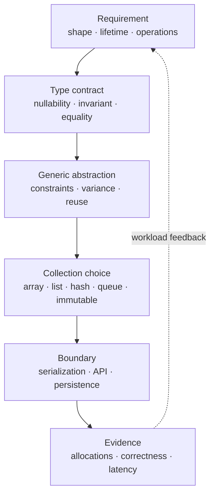

# C# Types, Generics và Collections trong Production

> [← Module overview](README.md) · Prerequisite: [Module 01 data structures](../01-computer-science/data-structures-for-backend-systems.md) · Tiếp theo: [Ownership và exceptions](exceptions-disposable-and-resource-ownership.md)

## Mục tiêu / Learning Objectives

Sau chương này, người học có thể:

- phân biệt value/reference semantics, nullability, identity và equality;
- dùng generics/constraints để tạo contract compile-time mà không dựa vào cast runtime;
- chọn collection theo operations, ownership, ordering, mutation và concurrency;
- nhận diện boxing, accidental allocation, deferred LINQ execution và mutable aliasing;
- thiết kế DTO/domain types có invariant rõ và boundary serialization an toàn;
- review type/collection choices qua correctness, performance, security và evolution.

## Tại sao cần học? / Why It Matters

Type system là lớp phòng thủ đầu tiên của backend. Một generic constraint đúng loại bỏ nhiều runtime failure; một `IEnumerable<T>` lazy query có thể chạy lại database ngoài ý muốn; một `List<T>` mutable trả ra ngoài có thể phá invariant; một `Dictionary<string, object>` làm mất compile-time contract và đẩy lỗi vào production.

Collection cũng là runtime decision: layout, equality, allocations, order và thread-safety đều ảnh hưởng behavior. Bảng Big-O từ Module 01 chỉ là điểm khởi đầu.

## Tổng quan / Overview



## Mental Model

### Type là contract, object là runtime state

Type nói operation nào hợp lệ và invariant nào được compiler kiểm tra. Object giữ state theo lifetime và ownership cụ thể. Interface giúp thay implementation nhưng không tự đảm bảo immutability, thread-safety hay serialization shape.

### Generic là một family of types

`List<int>` và `List<string>` dùng cùng source abstraction nhưng compiler giữ type safety. Generic constraints biểu đạt capability cần thiết (`where T : class`, interface, `notnull`, `new()`). Không dùng `object`/cast chỉ để né thiết kế constraint.

### Collection là semantics + cost

Chọn collection từ uniqueness, order, lookup, priority, range, concurrency và capacity; sau đó đo memory/locality trên workload. [Module 01](../01-computer-science/data-structures-for-backend-systems.md) đã trình bày invariant và cost model.

## Thuật ngữ / Terminology

| Thuật ngữ | Ý nghĩa |
| --- | --- |
| Value type | Giá trị được copy theo semantics của type; storage context phụ thuộc runtime |
| Reference type | Variable thường giữ reference đến object; aliasing có thể chia sẻ mutation |
| Nullable reference type | Compiler annotations/analysis về khả năng null, không phải runtime wrapper |
| Equality | Quy tắc hai value được coi là cùng identity/giá trị |
| Generic parameter | Placeholder type như `T`, `TKey`, `TValue` |
| Constraint | Giới hạn capability/type của generic parameter |
| Boxing | Chuyển value type thành `object`/interface reference, thường tạo object |
| Variance | Quy tắc compatible generic conversion cho interface/delegate |
| Covariance | Dùng type cụ thể hơn ở output/read-only position |
| Contravariance | Dùng type tổng quát hơn ở input position |
| Immutability | State không đổi sau construction; có thể chia sẻ an toàn hơn |
| Deferred execution | Query/delegate chạy khi enumerate/invoke, không phải lúc tạo |
| Materialization | Chạy và lưu kết quả vào collection như `ToList()` |
| Aliasing | Nhiều references trỏ cùng mutable object |
| DTO | Data transfer object, boundary shape không nhất thiết domain entity |
| Span | Ref struct view trên contiguous memory với lifetime restrictions |

## Prerequisites

- C# syntax, method và interface cơ bản.
- [Complexity](../01-computer-science/complexity-and-workload-reasoning.md) và [data structures](../01-computer-science/data-structures-for-backend-systems.md).
- Hiểu exception/resource ownership ở chương kế tiếp để trả collection/stream đúng lifetime.

## How It Works

### 1. Value/reference semantics và aliasing

Assignment value type thường copy value; assignment reference type copy reference. Hai biến reference có thể mutate cùng object. `record`/`record struct` cung cấp value-oriented equality patterns nhưng không biến mọi field nested thành immutable.

Đừng suy storage từ type slogan. Một value-type field trong object nằm inline trong object; local có thể ở register/stack; async capture có thể tạo state-machine object. Hãy quan tâm allocation và lifetime bằng evidence.

### 2. Nullable reference types

Nullable analysis (`string` vs `string?`) giúp compiler cảnh báo dereference có thể null. Nó không validate input từ HTTP/database và không thay thế runtime guard. Boundary phải parse/validate rồi chuyển thành non-null invariant.

### 3. Equality và hash contract

Nếu type làm key:

- equal values phải có equal hash code;
- equality fields không được mutate sau insert;
- comparer phải phù hợp culture/case/normalization;
- hash/equality không nên thực hiện work attacker-controlled không bounded.

Override `Equals`/`GetHashCode` hoặc dùng `IEqualityComparer<T>` có chủ đích; test collision/normalization semantics.

### 4. Generic constraints

Constraints là executable documentation:

```csharp
static T Max<T>(T left, T right) where T : IComparable<T>
    => left.CompareTo(right) >= 0 ? left : right;
```

Compiler biết `CompareTo` tồn tại. Không cần cast/reflect và caller thấy lỗi sớm. Constraint không bảo đảm method rẻ hoặc side-effect-free; semantics vẫn cần document.

### 5. Variance ở boundary

Read-only producer có thể covariance (`IEnumerable<Derived>` dùng như `IEnumerable<Base>`); consumer như comparer có thể contravariance. Mutable `IList<T>` không variant an toàn vì vừa đọc vừa ghi. Không ép cast giữa generic types không compatible.

### 6. Collection execution

- `IEnumerable<T>` có thể deferred và chạy nhiều lần;
- `ToList()` materialize, trả cost/memory ngay;
- `IAsyncEnumerable<T>` deferred async stream, cần cancellation và lifetime của underlying resource;
- returning mutable concrete list mở quyền sửa state ngoài owner.

`IReadOnlyList<T>` hạn chế API mutation nhưng backing collection vẫn có thể mutable nếu owner giữ reference.

### 7. Boxing và abstraction cost

Value type qua `object`/non-generic interface có thể box. Generic method giữ type information thường tránh boxing; nhưng interface dispatch, closures, LINQ iterators và async state machines vẫn có cost khác. Đo hot path trước khi dùng unsafe/hand optimization.

### 8. Collection selection

| Need | Typical choice | Boundary cần kiểm tra |
| --- | --- | --- |
| Fixed contiguous data | array / `ReadOnlySpan<T>` | lifetime, mutation, async crossing |
| Ordered dynamic list | `List<T>` | insert/remove giữa, capacity |
| Membership/unique | `HashSet<T>` | equality, memory, ordering |
| Key-value | `Dictionary<TKey,TValue>` | mutable key, comparer, concurrency |
| FIFO/LIFO | `Queue<T>`/`Stack<T>` | boundedness, durability |
| Priority | `PriorityQueue<TElement,TPriority>` | tie ordering, fairness |
| Read-only snapshot | immutable/read-only wrapper | rebuild/publish cost |
| Concurrent map | `ConcurrentDictionary` | multi-step atomicity |

## Minimal Example

Giữ invariant và không leak mutable list:

```csharp
public sealed class Batch<T>
{
    private readonly List<T> _items = new();

    public int Count => _items.Count;

    public void Add(T item) => _items.Add(item);

    public IReadOnlyList<T> Snapshot() => _items.ToArray();
}
```

Snapshot trả copy. Nếu batch rất lớn, có thể cần immutable snapshot/pagination; đừng trả `_items` trực tiếp chỉ để tránh allocation mà không document ownership.

## Production Example

### Generic pipeline với typed result

```csharp
public interface IStage<in TInput, TOutput>
{
    ValueTask<TOutput> ExecuteAsync(TInput input, CancellationToken cancellationToken);
}

public sealed record ParseResult(string Source, int ItemCount);

public sealed class ParserStage : IStage<ReadOnlyMemory<byte>, ParseResult>
{
    public ValueTask<ParseResult> ExecuteAsync(
        ReadOnlyMemory<byte> input,
        CancellationToken cancellationToken)
    {
        cancellationToken.ThrowIfCancellationRequested();
        return ValueTask.FromResult(new ParseResult("upload", input.Length));
    }
}
```

`in` biểu đạt input-only use ở interface; output typed rõ. Production implementation vẫn phải validate payload length, encoding, cancellation và ownership của memory. `ReadOnlyMemory<byte>` có thể sống qua async boundary; `ReadOnlySpan<byte>` thì không thể capture tùy ý qua await.

## .NET Integration

- `List<T>`, `Dictionary<TKey,TValue>`, `HashSet<T>`, `Queue<T>`, `Stack<T>` và `PriorityQueue<,>` là BCL primitives.
- `IReadOnlyCollection<T>`/`IReadOnlyList<T>` diễn đạt read intent nhưng không đảm bảo deep immutability.
- `IEnumerable<T>`/LINQ nên được materialize tại boundary khi cần snapshot, deterministic repeat hoặc disconnect khỏi DB/session.
- `IAsyncEnumerable<T>` phù hợp streaming nhưng phải pass token (`WithCancellation`) và giữ resource sống trong scope.
- `record`/`record struct` tiện cho value-like data nhưng nested mutable references vẫn mutable.
- `ArrayPool<T>`/`MemoryPool<T>` có thể giảm allocation; ownership/clear/return là contract bắt buộc.
- Generic APIs nên expose constraint cần thiết thay `object`/reflection.

## Internals

### Generic code và JIT

CLR giữ generic type information; representation/JIT sharing khác giữa reference/value type là implementation detail. Không viết architecture phụ thuộc exact code sharing, method layout hoặc internal dictionary capacity.

### Iterator/state-machine allocation

LINQ iterator, closure và async method có thể tạo objects tùy code path/JIT. Allocation không xấu mặc định; long-lived closure có thể giữ object graph ngoài ý muốn. Profile hot path và retained references.

### Collection comparer

Default comparer dựa type; custom comparer có thể thay semantics lẫn cost. Persisted/cache keys phải ghi rõ normalization/comparer version để migration không đổi identity âm thầm.

## Common Mistakes

- Dùng `object`/dynamic cho mọi boundary.
- Tin nullable annotation là validation.
- Trả mutable collection nội bộ.
- Enumerate `IEnumerable` nhiều lần gây repeated I/O/query.
- Gọi `ToList()` sớm trên result set lớn.
- Dùng `IList<T>` variance/cast sai.
- Boxing value types trong hot loop chưa đo.
- Mutable key trong hash collection.
- Dùng culture-sensitive string equality cho security/identity key.
- Dùng `ReadOnlySpan<T>` qua async boundary không hợp lệ.
- Add `ConcurrentDictionary` nhưng check-then-act qua nhiều operation.
- Chọn collection từ Big-O mà bỏ order/capacity/ownership.

## Performance Considerations

Đo:

- allocations/GC do boxing, LINQ, closures, materialization;
- iteration/locality và comparer/hash cost;
- capacity growth/rehash và retained backing array;
- serialization/deserialization copies;
- repeated enumeration/database/network calls;
- memory lifetime của snapshots.

Tối ưu thường bắt đầu bằng xác định boundary materialize/stream và tránh repeated work, không phải đổi mọi loop sang low-level API.

## Security Considerations

- Validate length/count/depth trước materialization/allocation.
- Normalize and compare identity keys bằng invariant comparer thích hợp.
- Không bind arbitrary polymorphic `object` payload nếu serializer/type allow-list không rõ.
- `IEnumerable` lazy query có thể truy cập resource sau auth scope đã kết thúc; materialize/authorize tại đúng boundary.
- Không log toàn bộ object graph hoặc secrets embedded trong DTO.
- Pooled buffers có thể giữ dữ liệu tenant trước; clear theo threat model.

## Reliability / Failure Modes

| Failure | Mechanism | Response |
| --- | --- | --- |
| Null/invalid input | Annotation không thay validation | validate at boundary, return typed error |
| Wrong equality | comparer/normalization mismatch | explicit comparer + tests + migration |
| Repeated query | deferred enumeration | materialize once or stream with owner |
| Memory spike | unbounded `ToList`/snapshot | page, stream, cap, backpressure |
| State corruption | mutable aliasing | ownership, immutable snapshot, defensive copy |
| Duplicate/ordering bug | wrong set/queue/priority semantics | encode invariant in type/test |
| Hidden boxing/allocation | interface/object path | profile, generic path, acceptable budget |

## Observability

Đo logical shape, không expose internal type details:

- input/output item count and payload size;
- materialization count/duration;
- collection capacity/queue depth where relevant;
- comparer/hash failure or validation rejection;
- allocation/GC correlation on hot operation;
- lazy query duration and underlying dependency calls;
- serializer type/contract version, not sensitive payload.

## Operational Considerations

- Public collection contract phải document order, duplicate, null và mutation.
- DTO/domain changes cần compatibility/versioning và migration tests.
- Large snapshots phải có memory budget và cancellation.
- Comparer/normalization change có thể yêu cầu rebuild index/cache.
- Pool configuration và clear behavior phải được review cùng privacy/security.
- Generic Host/DI registration nên validate scopes lúc startup/development.

## Architect Perspective

### Câu hỏi quyết định

- Type nào sở hữu invariant và ai được mutate?
- Collection semantics có phải API contract hay chỉ implementation detail?
- Data được stream, snapshot, cache hay persist?
- Generic abstraction giảm duplication hay che mất domain difference?
- Equality/comparer có stable qua version, locale và tenant boundary không?
- Khi input 10x, memory/copy/materialization thay đổi thế nào?

### 10x và 100x

10x thường cần bound/materialization/index/capacity rõ hơn. 100x có thể cần streaming, partition/external index, binary formats hoặc thay API shape. Đừng biến mọi generic collection thành remote abstraction; network/serialization/consistency là cost mới.

## Trade-offs

| Choice | Lợi ích | Giá phải trả |
| --- | --- | --- |
| Concrete type | Semantics/capacity rõ | Coupling, khó thay implementation |
| Interface | Substitutability/testability | Có thể che cost/ownership |
| Mutable object | Update rẻ | Aliasing/race/invariant risk |
| Immutable snapshot | Safe sharing/read reasoning | Copy/rebuild/memory |
| LINQ/deferred | Expressive/composable | Hidden execution/allocation |
| Generic abstraction | Reuse/type safety | Constraint/design complexity |
| `object`/reflection | Dynamic extensibility | Runtime failure, boxing, security |

## When NOT to Use It

- Không generic hóa khi domain types có invariants khác nhau.
- Không trả interface mơ hồ nếu caller cần biết order/capacity/lifetime.
- Không dùng LINQ chain dài trên hot path trước khi đo.
- Không snapshot toàn bộ dataset chỉ để tránh nghĩ về ownership.
- Không dùng `ArrayPool` cho object sống lâu hoặc ownership không rõ.
- Không dùng reflection/dynamic để thay compile-time contract có thể viết được.

## Alternatives

- Explicit domain types/records cho business invariant.
- Immutable collections/snapshots cho read-heavy sharing.
- Streaming `IAsyncEnumerable<T>` cho result lớn.
- Database query/projection thay materialize entity graph.
- Source-generated serialization/logging khi throughput/allocations chứng minh benefit.
- Message contracts versioned thay chia sẻ internal model giữa services.

## Review Questions

1. Tại sao `IReadOnlyList<T>` không đảm bảo deep immutability?
2. Khi nào `IEnumerable<T>` có thể chạy query lại?
3. Mutable hash key phá invariant gì?
4. `ReadOnlySpan<T>` và `ReadOnlyMemory<T>` khác boundary nào?
5. Generic constraint tốt hơn `object`/cast ra sao?
6. Record có làm nested list immutable không?
7. Khi nào defensive copy đáng trả giá?
8. Collection contract cần nói rõ những semantics nào?

## Hands-on Lab

### Problem

Nối type/collection reasoning với RuntimeLab: quan sát cancellation và allocation shape, sau đó xác định collection boundary nào nên materialize.

### Constraints

- Dùng Release build và workload bounds của lab.
- Ghi prediction trước output.
- Không thay code lab để làm timing “đẹp”.

### Implementation steps

```powershell
cd E:\Documents\Dev\labs\03-dotnet\runtime-lab
dotnet build -c Release
dotnet run -c Release --no-build -- allocation 50000
dotnet run -c Release --no-build -- cancellation 10000 25
```

### Expected outcome

Output giữ correctness checksum/produced-consumed invariants và in allocated bytes/GC context. Cancellation có thể dừng trước total items.

### Verification

Ghi type/collection được dùng, input count, allocation và cancellation state. Giải thích đâu là stable contract, đâu là runtime observation.

### Failure experiment

Chạy input vượt bounds của lab; chương trình phải reject trước materialization lớn. Viết một test/pseudocode cho mutable aliasing hoặc repeated enumeration.

### Questions

- Collection nào là owner của state?
- Materialize lúc nào để tránh query/resource chạy lại?
- Type contract nào làm invalid state không compile được?

## Exit Criteria

- Viết được generic API có constraint đúng capability.
- Chọn collection cho bốn workload và nói rõ order/unique/capacity/ownership.
- Tìm được một deferred execution hazard và một boxing/allocation hazard.
- Thiết kế boundary không leak mutable state và có validation.
- Liên hệ được output RuntimeLab với type/collection decision.

## Related Topics

- [Module 01 data structures](../01-computer-science/data-structures-for-backend-systems.md)
- [Exceptions và ownership](exceptions-disposable-and-resource-ownership.md)
- [Async/await và cancellation](async-await-cancellation-and-task-lifecycle.md)
- [GC và allocations](gc-allocations-and-runtime-memory.md)
- [Module 04 — Backend](../04-backend/README.md)

## Official English Sources

- [Generic types and methods](https://learn.microsoft.com/en-us/dotnet/csharp/fundamentals/types/generics)
- [C# type system](https://learn.microsoft.com/en-us/dotnet/csharp/fundamentals/types/)
- [C# collections](https://learn.microsoft.com/en-us/dotnet/csharp/language-reference/builtin-types/collections)
- [C# language specification](https://learn.microsoft.com/en-us/dotnet/csharp/language-reference/language-specification/)
- [Module references](references.md)

## Vietnamese Resources

Không chọn tutorial community làm source of truth. Dùng bản English official cho generics, variance, nullability và API semantics.

## Verification Metadata

- Verified: 2026-08-11.
- Technology version: .NET 10 target; stable C# concepts separated from JIT/runtime implementation detail.
- Official sources: Microsoft Learn links trên và [references.md](references.md).
- Context7 queries used: none; tool unavailable in this run.
- Notes: examples emphasize ownership, equality, deferred execution and bounded materialization over interview-style collection tables.
