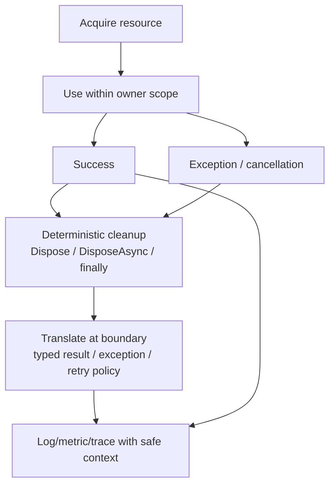

# Exceptions, `IDisposable` và Resource Ownership

> [← C# types và generics](csharp-types-generics-and-collections.md) · [Module overview](README.md) · Tiếp theo: [Async/await và cancellation](async-await-cancellation-and-task-lifecycle.md)

## Mục tiêu / Learning Objectives

Sau chương này, người học có thể:

- phân biệt programmer error, invalid input, transient failure, cancellation và process-fatal condition;
- thiết kế exception boundary có context, recovery, logging và preserve stack trace;
- dùng `using`, `try/finally`, `IDisposable`, `IAsyncDisposable` và SafeHandle đúng ownership;
- cascade dispose resource được sở hữu và không dispose resource chỉ được borrow;
- tránh nuốt lỗi, catch quá rộng, retry sai hoặc cleanup không deterministic;
- review failure path qua security, reliability, diagnostics và operational behavior.

## Tại sao cần học? / Why It Matters

Exception và resource cùng nói về boundary: một operation có thể không hoàn thành, nhưng system vẫn phải release lock, file, socket, permit, temporary file và diagnostic context. GC giúp memory managed an toàn hơn nhưng không biết khi nào database connection hoặc file handle hết business lifetime.

Code “happy path” thường ngắn; production quality nằm ở `finally`, cancellation, duplicate/retry và ownership khi constructor hoặc downstream call thất bại giữa chừng.

## Tổng quan / Overview



## Mental Model

### Exception không phải control flow cho mọi trường hợp

Exception biểu diễn operation không thể hoàn thành contract tại layer đó. Invalid argument có thể fail fast; transient network failure có thể retry dưới deadline; cancellation thường là expected control signal; programmer bug cần sửa/propagate chứ không trả success giả.

### Ownership là acquire → use → release

Owner chịu trách nhiệm release đúng một lần, kể cả khi `use` throw. Borrower không dispose resource do caller sở hữu trừ khi contract nói transfer ownership. Wrapper sở hữu inner resource thì cascade dispose.

### Boundary translation

Không log và wrap cùng exception ở mọi layer. Layer thấp thêm context hữu ích rồi preserve cause; boundary cao quyết định response/retry/telemetry. Exception type không nên leak secret, connection string hoặc internal stack ra public API.

## Thuật ngữ / Terminology

| Thuật ngữ | Ý nghĩa |
| --- | --- |
| Exception | Object mô tả operation failure và stack/context |
| Inner exception | Cause chain được giữ khi wrap/rethrow |
| Stack trace | Execution path tại thời điểm throw |
| `throw;` | Rethrow giữ stack trace hiện tại |
| `throw ex;` | Rethrow làm mất/đổi stack trace hữu ích |
| Exception filter | `catch (...) when (...)` lọc trước handler body |
| `finally` | Cleanup path chạy dù success/failure trong normal control flow |
| `IDisposable` | Synchronous deterministic cleanup contract |
| `IAsyncDisposable` | Asynchronous cleanup contract |
| SafeHandle | Wrapper chuẩn cho unmanaged handle lifetime |
| Finalizer | Runtime fallback queue, không phải deterministic cleanup |
| Ownership transfer | Contract chuyển trách nhiệm dispose |
| Borrowed resource | Chỉ dùng, không release owner resource |
| Cancellation | Cooperative request dừng operation |
| Transient failure | Có thể retry nếu budget/idempotency cho phép |
| Fail-fast | Từ chối sớm khi invariant/config không hợp lệ |

## Prerequisites

- C# control flow, `try/catch/finally`, interfaces.
- [C# types/generics](csharp-types-generics-and-collections.md).
- [Module 02 signals/resources](../02-linux-git-networking/process-signals-and-resource-pressure.md) cho OS-level ownership.

## How It Works

### 1. Throw, catch và filter

Runtime tìm handler phù hợp theo type hierarchy. Catch specific exception mà layer hiểu và có recovery; catch base `Exception` chỉ ở boundary có logging/fallback/termination policy rõ. Exception filter đánh giá trước handler body, hữu ích để phân biệt status/error code mà không mutate exception.

```csharp
try
{
    return await client.GetStringAsync(uri, cancellationToken);
}
catch (HttpRequestException exception) when (IsTransient(exception))
{
    throw new DependencyUnavailableException(uri, exception);
}
```

Không retry mọi `HttpRequestException`; timeout, DNS, TLS, 4xx và policy khác nhau.

### 2. Preserve context

`throw;` giữ stack trace; `throw exception;` làm mất vị trí throw hữu ích. Nếu wrap, truyền `innerException` và thêm context không chứa secrets. Exception message không phải public contract; map sang typed error response ở boundary API.

### 3. `finally` và `using`

Compiler chuyển `using` thành `try/finally` tương đương:

```csharp
await using var reader = File.OpenRead(path).ConfigureAwait(false);
// reader.DisposeAsync() được gọi khi scope rời đi
```

Use declaration mở rộng scope đến cuối block/method; chọn scope nhỏ nhất hợp lý để release sớm. Nếu cần catch constructor/use cùng cleanup, viết `try/catch/finally` rõ.

### 4. `IDisposable` và `IAsyncDisposable`

Implement sync cleanup khi release có thể synchronous; async cleanup khi cần flush/close asynchronous. Expose cả hai chỉ khi semantics rõ; sync `Dispose` không nên block dài để giả async. `DisposeAsync` nên idempotent và không làm object usable trở lại.

### 5. Ownership cascade

Nếu type sở hữu field disposable, type thường cũng implement disposable và release inner resources theo reverse acquisition order. Nếu field được inject nhưng lifetime owner là container/caller, contract phải nói rõ type không dispose borrowed dependency.

### 6. Finalizer và SafeHandle

Finalizer là safety net cho unmanaged resource nhưng chạy không deterministic, tăng pressure và có thể trì hoãn reclaim. Prefer SafeHandle + deterministic dispose; finalizer không thay `using`.

### 7. Exception trong cleanup

Nếu cả operation và dispose throw, exception từ cleanup có thể che lỗi gốc. Cleanup nên idempotent, hạn chế throw và ghi context phù hợp; nếu cleanup failure có ý nghĩa operational, combine/preserve failure theo policy thay vì nuốt âm thầm.

### 8. Async failure state

Task-returning method lưu exception trong returned Task; exception quan sát khi `await`/wait. `async void` chỉ dùng event handler vì caller không thể await/catch bình thường. `Task.WhenAll` cần xử lý aggregate failures và cancellation semantics.

## Minimal Example

```csharp
public sealed class TempFileLease : IDisposable
{
    private readonly string _path;
    private bool _disposed;

    public TempFileLease(string path) => _path = path;

    public void Dispose()
    {
        if (_disposed)
        {
            return;
        }

        _disposed = true;
        File.Delete(_path);
    }
}

using var lease = new TempFileLease(path);
// work; file is deleted on normal exit or exception
```

Production implementation phải quyết định missing-file behavior, symlink/security boundary, async cleanup, ownership transfer và error policy; sample chỉ minh họa shape.

## Production Example

### Bounded file processing

```csharp
static async Task ProcessFileAsync(
    string inputPath,
    string outputPath,
    CancellationToken cancellationToken)
{
    await using var input = new FileStream(
        inputPath,
        FileMode.Open,
        FileAccess.Read,
        FileShare.Read,
        bufferSize: 64 * 1024,
        options: FileOptions.Asynchronous | FileOptions.SequentialScan);

    await using var output = new FileStream(
        outputPath,
        FileMode.CreateNew,
        FileAccess.Write,
        FileShare.None,
        bufferSize: 64 * 1024,
        options: FileOptions.Asynchronous | FileOptions.SequentialScan);

    await input.CopyToAsync(output, cancellationToken);
}
```

Contract cần bổ sung: output partial file khi cancellation, atomic rename, overwrite policy, max file size, permissions, retry, cleanup và idempotency. Dispose thành công không làm partial output thành valid artifact; correctness boundary vẫn phải explicit.

## .NET Integration

- `using`/`await using` là syntax ownership, compiler tạo cleanup path.
- `IDisposable`/`IAsyncDisposable` không được GC tự gọi.
- `CancellationToken.ThrowIfCancellationRequested` tạo task Canceled khi dùng đúng token.
- `ExceptionDispatchInfo` hữu ích khi cần rethrow sau khi lưu exception, nhưng thường `throw;` hoặc inner exception đủ.
- `SafeHandle` nên được ưu tiên cho unmanaged handles.
- `IHost`/DI container dispose services theo lifetime khi host shutdown; service không nên tự dispose dependency do container sở hữu.
- `ILogger` ghi structured context; không log secret/entire exception graph tùy tiện.

## Internals

### Exception cost

Throw/capture stack có cost; không dùng exception cho expected branch trong hot loop nếu result/validation có thể biểu đạt rõ hơn. Nhưng không hy sinh correctness/diagnostic context để tránh mọi allocation.

### Async state machine and cleanup

`await using` cần đảm bảo cleanup sau continuation/failure. Compiler-generated state machine giữ locals cần thiết qua suspension; lifetime của captured object có thể dài hơn source scope trực quan.

### Finalization queue

Finalizable object sống qua ít nhất một collection và chờ finalizer thread; đây là lý do deterministic cleanup quan trọng cho handles/connections.

## Common Mistakes

- `catch (Exception) { return success; }`.
- Log rồi không `throw`/map, làm mất failure signal.
- `throw ex;` thay `throw;`.
- Retry exception không phân loại hoặc không có deadline/idempotency.
- Dispose dependency do DI/container sở hữu.
- Không dispose trên constructor partial failure.
- Dùng finalizer như bình thường.
- Gọi sync `Dispose` trên async resource trong latency-sensitive path.
- Fire-and-forget task không owner/catch/cleanup.
- Coi cancellation là lỗi hệ thống và alert như outage.
- Xóa partial output trước khi đảm bảo artifact khác đã durable.
- Exception message chứa path/token/PII.

## Performance Considerations

- Giữ resource scope nhỏ để release sớm và giảm concurrency-held resources.
- Tránh allocate exception cho expected validation hot path.
- Async dispose có thể tạo continuation/I/O; đo tail latency.
- Buffer size/access mode cần workload evidence; không copy huge file vào memory.
- Logging exception stack đầy đủ ở mọi request có thể tốn CPU/I/O; sample/rate-limit nhưng giữ error counters.
- Retry làm duplicate work/resource lease; budget nó vào capacity.

## Security Considerations

- Validate path, canonicalization, symlink and tenant boundary trước acquire file.
- Error responses không leak stack/path/connection details.
- Ensure secrets/keys dispose/zeroing theo capability và threat model; managed strings không zero deterministic dễ dàng.
- Dump/log chứa exception, locals, handles và buffers có thể chứa secrets.
- Cleanup failure không được bypass authorization/audit trail.
- DoS qua exception storm, retry storm hoặc unbounded resource acquisition cần rate/concurrency budgets.

## Reliability / Failure Modes

| Failure | Mechanism | Response |
| --- | --- | --- |
| Handle/socket leak | missing cleanup/borrow-owner confusion | `using`, ownership docs, counters |
| Partial write | exception/cancel giữa output | temp + flush/rename/recovery policy |
| Hidden failure | broad catch/log-only | typed boundary, rethrow/failure metric |
| Retry storm | wrong classification/no deadline | backoff/jitter, retry budget, idempotency |
| Cleanup masks root error | dispose throws | preserve original + cleanup telemetry |
| Shutdown leak | hosted service ignores token | drain/stop contract, grace timeout |
| Finalizer backlog | nondeterministic release | deterministic dispose, reduce finalizable objects |

## Observability

- Exception count/type/rate by operation and dependency;
- cancellation vs timeout vs fault counts separately;
- active resource count/lease age/file descriptors/connections;
- cleanup duration/failure;
- retry attempt and exhausted budget;
- partial artifact count and recovery actions;
- structured correlation/trace IDs without sensitive values.

Không tạo metric label raw exception message/stack vì cardinality và privacy.

## Operational Considerations

- Runbook cần nêu resource leak signals, dump/trace policy và safe restart.
- Shutdown grace period phải đủ drain nhưng bounded; forced termination là recovery path.
- File/connection retry cần ownership/idempotency và cleanup sau timeout.
- Alert cancellation chỉ khi unexpected rate hoặc deadline budget vượt; user cancel bình thường không phải outage.
- Release/upgrade phải test dispose behavior, host shutdown và dependency client changes.

## Architect Perspective

### Câu hỏi quyết định

- Ai acquire, ai owns, ai borrows và ai release?
- Failure ở mỗi bước để lại side effect/resource nào?
- Exception nào recoverable ở layer này và layer nào quyết định response?
- Cleanup có synchronous, asynchronous hay best-effort?
- Có thể restart/replay an toàn sau partial failure không?
- Observability có phân biệt cancellation, timeout, fault và leak không?

### 10x và 100x

10x thường lộ connection/file descriptor/exception/logging pressure. 100x cần admission control, durable workflow, bulkhead và aggregate error reporting; không chỉ tăng timeout hoặc nuốt exception.

## Trade-offs

| Choice | Lợi ích | Giá phải trả |
| --- | --- | --- |
| Fail fast | Bound damage, clear invariant | Caller phải xử lý |
| Wrap exception | Add context/boundary type | Preserve cause/stack cần cẩn thận |
| Retry | Tolerate transient fault | Duplicate work, latency, load |
| `using` | Deterministic cleanup | Scope/cascade phải đúng |
| Finalizer | Last-resort safety | Delay, nondeterminism, complexity |
| Sync dispose | Simple | Có thể block async resource |
| Async dispose | Nonblocking flush/close | Cancellation/order/continuation complexity |

## When NOT to Use It

- Không catch lỗi chỉ để log rồi tiếp tục với state không hợp lệ.
- Không retry non-idempotent side effect không có dedupe/compensation.
- Không thêm finalizer khi SafeHandle/Dispose đủ.
- Không dispose object không owned.
- Không dùng async cleanup cho resource sync/local nhỏ nếu complexity vượt benefit.
- Không expose internal exceptions như public API contract.

## Alternatives

- Result/error union cho expected validation/business outcome.
- Typed error response/problem details ở API boundary.
- Circuit breaker/bulkhead/dead-letter thay retry vô hạn.
- Transaction/atomic rename/compensation cho partial side effects.
- Process supervisor/restart cho unrecoverable corruption.
- `SafeHandle`/OS ownership primitives cho native resources.

## Review Questions

1. Khi nào catch exception là đúng layer?
2. `throw;` khác `throw ex;` thế nào?
3. GC có gọi `Dispose` không?
4. Borrowed resource khác owned resource ra sao?
5. Vì sao partial file không được coi là success dù `Dispose` thành công?
6. Cancellation có nên log/error như outage không?
7. Retry cần ba budget/contract nào?
8. Cleanup exception xử lý thế nào để không mất root error?

## Hands-on Lab

### Problem

Quan sát cancellation/cleanup boundary trong RuntimeLab và viết ownership review cho một file-processing operation.

### Constraints

- Không xóa/ghi đè file ngoài thư mục lab.
- Không dùng exception dump chứa dữ liệu thật.
- Mọi resource phải có owner và cleanup path.

### Implementation steps

```powershell
cd E:\Documents\Dev\labs\03-dotnet\runtime-lab
dotnet run -c Release --no-build -- cancellation 10000 25
dotnet run -c Release --no-build -- cancellation 50000 1
```

### Expected outcome

Cancellation xảy ra ở case ngắn; process vẫn kết thúc sạch và output nêu consumed/produced. Case dài hơn có thể hoàn thành nhiều work hơn tùy scheduling.

### Verification

Ghi task state, cancellation observed, item counts và cleanup message. Viết ownership table cho input, output, token source, channel và logger.

### Failure experiment

Thử command vượt limit để xác minh fail fast. Sau đó mô tả partial output recovery: temp name, flush/close, atomic move, retry và cleanup.

### Questions

- Resource nào có thể leak nếu cancellation xảy ra giữa acquire/use?
- Layer nào map `OperationCanceledException` thành response?
- Cleanup nào cần async?

## Exit Criteria

- Viết được exception taxonomy và boundary policy cho một integration.
- Có ownership table acquire/borrow/transfer/release.
- Dùng `using`/`await using`/`finally` đúng cho success, throw và cancellation.
- Giải thích retry/idempotency/partial side-effect trade-off.
- Có evidence RuntimeLab cancellation và failure-bound behavior.

## Related Topics

- [C# types/generics](csharp-types-generics-and-collections.md)
- [Async/await/cancellation](async-await-cancellation-and-task-lifecycle.md)
- [Generic Host lifecycle](threadpool-concurrency-and-diagnostics.md)
- [GC and runtime memory](gc-allocations-and-runtime-memory.md)
- [Module 02 signals/resources](../02-linux-git-networking/process-signals-and-resource-pressure.md)

## Official English Sources

- [Exception handling](https://learn.microsoft.com/en-us/dotnet/csharp/fundamentals/exceptions/exception-handling)
- [Creating and throwing exceptions](https://learn.microsoft.com/en-us/dotnet/csharp/fundamentals/exceptions/creating-and-throwing-exceptions)
- [Using IDisposable objects](https://learn.microsoft.com/en-us/dotnet/standard/garbage-collection/using-objects)
- [Implement a Dispose method](https://learn.microsoft.com/en-us/dotnet/standard/garbage-collection/implementing-dispose)
- [Implement a DisposeAsync method](https://learn.microsoft.com/en-us/dotnet/standard/garbage-collection/implementing-disposeasync)
- [Task cancellation](https://learn.microsoft.com/en-us/dotnet/standard/parallel-programming/task-cancellation)
- [Module references](references.md)

## Vietnamese Resources

Không dùng bản dịch/community material làm canonical cho exception/disposal semantics. Đối chiếu English official khi API/lifecycle phụ thuộc version.

## Verification Metadata

- Verified: 2026-08-11.
- Technology version: .NET 10 target; ownership concepts stable, host/client APIs version-sensitive.
- Official sources: Microsoft Learn links trên và [references.md](references.md).
- Context7 queries used: none; tool unavailable in this run.
- Notes: examples separate expected result from exceptional failure and treat cleanup/privacy as production concerns.
