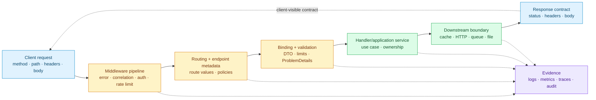
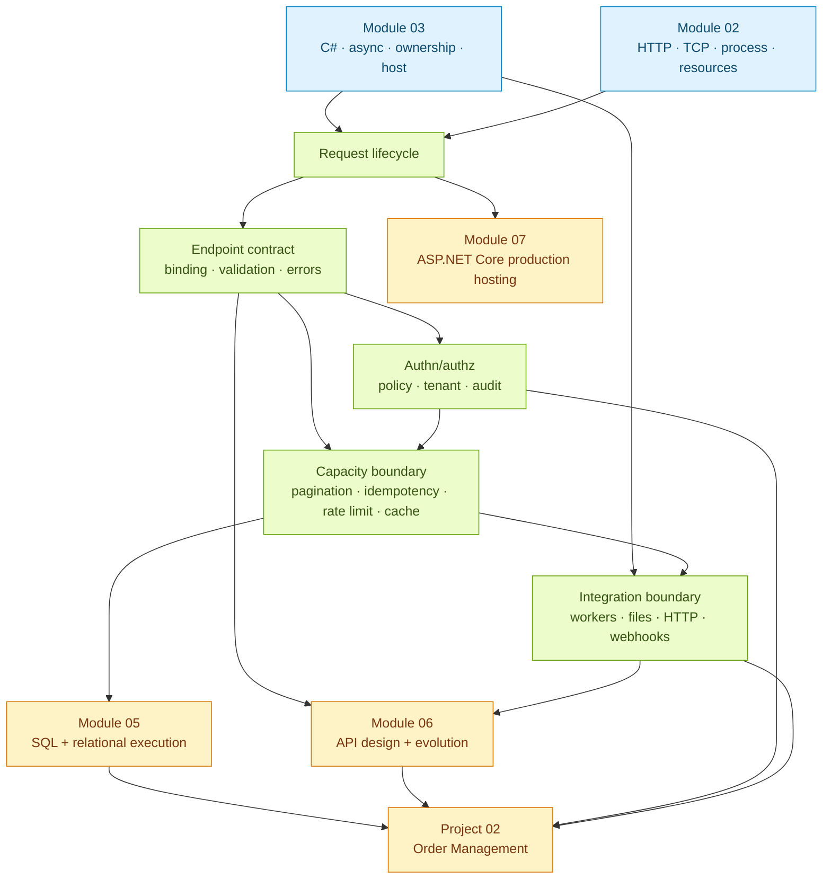
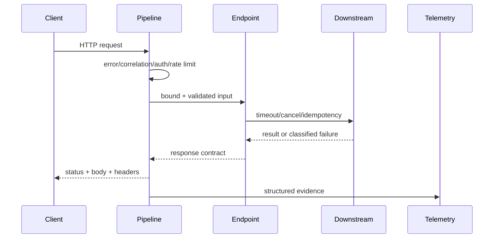

# Module 04 — Backend Request Lifecycle và Production Boundaries

> [← Module 03](../03-dotnet/README.md) · [Roadmap](../00-roadmap/README.md)

Module này nối runtime execution với backend application behavior: một HTTP request đi qua middleware, routing, binding, validation, authorization, handler, downstream call và response như thế nào. Trọng tâm là contract, failure boundary, abuse resistance và evidence; SQL/EF Core được mở ở Module 05.

## Module trong một hình



## Phạm vi và trạng thái

| Learning slice | Priority | Trạng thái nội dung | Evidence người học |
| --- | --- | --- | --- |
| [Request lifecycle và endpoint contract](request-lifecycle-and-endpoint-contract.md) | P0 | Content v1 | Pending |
| [Authentication, authorization và validation](authentication-authorization-and-validation.md) | P0 | Content v1 | Pending |
| [Pagination, idempotency, rate limiting và caching](pagination-idempotency-rate-limiting-and-caching.md) | P0 | Content v1 | Pending |
| [Background jobs, files và webhooks](background-jobs-files-and-webhooks.md) | P0 | Content v1 | Pending |
| [BackendLab .NET 10](../../labs/04-backend/backend-lab/Program.cs) | P0 | Buildable lab | Pending run report |

## Dependency map



## Bốn boundary phải giữ rõ

### Request boundary

HTTP input là untrusted và bounded bằng method, route, header, body size, timeout và content type. Không đưa raw request vào domain hoặc log.

### Security boundary

Authentication tạo identity; authorization quyết định action/resource. Policy phải kiểm tra resource và tenant, không chỉ có claim `role=admin`.

### Capacity boundary

Pagination, idempotency, rate limiting, cache và queue là cách phân bổ capacity. Chúng không phải decorator gắn tùy ý sau khi endpoint đã viết xong.

### Integration boundary

HTTP client, file, queue và webhook đều có timeout, retry budget, duplicate, replay và ownership. Không biến request thread thành durable job.

## Cách chạy lab

Yêu cầu: .NET SDK 10 theo [technology baseline](../00-roadmap/technology-baseline.md).

```powershell
cd E:\Documents\Dev\labs\04-backend\backend-lab
dotnet build -c Release
dotnet run -c Release --no-build -- pagination 10000 100 3
dotnet run -c Release --no-build -- idempotency 1000 10
dotnet run -c Release --no-build -- backpressure 10000 64 25
```

BackendLab là executable experiment, không phải server public. Nó kiểm tra các invariant của boundary bằng workload bounded; production endpoint cần thêm framework hosting, TLS, identity provider, persistence và deployment policy.



## Evidence tối thiểu

1. Một request trace có pipeline order và correlation ID.
2. Một matrix authn/authz gồm anonymous, authenticated, wrong tenant và forbidden action.
3. Pagination output ổn định khi dữ liệu thay đổi; duplicate request không duplicate side effect.
4. Rate limit/backpressure experiment có bounded memory và explicit rejection/cancellation.
5. Webhook/integration note có timeout, signature, replay, idempotency và audit.

## Exit criteria của module

Người học hoàn thành Module 04 khi có thể:

- trace request từ ingress đến response và downstream;
- thiết kế DTO, validation, status code và ProblemDetails không lộ nội bộ;
- tách authentication khỏi authorization và viết policy/resource check;
- chọn offset/cursor pagination, idempotency store, rate limit và cache theo workload;
- thiết kế worker/file/webhook integration có bounded queue, retry/deadline và replay;
- review endpoint qua correctness, security, latency, cost và operability.

## Tiếp tục từ đây

Sau Module 04, mở Module 05 — SQL khi contract/persistence boundary đã rõ; không tối ưu LINQ trước khi đọc generated SQL và execution plan. Project 02 sẽ nối endpoint contract với relational model.

## Verification metadata

- Verified: 2026-08-11.
- Technology version: ASP.NET Core/.NET 10 target.
- Official sources: Microsoft Learn pages in [references.md](references.md).
- Context7 queries used: không có Context7 callable tool trong run này; version-sensitive claims đối chiếu trực tiếp Microsoft Learn.
- Notes: module không lặp SQL/EF Core internals; các boundary được nối sang Module 05.

<!-- Mermaid.js Script CDN hỗ trợ tự động render sơ đồ Mermaid trên GitHub Pages (Jekyll) -->
<script type="module">
  import mermaid from 'https://cdn.jsdelivr.net/npm/mermaid@10/dist/mermaid.esm.min.mjs';
  mermaid.initialize({ startOnLoad: true, theme: 'default' });

  document.addEventListener("DOMContentLoaded", function () {
    const elements = document.querySelectorAll("pre.language-mermaid, code.language-mermaid, .language-mermaid pre, pre code.language-mermaid");
    elements.forEach((el) => {
      const container = el.tagName.toLowerCase() === "code" ? el.parentElement : el;
      const div = document.createElement("div");
      div.className = "mermaid";
      div.textContent = el.textContent;
      if (container && container.parentNode) {
        container.parentNode.replaceChild(div, container);
      }
    });
    mermaid.run({ querySelector: '.mermaid' });
  });
</script>
