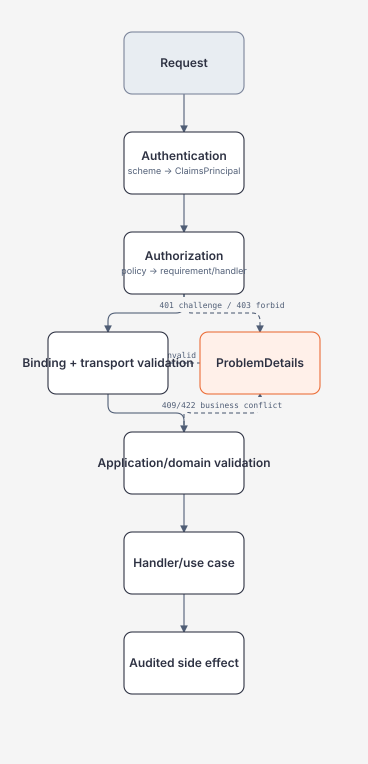

# Authentication, Authorization và Validation

> [← Request lifecycle](request-lifecycle-and-endpoint-contract.md) · [Module overview](README.md)

## Mục tiêu / Learning Objectives

- phân biệt authentication, authorization, accounting/audit và input validation;
- hiểu scheme, challenge, forbid, claims, requirements và handlers;
- viết policy/resource-based authorization có tenant boundary;
- thiết kế validation ở transport, application và domain boundary;
- chuẩn hóa 400/401/403/404/409/422/429/500 bằng ProblemDetails;
- review auth và validation theo threat model, privacy và operability.

## Tại sao cần học? / Why It Matters

Một token hợp lệ không có nghĩa user được phép đọc resource đó. Một DTO hợp lệ về kiểu dữ liệu không có nghĩa command hợp lệ về business. Nếu trộn hai lớp, app dễ mắc IDOR, tenant data leak, confusing 401/403 hoặc trả lỗi không thể tự sửa.

Security boundary phải được thực thi server-side ở đúng resource và operation. Validation phải chặn input xấu sớm nhưng không thay authorization; error response cần đủ hữu ích cho client mà không tiết lộ policy nội bộ.

## Tổng quan / Overview



## Mental Model

| Lớp | Câu hỏi | Kết quả điển hình |
| --- | --- | --- |
| Authentication | Ai đang gọi? | `ClaimsPrincipal`, hoặc anonymous |
| Authorization | Caller có được phép action/resource này không? | allow, challenge, forbid |
| Transport validation | Input có parse/bound được không? | 400 + field errors |
| Business validation | Operation có hợp invariant hiện tại không? | 409/422 hoặc domain error |
| Audit | Ai đã làm gì trên resource nào? | immutable event/log có privacy |

Authentication tạo identity; authorization sử dụng identity để quyết định. Validation không được “sửa” user permission và authorization không được giả định input đã safe.

## Thuật ngữ / Terminology

| Thuật ngữ | Ý nghĩa |
| --- | --- |
| Scheme | Cấu hình handler xác thực (JWT, cookie, OIDC...) |
| Authenticate | Tạo identity từ request credential |
| Challenge | Phản hồi caller chưa authenticated (thường 401) |
| Forbid | Caller authenticated nhưng không được phép (thường 403) |
| Claim | Assertion trong identity |
| Requirement | Điều kiện policy cần đạt |
| Handler | Code đánh giá requirement/resource |
| Policy | Tập requirements áp dụng cho endpoint |
| Resource-based authz | Quyết định có resource cụ thể |
| Tenant boundary | Giới hạn data/action theo tenant |
| DTO validation | Kiểm tra transport shape |
| ProblemDetails | Payload lỗi có type/title/status/detail/instance |
| IDOR | Truy cập object bằng ID mà thiếu ownership check |

## Prerequisites

- [Request lifecycle](request-lifecycle-and-endpoint-contract.md).
- [HTTP status/headers](../02-linux-git-networking/dns-tcp-tls-http-deep-dive.md).
- [Exceptions and failure boundary](../03-dotnet/exceptions-disposable-and-resource-ownership.md).
- [Security/threat modeling](../00-roadmap/master-roadmap.md#ai-experience-policy).

## How It Works

### Authentication

ASP.NET Core authentication service chọn scheme/handler để xác thực credential và đặt `HttpContext.User`. API thường dùng bearer token; browser session thường dùng cookie/OIDC. Scheme không tự “probe” mọi credential; default scheme hoặc explicit scheme phải rõ.

### Authorization

Authorization policy gồm requirement và handler. Role/claim policy phù hợp coarse-grained rule; resource-based handler cần load resource và kiểm tra owner/tenant/action. Endpoint có thể yêu cầu policy bằng metadata, nhưng use case vẫn nên có defense-in-depth cho side effect quan trọng.

### Validation order

Binding conversion xảy ra trước action; model validation sau binding. `[ApiController]` có thể short-circuit invalid ModelState. Business validation cần chạy trong application/domain layer vì nó phụ thuộc current state và transaction boundary.

## Minimal Example

```csharp
builder.Services.AddAuthentication().AddJwtBearer();
builder.Services.AddAuthorization(options =>
{
    options.AddPolicy("orders:read", policy =>
        policy.RequireAuthenticatedUser()
              .RequireClaim("scope", "orders:read"));
});

app.MapGet("/orders/{id:guid}", async (
    Guid id,
    IOrderReader reader,
    CancellationToken ct) =>
{
    var order = await reader.FindAsync(id, ct);
    return order is null ? Results.NotFound() : Results.Ok(order);
})
.RequireAuthorization("orders:read");
```

Scope claim chỉ là một input cho policy. Quyền đọc resource và tenant vẫn phải được kiểm tra trong `IOrderReader`/application boundary.

## Production Example

```csharp
public sealed class OrderAuthorizationHandler
    : AuthorizationHandler<SameTenantRequirement, Order>
{
    protected override Task HandleRequirementAsync(
        AuthorizationHandlerContext context,
        SameTenantRequirement requirement,
        Order resource)
    {
        var tenant = context.User.FindFirst("tenant_id")?.Value;
        var subject = context.User.FindFirst("sub")?.Value;

        if (tenant is not null && tenant == resource.TenantId
            && (resource.OwnerId == subject || context.User.IsInRole("order-admin")))
        {
            context.Succeed(requirement);
        }

        return Task.CompletedTask;
    }
}
```

Không load resource theo ID rồi trả về trước khi handler chạy. Nếu resource không tồn tại, chọn 404/403 theo anti-enumeration policy đã được quyết định và test thống nhất.

## .NET Integration

- `AddAuthentication`/`UseAuthentication` tạo identity; `AddAuthorization`/`UseAuthorization` đánh giá policy.
- `IAuthorizationService.AuthorizeAsync` phù hợp imperative/resource checks.
- `ApiController` tự trả validation response; customize `InvalidModelStateResponseFactory` nếu contract yêu cầu.
- `AddProblemDetails` và `UseExceptionHandler` tạo error payload production.
- Data protection, key rotation và token validation settings thuộc deployment/security baseline, không hard-code trong handler.

## Internals

Authentication handler trả `AuthenticateResult`; authorization service evaluate policy requirements và handlers. Một requirement có thể được nhiều handler xử lý; success semantics cần hiểu rõ để không vô tình OR/AND sai.

Claims là dữ liệu từ credential/provider, không phải database truth luôn luôn mới. Token lifetime, clock skew, revocation, key rotation và audience/issuer validation quyết định trust window. Resource authorization cần data lookup trong đúng consistency boundary.

Validation visitor có thể đi sâu object graph; collection length/depth phải bounded. Custom validator không nên gọi network/database trong transport binding vì làm request path khó timeout và khó test.

## Common Mistakes

- dùng `IsInRole` thay mọi authorization;
- tin `user_id` từ body thay subject đã authenticated;
- check tenant ở GET nhưng quên PUT/DELETE/export;
- trả 403 cho anonymous hoặc 401 cho forbidden một cách không nhất quán;
- dùng regex/validator gọi downstream chậm;
- log token/claims đầy đủ;
- expose validation detail của resource không thuộc tenant;
- dùng 500 cho lỗi client có thể sửa;
- chỉ test happy path credential;
- nghĩ HTTPS tự giải quyết authorization.

## Performance Considerations

Token validation, policy handler và resource lookup nằm trên critical path. Cache key material/metadata theo provider policy, nhưng không cache authorization lâu hơn permission/change risk cho phép. Tránh N+1 resource checks khi list endpoint; batch/filter theo tenant.

Validation nên reject sớm theo size/depth/content type. Metric tách auth failure, validation failure, policy handler latency và downstream lookup latency; tránh label bằng user/token.

## Security Considerations

Validate issuer, audience, signature, algorithm, expiration và token type phù hợp. Cookie cần Secure/HttpOnly/SameSite và CSRF strategy; bearer token cần transport/storage threat model khác. Không tin `X-Forwarded-*` ngoài trusted proxy.

Anti-enumeration quyết định 404 vs 403; document để client không suy ra resource existence trái policy. Audit ghi subject, tenant, action, resource classification, decision và correlation ID; redact PII/token.

## Reliability / Failure Modes

| Failure | User-visible result | Operational action |
| --- | --- | --- |
| Identity provider unavailable | 401/503 theo fail-closed policy | alert, fallback không mở quyền |
| Key rotation mismatch | auth failures | verify issuer/JWKS/cache/clock |
| Policy dependency timeout | 503 hoặc deny | bounded timeout, circuit/fallback deny |
| Stale permission cache | over/under authorization | TTL/invalidation/audit |
| Malformed input | 400 | stable field errors |
| Domain conflict | 409/422 | client correction/retry policy |
| Handler exception | 500 ProblemDetails | log once, no sensitive detail |

Fail closed cho authorization; fail open chỉ là explicit, time-bounded, reviewed emergency behavior.

## Observability

Metric: auth success/failure by scheme, 401/403 counts, policy latency, validation 4xx, conflict rate, token/key errors. Không đặt subject/user ID làm high-cardinality metric tag.

Trace span có `auth.scheme`, `auth.decision` và policy name ở mức không nhạy cảm; resource identifiers nên hashed/classified hoặc omitted. Audit trail khác application log: retention, integrity và access policy rõ.

## Operational Considerations

- rotation key/secret và clock synchronization là runbook items;
- kiểm thử startup khi provider metadata unavailable;
- test anonymous, expired token, wrong audience, wrong tenant, missing scope và resource absent;
- deploy policy changes theo canary nếu blast radius lớn;
- review ProblemDetails không leak internal IDs/claims;
- incident response cần revoke/rotate credential và tìm audit event liên quan.

## Architect Perspective

Authn/authz là trust-boundary architecture, không chỉ attribute trên controller. Identity source, permission source, tenant model, cache invalidation, audit owner và emergency access phải được vẽ cùng data flow.

Ở 10x tenant/user, policy evaluation và permission lookup cần cache/index/partition có invalidation. Ở 100x, externalized authorization hoặc centralized policy có thể hợp lý nhưng tạo network dependency và consistency trade-off.

## Trade-offs

| Lựa chọn | Lợi ích | Chi phí/rủi ro |
| --- | --- | --- |
| JWT bearer | Stateless, service-friendly | Revocation/rotation/claim staleness |
| Cookie/OIDC | Browser UX, session control | CSRF, key/data protection, redirects |
| Role policy | Simple coarse rule | Role explosion, weak resource context |
| Resource handler | Precise owner/tenant check | Lookup/latency/complexity |
| Gateway auth | Central ingress control | App may miss fine-grained checks |
| App-side authz | Context-rich, auditable | Must repeat correctly across services |

## When NOT to Use It

- Không tự viết JWT parser/crypto khi framework/provider đã có handler.
- Không dùng role duy nhất cho multi-tenant resource authorization.
- Không đưa authorization vào client UI như control duy nhất.
- Không dùng validation để che permission failure.
- Không cache allow decision dài nếu permission thay đổi nhanh.
- Không trả raw claims/exception cho client.

## Alternatives

- OAuth2/OIDC provider-managed identity thay local password store.
- Policy engine riêng khi policy shared nhiều service và có ownership rõ.
- Database row-level security cho boundary data phù hợp, kết hợp app authz.
- Signed webhook secret/mTLS cho machine-to-machine callback.
- Capability/short-lived token cho scoped automation.

## Review Questions

1. 401 và 403 khác nhau ở signal và threat model nào?
2. Vì sao claim `tenant_id` chưa đủ để authorize resource?
3. Khi nào 404 tốt hơn 403?
4. Binding validation và business validation chạy ở đâu?
5. Policy handler timeout nên fail thế nào?
6. Token/key rotation ảnh hưởng cache ra sao?
7. Metric nào giúp điều tra auth incident mà không lộ PII?
8. Vì sao client-side route guard không phải authorization?

## Hands-on Lab

Tạo authorization matrix cho endpoint `GET /orders/{id}` và `POST /orders`:

| Actor | Tenant | Credential | Expected |
| --- | --- | --- | --- |
| anonymous | — | none | 401 |
| user A | tenant-1 | valid | 200 chỉ resource tenant-1/owned |
| user A | tenant-2 | valid | 404 hoặc 403 theo policy |
| admin | tenant-1 | valid | 200 theo admin scope |
| expired token | tenant-1 | expired | 401 |

Ghi thêm validation cases: missing field, wrong type, oversized collection, invalid business state. Không dùng token thật trong lab artifact.

## Exit Criteria

- giải thích authn/authz/validation riêng biệt;
- viết policy và resource check không dựa vào body user ID;
- map lỗi 400/401/403/404/409/422/500 ổn định;
- có matrix test cho tenant/role/credential failure;
- thiết kế audit/metric không lộ secret hoặc PII.

## Related Topics

- [Request lifecycle](request-lifecycle-and-endpoint-contract.md).
- [Pagination/idempotency/rate limiting/caching](pagination-idempotency-rate-limiting-and-caching.md).
- [Background jobs/files/webhooks](background-jobs-files-and-webhooks.md).
- [Module 02 TLS/HTTP](../02-linux-git-networking/dns-tcp-tls-http-deep-dive.md).
- [Module 03 exceptions](../03-dotnet/exceptions-disposable-and-resource-ownership.md).

## Official English Sources

- [Authentication overview](https://learn.microsoft.com/en-us/aspnet/core/security/authentication/?view=aspnetcore-10.0).
- [Authorization introduction](https://learn.microsoft.com/en-us/aspnet/core/security/authorization/introduction?view=aspnetcore-10.0).
- [Policy-based authorization](https://learn.microsoft.com/en-us/aspnet/core/security/authorization/policies?view=aspnetcore-10.0).
- [Model validation](https://learn.microsoft.com/en-us/aspnet/core/mvc/models/validation?view=aspnetcore-10.0).
- [ProblemDetails for APIs](https://learn.microsoft.com/en-us/aspnet/core/fundamentals/error-handling-api?view=aspnetcore-10.0).

## Vietnamese Resources

- Dùng [glossary](../00-roadmap/glossary.md) cho authentication/authorization/validation terminology.
- Viết threat matrix bằng tiếng Việt, giữ claim/policy/requirement tiếng Anh để tránh nghĩa mơ hồ.

## Verification Metadata

- Verified: 2026-08-11.
- Technology version: ASP.NET Core/.NET 10 target.
- Context7 queries used: none; callable tool unavailable.
- Notes: authorization policy phải được test ở resource/tenant boundary, không chỉ endpoint metadata.
