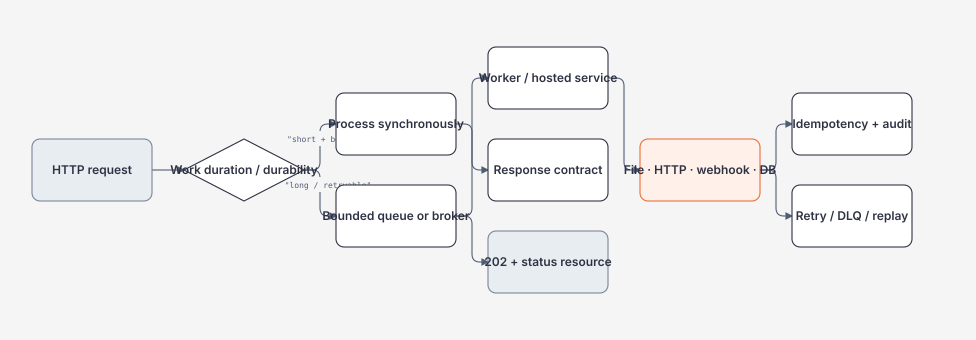

# Background Jobs, Files và Webhooks

> [← Pagination/idempotency/caching](pagination-idempotency-rate-limiting-and-caching.md) · [Module overview](README.md)

## Mục tiêu / Learning Objectives

- phân biệt request work, hosted service, durable queue và external worker;
- thiết kế bounded background queue có backpressure và shutdown drain;
- xử lý file stream với size limit, path safety, atomic write và cleanup;
- gọi downstream bằng deadline, cancellation, retry budget và `HttpClientFactory`;
- nhận webhook có signature, replay protection, idempotency và audit;
- chọn synchronous response, `202 Accepted`, queue hoặc durable workflow.

## Tại sao cần học? / Why It Matters

`Task.Run` trong controller không biến công việc thành durable job. Process restart, deploy, timeout hoặc duplicate request có thể làm mất work hoặc tạo side effect lặp. File và webhook còn thêm untrusted bytes, path traversal, signature rotation và replay attack.

Backend production phải nói rõ request kết thúc khi nào, work được lưu ở đâu, ai retry, ai quan sát và user kiểm tra trạng thái bằng cách nào.

## Tổng quan / Overview



## Mental Model

| Boundary | Owner | Required contract |
| --- | --- | --- |
| Enqueue | API/application | validate, authorize, idempotency, capacity |
| Queue | process/broker | bound, durability, visibility, ordering |
| Worker | hosted service | scope, cancellation, retry, concurrency |
| Side effect | integration adapter | timeout, dedupe, audit, compensation |
| Completion | status/event store | state machine, replay, client query |
| Shutdown | host/operator | stop intake, drain budget, recover remainder |

`202 Accepted` chỉ có nghĩa request được chấp nhận để xử lý, không phải side effect đã hoàn thành. Status resource/event cần expose progress mà không lộ secret.

## Thuật ngữ / Terminology

| Thuật ngữ | Ý nghĩa |
| --- | --- |
| Hosted service | `IHostedService`/`BackgroundService` trong host lifecycle |
| Bounded queue | Queue có capacity và full behavior |
| Durable queue | Queue giữ message qua process restart |
| Backpressure | Producer bị buộc theo capacity consumer |
| Drain | Xử lý work đã nhận trước shutdown deadline |
| DLQ | Dead-letter queue cho message không xử lý được |
| Webhook | HTTP callback do event producer gửi |
| Signature | MAC/asymmetric proof của payload/origin |
| Replay | Gửi lại payload hợp lệ đã từng nhận |
| Atomic write | File chỉ xuất hiện hoàn chỉnh sau commit/rename |
| Idempotent consumer | Xử lý duplicate không tạo state sai |
| Poison message | Message luôn fail do payload/contract |

## Prerequisites

- [Async/cancellation và ownership](../03-dotnet/async-await-cancellation-and-task-lifecycle.md).
- [Generic Host/ThreadPool](../03-dotnet/threadpool-concurrency-and-diagnostics.md).
- [Filesystem/process pressure](../02-linux-git-networking/filesystem-permissions-and-identities.md).
- [Idempotency/rate limit](pagination-idempotency-rate-limiting-and-caching.md).

## How It Works

### Queue và worker

Producer validate/authorize rồi enqueue một work item nhỏ, không capture `HttpContext`, scoped service hoặc raw request stream. Worker tạo scope cho mỗi item, execute với token/deadline, classify error và ack/complete sau side effect phù hợp.

Bounded `Channel<T>` tạo backpressure trong process. Broker dùng khi cần durability, multiple consumers, replay hoặc scale độc lập. Queue capacity là memory/latency budget, không chỉ số tùy ý.

### File processing

Read stream bounded, validate content type/size, tạo safe storage key, ghi vào temporary path, flush/close rồi atomic move. Không ghép filename client trực tiếp với root path. Cleanup temp khi cancellation/failure; virus/content inspection là downstream policy.

### Webhook receive/send

Receive: đọc raw bytes một lần, verify signature trên exact bytes + timestamp/nonce, enforce body/time bounds, dedupe event ID, enqueue minimal normalized event và trả 2xx sau khi đã persist/accept. Send: timeout, retry with backoff, signature rotation, idempotency và delivery log.

## Minimal Example

```csharp
public interface IBackgroundTaskQueue
{
    ValueTask<bool> TryEnqueueAsync(
        WorkItem item,
        CancellationToken cancellationToken);

    IAsyncEnumerable<WorkItem> ReadAllAsync(CancellationToken cancellationToken);
}

public sealed record WorkItem(Guid Id, string StorageKey);
```

API nên trả 429/503 khi queue full hoặc `202` sau enqueue thành công; không silently drop nếu contract yêu cầu durability.

## Production Example

```csharp
public sealed class WorkQueueService(
    IBackgroundTaskQueue queue,
    IServiceScopeFactory scopes,
    ILogger<WorkQueueService> logger) : BackgroundService
{
    protected override async Task ExecuteAsync(CancellationToken stoppingToken)
    {
        await foreach (var item in queue.ReadAllAsync(stoppingToken))
        {
            try
            {
                using var scope = scopes.CreateScope();
                var processor = scope.ServiceProvider
                    .GetRequiredService<IWorkItemProcessor>();
                await processor.ProcessAsync(item, stoppingToken);
            }
            catch (OperationCanceledException) when (stoppingToken.IsCancellationRequested)
            {
                break;
            }
            catch (Exception ex)
            {
                logger.LogError(ex, "Work item {WorkItemId} failed", item.Id);
                await queue.MarkFailedAsync(item, ex, stoppingToken);
            }
        }
    }
}
```

Durable queue cần ack/retry/DLQ semantics ngoài code loop. Worker phải giới hạn concurrency và không nuốt cancellation như business failure.

## .NET Integration

- `AddHostedService` đăng ký `BackgroundService` vào Generic Host lifecycle.
- `IServiceScopeFactory` tạo scoped dependencies cho từng work item.
- `Channel<T>`/`BoundedChannelOptions` phù hợp in-process bounded queue.
- `IHttpClientFactory` quản lý handler lifetime và named/typed client policy; timeout/retry vẫn phải thiết kế theo operation.
- `FileStream`, `RandomAccess` và async stream APIs cần ownership/disposal rõ.
- `ActivitySource`/`ILogger` ghi delivery ID, attempt, outcome và latency.

## Internals

Hosted service bắt đầu/dừng cùng host; không có request scope tự động. `StopAsync` nhận shutdown token và host có grace period; nếu worker không observe token, shutdown sẽ timeout/force.

Channel `Wait` full mode giữ producer ở await; `DropWrite`/`DropOldest` có thể mất work và chỉ hợp khi semantics cho phép. Broker visibility timeout có thể redeliver khi worker chết giữa side effect và ack.

Webhook signature phải verify raw bytes trước parse/normalization. HMAC compare constant-time; timestamp window giảm replay nhưng không thay event-ID dedupe. Key rotation cần accept old/new trong overlap ngắn.

## Common Mistakes

- `Task.Run` fire-and-forget trong request;
- inject scoped DbContext trực tiếp vào singleton worker;
- queue unbounded giữ toàn payload;
- ack message trước side effect commit;
- retry mọi exception vô hạn;
- file path dùng tên client không sanitize;
- ghi đè file đích không atomic;
- verify signature sau JSON re-serialize;
- webhook trả 200 trước khi lưu event nhưng không có replay plan;
- shutdown bỏ qua in-flight work.

## Performance Considerations

Worker concurrency phải theo downstream capacity, file descriptors, memory và rate quota. Queue depth/age quan trọng hơn worker count đơn thuần. Stream large file, tránh giữ body trong memory và tránh serialize payload nhiều lần.

Retry jitter, batch/prefetch và connection reuse giảm overhead nhưng tăng burst/duplicate risk. Đo end-to-end completion latency, attempt count, DLQ rate và shutdown drain time.

## Security Considerations

File upload chống path traversal, symlink/reparse point, zip bomb, decompression bomb, oversized multipart và malicious content. Storage key không phải path client; authorization kiểm tra trước download/delete.

Webhook secret/key phải nằm trong secret manager; verify signature, timestamp, event ID và sender allow-list/mTLS nếu cần. Không log raw payload/token; encrypt data at rest và đặt retention.

Queue message có thể chứa tenant/user data; enforce access, encryption, TTL và DLQ redaction. Retry không được mở rộng permission hoặc gửi data sang endpoint khác tenant.

## Reliability / Failure Modes

| Failure | Effect | Recovery |
| --- | --- | --- |
| Process restart | in-memory work lost | broker/outbox hoặc replay source |
| Queue full | producer blocked/rejected | backpressure/429/503/durable spill |
| Worker crash | duplicate/unacked | idempotent consumer + retry/DLQ |
| Downstream timeout | partial uncertainty | deadline, classify, reconciliation |
| Poison payload | repeated failure | max attempts + DLQ/manual fix |
| Partial file | corrupt artifact | temp file + atomic rename/cleanup |
| Webhook replay | duplicate side effect | event ID + timestamp/idempotency |
| Shutdown timeout | incomplete drain | checkpoint/requeue/force policy |

Không promise exactly-once qua network; thiết kế at-least-once + idempotency hoặc semantics tự nhiên an toàn.

## Observability

Metrics: enqueue/dequeue, depth, age, processing duration, attempts, retry/DLQ, bytes, file size, webhook delivery status, signature failures, completion latency và shutdown drain.

Trace giữ `trace_id`, `operation_id`, `delivery_id`, `attempt`, `tenant_class` và downstream spans. Log state transitions (accepted/started/completed/failed/retried/dead-lettered), không chỉ exception cuối cùng.

## Operational Considerations

- capacity/consumer count được config validate và rollout canary;
- runbook có replay/DLQ procedure, idempotency check và audit;
- graceful shutdown test với backlog và slow dependency;
- monitor disk/quota/descriptor và temporary file cleanup;
- key/signature rotation rehearsal;
- backup/retention cho durable queue/status metadata;
- không sửa DLQ message trực tiếp nếu không có immutable audit.

## Architect Perspective

Background processing là distributed system mini: queue state, ownership, retry, duplicate, ordering, visibility và recovery. Chọn in-process chỉ khi loss/restart semantics chấp nhận được; chọn broker khi durability/replay/scale đáng giá complexity.

Ở 10x, cần partition tenant, concurrency budget, DLQ tooling và status API. Ở 100x, cần regional queue, ordering key, replay isolation, storage lifecycle và capacity/cost model.

## Trade-offs

| Lựa chọn | Lợi ích | Chi phí |
| --- | --- | --- |
| Synchronous request | Immediate result | Timeout/latency coupling |
| In-process channel | Simple, low latency | Restart loss, one process |
| Durable broker | Replay/scale/decouple | Operational/storage complexity |
| File buffering | Retry/inspection dễ | Disk/cleanup/corruption |
| Stream processing | Bounded memory | Partial failure/retry khó |
| Webhook push | Near real-time | Receiver/replay/signature burden |

## When NOT to Use It

- Không dùng hosted service cho workflow cần survive deploy nếu chưa có durable state.
- Không upload file vào memory toàn bộ khi size không bounded.
- Không retry webhook side effect nếu không có event ID/idempotency.
- Không dùng timer nếu previous run có thể overlap mà không có lock.
- Không trả `202` nếu client không có status/reconciliation path.
- Không đặt DLQ thành “ngăn rác” không ai sở hữu.

## Alternatives

- Scheduled job/orchestrator cho workflow dài với checkpoint.
- Object storage + event notification cho file lớn.
- Broker/outbox/inbox cho durable integration.
- Polling status resource khi client không nhận webhook.
- Batch import/export khi per-request granularity quá đắt.

## Review Questions

1. Vì sao `Task.Run` trong controller không durable?
2. Khi nào bounded channel đủ, khi nào cần broker?
3. Ack trước hay sau side effect? Vì sao?
4. Webhook signature phải verify trên bytes nào?
5. File atomic write giải quyết failure nào?
6. Visibility timeout tạo duplicate ra sao?
7. Shutdown worker cần drain/requeue thế nào?
8. `202 Accepted` cần status/reconciliation contract gì?

## Hands-on Lab

Chạy [BackendLab](../../labs/04-backend/backend-lab/Program.cs):

```powershell
dotnet run -c Release --no-build -- backpressure 10000 64 25
```

Ghi produced/consumed/rejected, queue capacity, cancellation state và elapsed time. Sau đó thiết kế webhook envelope gồm `eventId`, `occurredAt`, `tenantId`, `type`, `version`, `signature` và idempotency policy; không gửi ra internet.

### Failure experiment

Thử capacity `0`, item count vượt bound và cancellation rất ngắn. Expected: exit code `64` cho input invalid; valid workload dừng cooperative, không treo và không tăng queue vô hạn.

## Exit Criteria

- chọn sync/202/queue dựa duration/durability/recovery;
- implement bounded worker scope/cancellation/error classification;
- thiết kế safe file lifecycle và webhook signature/replay;
- có DLQ/retry/idempotency/reconciliation plan;
- chứng minh backpressure bằng lab output và metric plan.

## Related Topics

- [Request lifecycle](request-lifecycle-and-endpoint-contract.md).
- [Pagination/idempotency/rate limiting/caching](pagination-idempotency-rate-limiting-and-caching.md).
- [Module 03 ownership](../03-dotnet/exceptions-disposable-and-resource-ownership.md).
- [Module 03 Generic Host](../03-dotnet/threadpool-concurrency-and-diagnostics.md).
- [Module 02 filesystem](../02-linux-git-networking/filesystem-permissions-and-identities.md).

## Official English Sources

- [Background tasks with hosted services](https://learn.microsoft.com/en-us/aspnet/core/fundamentals/host/hosted-services?view=aspnetcore-10.0).
- [HTTP requests with IHttpClientFactory](https://learn.microsoft.com/en-us/aspnet/core/fundamentals/http-requests?view=aspnetcore-10.0).
- [HttpClient guidelines](https://learn.microsoft.com/en-us/dotnet/fundamentals/networking/http/httpclient-guidelines).
- [Idempotency in integration events](https://learn.microsoft.com/en-us/dotnet/architecture/microservices/multi-container-microservice-net-applications/subscribe-events).

## Vietnamese Resources

- Đối chiếu [resource ownership](../03-dotnet/exceptions-disposable-and-resource-ownership.md) trước khi thêm worker.
- Dùng [glossary](../00-roadmap/glossary.md) cho queue, retry, DLQ, replay và webhook.

## Verification Metadata

- Verified: 2026-08-11.
- Technology version: ASP.NET Core/.NET 10 target.
- Context7 queries used: none; callable tool unavailable.
- Notes: durable semantics phải được verify với broker/storage thật trong Project 02/03.
