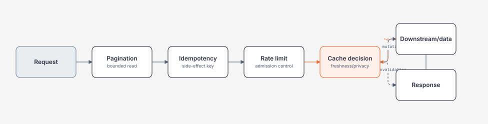

# Pagination, Idempotency, Rate Limiting và Caching

> [← Authentication/authorization](authentication-authorization-and-validation.md) · [Module overview](README.md)

## Mục tiêu / Learning Objectives

- chọn offset hay cursor pagination theo ordering, mutation và UX;
- định nghĩa idempotency key, replay semantics, conflict và retention;
- thiết kế rate limit theo identity/tenant/resource mà không tạo DoS partition;
- phân biệt cache-aside, output/response cache và authoritative data;
- xử lý stampede, stale data, invalidation và privacy;
- đo capacity bằng queue age, rejection, hit ratio và tail latency.

## Tại sao cần học? / Why It Matters

Endpoint không có bound sẽ biến một query hoặc burst thành process-wide incident. Pagination bảo vệ response và downstream; idempotency bảo vệ side effect khi client retry; rate limit bảo vệ capacity; cache giảm cost nhưng có thể trả dữ liệu sai hoặc leak tenant.

Đây là một nhóm contract liên quan. Thêm rate limiter mà không có overload policy chỉ đổi lỗi từ timeout sang 429; thêm cache mà không có invalidation chỉ làm stale bug khó quan sát hơn.

## Tổng quan / Overview



## Mental Model

| Primitive | Bảo vệ | Câu hỏi phải trả lời |
| --- | --- | --- |
| Pagination | response/read capacity | ordering có stable không, page drift ra sao? |
| Idempotency | duplicate side effect | key scope/retention/replay result là gì? |
| Rate limit | admission/downstream capacity | ai bị giới hạn, token nào, retry-after nào? |
| Cache | latency/read cost | source of truth, TTL, invalidation và tenant key? |

Capacity contract phải có bound và behavior khi bound bị chạm: wait, reject, degrade, stale read, queue hay spill durable. “Nhanh hơn” không đủ để chọn.

## Thuật ngữ / Terminology

| Thuật ngữ | Ý nghĩa |
| --- | --- |
| Offset pagination | `page/pageSize` hoặc `offset/limit` |
| Cursor pagination | Token biểu diễn vị trí theo stable ordering |
| Keyset pagination | Query tiếp theo dựa trên last ordered key |
| Idempotency key | Client operation identity dùng để deduplicate |
| Replay | Retry cùng key nhận lại kết quả đã lưu |
| Conflict | Cùng key nhưng payload khác |
| Token bucket | Rate limiter có refill token |
| Fixed/sliding window | Limit theo time window |
| Partition | Bucket riêng theo client/tenant/resource |
| Cache-aside | App đọc cache, miss thì source rồi set |
| Stampede | Nhiều request cùng repopulate một key |
| Freshness | Mức dữ liệu còn hợp lệ theo policy |

## Prerequisites

- [Request lifecycle](request-lifecycle-and-endpoint-contract.md).
- [Async/backpressure](../03-dotnet/async-await-cancellation-and-task-lifecycle.md).
- [Data structures/workload](../01-computer-science/data-structures-for-backend-systems.md).
- [Authentication/authorization](authentication-authorization-and-validation.md).

## How It Works

### Pagination

Offset dễ hiểu và phù hợp dữ liệu nhỏ/page navigation, nhưng offset lớn thường scan/skip nhiều và insert/delete gây page drift. Cursor/keyset cần stable unique ordering như `(CreatedAt, Id)`, encode cursor có integrity/expiry và reject tampered cursor.

### Idempotency

Server lưu `(scope, key, request fingerprint, status, response/reference, expiry)`. Cùng key + cùng fingerprint có thể replay; cùng key + khác fingerprint là conflict. Atomic claim của key phải nằm cùng boundary chống race; cache-only key không đủ cho durable side effect.

### Rate limiting

Admission control xảy ra trước work expensive. Partition bằng authenticated tenant/subject hoặc server-known key; partition dựa raw client IP có spoofing/NAT/DoS trade-off. 429 response nên có `Retry-After` khi có ý nghĩa.

### Caching

Cache key phải include mọi dimension ảnh hưởng response: tenant, user scope, locale, version và query. Cache hit không bypass authorization. Mutation cần invalidation/versioning; TTL là safety net, không phải correctness proof.

## Minimal Example

```csharp
public sealed record PageRequest(int Limit, long? AfterId);

public static IReadOnlyList<Item> Page(
    IReadOnlyList<Item> ordered,
    PageRequest request)
{
    if (request.Limit is < 1 or > 200)
        throw new ArgumentOutOfRangeException(nameof(request.Limit));

    var start = request.AfterId is null
        ? 0
        : ordered.TakeWhile(item => item.Id <= request.AfterId).Count();

    return ordered.Skip(start).Take(request.Limit).ToArray();
}
```

Production query phải push ordering/filter/limit xuống data store; ví dụ trên chỉ minh họa invariant và bounds.

## Production Example

```csharp
public async Task<IdempotentResult<T>> ExecuteAsync<T>(
    string scope,
    string key,
    object request,
    Func<CancellationToken, Task<T>> operation,
    CancellationToken ct)
{
    var fingerprint = _fingerprinter.Create(request);
    var claim = await _store.TryClaimAsync(scope, key, fingerprint, ct);

    if (claim is ExistingRecord existing)
    {
        if (!CryptographicOperations.FixedTimeEquals(
                existing.Fingerprint, fingerprint))
            return IdempotentResult<T>.Conflict("Key was used with another request");

        return await existing.ReplayAsync<T>(ct);
    }

    try
    {
        var value = await operation(ct);
        await _store.CompleteAsync(scope, key, fingerprint, value, ct);
        return IdempotentResult<T>.Created(value);
    }
    catch
    {
        await _store.MarkFailedOrReleaseAsync(scope, key, fingerprint, ct);
        throw;
    }
}
```

Persisted response/reference và atomic claim cần được thiết kế theo transaction/store thật. Không lưu raw payment/token payload chỉ để replay tiện.

## .NET Integration

- `Microsoft.AspNetCore.RateLimiting` gắn policies vào endpoint metadata và có metrics.
- Output caching khác response caching: server controls policy, but authorization/tenant vary remains essential.
- `IMemoryCache` là process-local; distributed cache cần serialization, timeout, availability và invalidation policy.
- `IAsyncEnumerable<T>`/cursor endpoints có thể stream nhưng phải bound page/window và cancellation.
- `TimeProvider` giúp test TTL, idempotency expiry và rate-window deterministically.

## Internals

Cursor có thể là opaque signed token chứa last key, filter hash, version và expiry. Nếu token encode dữ liệu nhạy cảm, encrypt hoặc tránh đưa trực tiếp. Stable ordering cần unique tie-breaker; `CreatedAt` riêng có thể duplicate.

Rate limiter thường duy trì state theo partition và clock window; state cardinality không bound là memory DoS. Distributed limit cần clock/consistency trade-off và network cost.

Cache stampede xảy ra khi TTL cùng hết; single-flight/resource lock, jittered TTL, stale-while-revalidate hoặc prewarm giảm herd nhưng tăng complexity. Invalidation event có thể mất; versioned key giảm dependency vào delete chính xác.

## Common Mistakes

- offset không có explicit order;
- cursor trust client và không sign/filter-bind;
- page size client kiểm soát vô hạn;
- idempotency key global không scope tenant/operation;
- cùng key khác payload nhưng server replay nhầm;
- cache response private thành public/shared;
- rate limit chỉ theo IP;
- retry 429 không đọc `Retry-After`;
- cache authorization result quá lâu;
- dùng in-memory idempotency trong multi-instance service.

## Performance Considerations

Đo query/read cost theo page depth, payload bytes, cache hit/miss, limiter decision latency và downstream load. Cursor/keyset thường giữ cost ổn định hơn offset ở deep page nhưng client integration phức tạp hơn.

Cache chỉ giúp nếu serialization/network/cache latency nhỏ hơn source; hit ratio cao nhưng stale/error cost lớn vẫn là trade-off xấu. Idempotency store giữ response lớn có thể tăng storage; lưu reference khi có thể.

## Security Considerations

Rate-limit partition key phải chống spoofing và không dùng raw user input làm vô hạn partition. Cursor/idempotency key cần length/charset bound; fingerprint canonicalization tránh collision/ambiguity.

Cache key và logs không được lộ tenant/PII; encryption/access control cho persisted idempotency response. Không để 429/error response trở thành oracle về user existence hoặc private resource.

## Reliability / Failure Modes

| Failure | Impact | Policy |
| --- | --- | --- |
| Cache unavailable | latency/cost tăng | bounded timeout, source fallback hoặc fail closed theo data |
| Stale cache | wrong read | TTL/version/invalidation/audit |
| Idempotency store timeout | duplicate risk | không thực hiện side effect nếu claim chưa rõ |
| Same key/different payload | ambiguity | 409 conflict |
| Limiter state loss | burst/false reject | choose fail-open/closed có budget |
| Cursor invalid/expired | client error | 400, không stack trace |
| Deep offset | slow query | cap depth, cursor migration |

“At-least-once retry” yêu cầu idempotency hoặc operation semantics tự nhiên idempotent.

## Observability

Metrics: request rate, 429/rejection, retry-after, queue age, page size/depth, cache hit/miss/stale, idempotency replay/conflict/claim latency, downstream latency. Tách tenant class thay raw tenant ID nếu cardinality cao.

Logs ghi policy decision, key hash, fingerprint version và outcome; không ghi raw idempotency key nếu nó có thể là secret. Trace nối cache, limiter, idempotency store và source query.

## Operational Considerations

- load test limiter trước production; tài liệu hóa burst/concurrency/window;
- monitor cache memory/eviction và distributed cache latency;
- có migration/expiry policy cho idempotency records;
- test deploy multi-instance và clock skew;
- runbook cho cache flush phải nêu blast radius;
- contract test cursor compatibility và `Retry-After`.

## Architect Perspective

Capacity controls là architecture, không phải tuning cuối sprint. Chọn nơi state nằm (process, distributed cache, database, queue), ai sở hữu invalidation, consistency nào chấp nhận được và failure nào bảo vệ dữ liệu nhất.

Ở 10x, cần tenant quota, partition fairness, cache stampede control và storage lifecycle. Ở 100x, admission control có thể ở gateway/edge, idempotency durable theo region và cache topology cần geo/failover reasoning.

## Trade-offs

| Lựa chọn | Lợi ích | Chi phí |
| --- | --- | --- |
| Offset | Dễ client/UI | Deep-page cost, page drift |
| Cursor/keyset | Stable cost/order | Opaque token/version complexity |
| In-memory idempotency | Nhanh, đơn giản | Mất state khi restart, multi-instance |
| Durable idempotency | Replay/recovery | Storage/cleanup/transaction cost |
| Local limiter | Low latency | Không global fairness |
| Distributed limiter | Shared quota | Network/consistency dependency |
| Cache-aside | Explicit source behavior | Stampede/invalidation code |

## When NOT to Use It

- Không thêm cache trước khi đo source cost và freshness requirement.
- Không dùng offset cho infinite/deep feed nếu keyset phù hợp.
- Không gọi operation sau khi idempotency claim timeout không rõ trạng thái.
- Không partition limiter bằng arbitrary user input.
- Không cache authorization/private response bằng key thiếu tenant/scope.
- Không lưu full response nhạy cảm chỉ để replay dễ.

## Alternatives

- Queue/admission thay rate limit khi work cần durable processing.
- Materialized read model/search index thay query deep pagination.
- ETag/conditional request thay cache body khi revalidation đủ.
- Natural idempotent PUT/upsert thay POST key khi semantics cho phép.
- Gateway/edge limit cho volumetric abuse, app policy cho tenant/resource.

## Review Questions

1. Vì sao offset page có thể drift khi insert/delete?
2. Cursor cần bind với filter nào?
3. Idempotency store cần lưu fingerprint để làm gì?
4. Khi limiter state mất, fail-open hay fail-closed dựa vào gì?
5. Cache key thiếu tenant gây bug gì?
6. Stampede khác cache miss bình thường thế nào?
7. Khi nào 429 và khi nào 503?
8. Evidence nào chứng minh cache cải thiện SLO chứ không chỉ hit ratio?

## Hands-on Lab

Chạy [BackendLab](../../labs/04-backend/backend-lab/Program.cs):

```powershell
dotnet run -c Release --no-build -- pagination 10000 100 3
dotnet run -c Release --no-build -- idempotency 1000 10
```

Ghi checksum/stable page, unique side effects, replay count, conflict count và elapsed time. Lặp với bound invalid; xác nhận không có unbounded allocation.

## Exit Criteria

- chọn offset/cursor có ordering và bound;
- mô tả idempotency claim/replay/conflict/expiry;
- thiết kế rate limit partition không tạo memory DoS;
- phân biệt cache source/freshness/invalidation/privacy;
- có metrics và failure policy cho từng primitive.

## Related Topics

- [Request lifecycle](request-lifecycle-and-endpoint-contract.md).
- [Authentication/authorization](authentication-authorization-and-validation.md).
- [Background jobs/files/webhooks](background-jobs-files-and-webhooks.md).
- [Module 01 workload reasoning](../01-computer-science/complexity-and-workload-reasoning.md).
- [Module 03 cancellation](../03-dotnet/async-await-cancellation-and-task-lifecycle.md).

## Official English Sources

- [Rate limiting middleware](https://learn.microsoft.com/en-us/aspnet/core/performance/rate-limit?view=aspnetcore-10.0).
- [Caching overview](https://learn.microsoft.com/en-us/aspnet/core/performance/caching/overview?view=aspnetcore-10.0).
- [HTTP API design and idempotency](https://learn.microsoft.com/en-us/azure/architecture/best-practices/api-implementation).
- [Idempotency in integration events](https://learn.microsoft.com/en-us/dotnet/architecture/microservices/multi-container-microservice-net-applications/subscribe-events).

## Vietnamese Resources

- Dùng [glossary](../00-roadmap/glossary.md) cho pagination, quota, replay, freshness và invalidation.
- Ghi capacity decision bằng input size, concurrency, downstream budget và observed evidence.

## Verification Metadata

- Verified: 2026-08-11.
- Technology version: ASP.NET Core/.NET 10 target.
- Context7 queries used: none; callable tool unavailable.
- Notes: rate limiting/caching claims require load test and deployment topology validation.
