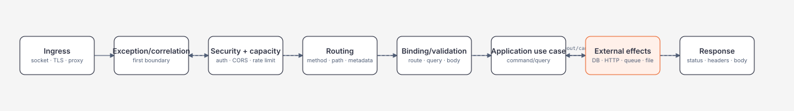

# Request Lifecycle và Endpoint Contract

> [← Module overview](README.md) · [Module 03 runtime](../03-dotnet/README.md)

## Mục tiêu / Learning Objectives

- mô tả request path từ server ingress qua middleware, routing, binding, endpoint và response;
- thiết kế endpoint contract có method, route, input, status, headers và body rõ ràng;
- hiểu middleware order, short-circuit và endpoint metadata;
- phân biệt transport DTO, application command/query và domain object;
- đặt timeout, body-size, content-type và cancellation boundary;
- tạo trace evidence cho một request thành công và một request lỗi.

## Tại sao cần học? / Why It Matters

Controller hoặc minimal API handler chỉ là một đoạn nhỏ trong request. Nếu middleware order sai, auth có thể chạy sau endpoint; nếu binding không bounded, body lớn có thể làm cạn memory; nếu response contract mơ hồ, client retry và migration trở thành guessing.

Backend engineer cần biết request đã đi qua boundary nào, ai sở hữu mỗi side effect và lỗi nào được phép lộ ra ngoài. Đây là nền để đọc trace, review security và nối endpoint với SQL ở module sau.

## Tổng quan / Overview



## Mental Model

Request lifecycle là một chuỗi decision point:

| Boundary | Quyết định | Failure nếu sai |
| --- | --- | --- |
| Ingress | tin proxy/header nào, giới hạn body bao nhiêu | spoofed IP, memory exhaustion |
| Middleware | chạy trước/sau, short-circuit gì | auth bypass, missing telemetry |
| Routing | endpoint nào được chọn | wrong handler, ambiguous route |
| Binding | nguồn input và conversion | over-posting, invalid state |
| Validation | request hợp lệ theo rule nào | bad data vào domain |
| Application | use case và side effect | business invariant broken |
| Response | status/body/header ổn định | client retry hoặc parse sai |

Middleware chạy vào theo thứ tự đăng ký và thường chạy ra theo thứ tự ngược sau `next`. Endpoint không được coi request là “trusted” chỉ vì nó đã qua routing.

## Thuật ngữ / Terminology

| Thuật ngữ | Ý nghĩa |
| --- | --- |
| Middleware | Component có thể xử lý hoặc chuyển request cho component kế tiếp |
| Short-circuit | Kết thúc pipeline mà không gọi `next` |
| Endpoint | Handler + metadata được routing chọn |
| Route value | Giá trị lấy từ path template |
| Model binding | Chuyển dữ liệu HTTP thành parameter/object |
| Model validation | Kiểm tra constraint trên model đã bind |
| DTO | Transport data transfer object |
| ProblemDetails | Error representation cho HTTP API |
| Correlation ID | ID nối log/trace của một operation |
| Idempotent | Lặp operation không làm state khác ngoài lần đầu |
| Resource filter/policy | Quyết định dựa trên resource cụ thể |
| Downstream | Dependency được endpoint gọi tiếp |

## Prerequisites

- [HTTP request path](../02-linux-git-networking/dns-tcp-tls-http-deep-dive.md).
- [Async/cancellation](../03-dotnet/async-await-cancellation-and-task-lifecycle.md).
- [Exceptions và ownership](../03-dotnet/exceptions-disposable-and-resource-ownership.md).
- [ThreadPool và diagnostics](../03-dotnet/threadpool-concurrency-and-diagnostics.md).

## How It Works

### Middleware order

Một skeleton thường đặt error handling sớm, forwarded headers đúng boundary, HTTPS/security headers, routing, authentication, authorization, rate limit và endpoint. Chi tiết order thay đổi theo app type; điều quan trọng là viết ra invariant, không copy pipeline mù.

```csharp
var builder = WebApplication.CreateBuilder(args);
builder.Services.AddProblemDetails();
builder.Services.AddAuthentication().AddJwtBearer();
builder.Services.AddAuthorization();

var app = builder.Build();
app.UseExceptionHandler();
app.UseRouting();
app.UseAuthentication();
app.UseAuthorization();
app.MapControllers();
app.Run();
```

### Routing và metadata

Route template, HTTP verb, constraints và endpoint metadata cùng quyết định candidate. Constraint như `{id:int}` giúp reject input rõ hơn nhưng không thay business validation. Metadata có thể được policy, rate limiter, OpenAPI và telemetry đọc.

### Binding và validation

Binding lấy dữ liệu từ route, query, header, form hoặc body theo rule framework. Binding failure (ví dụ string không parse thành integer) khác domain validation failure (ví dụ quantity vượt limit). `ApiController` có thể tự trả 400; contract phải thống nhất error shape.

### Response execution

Handler chọn status code, headers và body; formatter serialize body và response middleware chạy ra. Không ghi response body trước khi quyết định error boundary nếu còn khả năng exception. Streaming cần cancellation và ownership rõ.

## Minimal Example

```csharp
public sealed record GetOrderQuery(Guid OrderId);

app.MapGet("/orders/{id:guid}", async (
    Guid id,
    IOrderReader reader,
    CancellationToken cancellationToken) =>
{
    var order = await reader.FindAsync(new GetOrderQuery(id), cancellationToken);
    return order is null
        ? Results.NotFound()
        : Results.Ok(order);
})
.WithName("GetOrder")
.Produces<OrderView>(StatusCodes.Status200OK)
.Produces(StatusCodes.Status404NotFound);
```

`CancellationToken` ở endpoint chỉ có giá trị nếu downstream thực sự truyền token. `OrderView` là response DTO, không expose persistence entity trực tiếp.

## Production Example

```csharp
public sealed record CreateOrderRequest(
    string CustomerId,
    IReadOnlyList<CreateOrderLine> Lines,
    string IdempotencyKey);

app.MapPost("/orders", async (
    CreateOrderRequest request,
    ClaimsPrincipal user,
    IOrderApplication service,
    CancellationToken ct) =>
{
    var command = new CreateOrderCommand(
        user.FindFirstValue("sub") ?? throw new UnauthorizedAccessException(),
        request.CustomerId,
        request.Lines,
        request.IdempotencyKey);

    var result = await service.CreateAsync(command, ct);
    return result switch
    {
        CreateOrderResult.Created created =>
            Results.Created($"/orders/{created.OrderId}", created.View),
        CreateOrderResult.Replayed replayed =>
            Results.Ok(replayed.View),
        CreateOrderResult.Conflict conflict =>
            Results.Conflict(new { code = "idempotency_conflict", conflict.Message }),
        _ => Results.Problem(statusCode: 500)
    };
})
.RequireAuthorization("orders:create")
.Produces<OrderView>(StatusCodes.Status201Created)
.Produces<OrderView>(StatusCodes.Status200OK)
.Produces(StatusCodes.Status409Conflict);
```

Application service owns idempotency and business transaction boundary; endpoint maps result to HTTP. Không retry `CreateAsync` tại controller nếu chưa biết side effect và key policy.

## .NET Integration

- `WebApplicationBuilder` composes DI, configuration, logging và server host.
- `UseExceptionHandler`/`AddProblemDetails` tạo error boundary cho production.
- `MapGroup` gom prefix, metadata, authorization và filters cho endpoint family.
- `IEndpointFilter` hoặc MVC filters phù hợp cross-cutting logic cần endpoint metadata; middleware phù hợp process-wide concern.
- `Activity`/OpenTelemetry nối request với downstream span; `ILogger` ghi structured fields, không ghi raw body.

## Internals

Routing xây candidate set từ endpoint data source; matcher đọc path/verb/constraint rồi chọn endpoint. Endpoint invoker bind parameter trước khi handler chạy. Body formatter có thể buffer hoặc stream tùy input formatter và return type.

Middleware delegate là chain of responsibility. `await next(context)` tạo suspension point; exception đi ngược chain tới middleware có handler. Response đã bắt đầu gửi thì status/header có thể không đổi được.

Model binding tạo object graph và ModelState; validation visitor đi qua graph. Độ sâu và kích thước graph là resource concern, không chỉ correctness concern.

## Common Mistakes

- đặt `UseAuthorization` trước `UseAuthentication`;
- auth ở controller nhưng quên endpoint/background path khác;
- nhận entity persistence trực tiếp làm request DTO;
- không giới hạn request body hoặc collection length;
- trả 200 cho mọi lỗi để “client dễ xử lý”;
- ném stack trace/SQL/secret trong response;
- tự đọc `HttpContext.Request.Body` nhiều nơi;
- tạo `HttpClient` mỗi request;
- tạo background `Task.Run` từ handler rồi quên ownership;
- log `Authorization`, cookie hoặc raw payload.

## Performance Considerations

Giảm work trước handler bằng route constraint, auth và rate limit; tránh deserialize body nếu request bị reject sớm. Dùng async I/O, stream payload lớn và response projection. Đo p50/p95/p99 theo endpoint, status, payload size và downstream wait.

Middleware mỗi lớp có cost; không biến pipeline thành nơi chứa business logic. Correlation/logging nên structured và sampled. `IAsyncEnumerable<T>` chỉ giúp streaming khi toàn pipeline giữ async semantics và client chấp nhận chunking.

## Security Considerations

Trust proxy headers chỉ từ known proxy; nếu không, client có thể spoof scheme/IP. Validate content type, body size, path/query length và decompression limits. CORS không phải authentication; CSRF và cookie policy khác bearer-token threat model.

Dùng allow-list binding, DTO immutable và resource authorization. Không include claims/token/body vào log mặc định. ProblemDetails có `traceId` hữu ích nhưng không chứa internal exception detail.

## Reliability / Failure Modes

| Failure | Boundary | Response |
| --- | --- | --- |
| Dependency timeout | application/downstream | cancel, classify 503/504, bounded retry |
| Client disconnect | request token | stop work, release ownership |
| Invalid body | binding/validation | stable 400 ProblemDetails |
| Ambiguous route | routing | fail startup/test, không đoán |
| Response already started | response | log and close safely; không rewrite headers |
| Queue full | capacity | 429/503/reject hoặc durable enqueue |
| Worker crash | integration | supervisor/restart/DLQ/audit |

Timeout không phải retry; retry phải tính remaining deadline và idempotency.

## Observability

Tối thiểu mỗi request có method, normalized route, status, duration, correlation/trace ID, payload size và downstream outcome. Không dùng raw URL/query làm metric label nếu có cardinality cao.

Trace nên có spans cho handler, DB/HTTP/queue; metric nên có request rate, error rate, latency histogram, active requests, rejected requests và queue age. Log exception một lần ở boundary có ownership, tránh duplicate stack.

## Operational Considerations

- readiness chỉ báo ready sau config validation và dependency policy cần thiết;
- graceful shutdown ngừng nhận request mới, cancel/drain work theo grace period;
- đặt server/request/header/body/idle timeout ở cả proxy và app;
- test forwarded headers, large body, malformed JSON, client disconnect và slow downstream;
- giữ response/status compatibility trong versioned contract;
- runbook phải nêu command/tool, safe sample và artifact retention.

## Architect Perspective

Endpoint là contract giữa client, app, data và operations. Quyết định “sync response hay enqueue job” thay đổi consistency, retry, UX, storage và ownership. Middleware là shared policy boundary; application service là use-case boundary; repository/HTTP client là integration boundary.

Ở 10x, route/handler code chưa đủ: cần quota, tenant fairness, schema evolution và trace sampling. Ở 100x, ingress, queue, cache, regional routing và durable workflow trở thành architectural components.

## Trade-offs

| Lựa chọn | Lợi ích | Chi phí |
| --- | --- | --- |
| Minimal API | Ít ceremony, endpoint-local | Cần discipline để không thành lambda soup |
| Controllers | Convention/filter/tooling rõ | Nhiều abstraction hơn |
| Middleware | Cross-cutting process-wide | Order coupling, khó resource-specific |
| Endpoint filter | Metadata-aware, local | Không thay middleware cho mọi concern |
| Buffer body | Dễ validate/retry | Peak memory, latency |
| Stream body | Bounded memory | Error/partial response phức tạp |

## When NOT to Use It

- Không đưa business rule vào middleware chỉ vì “dùng được `HttpContext`”.
- Không dùng endpoint `Task.Run` như durable background queue.
- Không trả entity/exception nội bộ làm public contract.
- Không thêm retry ở mọi layer cùng lúc.
- Không chọn streaming nếu client và downstream không hỗ trợ backpressure.
- Không dùng một correlation ID thay cho authorization hoặc idempotency key.

## Alternatives

- Worker/queue cho công việc dài hoặc cần replay.
- gRPC/RPC cho service-to-service contract có schema rõ.
- WebSocket/SignalR cho realtime thay polling endpoint.
- Batch/export job cho dữ liệu lớn thay response synchronous.
- Gateway/BFF khi client-specific aggregation có ownership rõ.

## Review Questions

1. Middleware nào phải chạy trước authentication và vì sao?
2. Binding failure khác domain validation ở đâu?
3. Khi nào endpoint nên trả 202 thay 200/201?
4. Vì sao DTO không nên là persistence entity?
5. Request cancellation đi tới dependency nào?
6. Response đã bắt đầu thì error handler còn làm gì được?
7. Metric label nào có nguy cơ cardinality explosion?
8. Queue full nên trả client status nào trong từng workload?

## Hands-on Lab

Chạy [BackendLab](../../labs/04-backend/backend-lab/Program.cs):

```powershell
dotnet run -c Release --no-build -- pagination 10000 100 3
```

Ghi contract: input bounds, stable ordering, page metadata, checksum và failure khi page/page-size invalid. Viết một trace sketch từ ingress đến response và đánh dấu owner của từng step.

### Failure experiment

Thử page size `0`, page quá lớn, method/command không hợp lệ và workload vượt bound. Expected behavior là reject với exit code `64`, không allocate workload không giới hạn.

## Exit Criteria

- vẽ được request pipeline và giải thích middleware order;
- viết endpoint contract có DTO, status, error và cancellation;
- phân biệt middleware/filter/handler/application service;
- xác định timeout/body-size/cardinality và response compatibility;
- chạy BackendLab pagination và lưu evidence/failure output.

## Related Topics

- [Authentication, authorization và validation](authentication-authorization-and-validation.md).
- [Pagination, idempotency, rate limiting và caching](pagination-idempotency-rate-limiting-and-caching.md).
- [Background jobs, files và webhooks](background-jobs-files-and-webhooks.md).
- [Module 03 async/cancellation](../03-dotnet/async-await-cancellation-and-task-lifecycle.md).
- Module 05 — SQL khi content được mở.

## Official English Sources

- [ASP.NET Core middleware](https://learn.microsoft.com/en-us/aspnet/core/fundamentals/middleware?view=aspnetcore-10.0).
- [Routing](https://learn.microsoft.com/en-us/aspnet/core/fundamentals/routing?view=aspnetcore-10.0).
- [Model binding](https://learn.microsoft.com/en-us/aspnet/core/mvc/models/model-binding?view=aspnetcore-10.0).
- [ProblemDetails error handling](https://learn.microsoft.com/en-us/aspnet/core/fundamentals/error-handling-api?view=aspnetcore-10.0).

## Vietnamese Resources

- Giữ canonical English term trong [glossary](../00-roadmap/glossary.md).
- Diễn giải request path bằng Mermaid và trace table trước khi học framework convention.
- Dùng [source policy](../00-roadmap/source-policy.md) khi thêm framework/version claim.

## Verification Metadata

- Verified: 2026-08-11.
- Technology version: ASP.NET Core/.NET 10 target.
- Context7 queries used: none; callable tool unavailable.
- Notes: request/response contract là transport boundary; SQL query shape thuộc Module 05.
