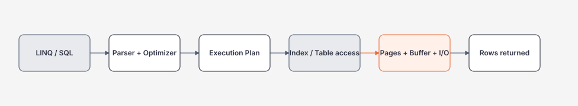

# Module 05 — SQL / SQL Server

> [← Module 04 Backend](../04-backend/README.md) · [Roadmap](../00-roadmap/README.md)

Module này học SQL theo cách của Backend Engineer và Software Architect: **query phải nối được tới data model, transaction, execution plan, index, I/O, concurrency và production incident**.

## Hiểu trong 5 phút

Khi application gọi database, thứ bạn viết thường chỉ là điểm bắt đầu:



Một query chậm không được xử lý bằng câu trả lời mặc định `thêm index`.

Bạn phải hỏi theo thứ tự:

1. Query đang yêu cầu dữ liệu gì?
2. SQL thật sự được gửi xuống database là gì?
3. Estimated/Actual rows có lệch lớn không?
4. Plan đang `Seek`, `Scan`, `Lookup`, `Sort`, `Hash` hay `Nested Loops`?
5. Index hiện tại có phù hợp filter/order/join không?
6. Query đọc bao nhiêu page? CPU/I/O bao nhiêu?
7. Có blocking/deadlock/concurrency issue không?
8. Thay đổi index/query có làm write path tệ đi không?

---

# 1. Chạy ví dụ đầu tiên

Giả sử hệ thống có Orders:

```sql
CREATE TABLE dbo.Orders
(
    Id          bigint         NOT NULL PRIMARY KEY,
    TenantId    int            NOT NULL,
    CustomerId  bigint         NOT NULL,
    Status      varchar(20)    NOT NULL,
    TotalAmount decimal(18, 2) NOT NULL,
    CreatedAt   datetime2      NOT NULL
);
```

Query business:

```sql
SELECT TOP (50)
    Id,
    CustomerId,
    TotalAmount,
    CreatedAt
FROM dbo.Orders
WHERE TenantId = @tenantId
  AND Status = 'Paid'
ORDER BY CreatedAt DESC;
```

Index đầu tiên để suy nghĩ:

```sql
CREATE INDEX IX_Orders_Tenant_Status_CreatedAt
ON dbo.Orders(TenantId, Status, CreatedAt DESC)
INCLUDE(CustomerId, TotalAmount);
```

Đừng dừng ở `query chạy nhanh hơn`. Hãy đo:

```sql
SET STATISTICS IO ON;
SET STATISTICS TIME ON;

SELECT TOP (50)
    Id,
    CustomerId,
    TotalAmount,
    CreatedAt
FROM dbo.Orders
WHERE TenantId = @tenantId
  AND Status = 'Paid'
ORDER BY CreatedAt DESC;
```

Evidence cần lưu:

```text
logical reads before / after
CPU time before / after
elapsed time before / after
actual execution plan
write-cost impact của index mới
```

---

# 2. Mental model quan trọng nhất

```text
Business requirement
        ↓
Data model + constraints
        ↓
SQL query shape
        ↓
Statistics / cardinality estimate
        ↓
Query optimizer
        ↓
Execution plan
        ↓
Index / heap / pages
        ↓
CPU + memory + I/O
```

Nếu học EF Core nhưng bỏ qua chuỗi này, bạn chỉ biết viết LINQ chứ chưa kiểm soát database behavior.

---

# 3. Lộ trình trong module

| Bước | Tài liệu | Bạn phải làm được |
| --- | --- | --- |
| 1 | [Relational Model, Schema và SQL](relational-model-schema-and-sql.md) | Thiết kế table/key/constraint/query đúng invariant |
| 2 | [Transactions, Isolation và Concurrency](transactions-isolation-and-concurrency.md) | Giải thích lock, blocking, deadlock, row versioning và retry boundary |
| 3 | [Indexes, Execution Plans và SQL Operations](indexes-execution-plans-and-operations.md) | Đọc actual plan, statistics, access path và Query Store |
| 4 | [EF Core → SQL → Execution Plan](ef-core-query-shape-and-sql.md) | Đi từ LINQ tới SQL thật, plan và index impact |

---

# 4. SQL mà Backend Engineer phải biết

## Query fundamentals

```sql
SELECT
FROM
WHERE
JOIN
GROUP BY
HAVING
ORDER BY
OFFSET / FETCH
CTE
WINDOW FUNCTIONS
```

Ví dụ window function:

```sql
SELECT
    CustomerId,
    CreatedAt,
    TotalAmount,
    SUM(TotalAmount) OVER
    (
        PARTITION BY CustomerId
        ORDER BY CreatedAt
    ) AS RunningTotal
FROM dbo.Orders;
```

## Data integrity

Rule quan trọng nên ở database khi có thể enforce ổn định:

```sql
ALTER TABLE dbo.Orders
ADD CONSTRAINT CK_Orders_TotalAmount_NonNegative
CHECK (TotalAmount >= 0);
```

Unique invariant:

```sql
CREATE UNIQUE INDEX UX_Orders_Tenant_ExternalId
ON dbo.Orders(TenantId, ExternalId);
```

Application validation vẫn cần cho UX, nhưng validation không thay thế database constraint đối với invariant cần giữ dưới concurrency.

---

# 5. SQL + EF Core: phải nhìn được SQL thật

Ví dụ LINQ:

```csharp
var orders = await db.Orders
    .AsNoTracking()
    .Where(x => x.TenantId == tenantId && x.Status == OrderStatus.Paid)
    .OrderByDescending(x => x.CreatedAt)
    .Select(x => new OrderSummary(
        x.Id,
        x.CustomerId,
        x.TotalAmount,
        x.CreatedAt))
    .Take(50)
    .ToListAsync(cancellationToken);
```

Debug SQL:

```csharp
var query = db.Orders
    .AsNoTracking()
    .Where(x => x.TenantId == tenantId && x.Status == OrderStatus.Paid)
    .OrderByDescending(x => x.CreatedAt)
    .Take(50);

Console.WriteLine(query.ToQueryString());
```

Chuỗi review bắt buộc:

```text
LINQ
 ↓
Generated SQL
 ↓
Actual Execution Plan
 ↓
Index usage
 ↓
Logical reads / CPU / duration
```

---

# 6. Anti-pattern cần nhận ra ngay

## N+1

```csharp
foreach (var order in orders)
{
    var items = await db.OrderItems
        .Where(x => x.OrderId == order.Id)
        .ToListAsync(cancellationToken);
}
```

Nếu `orders = 500`, bạn có thể tạo hàng trăm round trip.

Hãy nghĩ tới projection/query shape trước:

```csharp
var result = await db.Orders
    .AsNoTracking()
    .Where(x => x.TenantId == tenantId)
    .Select(x => new
    {
        x.Id,
        Items = x.Items.Select(i => new
        {
            i.ProductId,
            i.Quantity
        }).ToList()
    })
    .ToListAsync(cancellationToken);
```

## Offset pagination ở page rất sâu

```sql
ORDER BY CreatedAt DESC
OFFSET 500000 ROWS
FETCH NEXT 50 ROWS ONLY;
```

Khi workload lớn, cân nhắc keyset pagination:

```sql
WHERE CreatedAt < @lastCreatedAt
   OR (CreatedAt = @lastCreatedAt AND Id < @lastId)
ORDER BY CreatedAt DESC, Id DESC;
```

## `SELECT *`

Không chỉ tốn network. Nó còn có thể phá covering-index strategy và làm query phải đọc nhiều data hơn cần thiết.

---

# 7. Failure experiments phải tự chạy

## Experiment A — Blocking

Session 1:

```sql
BEGIN TRANSACTION;

UPDATE dbo.Orders
SET Status = 'Processing'
WHERE Id = 1001;

-- chưa COMMIT
```

Session 2:

```sql
UPDATE dbo.Orders
SET Status = 'Cancelled'
WHERE Id = 1001;
```

Quan sát blocking rồi mới `COMMIT`/`ROLLBACK` session 1.

## Experiment B — Deadlock

Tạo hai transaction update cùng hai rows nhưng theo thứ tự ngược nhau. Mục tiêu không phải học cách "né error", mà hiểu vì sao transaction ordering và retry policy phải được thiết kế.

## Experiment C — Index regression

1. Chạy workload baseline.
2. Thêm index.
3. Đo read workload.
4. Đo insert/update workload.
5. So sánh storage/index maintenance cost.

---

# 8. Các câu hỏi Architect phải trả lời

Không chỉ:

> Query này có index chưa?

Mà còn:

- Workload read/write ratio là bao nhiêu?
- Query path nào nằm trên latency-critical path?
- Isolation level nào phù hợp correctness requirement?
- Có cần strong consistency ở boundary này không?
- Query/index change có tăng write amplification không?
- Có thể giải bài toán bằng schema/query đơn giản hơn thay vì thêm cache không?
- Query Store/telemetry có đủ để phát hiện regression sau deploy không?
- Backup/restore/RPO/RTO có phù hợp NFR không?

---

# 9. Evidence để hoàn thành Module 05

Bạn chưa hoàn thành SQL chỉ vì viết được JOIN.

Tối thiểu phải có:

- một schema có PK/FK/unique/check constraint hợp lý;
- một transaction concurrency experiment;
- một blocking hoặc deadlock reproduction;
- một query có actual execution plan;
- một optimization có before/after `STATISTICS IO/TIME`;
- một LINQ query đi tới generated SQL và plan;
- một note giải thích trade-off index read vs write;
- một production troubleshooting checklist.

---

# 10. Thứ tự học đề xuất

```text
Relational model
    ↓
SQL query
    ↓
Transactions
    ↓
Isolation + Locking
    ↓
Indexes
    ↓
Statistics
    ↓
Execution Plans
    ↓
Query Store
    ↓
EF Core Query Shape
    ↓
Production troubleshooting
```

Sau Module 05, chuyển sang [API Design](../06-api-design/README.md), nhưng tiếp tục dùng SQL module như reference khi học EF Core, performance và distributed systems.

## Official references

Xem [references.md](references.md). English official documentation là source of truth cho SQL Server behavior; roadmap này tập trung vào cách học và reasoning.

## Verification metadata

- Verified: 2026-08-12.
- Status: code-first deep rewrite in progress.
- Primary implementation: SQL Server 2025 baseline của repository.
- Related: EF Core 10, ASP.NET Core 10.
