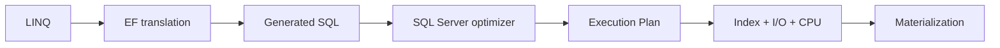

# EF Core → SQL → Execution Plan

> [← SQL overview](README.md) · [Indexes & Plans](indexes-execution-plans-and-operations.md)

## Hiểu trong 5 phút

EF Core không xóa SQL khỏi hệ thống. Nó **sinh SQL thay bạn**.

Do đó review query đúng phải đi hết chuỗi:



Nếu bạn chỉ nhìn LINQ đẹp hay xấu mà không nhìn SQL/plan, bạn chưa review performance đầy đủ.

---

# 1. Projection trước `Include`

Bad default:

```csharp
var orders = await db.Orders
    .Include(x => x.Customer)
    .Include(x => x.Items)
        .ThenInclude(x => x.Product)
    .Where(x => x.TenantId == tenantId)
    .ToListAsync(cancellationToken);
```

Endpoint list thường không cần toàn bộ graph.

Projection rõ contract hơn:

```csharp
var orders = await db.Orders
    .AsNoTracking()
    .Where(x => x.TenantId == tenantId)
    .OrderByDescending(x => x.CreatedAt)
    .Select(x => new OrderListItem(
        x.Id,
        x.Customer.Name,
        x.Status,
        x.TotalAmount,
        x.CreatedAt,
        x.Items.Count))
    .Take(50)
    .ToListAsync(cancellationToken);
```

Lợi ích cần verify bằng SQL thật:

```text
fewer columns
fewer rows / less duplication
less materialization
potentially better covering index
```

---

# 2. `ToQueryString()` là bước debug cơ bản

```csharp
var query = db.Orders
    .AsNoTracking()
    .Where(x => x.TenantId == tenantId)
    .OrderByDescending(x => x.CreatedAt)
    .Take(50);

var sql = query.ToQueryString();
Console.WriteLine(sql);
```

Checklist:

```text
WHERE đúng không?
JOIN nào được sinh?
Có SELECT nhiều column không cần thiết không?
ORDER BY có đúng index shape không?
Pagination được translate như nào?
Query có split thành nhiều round trip không?
```

---

# 3. `AsNoTracking()` không phải magic performance switch

Read-only query thường không cần change tracking:

```csharp
var customer = await db.Customers
    .AsNoTracking()
    .SingleAsync(x => x.Id == customerId, cancellationToken);
```

Nhưng performance vẫn phụ thuộc SQL và số rows materialize.

```text
AsNoTracking
    ↓
reduces EF tracking overhead

NOT
    ↓
fix bad SQL/index automatically
```

---

# 4. N+1: nhìn bằng số round trips

Bad:

```csharp
var orders = await db.Orders
    .Where(x => x.TenantId == tenantId)
    .Take(100)
    .ToListAsync(cancellationToken);

foreach (var order in orders)
{
    order.ItemCount = await db.OrderItems
        .CountAsync(x => x.OrderId == order.Id, cancellationToken);
}
```

Mental model:

```text
1 query lấy Orders
+
100 queries Count Items
=
101 round trips
```

Projection:

```csharp
var orders = await db.Orders
    .AsNoTracking()
    .Where(x => x.TenantId == tenantId)
    .Select(x => new OrderListItem(
        x.Id,
        x.Customer.Name,
        x.Status,
        x.TotalAmount,
        x.CreatedAt,
        x.Items.Count))
    .Take(100)
    .ToListAsync(cancellationToken);
```

Sau đó verify generated SQL và plan.

---

# 5. Cartesian explosion

Multiple collection includes có thể tạo nhiều duplicated rows trong result set.

Ví dụ conceptual:

```text
1 Order
10 Items
5 Tags

JOIN shape có thể tạo 50 row combinations
```

Không phải lúc nào `Include` cũng sai, nhưng phải hiểu cardinality.

Khi phù hợp có thể cân nhắc split queries:

```csharp
var orders = await db.Orders
    .AsNoTracking()
    .Include(x => x.Items)
    .Include(x => x.Tags)
    .AsSplitQuery()
    .Where(x => x.TenantId == tenantId)
    .ToListAsync(cancellationToken);
```

Trade-off:

```text
Single query:
  fewer round trips
  risk row duplication / huge join

Split query:
  less cartesian duplication
  more round trips / consistency considerations
```

Đo workload thực tế.

---

# 6. Offset vs keyset pagination

Offset:

```csharp
var page = await db.Orders
    .AsNoTracking()
    .Where(x => x.TenantId == tenantId)
    .OrderByDescending(x => x.CreatedAt)
    .ThenByDescending(x => x.Id)
    .Skip(pageIndex * pageSize)
    .Take(pageSize)
    .ToListAsync(cancellationToken);
```

Ở page sâu, database vẫn phải xử lý/skip nhiều rows.

Keyset:

```csharp
var page = await db.Orders
    .AsNoTracking()
    .Where(x => x.TenantId == tenantId)
    .Where(x =>
        x.CreatedAt < cursorCreatedAt ||
        (x.CreatedAt == cursorCreatedAt && x.Id < cursorId))
    .OrderByDescending(x => x.CreatedAt)
    .ThenByDescending(x => x.Id)
    .Take(pageSize)
    .ToListAsync(cancellationToken);
```

Index shape cần phù hợp:

```sql
CREATE INDEX IX_Orders_Tenant_Created_Id
ON dbo.Orders(TenantId, CreatedAt DESC, Id DESC);
```

---

# 7. Query trong loop và `SaveChanges` trong loop

Bad write path:

```csharp
foreach (var item in request.Items)
{
    db.OrderItems.Add(Map(item));
    await db.SaveChangesAsync(cancellationToken);
}
```

Thường tốt hơn:

```csharp
foreach (var item in request.Items)
{
    db.OrderItems.Add(Map(item));
}

await db.SaveChangesAsync(cancellationToken);
```

Nhưng với hàng chục nghìn rows, lại phải xem batch size, transaction size, memory và bulk strategy.

Không có một rule đúng cho mọi scale.

---

# 8. Server-side update khi không cần load entity

Nếu requirement chỉ là update tập rows:

```csharp
var affected = await db.Notifications
    .Where(x =>
        x.TenantId == tenantId &&
        x.Status == NotificationStatus.Pending)
    .ExecuteUpdateAsync(
        setters => setters
            .SetProperty(x => x.Status, NotificationStatus.Cancelled)
            .SetProperty(x => x.UpdatedAt, DateTimeOffset.UtcNow),
        cancellationToken);
```

So sánh với:

```text
SELECT entities
↓
materialize
↓
change tracking
↓
UPDATE each
```

Nhưng `ExecuteUpdateAsync` bypass change tracker; hiểu lifecycle/state của DbContext trước khi dùng trong mixed workflows.

---

# 9. Compiled query chỉ sau khi đo

Đừng bắt đầu performance optimization bằng compiled query nếu bottleneck là SQL scan 10M rows.

Ưu tiên:

```text
query shape
↓
SQL
↓
plan/index
↓
round trips
↓
materialization
↓
then EF-specific micro overhead
```

---

# 10. Command timeout và cancellation

```csharp
await db.Orders
    .Where(x => x.TenantId == tenantId)
    .ToListAsync(cancellationToken);
```

`CancellationToken` phải được truyền từ HTTP/background operation xuống DB call.

Nhưng cancellation không thay thế timeout budget và không có nghĩa server-side work chắc chắn dừng ngay tại cùng thời điểm.

Production design cần:

```text
HTTP deadline
↓
application cancellation
↓
DB command timeout
↓
transaction cleanup
```

---

# 11. Logging generated commands — tránh leak dữ liệu

Development có thể enable logging để hiểu query translation, nhưng production phải cẩn thận sensitive parameter/data.

Ví dụ configuration tối giản:

```csharp
builder.Services.AddDbContext<AppDbContext>((sp, options) =>
{
    options.UseSqlServer(connectionString);

    if (builder.Environment.IsDevelopment())
    {
        options.EnableDetailedErrors();
    }
});
```

Không bật sensitive-data logging production chỉ để debug thuận tiện.

---

# 12. Integration test cho query shape

Bạn không cần assert exact SQL text cho mọi query, vì dễ brittle.

Nhưng với critical query, có thể kiểm tra behavior + performance contract bằng test database thật.

Ví dụ:

```csharp
[Fact]
public async Task ListPaidOrders_returns_bounded_page()
{
    await SeedOrdersAsync(count: 5000);

    var result = await service.ListPaidOrdersAsync(
        tenantId: 42,
        pageSize: 50,
        CancellationToken.None);

    Assert.True(result.Count <= 50);
}
```

Với performance-critical query, lưu plan/IO evidence trong lab hoặc benchmark pipeline thay vì biến unit test thành benchmark giả.

---

# 13. Review checklist cho PR có EF Core query

Khi review:

```text
[ ] Query có bound không? Take/page/filter?
[ ] Có cần tracking không?
[ ] Projection đủ nhỏ chưa?
[ ] Có N+1 risk không?
[ ] Include cardinality thế nào?
[ ] Generated SQL đã xem chưa?
[ ] Index nào phục vụ filter/order/join?
[ ] Offset sâu không?
[ ] CancellationToken đã truyền chưa?
[ ] Transaction/concurrency semantics có rõ không?
[ ] Sensitive data có bị log không?
```

---

# 14. Failure experiment

Tạo một endpoint list Orders.

Version A:

```csharp
.Include(x => x.Customer)
.Include(x => x.Items)
```

Version B:

```csharp
.Select(...)
.AsNoTracking()
```

Với data đủ lớn, so sánh:

```text
SQL text
rows returned by DB
logical reads
elapsed time
allocated bytes in app
response payload
```

Kết luận phải dựa vào evidence, không dựa vào "projection luôn nhanh hơn".

---

# 15. Exit criteria

Bạn hoàn thành khi có thể:

- lấy SQL từ một LINQ query;
- đọc plan cơ bản của query đó;
- đề xuất index theo filter/order/join;
- nhận ra N+1 và cartesian explosion;
- chọn offset/keyset có lý do;
- giải thích `AsNoTracking`, split query và server-side update bằng trade-off;
- chứng minh optimization bằng DB + application metrics.

## Official English Sources

- [EF Core efficient querying](https://learn.microsoft.com/en-us/ef/core/performance/efficient-querying)
- [EF Core advanced performance](https://learn.microsoft.com/en-us/ef/core/performance/advanced-performance-topics)
- [EF Core pagination](https://learn.microsoft.com/en-us/ef/core/querying/pagination)
- [EF Core tracking](https://learn.microsoft.com/en-us/ef/core/querying/tracking)

## Verification metadata

- Verified: 2026-08-12.
- Target: EF Core 10 + SQL Server baseline của repository.
- Status: code-first v1.
