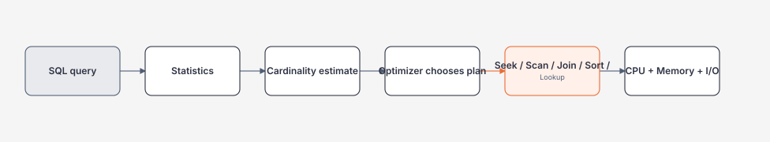
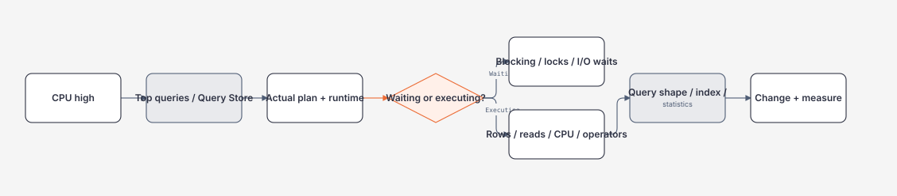

# Indexes, Execution Plans và SQL Operations

> [← SQL overview](README.md) · [SQL references](references.md)

## Hiểu trong 5 phút

Index không phải là "tăng tốc database" một cách chung chung.

Index là một **access path** giúp SQL Server tìm dữ liệu theo một shape cụ thể mà không phải đọc quá nhiều pages/rows.



Bạn không tối ưu query bằng cảm giác. Bạn cần evidence:

```text
Actual Execution Plan
STATISTICS IO
STATISTICS TIME
Query Store
wait/blocking information
```

---

# 1. Bắt đầu bằng query thật

```sql
SELECT TOP (50)
    Id,
    CustomerId,
    TotalAmount,
    CreatedAt
FROM dbo.Orders
WHERE TenantId = @tenantId
  AND Status = 'Paid'
ORDER BY CreatedAt DESC;
```

Giả sử chưa có index phù hợp. SQL Server có thể phải đọc nhiều dữ liệu rồi sort.

Thử index:

```sql
CREATE INDEX IX_Orders_Tenant_Status_CreatedAt
ON dbo.Orders(TenantId, Status, CreatedAt DESC)
INCLUDE(CustomerId, TotalAmount);
```

Sau đó đo lại.

```sql
SET STATISTICS IO ON;
SET STATISTICS TIME ON;
```

Mục tiêu là giải thích **vì sao** logical reads/CPU/elapsed thay đổi.

---

# 2. Clustered vs nonclustered: mental model

Không cần bắt đầu bằng câu định nghĩa học thuộc.

Hãy nghĩ:

```text
Clustered index
    ↓
leaf level chứa data rows

Nonclustered index
    ↓
leaf level chứa index key + locator / included data
```

Nếu nonclustered index không chứa đủ columns query cần, plan có thể phải quay lại base data bằng lookup.

---

# 3. Composite index: thứ tự column rất quan trọng

Index:

```sql
CREATE INDEX IX_Orders_Tenant_Status_CreatedAt
ON dbo.Orders(TenantId, Status, CreatedAt DESC);
```

Rất hợp với query:

```sql
WHERE TenantId = @tenantId
  AND Status = @status
ORDER BY CreatedAt DESC
```

Nhưng không có nghĩa nó tối ưu mọi query chỉ vì các columns đều nằm trong index.

Ví dụ:

```sql
WHERE CreatedAt >= @from
```

không tự động tận dụng access path giống query có predicate bắt đầu bằng `TenantId`.

Architect/backend engineer phải thiết kế index từ **workload**, không từ danh sách columns của table.

---

# 4. INCLUDE và covering query

Query:

```sql
SELECT
    Id,
    CustomerId,
    TotalAmount,
    CreatedAt
FROM dbo.Orders
WHERE TenantId = @tenantId
  AND Status = @status
ORDER BY CreatedAt DESC;
```

Index:

```sql
CREATE INDEX IX_Orders_Tenant_Status_CreatedAt
ON dbo.Orders(TenantId, Status, CreatedAt DESC)
INCLUDE(CustomerId, TotalAmount);
```

`INCLUDE` có thể giúp query lấy columns cần thiết ngay từ nonclustered index mà không phải lookup nhiều lần.

Nhưng thêm include columns cũng làm:

```text
index lớn hơn
write cost tăng
buffer usage tăng
backup/storage tăng
maintenance tăng
```

Không có "free index".

---

# 5. Seek vs Scan: đừng biến thành quy tắc tuyệt đối

Nhiều người học:

```text
Seek = tốt
Scan = xấu
```

Sai.

Nếu query cần 80% table, scan có thể hoàn toàn hợp lý.

Câu hỏi đúng:

```text
Plan đọc bao nhiêu dữ liệu so với dữ liệu thực sự cần?
Access path có phù hợp selectivity và query shape không?
```

---

# 6. Đọc Actual Execution Plan

Bắt đầu với các operator phổ biến:

| Operator | Ý nghĩa thực dụng |
| --- | --- |
| Index Seek | tìm range/key phù hợp trong index |
| Index/Table Scan | đọc một vùng lớn hoặc toàn access path |
| Key Lookup | quay về base row để lấy column thiếu |
| Nested Loops | thường tốt khi outer input nhỏ và inner lookup rẻ |
| Hash Match | thường phù hợp input lớn/equality join, cần memory |
| Merge Join | cần ordered inputs, có thể rất hiệu quả |
| Sort | cần CPU/memory; có thể spill nếu memory thiếu |

Điểm phải nhìn:

```text
Estimated Rows
Actual Rows
Number of Executions
Predicate
Seek Predicate
Warnings
Memory Grant
Spill
```

---

# 7. Estimated Rows vs Actual Rows

Ví dụ plan dự đoán:

```text
Estimated Rows = 10
Actual Rows    = 500,000
```

Đây là tín hiệu lớn.

Optimizer ra quyết định dựa trên estimate. Nếu estimate sai mạnh, join type, memory grant và access path có thể không phù hợp.

Bạn phải hỏi:

```text
Statistics stale?
Data skew?
Parameter sensitivity?
Predicate khó estimate?
Correlation giữa columns?
```

Đừng vội ép index/hint trước khi hiểu estimate.

---

# 8. Statistics là input của optimizer

Mental model:

```text
Data distribution
       ↓
Statistics
       ↓
Cardinality estimate
       ↓
Cost model
       ↓
Execution plan
```

Xem statistics:

```sql
DBCC SHOW_STATISTICS
(
    'dbo.Orders',
    'IX_Orders_Tenant_Status_CreatedAt'
);
```

Không cần trở thành DBA ngay, nhưng phải hiểu optimizer không "nhìn toàn bộ dữ liệu" mỗi lần compile query.

---

# 9. SARGability

Bad shape:

```sql
WHERE YEAR(CreatedAt) = 2026;
```

Hàm trên indexed column có thể làm access path khó sử dụng hiệu quả hơn.

Thường tốt hơn:

```sql
WHERE CreatedAt >= '2026-01-01'
  AND CreatedAt <  '2027-01-01';
```

Tư duy:

```text
đưa predicate về range/search shape mà index có thể hỗ trợ
```

Đừng chỉ nhớ từ `SARGable`; hãy nhìn plan và reads.

---

# 10. Key Lookup explosion

Một lookup không nhất thiết xấu.

Nhưng nếu outer input trả 200,000 rows rồi mỗi row lookup một lần, cost có thể tăng rất mạnh.

Plan clue:

```text
Nested Loops
    ↓
Key Lookup (executed 200,000 times)
```

Possible options:

- giảm rows sớm hơn;
- projection nhỏ hơn;
- INCLUDE phù hợp;
- đổi query shape;
- chấp nhận scan nếu query thực sự cần phần lớn data.

---

# 11. Sort và memory grant

Query:

```sql
SELECT ...
FROM dbo.Orders
WHERE TenantId = @tenantId
ORDER BY CreatedAt DESC;
```

Nếu index có ordering phù hợp, optimizer có thể tránh explicit Sort.

Nếu phải Sort tập lớn:

```text
memory grant không đủ
    ↓
spill to tempdb
    ↓
latency + I/O tăng
```

Đọc warnings trong actual plan thay vì chỉ nhìn operator cost percentage.

---

# 12. Parameter sensitivity

Một query parameterized có thể có workload rất khác:

```text
Tenant A: 20 rows
Tenant B: 20,000,000 rows
```

Một plan phù hợp A chưa chắc phù hợp B.

Dấu hiệu cần điều tra:

```text
query nhanh/chậm tùy parameter
same query_hash nhưng runtime rất khác
plan change hoặc cached-plan sensitivity
```

Không chữa bằng `OPTION (RECOMPILE)` mọi nơi. Mỗi workaround có CPU/plan-cache trade-off.

---

# 13. Query Store: flight recorder cho query behavior

Query Store giúp nhìn lịch sử thay vì chỉ xem "plan hiện tại".

Use cases:

```text
query regression sau deploy
plan thay đổi
runtime tăng đột ngột
compare plans theo thời gian
identify top resource consumers
```

Architectural value:

> Có production evidence để biết thay đổi app/schema/index ảnh hưởng database thế nào.

---

# 14. EF Core → SQL → Plan

LINQ:

```csharp
var query = db.Orders
    .AsNoTracking()
    .Where(x =>
        x.TenantId == tenantId &&
        x.Status == OrderStatus.Paid)
    .OrderByDescending(x => x.CreatedAt)
    .Select(x => new OrderSummary(
        x.Id,
        x.CustomerId,
        x.TotalAmount,
        x.CreatedAt))
    .Take(50);
```

In SQL để review:

```csharp
var sql = query.ToQueryString();
logger.LogDebug("Generated SQL:\n{Sql}", sql);
```

Đừng benchmark chỉ LINQ code. Query performance nằm ở cả translation + DB execution + materialization.

Xem guide riêng: [EF Core → SQL → Execution Plan](ef-core-query-shape-and-sql.md).

---

# 15. Index write cost

Mỗi insert/update/delete có thể phải maintain nhiều indexes.

Ví dụ table có:

```text
1 clustered index
12 nonclustered indexes
```

Một write có thể chạm nhiều structures hơn bạn tưởng.

Do đó index review luôn gồm hai câu:

```text
Query nào được lợi?
Write/storage/maintenance nào phải trả giá?
```

---

# 16. Production troubleshooting flow

Khi nhận ticket "database CPU cao":



Không optimize random query chỉ vì plan nhìn phức tạp.

---

# 17. Lab — trước và sau index

## Step 1 — tạo data đủ lớn

Tạo ít nhất vài trăm nghìn Orders trong local/test database.

## Step 2 — baseline

```sql
SET STATISTICS IO ON;
SET STATISTICS TIME ON;
```

Lưu:

```text
logical reads
CPU
elapsed
actual plan
```

## Step 3 — thêm index có giả thuyết rõ

```sql
CREATE INDEX IX_Orders_Tenant_Status_CreatedAt
ON dbo.Orders(TenantId, Status, CreatedAt DESC)
INCLUDE(CustomerId, TotalAmount);
```

## Step 4 — chạy lại cùng workload

## Step 5 — test write cost

Bulk insert/update trước và sau index.

## Step 6 — viết decision note

```text
Problem:
Evidence:
Index proposed:
Read benefit:
Write/storage cost:
Rollback:
Revisit trigger:
```

---

# 18. Exit criteria

Bạn hoàn thành chapter khi có thể:

- đọc một actual execution plan cơ bản;
- giải thích seek/scan/lookup/join/sort bằng workload;
- nhận ra estimate vs actual mismatch;
- dùng `STATISTICS IO/TIME` thay vì cảm giác;
- thiết kế composite/include index theo query shape;
- giải thích index write cost;
- dùng Query Store cho regression investigation;
- nối LINQ → SQL → plan → index → resource cost.

## Official English Sources

- [SQL Server indexes](https://learn.microsoft.com/en-us/sql/relational-databases/indexes/indexes?view=sql-server-ver17)
- [SQL Server index design guide](https://learn.microsoft.com/en-us/sql/relational-databases/sql-server-index-design-guide?view=sql-server-ver17)
- [Execution plans](https://learn.microsoft.com/en-us/sql/relational-databases/performance/execution-plans?view=sql-server-ver17)
- [Query processing architecture guide](https://learn.microsoft.com/en-us/sql/relational-databases/query-processing-architecture-guide?view=sql-server-ver17)
- [Statistics](https://learn.microsoft.com/en-us/sql/relational-databases/statistics/statistics?view=sql-server-ver17)
- [Query Store](https://learn.microsoft.com/en-us/sql/relational-databases/performance/monitoring-performance-by-using-the-query-store?view=sql-server-ver17)

## Verification metadata

- Verified: 2026-08-12.
- Focus: SQL Server access paths, plans, statistics and production evidence.
- Status: code-first deep rewrite.
