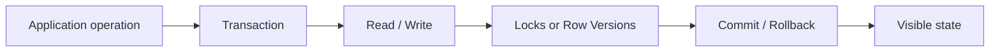

# Transactions, Isolation và Concurrency

> [← SQL overview](README.md) · [SQL references](references.md)

## Hiểu trong 5 phút

Transaction không phải chỉ là:

```sql
BEGIN TRANSACTION;
-- do something
COMMIT;
```

Mục tiêu thật sự là giữ **invariant** khi nhiều request chạy cùng lúc.

Ví dụ inventory:

```text
Available = 1

Request A muốn mua 1
Request B muốn mua 1
```

Nếu cả hai cùng đọc `Available = 1` rồi cùng update, hệ thống có thể oversell nếu transaction/concurrency rule sai.

Mental model:



---

# 1. ACID nhưng đừng học như định nghĩa thuộc lòng

| Property | Câu hỏi production |
| --- | --- |
| Atomicity | Nếu operation fail giữa chừng, có partial state không? |
| Consistency | Invariant nào database phải bảo vệ? |
| Isolation | Concurrent transaction nhìn thấy nhau tới mức nào? |
| Durability | Sau commit, failure nào vẫn có thể làm mất dữ liệu? |

Điểm quan trọng nhất với Backend Engineer thường là **Isolation + Concurrency**.

---

# 2. Transaction đơn giản

```sql
BEGIN TRANSACTION;

UPDATE dbo.Inventory
SET Available = Available - @quantity
WHERE ProductId = @productId
  AND Available >= @quantity;

IF @@ROWCOUNT = 0
BEGIN
    ROLLBACK;
    THROW 50001, 'Insufficient inventory', 1;
END;

INSERT INTO dbo.OrderItems(OrderId, ProductId, Quantity)
VALUES (@orderId, @productId, @quantity);

COMMIT;
```

Điểm đáng chú ý: điều kiện `Available >= @quantity` nằm ngay trong `UPDATE`.

Tránh pattern:

```text
SELECT Available
↓
check in application
↓
UPDATE later
```

vì khoảng thời gian giữa read và write tạo race condition.

---

# 3. Isolation levels: nghĩ bằng anomaly

Không cần bắt đầu bằng bảng định nghĩa dài. Hãy hỏi "transaction này được phép nhìn thấy điều gì?".

| Isolation | Mental model đơn giản | Trade-off |
| --- | --- | --- |
| READ UNCOMMITTED | có thể đọc dữ liệu chưa commit | ít blocking nhưng correctness thấp |
| READ COMMITTED | không đọc dirty data | default phổ biến, vẫn có non-repeatable behavior |
| REPEATABLE READ | rows đã đọc được giữ ổn định hơn | lock lâu hơn |
| SNAPSHOT | đọc row version thay vì chờ writer | giảm reader/writer blocking, thêm versioning cost |
| SERIALIZABLE | gần với chạy tuần tự cho protected range | correctness cao, concurrency thấp hơn |

Đừng chọn isolation level theo câu "cao hơn là an toàn hơn". Chọn theo invariant + workload.

---

# 4. Blocking experiment

Mở hai query window.

## Session A

```sql
BEGIN TRANSACTION;

UPDATE dbo.Orders
SET Status = 'Processing'
WHERE Id = 1001;

-- Đừng commit ngay.
WAITFOR DELAY '00:00:30';

COMMIT;
```

## Session B

Chạy trong lúc A đang giữ transaction:

```sql
UPDATE dbo.Orders
SET Status = 'Cancelled'
WHERE Id = 1001;
```

Bạn cần quan sát:

```text
Session B đang chờ gì?
Ai là blocker?
Transaction A giữ lock bao lâu?
Application timeout trước hay database lock được giải phóng trước?
```

Một HTTP timeout **không có nghĩa** database transaction đã rollback ngay lập tức. Cancellation/connection behavior phải được hiểu và test.

---

# 5. Deadlock experiment

Deadlock khác blocking: SQL Server phải chọn một transaction làm victim để phá vòng chờ.

## Session A

```sql
BEGIN TRANSACTION;

UPDATE dbo.Accounts
SET Balance = Balance - 10
WHERE Id = 1;

WAITFOR DELAY '00:00:05';

UPDATE dbo.Accounts
SET Balance = Balance + 10
WHERE Id = 2;

COMMIT;
```

## Session B

```sql
BEGIN TRANSACTION;

UPDATE dbo.Accounts
SET Balance = Balance - 20
WHERE Id = 2;

WAITFOR DELAY '00:00:05';

UPDATE dbo.Accounts
SET Balance = Balance + 20
WHERE Id = 1;

COMMIT;
```

Hai transaction acquire resource theo thứ tự ngược nhau:

```text
A owns row 1 → waits row 2
B owns row 2 → waits row 1
```

Cách giảm deadlock thường bắt đầu bằng:

1. access resources theo cùng thứ tự;
2. transaction ngắn;
3. index phù hợp để giảm số rows/pages bị touch;
4. retry **toàn transaction** khi failure được phân loại là transient/deadlock.

Không retry ngẫu nhiên từng statement trong transaction.

---

# 6. EF Core transaction

```csharp
await using var transaction =
    await db.Database.BeginTransactionAsync(cancellationToken);

try
{
    var affected = await db.Inventory
        .Where(x => x.ProductId == productId && x.Available >= quantity)
        .ExecuteUpdateAsync(
            setters => setters.SetProperty(
                x => x.Available,
                x => x.Available - quantity),
            cancellationToken);

    if (affected == 0)
    {
        throw new InvalidOperationException("Insufficient inventory");
    }

    db.OrderItems.Add(new OrderItem
    {
        OrderId = orderId,
        ProductId = productId,
        Quantity = quantity
    });

    await db.SaveChangesAsync(cancellationToken);
    await transaction.CommitAsync(cancellationToken);
}
catch
{
    await transaction.RollbackAsync(CancellationToken.None);
    throw;
}
```

Lưu ý:

- rollback cleanup thường không nên phụ thuộc request cancellation đã bị cancel;
- transaction boundary nên bám business operation;
- transaction quá dài làm tăng lock duration và contention.

---

# 7. Optimistic concurrency với `rowversion`

Schema:

```sql
ALTER TABLE dbo.Orders
ADD Version rowversion NOT NULL;
```

Entity:

```csharp
public sealed class Order
{
    public long Id { get; set; }
    public string Status { get; set; } = null!;

    public byte[] Version { get; set; } = null!;
}
```

Configuration:

```csharp
modelBuilder.Entity<Order>()
    .Property(x => x.Version)
    .IsRowVersion();
```

Khi hai actor sửa cùng một row dựa trên cùng version, một update có thể fail bằng `DbUpdateConcurrencyException` thay vì silently overwrite.

```csharp
try
{
    await db.SaveChangesAsync(cancellationToken);
}
catch (DbUpdateConcurrencyException)
{
    // Decide business behavior:
    // - reload and show conflict
    // - reject request
    // - merge fields only if semantics allow it
    throw;
}
```

Optimistic concurrency không có nghĩa "auto retry SaveChanges cho tới khi thành công". Nếu business decision phụ thuộc state cũ, retry phải re-evaluate business rule.

---

# 8. Pessimistic vs optimistic thinking

```text
Pessimistic
"Giữ resource để người khác không thay đổi trong lúc tôi làm"

Optimistic
"Cho phép concurrent work nhưng phát hiện conflict trước commit"
```

| Workload | Hướng suy nghĩ |
| --- | --- |
| conflict hiếm, read nhiều | optimistic thường phù hợp |
| conflict thường xuyên, critical invariant | có thể cần locking/atomic update mạnh hơn |
| long human workflow | không giữ DB transaction trong nhiều phút/giờ |

---

# 9. Transaction boundary không được vượt qua network tùy tiện

Bad idea:

```text
BEGIN SQL TRANSACTION
    ↓
call payment API
    ↓
wait 5 seconds
    ↓
call email API
    ↓
COMMIT SQL
```

Bạn đang giữ database resources trong lúc phụ thuộc network không đáng tin cậy.

Tư duy tốt hơn:

```text
Local transaction
  ├─ business state
  └─ outbox message
        ↓ commit
Async publisher
        ↓
external system
```

Đây là cầu nối tới Module 17 Distributed Systems.

---

# 10. Retry boundary

Retry an toàn cần trả lời:

```text
Operation có idempotent không?
Transaction có được bắt đầu lại từ đầu không?
Business rule có cần đọc lại state không?
Failure có thật sự transient không?
```

Pseudo-code:

```csharp
for (var attempt = 1; attempt <= maxAttempts; attempt++)
{
    try
    {
        await ExecuteBusinessTransactionAsync(cancellationToken);
        break;
    }
    catch (SqlException ex) when (IsTransient(ex) && attempt < maxAttempts)
    {
        await Task.Delay(Backoff(attempt), cancellationToken);
    }
}
```

Không viết `catch { retry; }` cho mọi database error.

---

# 11. Common mistakes

- mở transaction quá sớm rồi làm nhiều CPU/network work;
- query không có index khiến transaction lock nhiều rows/pages hơn dự kiến;
- retry side effect không idempotent;
- tưởng HTTP timeout = SQL rollback;
- xử lý concurrency conflict bằng last-write-wins mà không có business decision;
- dùng isolation cao nhất cho mọi endpoint;
- giữ transaction qua user interaction;
- không thu deadlock graph / blocking evidence.

---

# 12. Production troubleshooting checklist

Khi endpoint "database bị chậm":

```text
1. Request latency tăng ở trace nào?
2. SQL command nào đang chậm?
3. Query execution chậm hay đang WAIT?
4. Nếu WAIT: blocker/session/resource nào?
5. Transaction nào đang mở lâu?
6. Plan/index có làm touch quá nhiều data không?
7. Có deployment/query-shape change gần đây không?
```

Đừng tối ưu plan nếu nguyên nhân thật là blocking.

---

# 13. Hands-on lab

Hoàn thành cả bốn:

### Lab A — Blocking
Reproduce hai sessions như trên và ghi thời gian chờ.

### Lab B — Deadlock
Reproduce reversed update order, lưu error/deadlock evidence.

### Lab C — Optimistic conflict
Viết integration test với hai `DbContext` cùng update một `rowversion` entity.

### Lab D — Atomic inventory
Chạy nhiều task đồng thời mua cùng một sản phẩm và verify:

```text
Available không âm
successful orders <= initial inventory
```

Ví dụ test shape:

```csharp
var tasks = Enumerable.Range(0, 20)
    .Select(_ => TryReserveAsync(productId, 1));

var results = await Task.WhenAll(tasks);

var inventory = await LoadInventoryAsync(productId);

Assert.True(inventory.Available >= 0);
Assert.Equal(initialStock, results.Count(x => x) + inventory.Available);
```

---

# 14. Exit criteria

Bạn hoàn thành chapter khi có thể:

- giải thích blocking vs deadlock;
- mô tả anomaly mà isolation level đang ngăn;
- thiết kế atomic update tránh check-then-act race;
- xử lý optimistic concurrency theo business rule;
- xác định transaction + retry boundary;
- chứng minh behavior bằng concurrency test thay vì chỉ nói lý thuyết.

## Official English Sources

- [Transaction locking and row versioning guide](https://learn.microsoft.com/en-us/sql/relational-databases/sql-server-transaction-locking-and-row-versioning-guide?view=sql-server-ver17)
- [SET TRANSACTION ISOLATION LEVEL](https://learn.microsoft.com/en-us/sql/t-sql/statements/set-transaction-isolation-level-transact-sql?view=sql-server-ver17)
- [EF Core concurrency conflicts](https://learn.microsoft.com/en-us/ef/core/saving/concurrency)
- [EF Core transactions](https://learn.microsoft.com/en-us/ef/core/saving/transactions)

## Verification metadata

- Verified: 2026-08-12.
- Focus: SQL Server transaction/concurrency + EF Core boundary.
- Status: code-first deep rewrite.
