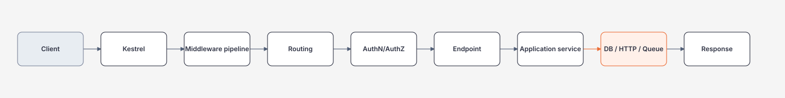

# Module 07 — ASP.NET Core

> [← Module 06 API Design](../06-api-design/README.md) · [Roadmap](../00-roadmap/README.md)

Mục tiêu của module này không phải nhớ `Program.cs`. Bạn phải hiểu **request đi qua đâu, middleware nào sở hữu responsibility nào, timeout/cancellation/auth/validation/telemetry được đặt ở đâu và process phản ứng thế nào khi dependency chậm hoặc deployment thay đổi**.

## Hiểu trong 5 phút



Middleware order là behavior, không chỉ style.

Ví dụ tối giản:

```csharp
var builder = WebApplication.CreateBuilder(args);

builder.Services.AddProblemDetails();
builder.Services.AddHealthChecks();
builder.Services.AddAuthentication().AddJwtBearer();
builder.Services.AddAuthorization();

var app = builder.Build();

app.UseExceptionHandler();
app.UseHttpsRedirection();
app.UseAuthentication();
app.UseAuthorization();

app.MapGet("/orders/{id:long}", async (
    long id,
    IOrderQuery query,
    CancellationToken cancellationToken) =>
{
    var order = await query.GetAsync(id, cancellationToken);

    return order is null
        ? Results.NotFound()
        : Results.Ok(order);
});

app.MapHealthChecks("/health/live");

app.Run();
```

Review không chỉ hỏi code compile chưa. Hỏi:

```text
Exception map ra contract nào?
Auth chạy trước endpoint chưa?
Cancellation đi xuống dependency chưa?
Endpoint có bound response/query không?
Health check đang kiểm tra process hay dependency?
Log/trace có correlation không?
```

---

# 1. Cấu trúc học

| Bước | Guide | Bạn phải làm được |
| --- | --- | --- |
| 1 | [Pipeline, Hosting và Configuration](pipeline-hosting-and-configuration.md) | hiểu Kestrel, middleware order, DI lifetime, Options và graceful shutdown |
| 2 | [Resilience, Security và Middleware](resilience-security-and-middleware.md) | rate limit, auth, timeout/retry boundary, ProblemDetails |
| 3 | [Deployment, Observability và Operations](deployment-observability-and-operations.md) | health/readiness, structured telemetry, rollout/rollback, incident flow |

---

# 2. Request lifecycle bằng code

Middleware đo latency:

```csharp
app.Use(async (context, next) =>
{
    var started = Stopwatch.GetTimestamp();

    try
    {
        await next(context);
    }
    finally
    {
        var elapsed = Stopwatch.GetElapsedTime(started);

        context.RequestServices
            .GetRequiredService<ILoggerFactory>()
            .CreateLogger("RequestTiming")
            .LogInformation(
                "{Method} {Path} -> {StatusCode} in {ElapsedMs}ms",
                context.Request.Method,
                context.Request.Path,
                context.Response.StatusCode,
                elapsed.TotalMilliseconds);
    }
});
```

Bạn nên nhìn pipeline như stack:

```text
middleware A before
  middleware B before
    endpoint
  middleware B after
middleware A after
```

Do đó order thay đổi behavior của error handling, auth, CORS, caching, rate limiting và telemetry.

---

# 3. DI lifetime phải gắn ownership

```csharp
builder.Services.AddSingleton<SystemClock>();
builder.Services.AddScoped<OrderService>();
builder.Services.AddTransient<OrderValidator>();
```

Mental model:

| Lifetime | Scope | Risk thường gặp |
| --- | --- | --- |
| Singleton | toàn process | giữ mutable/shared state, capture scoped service |
| Scoped | request/scope | dùng ngoài scope, background work giữ reference quá lâu |
| Transient | mỗi resolve | tạo quá nhiều object/resource nếu service nặng |

Không chọn lifetime theo thói quen.

---

# 4. Configuration phải fail fast

```csharp
builder.Services
    .AddOptions<PaymentOptions>()
    .BindConfiguration("Payment")
    .Validate(x => Uri.TryCreate(x.BaseUrl, UriKind.Absolute, out _),
        "Payment:BaseUrl must be an absolute URI")
    .Validate(x => x.TimeoutSeconds is > 0 and <= 30,
        "Payment:TimeoutSeconds must be between 1 and 30")
    .ValidateOnStart();
```

Config invalid nên làm deployment fail sớm thay vì nhận traffic rồi mới throw.

---

# 5. Cancellation phải đi xuyên stack

Endpoint:

```csharp
app.MapGet("/customers/{id:long}", async (
    long id,
    CustomerService service,
    CancellationToken cancellationToken) =>
{
    var result = await service.GetAsync(id, cancellationToken);
    return result is null ? Results.NotFound() : Results.Ok(result);
});
```

Service:

```csharp
public Task<CustomerDto?> GetAsync(
    long id,
    CancellationToken cancellationToken)
{
    return db.Customers
        .AsNoTracking()
        .Where(x => x.Id == id)
        .Select(x => new CustomerDto(x.Id, x.Name))
        .SingleOrDefaultAsync(cancellationToken);
}
```

Bad:

```csharp
await service.GetAsync(id, CancellationToken.None);
```

vì client disconnect/deadline không còn propagate.

---

# 6. Error contract ổn định

Không trả raw exception:

```json
{
  "exception": "SqlException...",
  "stackTrace": "..."
}
```

Dùng error contract:

```csharp
builder.Services.AddProblemDetails();
app.UseExceptionHandler();
```

Business validation nên map rõ:

```csharp
return Results.ValidationProblem(new Dictionary<string, string[]>
{
    ["quantity"] = ["Quantity must be greater than zero."]
});
```

Security rule: internal exception detail không trở thành public API contract.

---

# 7. `HttpClient` production path

Không tạo client mới tùy tiện trong từng request:

```csharp
builder.Services.AddHttpClient<ExchangeRateClient>(client =>
{
    client.BaseAddress = new Uri(builder.Configuration["Rates:BaseUrl"]!);
    client.Timeout = TimeSpan.FromSeconds(5);
});
```

Client:

```csharp
public sealed class ExchangeRateClient(HttpClient httpClient)
{
    public async Task<RateDto?> GetAsync(
        string currency,
        CancellationToken cancellationToken)
    {
        using var response = await httpClient.GetAsync(
            $"rates/{currency}",
            cancellationToken);

        response.EnsureSuccessStatusCode();

        return await response.Content.ReadFromJsonAsync<RateDto>(
            cancellationToken: cancellationToken);
    }
}
```

Timeout/retry phải dựa trên operation semantics. GET read-only có thể khác POST tạo side effect.

---

# 8. Health không đồng nghĩa readiness

Process sống:

```csharp
app.MapHealthChecks("/health/live", new HealthCheckOptions
{
    Predicate = _ => false
});
```

Readiness có thể check dependency quan trọng:

```csharp
builder.Services
    .AddHealthChecks()
    .AddSqlServer(connectionString, tags: ["ready"]);
```

Nhưng nếu every instance readiness check tạo tải nặng lên DB, health system lại trở thành source of load.

---

# 9. Failure experiments

## Experiment A — middleware order

Đặt authorization sai vị trí, viết integration test và quan sát endpoint behavior. Sau đó sửa pipeline.

## Experiment B — cancellation

Tạo endpoint gọi dependency delay 10 giây. Client cancel sau 500ms. Verify dependency nhận cancellation.

```csharp
app.MapGet("/slow", async (CancellationToken cancellationToken) =>
{
    await Task.Delay(TimeSpan.FromSeconds(10), cancellationToken);
    return Results.Ok();
});
```

## Experiment C — invalid configuration

Set `Payment:TimeoutSeconds=0`, verify process fail startup khi `ValidateOnStart()`.

## Experiment D — downstream timeout

Mock dependency chậm, verify endpoint không giữ request vô hạn và error được classify đúng.

---

# 10. Checklist khi review ASP.NET Core PR

```text
[ ] Endpoint contract rõ?
[ ] Input/query/payload có bound?
[ ] CancellationToken propagated?
[ ] DI lifetime đúng ownership?
[ ] Config validate on startup?
[ ] Error map thành stable contract?
[ ] AuthN/AuthZ ở đúng boundary?
[ ] HttpClient có timeout/resilience phù hợp semantics?
[ ] Health/readiness không tạo blast radius?
[ ] Structured logs/traces đủ điều tra?
[ ] Deployment có graceful shutdown/rollback path?
```

---

# 11. Exit criteria

Bạn hoàn thành module khi có thể:

- vẽ request pipeline và giải thích middleware order;
- giải thích DI lifetime bằng ownership thay vì thuộc lòng;
- propagate cancellation tới SQL/HTTP;
- dùng Options validation fail-fast;
- thiết kế ProblemDetails/error contract;
- phân biệt liveness/readiness;
- reproduce downstream slow/cancel/config failure;
- đọc trace/log để tìm latency boundary;
- giải thích vì sao một middleware/resilience feature nên hoặc không nên tồn tại.

## Official references

Xem [references.md](references.md). Baseline hiện tại của repository là ASP.NET Core 10; version-sensitive API phải được re-check trước production.

## Verification metadata

- Verified: 2026-08-12.
- Status: code-first deep rewrite in progress.
- Target: ASP.NET Core 10 / .NET 10.
