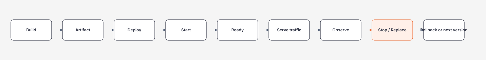

# Deployment, Observability và ASP.NET Operations

> [← ASP.NET Core overview](README.md) · [References](references.md)

## Hiểu trong 5 phút

Một API production không kết thúc ở `dotnet publish`.

Bạn phải vận hành được lifecycle:



Ba câu hỏi phải trả lời được:

```text
1. Instance này có sống không?        → liveness
2. Instance này có nhận traffic được? → readiness
3. Nếu request lỗi/chậm, evidence ở đâu? → logs + metrics + traces
```

---

# 1. Liveness vs readiness

Liveness không nên biến thành deep dependency test.

```csharp
builder.Services.AddHealthChecks();

app.MapHealthChecks("/health/live", new HealthCheckOptions
{
    Predicate = _ => false
});
```

Readiness có thể gồm dependency bắt buộc:

```csharp
builder.Services
    .AddHealthChecks()
    .AddSqlServer(
        connectionString,
        name: "sql",
        tags: ["ready"]);
```

```csharp
app.MapHealthChecks("/health/ready", new HealthCheckOptions
{
    Predicate = check => check.Tags.Contains("ready")
});
```

Mental model:

```text
liveness fails
→ platform có thể restart instance

readiness fails
→ instance nên rời traffic rotation
```

Nếu dependency chung toàn hệ thống down, làm mọi pod fail liveness có thể tạo restart storm mà không chữa được root cause.

---

# 2. Health check phải cheap và bounded

Bad:

```text
/health/ready
  ↓
query 10 tables
  ↓
call 3 external APIs
  ↓
run expensive report
```

Nếu 100 instances check mỗi vài giây, health endpoint tự tạo load.

Health check nên trả lời câu hỏi vận hành hẹp:

```text
"Instance này có đủ điều kiện nhận traffic cho capability này không?"
```

---

# 3. Structured logging

Bad:

```csharp
logger.LogInformation(
    "Order " + orderId + " processed for tenant " + tenantId);
```

Better:

```csharp
logger.LogInformation(
    "Order {OrderId} processed for tenant {TenantId}",
    orderId,
    tenantId);
```

Structured fields cho phép query:

```text
TenantId = 42
OrderId = 1001
StatusCode >= 500
DeploymentVersion = abc123
```

Không log secret/token/full sensitive payload chỉ để debug thuận tiện.

---

# 4. Source-generated logging cho hot path

```csharp
internal static partial class Log
{
    [LoggerMessage(
        EventId = 1001,
        Level = LogLevel.Information,
        Message = "Processed order {OrderId} in {ElapsedMs} ms")]
    public static partial void OrderProcessed(
        this ILogger logger,
        long orderId,
        double elapsedMs);
}
```

Use:

```csharp
logger.OrderProcessed(orderId, elapsed.TotalMilliseconds);
```

Đừng tối ưu logging API trước khi đo, nhưng hot path có thể hưởng lợi từ generated logging.

---

# 5. OpenTelemetry traces + metrics

Packages điển hình cho demo:

```bash
dotnet add package OpenTelemetry.Extensions.Hosting
dotnet add package OpenTelemetry.Instrumentation.AspNetCore
dotnet add package OpenTelemetry.Exporter.Console
```

Registration:

```csharp
using OpenTelemetry.Metrics;
using OpenTelemetry.Resources;
using OpenTelemetry.Trace;

builder.Services
    .AddOpenTelemetry()
    .ConfigureResource(resource => resource
        .AddService(builder.Environment.ApplicationName))
    .WithTracing(tracing => tracing
        .AddAspNetCoreInstrumentation()
        .AddConsoleExporter())
    .WithMetrics(metrics => metrics
        .AddAspNetCoreInstrumentation()
        .AddConsoleExporter());
```

Console exporter phù hợp local/demo; production thường export qua OTLP/collector/backend phù hợp.

---

# 6. Custom span cho business operation

```csharp
private static readonly ActivitySource ActivitySource =
    new("OrderService");

public async Task ProcessAsync(
    long orderId,
    CancellationToken cancellationToken)
{
    using var activity = ActivitySource.StartActivity("order.process");

    activity?.SetTag("order.id", orderId);

    await LoadAsync(orderId, cancellationToken);
    await ValidateAsync(orderId, cancellationToken);
    await SaveAsync(orderId, cancellationToken);
}
```

Nhưng tag cardinality phải được xem xét. `order.id` trên trace có thể ổn hơn đưa vào metric label cardinality cao.

---

# 7. Custom metrics

```csharp
private static readonly Meter Meter =
    new("OrderService");

private static readonly Counter<long> OrdersProcessed =
    Meter.CreateCounter<long>("orders.processed");

private static readonly Histogram<double> ProcessingDuration =
    Meter.CreateHistogram<double>(
        "orders.processing.duration",
        unit: "ms");
```

Use:

```csharp
var started = Stopwatch.GetTimestamp();

try
{
    await ProcessCoreAsync(orderId, cancellationToken);
    OrdersProcessed.Add(1, new("result", "success"));
}
catch
{
    OrdersProcessed.Add(1, new("result", "failure"));
    throw;
}
finally
{
    ProcessingDuration.Record(
        Stopwatch.GetElapsedTime(started).TotalMilliseconds);
}
```

Good metric dimensions:

```text
result=success|failure
operation=process_order
```

Dangerous high-cardinality dimensions:

```text
order_id
email
full_url_with_query
exception_message
```

---

# 8. RED method cho API

Theo endpoint/service:

```text
Rate     → requests/sec
Errors   → error rate
Duration → latency distribution
```

Ví dụ SLO:

```text
99.9% successful requests / 30 days
P95 < 300 ms for GET /orders/{id}
```

Resource metric như CPU chỉ là supporting signal. User-visible SLO mới là outcome.

---

# 9. Trace một request end-to-end

Bạn muốn nhìn:

```text
HTTP GET /orders/42            420 ms
  ├─ auth                       5 ms
  ├─ SQL SELECT Order         350 ms
  └─ serialize                  8 ms
```

Nếu SQL span là 350ms, investigation chuyển sang DB.

Nếu request mất 420ms nhưng child spans chỉ 100ms, có gap trong instrumentation hoặc queue/CPU wait cần điều tra.

---

# 10. Deployment version phải có trong telemetry

Mỗi artifact/deploy nên có identity:

```text
git SHA
image digest
application version
environment
region / cluster
```

Log scope example:

```csharp
using var scope = logger.BeginScope(new Dictionary<string, object>
{
    ["DeploymentVersion"] = deploymentVersion
});
```

Khi incident bắt đầu ngay sau deploy, query theo version giúp thu hẹp blast radius.

---

# 11. Graceful shutdown

Worker:

```csharp
public sealed class CleanupWorker(
    ILogger<CleanupWorker> logger) : BackgroundService
{
    protected override async Task ExecuteAsync(
        CancellationToken stoppingToken)
    {
        while (!stoppingToken.IsCancellationRequested)
        {
            try
            {
                await RunOnceAsync(stoppingToken);
            }
            catch (OperationCanceledException)
                when (stoppingToken.IsCancellationRequested)
            {
                break;
            }
            catch (Exception ex)
            {
                logger.LogError(ex, "Cleanup iteration failed");
            }
        }
    }
}
```

Shutdown path cần biết:

```text
stop accepting new work
cancel wait operations
finish/rollback current transaction
flush critical telemetry when possible
exit before platform hard kill
```

---

# 12. Readiness during startup

Bad:

```text
process starts
↓
ready immediately
↓
receives traffic
↓
cache/schema/config initialization chưa xong
```

Nếu app có initialization thực sự bắt buộc, readiness chỉ nên healthy sau khi invariant đạt.

Nhưng tránh biến startup thành hàng phút synchronous boot nếu work có thể lazy/background an toàn.

---

# 13. Deployment strategy

## Rolling

```text
v1 v1 v1
↓ replace gradually
v1 v1 v2
v1 v2 v2
v2 v2 v2
```

Requires compatibility giữa old/new versions trong rollout window.

## Blue/Green

```text
Blue v1  ← traffic
Green v2 ← verify

switch traffic
```

Rollback nhanh hơn nhưng cần duplicate capacity/topology.

## Canary

```text
95% → v1
 5% → v2
```

Cần telemetry đủ tốt để so error/latency/business metrics.

---

# 14. Backward-compatible database deployment

Application deploy và DB migration dễ tạo coupling.

Safer evolution thường theo expand/contract:

```text
1. Add new nullable/backward-compatible column
2. Deploy code đọc/ghi compatible cả old/new
3. Backfill
4. Switch reads
5. Remove old path later
```

Không phải migration nào cũng cần quy trình này, nhưng breaking schema change trên zero-downtime system phải nghĩ rollout window.

---

# 15. Failure experiment — readiness

1. Start API + SQL dependency.
2. Verify `/health/ready` = healthy.
3. Stop SQL.
4. Observe readiness change.
5. Verify liveness vẫn phản ánh process sống.
6. Start SQL lại.
7. Observe recovery.

Evidence:

```text
status transition time
traffic behavior
log/trace evidence
load created by health checks
```

---

# 16. Failure experiment — deployment regression

Deploy v2 có artificial latency:

```csharp
if (deploymentVersion == "v2")
{
    await Task.Delay(300, cancellationToken);
}
```

Canary 5% traffic.

Compare:

```text
v1 P95
v2 P95
v1 error rate
v2 error rate
business success
```

Then rollback v2.

Goal: practice **detect → decide → rollback**, không chỉ deploy.

---

# 17. Incident checklist

Khi API latency tăng:

```text
1. SLO/alert affected endpoint nào?
2. Deployment/version nào?
3. Rate/errors/duration thay đổi từ khi nào?
4. Trace bottleneck ở app, SQL, HTTP hay queue?
5. Có resource saturation không?
6. Dependency có incident không?
7. Có rollback an toàn không?
8. Evidence nào phải giữ cho postmortem?
```

---

# 18. Exit criteria

Bạn hoàn thành chapter khi có thể:

- phân biệt liveness/readiness;
- tạo health checks không gây overload;
- cấu hình OpenTelemetry traces + metrics;
- thêm business span/metric có cardinality hợp lý;
- correlate request với deployment version;
- giải thích graceful shutdown;
- chọn rolling/blue-green/canary bằng trade-off;
- thiết kế rollback và schema compatibility window;
- điều tra một latency regression bằng logs/metrics/traces.

## Official English Sources

- [ASP.NET Core health checks](https://learn.microsoft.com/en-us/aspnet/core/host-and-deploy/health-checks?view=aspnetcore-10.0)
- [OpenTelemetry .NET traces for ASP.NET Core](https://opentelemetry.io/docs/languages/dotnet/traces/getting-started-aspnetcore/)
- [OpenTelemetry .NET metrics for ASP.NET Core](https://opentelemetry.io/docs/languages/dotnet/metrics/getting-started-aspnetcore/)
- [.NET Generic Host](https://learn.microsoft.com/en-us/dotnet/core/extensions/generic-host)

## Verification metadata

- Verified: 2026-08-12.
- OpenTelemetry registration shape verified against current OpenTelemetry .NET documentation.
- Target: ASP.NET Core 10 / .NET 10.
- Status: code-first deep rewrite.
