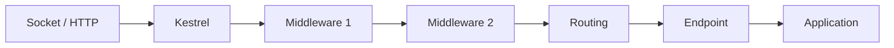

# Pipeline, Hosting và Configuration

> [← ASP.NET Core overview](README.md) · [References](references.md)

## Hiểu trong 5 phút

Một request không nhảy thẳng vào controller/endpoint.



Điều quan trọng:

- Kestrel sở hữu HTTP connection/request processing;
- middleware chạy theo **order**;
- DI scope thường gắn request scope;
- configuration được compose từ nhiều providers;
- process có lifecycle startup → running → stopping;
- cancellation/graceful shutdown phải đi tới công việc đang chạy.

---

# 1. Minimal app nhưng có production boundaries

```csharp
var builder = WebApplication.CreateBuilder(args);

builder.Services.AddProblemDetails();
builder.Services.AddHealthChecks();

builder.Services
    .AddOptions<AppOptions>()
    .BindConfiguration("App")
    .ValidateDataAnnotations()
    .ValidateOnStart();

builder.Services.AddScoped<OrderService>();

var app = builder.Build();

app.UseExceptionHandler();

app.MapGet("/orders/{id:long}", async (
    long id,
    OrderService service,
    CancellationToken cancellationToken) =>
{
    var order = await service.GetAsync(id, cancellationToken);

    return order is null
        ? Results.NotFound()
        : Results.Ok(order);
});

app.MapHealthChecks("/health/live");

app.Run();
```

Review từng dòng bằng responsibility:

```text
AddProblemDetails    → error contract support
ValidateOnStart      → fail-fast config
AddScoped            → request/service ownership
UseExceptionHandler  → global exception boundary
CancellationToken    → request abort propagation
Health endpoint      → operator signal
```

---

# 2. Middleware execution order

Custom middleware:

```csharp
app.Use(async (context, next) =>
{
    Console.WriteLine("A before");
    await next(context);
    Console.WriteLine("A after");
});

app.Use(async (context, next) =>
{
    Console.WriteLine("B before");
    await next(context);
    Console.WriteLine("B after");
});

app.MapGet("/", () => "OK");
```

Output:

```text
A before
B before
B after
A after
```

Mental model:

```text
A ┌──────────────────────────┐
  │ B ┌────────────────────┐ │
  │   │ Endpoint           │ │
  │ B └────────────────────┘ │
A └──────────────────────────┘
```

Do đó exception middleware thường cần ở ngoài các component mà nó muốn catch.

---

# 3. Short-circuit middleware

Middleware có thể không gọi `next`:

```csharp
app.Use(async (context, next) =>
{
    if (context.Request.Headers["X-Maintenance-Token"] == "block")
    {
        context.Response.StatusCode = StatusCodes.Status503ServiceUnavailable;
        await context.Response.WriteAsync("Maintenance");
        return;
    }

    await next(context);
});
```

Production implications:

- middleware trước endpoint có thể reject request sớm;
- code sau `await next()` vẫn chạy khi downstream hoàn tất;
- body/headers có thể đã bắt đầu gửi, nên late error handling có giới hạn.

---

# 4. Middleware class thay vì inline delegate

```csharp
public sealed class CorrelationMiddleware(RequestDelegate next)
{
    public async Task InvokeAsync(HttpContext context)
    {
        var correlationId =
            context.Request.Headers.TryGetValue("X-Correlation-Id", out var value)
                ? value.ToString()
                : Guid.NewGuid().ToString("N");

        context.Response.Headers["X-Correlation-Id"] = correlationId;

        using var scope = context.RequestServices
            .GetRequiredService<ILogger<CorrelationMiddleware>>()
            .BeginScope(new Dictionary<string, object>
            {
                ["CorrelationId"] = correlationId
            });

        await next(context);
    }
}
```

Register:

```csharp
app.UseMiddleware<CorrelationMiddleware>();
```

Không dùng correlation ID do client gửi làm authorization identity.

---

# 5. Request scoped dependency

```csharp
public sealed class OrderService(AppDbContext db)
{
    public async Task<OrderDto?> GetAsync(
        long id,
        CancellationToken cancellationToken)
    {
        return await db.Orders
            .AsNoTracking()
            .Where(x => x.Id == id)
            .Select(x => new OrderDto(
                x.Id,
                x.Status,
                x.TotalAmount))
            .SingleOrDefaultAsync(cancellationToken);
    }
}
```

Registration:

```csharp
builder.Services.AddDbContext<AppDbContext>(options =>
    options.UseSqlServer(connectionString));

builder.Services.AddScoped<OrderService>();
```

`DbContext` scoped và `OrderService` scoped cùng request là ownership dễ hiểu.

---

# 6. Captive dependency bug

Bad:

```csharp
builder.Services.AddScoped<RequestContext>();
builder.Services.AddSingleton<OrderCache>();

public sealed class OrderCache(RequestContext requestContext)
{
}
```

Singleton capture scoped dependency tạo lifetime mismatch.

Question khi chọn lifetime:

```text
Object này sở hữu state gì?
State sống bao lâu?
Có thread-safe không?
Có giữ connection/resource không?
Có phụ thuộc request/tenant identity không?
```

---

# 7. Configuration composition

Bạn có thể nhận config từ:

```text
appsettings.json
appsettings.{Environment}.json
environment variables
command line
secret provider / managed configuration
```

Không nên phụ thuộc vào source cụ thể trong business code.

```csharp
public sealed class PaymentOptions
{
    public const string SectionName = "Payment";

    [Required]
    public string BaseUrl { get; init; } = string.Empty;

    [Range(1, 30)]
    public int TimeoutSeconds { get; init; } = 5;
}
```

Bind + validate:

```csharp
builder.Services
    .AddOptions<PaymentOptions>()
    .BindConfiguration(PaymentOptions.SectionName)
    .ValidateDataAnnotations()
    .ValidateOnStart();
```

Consumer:

```csharp
public sealed class PaymentClient(
    IOptions<PaymentOptions> options,
    HttpClient httpClient)
{
    private readonly PaymentOptions _options = options.Value;
}
```

---

# 8. `IOptions`, `IOptionsSnapshot`, `IOptionsMonitor`

Mental model:

```text
IOptions<T>
  simple stable value

IOptionsSnapshot<T>
  scoped snapshot

IOptionsMonitor<T>
  observe changes / current value
```

Đừng dùng dynamic config reload cho một setting nếu application invariant yêu cầu restart để thay đổi an toàn.

Ví dụ connection provider, cryptographic setting hoặc schema behavior có thể cần controlled rollout hơn là hot reload.

---

# 9. Environment không phải security boundary

```csharp
if (app.Environment.IsDevelopment())
{
    app.MapOpenApi();
}
```

Environment giúp chọn behavior/configuration, nhưng production security không được dựa vào giả định "environment variable luôn đúng".

Critical endpoints vẫn cần authorization/network policy thích hợp.

---

# 10. Request cancellation

`HttpContext.RequestAborted` được bind thành `CancellationToken` trong Minimal API:

```csharp
app.MapGet("/report", async (
    ReportService service,
    CancellationToken cancellationToken) =>
{
    var report = await service.BuildAsync(cancellationToken);
    return Results.Ok(report);
});
```

Service propagate:

```csharp
public async Task<ReportDto> BuildAsync(
    CancellationToken cancellationToken)
{
    var rows = await db.Orders
        .AsNoTracking()
        .Take(10_000)
        .ToListAsync(cancellationToken);

    return Map(rows);
}
```

Bad:

```csharp
await db.Orders.ToListAsync(CancellationToken.None);
```

---

# 11. Background task không được capture request scope vô chủ

Bad:

```csharp
app.MapPost("/start", (OrderService service) =>
{
    _ = Task.Run(async () =>
    {
        await service.ProcessAsync(CancellationToken.None);
    });

    return Results.Accepted();
});
```

Sau request, scoped service có thể bị dispose; task cũng không có owner/retry/telemetry.

Tốt hơn: queue work cho `BackgroundService` hoặc external broker.

```csharp
public sealed record WorkItem(long OrderId);
```

```csharp
app.MapPost("/orders/{id:long}/process", async (
    long id,
    Channel<WorkItem> channel,
    CancellationToken cancellationToken) =>
{
    await channel.Writer.WriteAsync(new WorkItem(id), cancellationToken);
    return Results.Accepted();
});
```

Consumer có scope riêng:

```csharp
public sealed class OrderWorker(
    Channel<WorkItem> channel,
    IServiceScopeFactory scopeFactory,
    ILogger<OrderWorker> logger) : BackgroundService
{
    protected override async Task ExecuteAsync(CancellationToken stoppingToken)
    {
        await foreach (var item in channel.Reader.ReadAllAsync(stoppingToken))
        {
            await using var scope = scopeFactory.CreateAsyncScope();
            var service = scope.ServiceProvider.GetRequiredService<OrderService>();

            try
            {
                await service.ProcessAsync(item.OrderId, stoppingToken);
            }
            catch (Exception ex)
            {
                logger.LogError(ex, "Failed to process order {OrderId}", item.OrderId);
            }
        }
    }
}
```

In-memory Channel mất data khi process crash; nếu durability requirement cao hơn, dùng broker/persistent queue.

---

# 12. Graceful shutdown

Khi process nhận stop signal:

```text
Host stopping
    ↓
CancellationToken của BackgroundService được cancel
    ↓
Server ngừng nhận/new traffic theo platform behavior
    ↓
Inflight work có khoảng thời gian để hoàn tất
    ↓
Process exits
```

Worker phải honor cancellation:

```csharp
protected override async Task ExecuteAsync(CancellationToken stoppingToken)
{
    while (!stoppingToken.IsCancellationRequested)
    {
        await DoWorkAsync(stoppingToken);
    }
}
```

Đừng swallow `OperationCanceledException` rồi tiếp tục loop vô hạn khi host đang shutdown.

---

# 13. Kestrel limit và request bounds

Application nên có bounds ở nhiều lớp:

```text
server/proxy body limits
endpoint validation
pagination/page size
streaming/backpressure
DB query bounds
external dependency deadlines
```

Ví dụ endpoint upload không nên đọc file vô hạn vào memory:

```csharp
app.MapPost("/upload", async (
    IFormFile file,
    CancellationToken cancellationToken) =>
{
    const long maxBytes = 10 * 1024 * 1024;

    if (file.Length > maxBytes)
    {
        return Results.BadRequest("File too large");
    }

    await using var stream = file.OpenReadStream(maxBytes);
    await ProcessAsync(stream, cancellationToken);

    return Results.NoContent();
});
```

---

# 14. Failure experiments

## A — Middleware order

Viết integration test kiểm tra unauthenticated request không vào protected endpoint.

## B — Startup validation

Set invalid config:

```bash
export Payment__TimeoutSeconds=0
```

Run app và verify startup fail.

## C — Client cancellation

```bash
curl --max-time 0.5 http://localhost:5000/slow
```

Log phải cho thấy operation bị cancel thay vì tiếp tục 10 giây vô chủ.

## D — Graceful shutdown

1. Start long-running background operation.
2. Send SIGTERM/container stop.
3. Verify worker nhận stopping token.
4. Verify state không bị half-committed.

---

# 15. Exit criteria

Bạn hoàn thành chapter khi có thể:

- giải thích middleware nesting/order;
- viết custom middleware có scope/logging đúng;
- chọn DI lifetime theo ownership;
- phát hiện captive dependency;
- bind/validate Options fail-fast;
- propagate request cancellation;
- không fire-and-forget scoped service;
- giải thích graceful shutdown của API + worker;
- đặt bounds cho request/workload.

## Official English Sources

- [ASP.NET Core fundamentals](https://learn.microsoft.com/en-us/aspnet/core/fundamentals/?view=aspnetcore-10.0)
- [Middleware](https://learn.microsoft.com/en-us/aspnet/core/fundamentals/middleware?view=aspnetcore-10.0)
- [Configuration](https://learn.microsoft.com/en-us/aspnet/core/fundamentals/configuration/?view=aspnetcore-10.0)
- [Options pattern](https://learn.microsoft.com/en-us/aspnet/core/fundamentals/configuration/options?view=aspnetcore-10.0)
- [.NET Generic Host](https://learn.microsoft.com/en-us/dotnet/core/extensions/generic-host)

## Verification metadata

- Verified: 2026-08-12.
- Target: ASP.NET Core 10 / .NET 10.
- Status: code-first deep rewrite.
