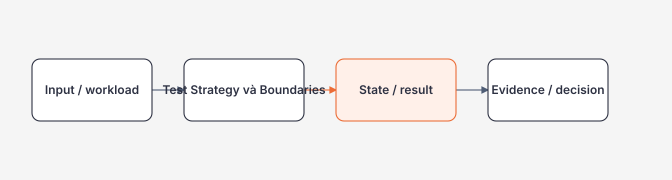

# Test Strategy và Boundaries

> [← Module 08 overview](README.md) · [Testing và Code Review references](references.md)

## Mục tiêu / Learning Objectives

- giải thích test strategy và boundaries bằng mental model và boundary;
- implement một minimal path có bound, invariant và observable output;
- phân tích failure, security, performance, reliability và operational ownership;
- đối chiếu behavior với nguồn chính thức thay vì dựa vào folklore;
- viết decision note và biết trigger để chuyển sang alternative.

## Tại sao cần học? / Why It Matters

Unit, integration, contract, component và end-to-end test theo risk. Đây là boundary nơi một quyết định nhỏ có thể đổi correctness, latency, security và operational ownership.

## Tổng quan / Overview

## Mental Model

| Boundary | Câu hỏi | Evidence |
| --- | --- | --- |
| Input | Dữ liệu/traffic đến từ đâu và bound nào? | Contract, validation, limit |
| Core | Invariant/state transition nào phải đúng? | Test, query/plan, policy |
| Resource | CPU, memory, network, storage, quota nào tiêu thụ? | Metrics, profile, capacity |
| Recovery | Khi dependency/change fail thì ai xử lý? | Retry, rollback, runbook |

Unit, integration, contract, component và end-to-end test theo risk. Học stable concept trước version/tool syntax; mọi claim production phải có measurement hoặc source.

## Thuật ngữ / Terminology

| Thuật ngữ | Ý nghĩa |
| --- | --- |
| Invariant | Điều kiện luôn phải đúng |
| Boundary | Nơi ownership/semantics đổi |
| Estimate | Dự đoán cost trước runtime |
| Backpressure | Buộc producer theo capacity |
| Evidence | Output dùng để quyết định |
| Rollback | Đường quay về trạng thái an toàn |

## Prerequisites

- [Module 07 prerequisite](../07-aspnet-core/README.md).
- [Roadmap dependency graph](../00-roadmap/prerequisites.md).
- Có thể ghi failure hypothesis và output reproducible.

## How It Works

Bắt đầu từ requirement, chọn primitive, đặt safety bound, quan sát behavior và xác định owner. Unit, integration, contract, component và end-to-end test theo risk. Không coi framework/platform abstraction là proof của correctness.

## Minimal Example

~~~csharp
dotnet test --filter Category=Unit
~~~

Minimal example chỉ chứng minh shape; production cần validation, cancellation/timeout, migration, security và test tùy boundary.

## Production Example

Unit, integration, contract, component và end-to-end test theo risk. Production path bổ sung contract test, structured telemetry, failure classification, rollout/rollback và data/privacy policy.

~~~text
decision = requirement + workload + failure + security + cost
evidence = implementation + test + measurement + runbook
~~~

## .NET Integration

- DI/configuration/host composition giữ lifetime và ownership rõ.
- Cancellation, timeout và disposal phải đi xuyên boundary; không fire-and-forget vô chủ.
- HTTP/API layer map lỗi thành contract ổn định, không leak exception nội bộ.
- Persistence/cache/queue adapter không che transaction, consistency hoặc retry semantics.
- Metrics/traces/logs dùng low-cardinality labels và retention/privacy policy.

## Internals

Đọc access path/state machine/controller/plan theo đúng module để giải thích observed behavior. Provider, runtime, platform và version có thể thay đổi implementation detail; giữ normative claim ở official docs.

## Common Mistakes

- copy syntax trước khi xác định invariant.
- bỏ qua input/size/concurrency bound.
- trả success khi side effect chưa commit.
- dùng một metric cho mọi workload.
- để implementation detail thành public contract.

## Performance Considerations

Đo workload representative với warm-up, concurrency, payload mix và tail latency. Bound state/queue/cache trước khi micro-optimize; so sánh before/after cùng environment và tính cả cost của measurement.

## Security Considerations

Threat model asset, identity, trust boundary, input abuse, secret handling và artifact access. Least privilege, data minimization, encryption, audit và expiry phải có negative test.

## Reliability / Failure Modes

| Failure | Signal | Response |
| --- | --- | --- |
| Invalid input/state | 4xx, constraint/test failure | Reject rõ, không partial side effect |
| Dependency slow/unavailable | Timeout, queue/latency tăng | Deadline, bounded retry, fallback hoặc shed |
| Capacity exhausted | CPU/memory/quota/429 | Backpressure, scale, degrade hoặc stop |
| Change incompatible | Error/contract drift | Canary, migration, rollback/forward fix |
| Operator mistake | Audit/event anomaly | Least privilege, approval, runbook |

## Observability

Ghi success/error rate, latency percentile, resource usage, state transitions và version/deployment. Trace nối request → core operation → dependency; log structured theo operation ID. Alert theo SLO/error budget.

## Operational Considerations

- Pin tool/provider/image/schema version phù hợp.
- Readiness không báo healthy trước invariant cần thiết.
- Runbook có preflight, read-only command, rollback và artifact retention.
- Rehearse backup/restore, key rotation, failover, drift hoặc upgrade tùy module.
- Manual exception có owner, expiry và post-incident review.

## Architect Perspective

Test Strategy và Boundaries trở thành architectural boundary khi ảnh hưởng ownership, consistency, deployment, capacity hoặc team topology. Chọn phương án đơn giản nhất thỏa NFR; document điều gì đổi ở 10x/100x và trigger migrate.

## Trade-offs

| Lựa chọn | Lợi ích | Chi phí/rủi ro |
| --- | --- | --- |
| Simple/local | Dễ hiểu, ít toil | Giới hạn scale/durability |
| Specialized/distributed | Capacity/feature tốt | Coupling, failure và vận hành |
| Managed/platform | Giảm control-plane toil | Quota, lock-in và cost |

## When NOT to Use It

- Không dùng pattern này nếu requirement chưa chứng minh need hoặc không có owner vận hành.
- Không dùng abstraction để che failure/latency/consistency semantics.
- Không chọn managed/distributed option chỉ vì production-ready mà thiếu cost/capacity evidence.
- Không mở rộng privilege, retention hoặc data exposure để làm lab nhanh hơn.
- Không tối ưu một metric nếu làm hỏng SLO, security hoặc rollback.

## Alternatives

- Giữ local/simple implementation khi scale và durability chưa yêu cầu.
- Dùng managed service khi team không muốn sở hữu control plane và cost hợp lý.
- Dùng queue/batch/stream hoặc synchronous path tùy latency/durability.
- Dùng immutable artifact/configuration và migration thay manual mutation.
- Dùng standard protocol/contract trước custom framework.

## Review Questions

1. Invariant nào phải đúng dù request/retry/deploy lặp lại?
2. Boundary nào sở hữu state, timeout, cleanup hoặc rollback?
3. Evidence nào chứng minh bottleneck/security/reliability claim?
4. Điều gì sẽ hỏng khi dependency chậm hoặc state stale?
5. Cost và operational toil tăng theo scale nào?
6. Khi nào phương án đơn giản hơn là lựa chọn tốt hơn?

## Hands-on Lab

Tạo một experiment bounded cho test strategy và boundaries: ghi workload, expected output, failure scenario và safety bound; chạy baseline rồi so sánh; lưu decision note. Không đưa credential, production data hoặc diagnostic artifact nhạy cảm vào repository.

## Exit Criteria

- Giải thích được unit, integration, contract, component và end-to-end test theo risk..
- Implement minimal example có validation/bound phù hợp.
- Mô tả failure, security, performance và operational response.
- Có evidence reproducible và decision note.
- Biết dependency tiếp theo và trigger cần nghiên cứu thêm.

## Related Topics

- [Module 07 prerequisite](../07-aspnet-core/README.md).
- [Test Strategy và Boundaries](test-strategy-and-boundaries.md).
- [Integration, Contract và Load Testing](integration-contract-and-load-testing.md).
- [Code Review, Quality Gates và Failure Analysis](code-review-quality-and-failure-analysis.md).
- Module 09 — Security và DevSecOps khi content được mở.

## Official English Sources

- [Unit testing .NET](https://learn.microsoft.com/en-us/dotnet/core/testing/unit-testing-with-dotnet-test).
- [Integration tests ASP.NET Core](https://learn.microsoft.com/en-us/aspnet/core/test/integration-tests?view=aspnetcore-10.0).
- [Test ASP.NET Core apps](https://learn.microsoft.com/en-us/aspnet/core/test/overview?view=aspnetcore-10.0).
- [Continuous testing](https://learn.microsoft.com/en-us/azure/well-architected/operational-excellence/continuous-testing).

## Vietnamese Resources

- Dùng [glossary](../00-roadmap/glossary.md) để giữ canonical English term.
- Viết reflection bằng tiếng Việt nhưng giữ tên API/protocol/metric chính xác.
- Tuân thủ [source policy](../00-roadmap/source-policy.md) cho claim version-sensitive.

## Verification Metadata

- Verified: 2026-08-11.
- Technology version: Testing và Code Review content v1; refresh version-sensitive behavior before production.
- Context7 queries used: none; callable tool unavailable in this run.
- Notes: content v1 không thay thế learner evidence; cần lab/review/production artifact để nâng level.
