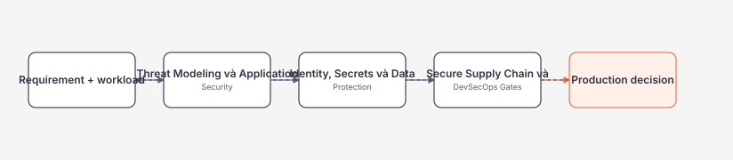
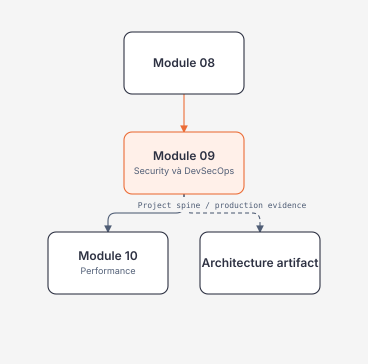

# Module 09 — Security và DevSecOps

> [← Module 08](../08-testing-code-review/README.md) · [Roadmap](../00-roadmap/README.md)

Module này tập trung vào Threat modeling, identity, secrets, supply chain và security gates. Mental model đi trước syntax; mọi chapter nối requirement → boundary → evidence → operations.

## Module trong một hình

## Phạm vi và trạng thái

| Learning slice | Priority | Trạng thái nội dung | Evidence người học |
| --- | --- | --- | --- |
| [Threat Modeling và Application Security](threat-modeling-and-application-security.md) | P0 | Content v1 | Pending |
| [Identity, Secrets và Data Protection](identity-secrets-and-data-protection.md) | P0 | Content v1 | Pending |
| [Secure Supply Chain và DevSecOps Gates](secure-supply-chain-and-devsecops.md) | P0 | Content v1 | Pending |

## Dependency map

## Cách học

1. Đọc mental model và dependency trước syntax.
2. Chạy hoặc thiết kế lab bounded, lưu output.
3. Review theo Senior Engineer, Security, Performance, Operations và Architect.
4. Chỉ chuyển module khi exit criteria và evidence đạt.

## Evidence tối thiểu

- Một diagram/contract nối input, core state, resources và recovery.
- Một failure/overload/security experiment có expected outcome.
- Một performance/operations note và rollback/recovery path.
- Một decision record nói rõ phương án đơn giản hơn, cost và trigger migrate.

## Tiếp tục từ đây

Sau module này, mở Module 10 — Performance khi content v1; không bỏ qua prerequisite chỉ vì đã đọc syntax.

## Official references

Xem [references.md](references.md) để lấy source of truth. Roadmap discovery không thay behavior/specification.

## Verification metadata

- Verified: 2026-08-11.
- Content status: Content v1; learner evidence pending.
- Technology focus: Security và DevSecOps.
- Context7 queries used: none; callable tool unavailable in this run.

<!-- Mermaid.js Script CDN hỗ trợ tự động render sơ đồ Mermaid trên GitHub Pages (Jekyll) -->

