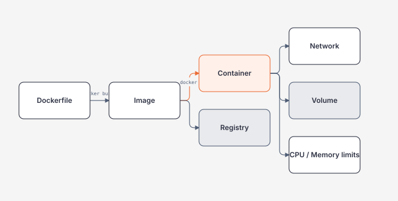

# Module 12 — Docker

> [← Module 11 Redis](../11-redis-caching/README.md) · [Roadmap](../00-roadmap/README.md)

Module này học Docker bằng một hệ thống .NET thật:

```text
ASP.NET Core API
+ Worker
+ SQL Server
+ Redis
+ Docker Compose
```

Bạn phải hiểu container như **isolated process + filesystem/network/resource boundaries**, không phải "máy ảo nhẹ".

## Hiểu trong 5 phút



Các khái niệm không được trộn:

| Concept | Hiểu ngắn |
| --- | --- |
| Dockerfile | instructions để build image |
| Image | immutable-ish application filesystem/artifact layers |
| Container | running process instance của image |
| Volume | persistent data lifecycle tách khỏi container |
| Network | communication + service discovery boundary |
| Registry | nơi lưu/distribute image |
| Compose | mô tả multi-container application topology |

---

# 1. Containerize ASP.NET Core

Dockerfile multi-stage:

```dockerfile
# syntax=docker/dockerfile:1

FROM mcr.microsoft.com/dotnet/sdk:10.0 AS build
WORKDIR /src

COPY MyApi.csproj .
RUN dotnet restore MyApi.csproj

COPY . .
RUN dotnet publish MyApi.csproj \
    -c Release \
    -o /app/publish \
    --no-restore

FROM mcr.microsoft.com/dotnet/aspnet:10.0 AS runtime
WORKDIR /app

COPY --from=build /app/publish .

EXPOSE 8080
ENTRYPOINT ["dotnet", "MyApi.dll"]
```

Build:

```bash
docker build -t my-api:dev .
```

Run:

```bash
docker run --rm \
  -p 8080:8080 \
  --name my-api \
  my-api:dev
```

Inspect:

```bash
docker ps
docker logs my-api
docker inspect my-api
docker stats my-api
```

---

# 2. `localhost` trap

Inside API container:

```text
localhost = API container itself
```

Nó **không** tự động là SQL container hoặc host machine.

Compose network:

```yaml
services:
  api:
    build: .
    environment:
      ConnectionStrings__Sql: >-
        Server=sql;Database=AppDb;User Id=sa;Password=${SA_PASSWORD};TrustServerCertificate=True

  sql:
    image: mcr.microsoft.com/mssql/server:2025-latest
```

Hostname `sql` đến từ service name trên Compose network.

---

# 3. Full local stack

```yaml
services:
  api:
    build:
      context: ./src/MyApi
    ports:
      - "8080:8080"
    environment:
      ASPNETCORE_ENVIRONMENT: Development
      ConnectionStrings__Sql: >-
        Server=sql;Database=AppDb;User Id=sa;Password=${SA_PASSWORD};TrustServerCertificate=True
      Redis__ConnectionString: redis:6379
    depends_on:
      - sql
      - redis

  worker:
    build:
      context: ./src/MyWorker
    environment:
      ConnectionStrings__Sql: >-
        Server=sql;Database=AppDb;User Id=sa;Password=${SA_PASSWORD};TrustServerCertificate=True
      Redis__ConnectionString: redis:6379
    depends_on:
      - sql
      - redis

  sql:
    image: mcr.microsoft.com/mssql/server:2025-latest
    environment:
      ACCEPT_EULA: "Y"
      MSSQL_SA_PASSWORD: ${SA_PASSWORD}
    volumes:
      - sql-data:/var/opt/mssql

  redis:
    image: redis:8

volumes:
  sql-data:
```

Run:

```bash
docker compose up --build
```

Debug:

```bash
docker compose ps
docker compose logs -f api
docker compose exec api printenv
docker compose exec api getent hosts sql
```

---

# 4. Container filesystem vs persistent data

Nếu app ghi file vào container writable layer:

```text
container removed
↓
file can disappear with container lifecycle
```

Database data cần volume:

```yaml
services:
  sql:
    volumes:
      - sql-data:/var/opt/mssql

volumes:
  sql-data:
```

Bind mount phù hợp dev source/config scenarios hơn:

```yaml
services:
  api:
    volumes:
      - ./local-data:/app/data
```

Không coi bind mount host path là production storage strategy mặc định.

---

# 5. Resource limits phải test

Run memory-bound container:

```bash
docker run --rm \
  --memory=256m \
  --cpus=0.5 \
  my-api:dev
```

Observe:

```bash
docker stats
```

Questions:

```text
GC behavior đổi thế nào dưới memory limit?
Request P95 tăng bao nhiêu với 0.5 CPU?
Process bị OOM kill ra sao?
Health/readiness phản ứng thế nào?
```

---

# 6. Signals và graceful shutdown

```bash
docker stop my-api
```

Docker gửi stop signal rồi chờ grace period trước force kill.

ASP.NET Core/Generic Host phải honor shutdown token. Background worker không được tiếp tục nhận work mới vô hạn.

Lab:

1. start long-running job;
2. `docker stop`;
3. verify worker nhận cancellation;
4. verify transaction/state không half-written;
5. check exit code/logs.

---

# 7. Security baseline

Không chạy mọi container privileged/root chỉ cho tiện.

Dockerfile có thể tạo/use non-root user tùy base image strategy.

Compose hardening examples:

```yaml
services:
  api:
    read_only: true
    cap_drop:
      - ALL
    tmpfs:
      - /tmp
```

Không harden blind. Application phải thực sự chỉ ghi vào paths được thiết kế.

Secret không bake vào image:

Bad:

```dockerfile
ENV API_KEY=super-secret
```

Better principle:

```text
image contains code/config defaults
runtime injects secret reference/value through approved secret mechanism
```

---

# 8. Image identity

Tag mutable:

```text
my-api:latest
```

Artifact identity tốt hơn cho deploy/audit thường gồm immutable digest:

```text
registry.example/my-api@sha256:...
```

Bạn cần map:

```text
git SHA
→ image digest
→ deployment
→ telemetry version
```

---

# 9. Failure experiments

## A — kill SQL

```bash
docker compose stop sql
```

Observe API:

```text
request errors
retry behavior
readiness
logs/traces
connection recovery after SQL starts again
```

## B — kill Redis

```bash
docker compose stop redis
```

Question: cache failure có làm core transaction unavailable không? Tùy requirement.

## C — memory limit

Reduce API memory until workload degrades/OOMs. Capture `docker stats` + application telemetry.

## D — network/DNS mistake

Change SQL host from `sql` to `localhost`. Debug bằng:

```bash
docker compose exec api getent hosts sql
docker compose exec api sh
```

Mục tiêu là hiểu namespace/network, không copy fix.

---

# 10. Lộ trình module

| Guide | Nội dung |
| --- | --- |
| [Images, Builds và Reproducibility](images-builds-and-reproducibility.md) | Dockerfile, layer/cache, multi-stage, image identity, build evidence |
| [Runtime, Networking, Storage và Resources](runtime-networking-storage-and-resources.md) | process, PID 1, DNS, ports, volume, CPU/memory, signals |
| [Security, Compose và Operations](docker-security-compose-and-operations.md) | least privilege, secret boundary, full stack, diagnostics, cleanup |

---

# 11. Exit criteria

Bạn hoàn thành Docker khi có thể:

- viết multi-stage Dockerfile cho .NET;
- giải thích image vs container vs volume;
- debug `localhost`/DNS/service network;
- persist SQL data đúng lifecycle;
- đặt CPU/memory limit và đo behavior;
- giải thích signal/graceful shutdown;
- chạy API + Worker + SQL + Redis bằng Compose;
- test dependency failure;
- giải thích security/operational trade-offs trước khi chuyển Kubernetes.

## Official references

Xem [references.md](references.md). Docker/Kubernetes syntax thay đổi theo version nhưng container mental model phải hiểu độc lập tooling.

## Verification metadata

- Verified: 2026-08-12.
- Status: code-first deep rewrite in progress.
- Baseline: Docker Engine 29.x theo technology baseline.
