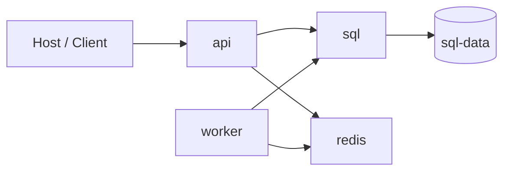

# Docker Security, Compose và Operations

> [← Docker overview](README.md) · [References](references.md)

## Hiểu trong 5 phút

Docker Compose tốt cho local integration/dev/test và một số single-host deployments. Nó giúp bạn mô tả topology:



Nhưng Compose không thay thế application resilience/security.

```text
depends_on ≠ dependency always available
container restart ≠ business recovery
secret mounted ≠ authorization
healthcheck ≠ SLO
```

---

# 1. Production-like local Compose

```yaml
services:
  api:
    build:
      context: ./src/MyApi
    ports:
      - "8080:8080"
    environment:
      ASPNETCORE_ENVIRONMENT: Development
      ConnectionStrings__Sql: >-
        Server=sql;Database=AppDb;User Id=sa;Password=${SA_PASSWORD};TrustServerCertificate=True
      Redis__ConnectionString: redis:6379
    depends_on:
      sql:
        condition: service_healthy
      redis:
        condition: service_started
    read_only: true
    tmpfs:
      - /tmp
    cap_drop:
      - ALL
    security_opt:
      - no-new-privileges:true
    logging:
      driver: json-file
      options:
        max-size: "10m"
        max-file: "3"

  worker:
    build:
      context: ./src/MyWorker
    environment:
      ConnectionStrings__Sql: >-
        Server=sql;Database=AppDb;User Id=sa;Password=${SA_PASSWORD};TrustServerCertificate=True
      Redis__ConnectionString: redis:6379
    depends_on:
      sql:
        condition: service_healthy
      redis:
        condition: service_started
    read_only: true
    tmpfs:
      - /tmp
    cap_drop:
      - ALL

  sql:
    image: mcr.microsoft.com/mssql/server:2025-latest
    environment:
      ACCEPT_EULA: "Y"
      MSSQL_SA_PASSWORD: ${SA_PASSWORD}
    volumes:
      - sql-data:/var/opt/mssql
    healthcheck:
      test:
        - CMD-SHELL
        - >-
          /opt/mssql-tools18/bin/sqlcmd -S localhost -U sa -P "$${MSSQL_SA_PASSWORD}" -C -Q "SELECT 1" || exit 1
      interval: 10s
      timeout: 5s
      retries: 10

  redis:
    image: redis:8

volumes:
  sql-data:
```

Đây là **learning stack**, không phải production recommendation cho mọi workload.

---

# 2. `.env` không phải secret manager

Local `.env`:

```text
SA_PASSWORD=LocalOnlyStrongPassword123!
```

`.gitignore`:

```text
.env
.env.*
!.env.example
```

`.env.example`:

```text
SA_PASSWORD=replace-me
```

Không commit actual secrets.

Production nên dùng secret mechanism của platform/cloud phù hợp thay vì copy `.env` lên server.

---

# 3. Compose secrets

Local file:

```text
./secrets/api-key.txt
```

Compose:

```yaml
services:
  api:
    secrets:
      - api_key

secrets:
  api_key:
    file: ./secrets/api-key.txt
```

Container nhận file thường qua `/run/secrets/api_key`.

.NET helper:

```csharp
static string ReadRequiredSecret(string path)
{
    if (!File.Exists(path))
    {
        throw new InvalidOperationException($"Secret file not found: {path}");
    }

    return File.ReadAllText(path).Trim();
}

var apiKey = ReadRequiredSecret("/run/secrets/api_key");
```

Secret file mount vẫn cần permissions, rotation và exposure review. Nó không magically solve secret lifecycle.

---

# 4. Least privilege

Questions:

```text
Container có cần root không?
Có cần write root filesystem không?
Có cần Linux capability nào không?
Có cần mount Docker socket không?
Có cần host network không?
```

Dangerous:

```yaml
privileged: true
```

hoặc:

```yaml
volumes:
  - /var/run/docker.sock:/var/run/docker.sock
```

Docker socket có quyền rất lớn trên host. Không mount chỉ để app "dễ điều khiển containers".

---

# 5. Read-only filesystem test

```yaml
services:
  api:
    read_only: true
    tmpfs:
      - /tmp
```

Start:

```bash
docker compose up --build
```

Nếu app crash vì cố ghi `/app/foo.log`, đây là discovery tốt.

Production logging nên đi stdout/stderr hoặc approved sink/path, không dựa vào random local files trong container.

---

# 6. Capability drop

```yaml
cap_drop:
  - ALL
```

Nếu app thực sự cần capability cụ thể, add explicit thay vì giữ default rộng hơn cần thiết.

Lab:

1. run with default capabilities;
2. run with `cap_drop: ALL`;
3. identify capability requirement nếu app break;
4. document why.

---

# 7. Image scanning / SBOM boundary

Delivery pipeline nên biết:

```text
source dependencies
base image packages
image digest
known vulnerabilities
SBOM/artifact metadata
```

Tool choice tùy platform, nhưng policy cần trả lời:

```text
severity nào block release?
who owns false positive/exception?
exception expires khi nào?
base image patch cadence?
```

Không dùng scan report như bằng chứng duy nhất rằng image "secure".

---

# 8. Compose profiles cho optional tooling

```yaml
services:
  adminer:
    image: adminer
    profiles: [debug]
```

Normal:

```bash
docker compose up
```

Debug:

```bash
docker compose --profile debug up
```

Không expose debug/admin tooling mặc định chỉ vì local tiện.

---

# 9. Logs

```bash
docker compose logs -f api
docker compose logs --tail=200 worker
```

Application log phải structured:

```csharp
logger.LogInformation(
    "Processing notification {NotificationId} for tenant {TenantId}",
    notificationId,
    tenantId);
```

Container logs không thay metrics/traces.

---

# 10. Log rotation

Local/single-host JSON logs có thể consume disk nếu không bound.

```yaml
logging:
  driver: json-file
  options:
    max-size: "10m"
    max-file: "3"
```

Production centralized logging architecture có thể dùng driver/collector khác; principle là storage/retention phải có owner và bound.

---

# 11. Startup sequencing

`depends_on` có thể help ordering, nhưng application vẫn phải handle dependency outage sau startup.

Bad mental model:

```text
Compose started SQL first
→ SQL can never fail later
```

Correct:

```text
dependency lifecycle is independent
→ app must classify and recover/fail predictably
```

---

# 12. Health condition

Compose:

```yaml
depends_on:
  sql:
    condition: service_healthy
```

Điều này có thể giảm startup race, nhưng SQL health command phải tồn tại trong image và chính health check cần bounded.

Bạn vẫn cần app readiness/recovery nếu SQL fail sau đó.

---

# 13. Restart policies

Ví dụ:

```yaml
restart: unless-stopped
```

Restart có thể giúp process crash recovery, nhưng hãy hỏi:

```text
Process crash vì transient OS issue?
Hay crash loop vì invalid config/schema?
```

Auto restart invalid app có thể tạo log storm/pressure thay vì recovery.

---

# 14. Debug workflow

Khi API không connect SQL:

```bash
docker compose ps
docker compose logs api
docker compose logs sql
docker compose exec api getent hosts sql
docker inspect <api-container>
```

Classify:

```text
DNS
TCP
TLS
credentials
database missing
migration/schema
query timeout
```

Không sửa bằng restart trước khi biết failure class, trừ khi incident policy yêu cầu immediate mitigation.

---

# 15. Cleanup có chủ đích

Stop containers:

```bash
docker compose down
```

Stop + delete named volumes:

```bash
docker compose down -v
```

Hai command có data semantics khác nhau.

Lab phải ghi rõ expected persistence trước khi cleanup.

---

# 16. Backup mindset

Docker volume không phải backup.

```text
volume
→ persistent local data lifecycle

backup
→ independently restorable copy with retention/recovery process
```

Đối với SQL Server production, backup/restore strategy thuộc database/platform architecture, không được thay bằng "volume exists".

---

# 17. Full failure drill

Chạy stack rồi làm tuần tự:

```bash
docker compose stop redis
docker compose start redis

docker compose stop sql
docker compose start sql

docker compose restart worker
```

Mỗi bước lưu:

```text
API behavior
worker behavior
health status
logs/traces
recovery time
lost/duplicate work?
```

Đây là evidence tốt hơn screenshot `docker compose up` thành công.

---

# 18. Khi nào Compose đủ?

Compose có thể đủ khi:

```text
single-host/local integration
small controlled deployment
manual/simple failover acceptable
team không cần cluster scheduler
```

Kubernetes bắt đầu có lý khi bạn có requirements như:

```text
multi-node scheduling
self-healing across nodes
rolling rollout at scale
service abstraction in cluster
declarative reconciliation
resource scheduling
platform policy
```

Nhưng Kubernetes thêm control-plane/operational complexity đáng kể.

---

# 19. Exit criteria

Bạn hoàn thành chapter khi có thể:

- chạy API/Worker/SQL/Redis bằng Compose;
- quản lý config/secrets không commit credential;
- giải thích read-only fs/capability/privileged/socket risks;
- bound logs/resources;
- debug DNS/TCP/auth dependency issue;
- test SQL/Redis outage + recovery;
- phân biệt persistent volume và backup;
- quyết định Compose vs orchestration bằng NFR.

## Official English Sources

- [Docker Compose](https://docs.docker.com/compose/)
- [Compose file reference](https://docs.docker.com/reference/compose-file/)
- [Docker security](https://docs.docker.com/engine/security/)
- [Docker secrets](https://docs.docker.com/compose/how-tos/use-secrets/)

## Verification metadata

- Verified: 2026-08-12.
- Baseline: Docker/Compose current repository baseline.
- Status: code-first deep rewrite.
