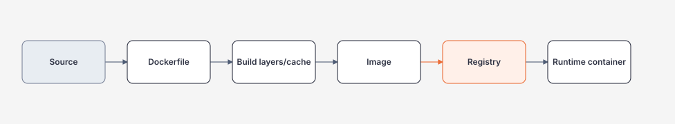

# Images, Builds và Reproducibility

> [← Docker overview](README.md) · [References](references.md)

## Hiểu trong 5 phút

Docker image là deployment artifact. Dockerfile là build recipe.



Một build production tốt cần:

```text
reproducible inputs
small attack surface
cache-friendly layers
no baked secrets
traceable source → image digest
```

---

# 1. Multi-stage .NET Dockerfile

```dockerfile
# syntax=docker/dockerfile:1

FROM mcr.microsoft.com/dotnet/sdk:10.0 AS restore
WORKDIR /src

COPY MyApi.csproj .
RUN dotnet restore MyApi.csproj

FROM restore AS build
COPY . .
RUN dotnet publish MyApi.csproj \
    -c Release \
    -o /app/publish \
    --no-restore

FROM mcr.microsoft.com/dotnet/aspnet:10.0 AS runtime
WORKDIR /app

COPY --from=build /app/publish .

EXPOSE 8080
ENTRYPOINT ["dotnet", "MyApi.dll"]
```

Why multi-stage:

```text
SDK/compiler/build cache
    stay in build stages

runtime image
    only needs published app + runtime
```

Không copy toàn SDK vào production image nếu không có requirement.

---

# 2. Cache-friendly ordering

Bad:

```dockerfile
COPY . .
RUN dotnet restore
RUN dotnet publish -c Release
```

Mỗi source-code change có thể invalidate restore layer.

Better:

```dockerfile
COPY MyApi.csproj .
RUN dotnet restore MyApi.csproj

COPY . .
RUN dotnet publish MyApi.csproj -c Release --no-restore
```

Dependency file thay đổi ít hơn source files, giúp cache reuse tốt hơn.

Với solution nhiều project, cần copy đúng project files/dependency graph trước restore.

---

# 3. `.dockerignore`

```text
**/bin/
**/obj/
.git/
.vs/
.idea/
TestResults/
coverage/
.env
*.user
```

Mục tiêu:

```text
smaller build context
less accidental secret/artifact copy
better cache behavior
```

Đừng blindly ignore file mà build thực sự cần.

---

# 4. Build context là security boundary

Nếu bạn chạy:

```bash
docker build .
```

build context có thể chứa nhiều file hơn bạn nghĩ.

Check:

```bash
find . -maxdepth 2 -type f | sort
```

Secrets trong build context có thể bị copy vào layer nếu Dockerfile sai, kể cả sau đó file bị delete ở layer khác.

Bad:

```dockerfile
COPY . .
RUN cat .env && rm .env
```

Delete ở layer sau không magically xóa secret khỏi previous layer history.

---

# 5. Không truyền secret bằng `ARG` để bake image

Bad:

```dockerfile
ARG NUGET_TOKEN
RUN dotnet nuget add source ... --password "$NUGET_TOKEN"
```

Build args/history/cache có thể tạo leak risk nếu dùng sai.

Khi build cần private dependency, dùng BuildKit secret mount hoặc CI credential mechanism phù hợp.

Conceptual BuildKit:

```dockerfile
RUN --mount=type=secret,id=nuget_config,target=/root/.nuget/NuGet/NuGet.Config \
    dotnet restore MyApi.csproj
```

Build:

```bash
docker build \
  --secret id=nuget_config,src="$HOME/.nuget/NuGet/NuGet.Config" \
  -t my-api:dev .
```

Secret phục vụ build nhưng không nên trở thành runtime image layer.

---

# 6. Inspect image

```bash
docker image ls my-api
docker image inspect my-api:dev
docker history my-api:dev
```

Questions:

```text
Image size bao nhiêu?
Layer nào lớn bất thường?
Có build tool/source file không cần thiết trong runtime image không?
Config/secret có xuất hiện trong history không?
```

---

# 7. Verify runtime contents

```bash
docker run --rm \
  --entrypoint sh \
  my-api:dev \
  -c 'find /app -maxdepth 2 -type f | sort | head -100'
```

Không assume multi-stage đúng chỉ vì Dockerfile nhìn đẹp.

---

# 8. Tag vs digest

Build/tag:

```bash
docker build -t registry.example/my-api:1.4.2 .
```

Tag giúp human-friendly release identity nhưng có thể mutable tùy registry policy.

Sau push, deployment evidence nên capture digest:

```text
registry.example/my-api@sha256:abc...
```

Traceability:

```text
Git commit 1a2b3c
↓
CI build run 998
↓
image digest sha256:...
↓
deployment prod-eu
```

---

# 9. Build metadata

Có thể thêm OCI labels:

```dockerfile
ARG VCS_REF
ARG VERSION

LABEL org.opencontainers.image.revision=$VCS_REF \
      org.opencontainers.image.version=$VERSION \
      org.opencontainers.image.source="https://github.com/example/my-api"
```

CI:

```bash
docker build \
  --build-arg VCS_REF="$GITHUB_SHA" \
  --build-arg VERSION="$VERSION" \
  -t "$IMAGE" .
```

Không đặt secret vào labels.

---

# 10. Pinning trade-off

Loose base:

```dockerfile
FROM mcr.microsoft.com/dotnet/aspnet:10.0
```

Pros:

```text
easier to receive patched base on rebuild
```

Cons:

```text
same Dockerfile rebuilt later may resolve different base digest
```

Digest pinning:

```dockerfile
FROM mcr.microsoft.com/dotnet/aspnet:10.0@sha256:...
```

Pros:

```text
strong reproducibility / exact identity
```

Cons:

```text
you must intentionally update digest to receive patches
```

Production answer thường là automation + controlled update, không phải "always tag" hay "always digest" tuyệt đối.

---

# 11. Build once, promote same artifact

Bad delivery model:

```text
build dev image
build staging image again
build prod image again
```

Mỗi rebuild có thể khác dependency/base/input.

Prefer:

```text
commit
↓
build once
↓
scan/test
↓
image digest
↓
promote same digest dev → staging → prod
```

Runtime environment-specific config được inject khi deploy.

---

# 12. Reproducibility test

1. Checkout same commit.
2. Build twice trong clean environment.
3. Compare runtime behavior, package lock inputs, base digest, image metadata.
4. Nếu digest khác, giải thích source of nondeterminism thay vì assume bug.

Exact bit-for-bit reproducibility có thể phụ thuộc build ecosystem. Goal chính là **controlled and auditable inputs**.

---

# 13. Image size experiment

Version A:

```dockerfile
FROM mcr.microsoft.com/dotnet/sdk:10.0
COPY . /app
WORKDIR /app
ENTRYPOINT ["dotnet", "run"]
```

Version B: multi-stage publish runtime image.

Compare:

```bash
docker image ls
```

Measure:

```text
image size
build duration cold/warm
startup time
files in runtime image
vulnerability scan result if scanner available
```

Không kết luận smaller image always faster app runtime, nhưng smaller artifact thường giảm transfer/storage/attack surface concerns.

---

# 14. CI build example

```yaml
name: image

on:
  pull_request:
  push:
    branches: [main]

jobs:
  build:
    runs-on: ubuntu-latest
    permissions:
      contents: read

    steps:
      - uses: actions/checkout@v7

      - name: Build image
        run: |
          docker build \
            --build-arg VCS_REF="$GITHUB_SHA" \
            -t my-api:test \
            ./src/MyApi

      - name: Smoke test
        run: |
          docker run -d --rm \
            --name my-api-smoke \
            -p 8080:8080 \
            my-api:test

          for i in {1..30}; do
            if curl --fail http://localhost:8080/health/live; then
              exit 0
            fi
            sleep 1
          done

          docker logs my-api-smoke
          exit 1
```

Release workflow có thể thêm registry login/push/sign/SBOM theo supply-chain requirements.

---

# 15. Common mistakes

- `COPY . .` trước restore làm cache kém;
- build context chứa `.env`, test dumps, credentials;
- dùng SDK image làm runtime mặc định;
- runtime image chứa source/build artifacts không cần thiết;
- rebuild riêng từng environment;
- deploy bằng mutable `latest` mà không capture digest;
- không biết base image đang dùng digest nào;
- thêm package/debug tool production không có owner/security review.

---

# 16. Exit criteria

Bạn hoàn thành chapter khi có thể:

- viết multi-stage .NET Dockerfile;
- giải thích cache invalidation;
- kiểm soát build context bằng `.dockerignore`;
- giữ build secret khỏi image layers;
- inspect history/runtime files;
- map git commit → image digest;
- giải thích tag/digest pin trade-off;
- build once/promote same artifact;
- tạo CI smoke test cho image.

## Official English Sources

- [Dockerfile reference](https://docs.docker.com/reference/dockerfile/)
- [Docker build best practices](https://docs.docker.com/build/building/best-practices/)
- [Build secrets](https://docs.docker.com/build/building/secrets/)
- [Build cache](https://docs.docker.com/build/cache/)

## Verification metadata

- Verified: 2026-08-12.
- Baseline: Docker Engine / BuildKit current repository baseline.
- Status: code-first deep rewrite.
