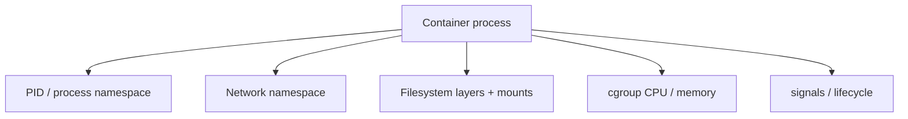

# Container Runtime, Networking, Storage và Resources

> [← Docker overview](README.md) · [References](references.md)

## Hiểu trong 5 phút

Container là một process được chạy với isolation/resource boundaries do OS/runtime cung cấp.



Nếu bạn debug Docker mà nghĩ "container là mini VM", rất dễ hiểu sai `localhost`, filesystem persistence, process ownership và resource limits.

---

# 1. Process lifecycle

Run:

```bash
docker run --rm --name demo nginx:alpine
```

Inspect process từ Docker:

```bash
docker top demo
```

Container tồn tại gắn với main process. Khi PID 1 trong container exit, container stop.

Test:

```bash
docker run --rm alpine sh -c 'echo start; sleep 2; echo done'
```

Container kết thúc ngay sau command hoàn tất.

---

# 2. PID 1 và signal handling

App .NET:

```csharp
var builder = Host.CreateApplicationBuilder(args);
builder.Services.AddHostedService<Worker>();

var host = builder.Build();
await host.RunAsync();
```

Worker:

```csharp
public sealed class Worker(
    ILogger<Worker> logger) : BackgroundService
{
    protected override async Task ExecuteAsync(
        CancellationToken stoppingToken)
    {
        while (!stoppingToken.IsCancellationRequested)
        {
            logger.LogInformation("Working");
            await Task.Delay(1000, stoppingToken);
        }
    }
}
```

Run container rồi:

```bash
docker stop worker
```

Expected:

```text
SIGTERM/stop signal
↓
Generic Host begins shutdown
↓
stoppingToken cancelled
↓
worker exits
↓
container exits
```

Nếu process không handle signal/grace period, runtime cuối cùng có thể force kill.

---

# 3. Network namespace và `localhost`

Compose:

```yaml
services:
  api:
    build: ./api

  redis:
    image: redis:8
```

Trong API container:

```text
localhost:6379
```

trỏ về API container, không phải Redis.

Correct hostname:

```text
redis:6379
```

Debug:

```bash
docker compose exec api getent hosts redis
docker compose exec api ping -c 1 redis
```

Nếu image không có ping, dùng DNS/client tool phù hợp thay vì cài tool production vô tội vạ.

---

# 4. Port publishing

Container app listen `8080`:

```bash
docker run --rm -p 8080:8080 my-api:dev
```

Mental model:

```text
host:8080
   ↓ published port
container network:8080
   ↓
Kestrel
```

Container-to-container trên cùng network thường gọi service port trực tiếp, không cần vòng qua host published port.

---

# 5. User-defined network

```bash
docker network create app-net

docker run -d \
  --name redis \
  --network app-net \
  redis:8

docker run --rm \
  --network app-net \
  alpine getent hosts redis
```

Compose tự tạo application network mặc định cho services nếu không cấu hình khác.

---

# 6. Filesystem layers

Image layer là build artifact; running container có writable layer riêng.

Test:

```bash
docker run --name temp alpine \
  sh -c 'echo hello >/data.txt && cat /data.txt'

docker rm temp
```

Nếu container bị remove, writable-layer data không phải durable storage strategy.

---

# 7. Volume

```bash
docker volume create demo-data

docker run --rm \
  -v demo-data:/data \
  alpine sh -c 'date >>/data/history.txt'

docker run --rm \
  -v demo-data:/data \
  alpine cat /data/history.txt
```

Container khác vẫn thấy data vì volume lifecycle tách khỏi container instance.

Inspect:

```bash
docker volume inspect demo-data
```

---

# 8. Bind mount

```bash
mkdir -p local-data

docker run --rm \
  -v "$PWD/local-data:/data" \
  alpine sh -c 'echo from-container >/data/message.txt'

cat local-data/message.txt
```

Bind mount tạo coupling với host filesystem path/permissions. Phù hợp nhiều dev scenarios nhưng cần cân nhắc portability/security.

---

# 9. Read-only root filesystem

```bash
docker run --rm \
  --read-only \
  alpine sh -c 'echo test >/file.txt'
```

Expected: write fail.

Nếu app cần `/tmp`:

```bash
docker run --rm \
  --read-only \
  --tmpfs /tmp \
  alpine sh -c 'echo test >/tmp/file.txt && cat /tmp/file.txt'
```

Đây là cách failure experiment giúp phát hiện application đang ghi file ở nơi bạn không hề biết.

---

# 10. Memory limit

```bash
docker run --rm \
  --memory=256m \
  my-api:dev
```

Observe:

```bash
docker stats
```

Với .NET, container memory limit ảnh hưởng environment GC/resource behavior. Bạn phải load-test trong limit tương tự production thay vì benchmark process không giới hạn trên laptop.

Failure experiment:

1. load endpoint tạo allocations;
2. memory 512m → baseline;
3. memory 256m;
4. memory 128m;
5. capture latency, GC metrics, OOM/exit behavior.

---

# 11. CPU limit

```bash
docker run --rm \
  --cpus=0.5 \
  my-api:dev
```

CPU-bound workload có thể tăng latency mạnh dù app logic không đổi.

Measure:

```text
RPS
P50/P95/P99
CPU usage
ThreadPool queue/diagnostics
```

---

# 12. Container exit codes

```bash
docker ps -a
```

Inspect:

```bash
docker inspect demo \
  --format '{{.State.Status}} {{.State.ExitCode}} {{.State.OOMKilled}}'
```

Exit code và `OOMKilled` là evidence khi container "tự restart".

Không chỉ đọc application log cuối cùng.

---

# 13. Healthcheck

Dockerfile example:

```dockerfile
HEALTHCHECK --interval=30s --timeout=3s --retries=3 \
  CMD wget -qO- http://localhost:8080/health/live || exit 1
```

Nhưng base runtime image có thể không chứa `wget`. Đừng thêm tool chỉ để copy snippet mà không hiểu image/security impact.

Alternative là platform-specific health probe ở Compose/Kubernetes/load balancer.

---

# 14. Compose dependency != readiness

```yaml
services:
  api:
    depends_on:
      - sql
```

`depends_on` order không có nghĩa SQL đã sẵn sàng nhận query đúng lúc API startup.

Application phải chịu được startup race hoặc Compose health condition được thiết kế rõ.

Tư duy robust:

```text
process starts
↓
DB temporarily unavailable
↓
app readiness false / startup strategy
↓
DB becomes ready
↓
app recovers
```

---

# 15. DNS failure lab

Compose config intentionally wrong:

```yaml
environment:
  Redis__ConnectionString: rediss:6379
```

Debug:

```bash
docker compose logs api
docker compose exec api getent hosts rediss
docker compose exec api getent hosts redis
```

Classify:

```text
DNS name not found
≠
TCP connection refused
≠
timeout
≠
auth failure
```

Failure classification quyết định response, không phải cứ "Redis down".

---

# 16. TCP connectivity lab

Nếu DNS resolve nhưng port không listen, từ debug image/tooling có thể test:

```bash
nc -vz redis 6379
```

Không cài `netcat` vào production image chỉ để debug nếu platform cho ephemeral/debug container tốt hơn.

---

# 17. Dependency recovery lab

```bash
docker compose up -d

docker compose stop redis
# send requests

docker compose start redis
# send requests again
```

Observe:

```text
Does API crash?
Does health change?
Does client reconnect?
Does retry create spike?
Does cache refill stampede?
```

---

# 18. Storage recovery lab

1. write DB data;
2. `docker compose down`;
3. `docker compose up`;
4. verify data remains because volume exists;
5. `docker compose down -v`;
6. understand why data disappears.

Không chạy `down -v` với môi trường có data cần giữ chỉ vì tutorial bảo cleanup.

---

# 19. Production checklist

```text
[ ] main process handles signals
[ ] image runs required process only
[ ] localhost assumptions reviewed
[ ] published ports minimal
[ ] persistent data uses explicit storage lifecycle
[ ] root filesystem write paths known
[ ] CPU/memory limits load-tested
[ ] exit/OOM evidence observable
[ ] dependency startup/recovery tested
[ ] secrets not baked into image
[ ] image version/digest traceable
```

---

# 20. Architect perspective

Docker giải quyết packaging/runtime consistency và isolation boundary, nhưng không tự giải quyết:

```text
multi-node scheduling
service failover
cluster autoscaling
rolling orchestration
persistent distributed control plane
```

Đó là lúc orchestration platform như Kubernetes có thể xuất hiện — **nếu** operational requirements justify complexity.

Không cần Kubernetes chỉ vì đã học Docker.

---

# 21. Exit criteria

Bạn hoàn thành chapter khi có thể:

- giải thích container process/PID lifecycle;
- debug `localhost`, DNS và port publishing;
- chứng minh volume persistence;
- phân biệt volume/bind mount/writable layer;
- test read-only filesystem;
- đặt CPU/memory limit và quan sát .NET behavior;
- đọc exit/OOM state;
- reproduce dependency outage + recovery;
- giải thích khi Docker Compose đủ và khi orchestration requirement bắt đầu xuất hiện.

## Official English Sources

- [Docker overview](https://docs.docker.com/get-started/docker-overview/)
- [Docker networking](https://docs.docker.com/engine/network/)
- [Docker storage](https://docs.docker.com/engine/storage/)
- [Resource constraints](https://docs.docker.com/engine/containers/resource_constraints/)
- [Docker Compose](https://docs.docker.com/compose/)

## Verification metadata

- Verified: 2026-08-12.
- Baseline: Docker Engine 29.x.
- Status: code-first deep rewrite.
