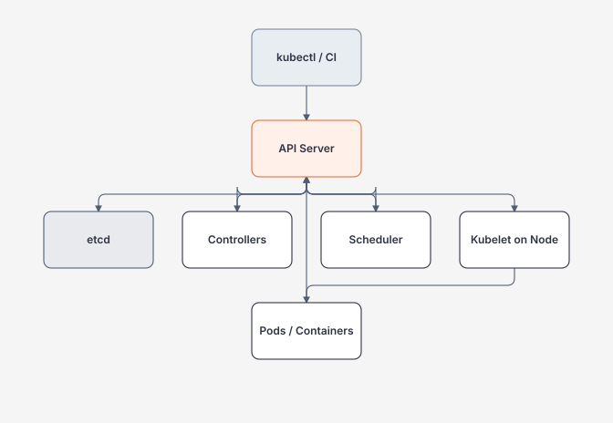

# Module 15 — Kubernetes

> [← Module 14 Cloud](../14-cloud/README.md) · [Docker prerequisite](../12-docker/README.md)

Kubernetes chỉ nên học sau khi bạn hiểu Docker process/network/storage/resource behavior.

Mục tiêu module không phải nhớ YAML. Mục tiêu là hiểu **desired state + reconciliation + scheduling + service discovery + health + resource/security boundaries**.

## Hiểu trong 5 phút

Bạn gửi desired state vào API server:



Kubernetes liên tục cố đưa:

```text
observed state
        ↓ reconcile
closer to desired state
```

Ví dụ:

```yaml
apiVersion: apps/v1
kind: Deployment
metadata:
  name: orders-api
spec:
  replicas: 3
  selector:
    matchLabels:
      app: orders-api
  template:
    metadata:
      labels:
        app: orders-api
    spec:
      containers:
        - name: api
          image: registry.example/orders-api@sha256:replace-me
          ports:
            - containerPort: 8080
```

Bạn khai báo `replicas: 3`; controller cố duy trì 3 Pod matching desired state.

---

# 1. Không bắt đầu bằng YAML — bắt đầu bằng object model

```text
Deployment
    ↓ creates/manages
ReplicaSet
    ↓ creates/manages
Pods
    ↓ contain
Containers
```

Network:

```text
Client
  ↓
Ingress / Gateway / LoadBalancer
  ↓
Service
  ↓ selector
Pods
```

Config:

```text
ConfigMap / Secret
        ↓
Pod environment / files
```

Storage:

```text
Pod
 ↓ PVC
PersistentVolume
 ↓
Storage provider
```

---

# 2. First workload

`deployment.yaml`:

```yaml
apiVersion: apps/v1
kind: Deployment
metadata:
  name: demo-api
spec:
  replicas: 2
  selector:
    matchLabels:
      app: demo-api
  template:
    metadata:
      labels:
        app: demo-api
    spec:
      containers:
        - name: api
          image: your-image:dev
          ports:
            - name: http
              containerPort: 8080
          resources:
            requests:
              cpu: 100m
              memory: 128Mi
            limits:
              memory: 256Mi
          readinessProbe:
            httpGet:
              path: /health/ready
              port: http
            initialDelaySeconds: 2
            periodSeconds: 5
          livenessProbe:
            httpGet:
              path: /health/live
              port: http
            initialDelaySeconds: 10
            periodSeconds: 10
```

Apply:

```bash
kubectl apply -f deployment.yaml
kubectl get deployments
kubectl get replicasets
kubectl get pods -o wide
```

Observe, không chỉ apply:

```bash
kubectl describe deployment demo-api
kubectl describe pod <pod-name>
kubectl logs <pod-name>
```

---

# 3. Service discovery

```yaml
apiVersion: v1
kind: Service
metadata:
  name: demo-api
spec:
  selector:
    app: demo-api
  ports:
    - name: http
      port: 80
      targetPort: http
```

Service cung cấp stable virtual endpoint/DNS abstraction phía trước Pods có lifecycle thay đổi.

```text
demo-api
  ↓ Service
Pod A
Pod B
```

Pod IP không phải application contract ổn định để caller lưu/call trực tiếp.

---

# 4. Rollout

Update image:

```bash
kubectl set image deployment/demo-api \
  api=registry.example/demo-api@sha256:new-digest
```

Watch:

```bash
kubectl rollout status deployment/demo-api
kubectl get pods -w
```

History:

```bash
kubectl rollout history deployment/demo-api
```

Rollback:

```bash
kubectl rollout undo deployment/demo-api
```

Rollback app không tự rollback database schema/data side effect. Migration compatibility vẫn phải thiết kế.

---

# 5. Requests vs limits

```yaml
resources:
  requests:
    cpu: 250m
    memory: 256Mi
  limits:
    memory: 512Mi
```

Mental model:

```text
request
→ scheduler capacity / guaranteed reservation signal

limit
→ runtime upper bound depending resource semantics
```

Đừng copy `100m/128Mi` cho mọi service.

Đo workload rồi set dựa trên:

```text
normal usage
peak
GC behavior
P95/P99 latency
OOM risk
node capacity
```

---

# 6. Probe semantics

Readiness:

```text
"Có nên gửi traffic tới Pod này không?"
```

Liveness:

```text
"Process có bị stuck tới mức restart hữu ích không?"
```

Startup probe:

```text
"App này cần startup lâu; đừng để liveness giết quá sớm"
```

Bad design:

```text
liveness calls DB
DB outage
↓
all Pods restart repeatedly
↓
DB vẫn outage + cluster churn tăng
```

---

# 7. ConfigMap và Secret

ConfigMap:

```yaml
apiVersion: v1
kind: ConfigMap
metadata:
  name: orders-config
data:
  Feature__NewCheckout: "true"
```

Deployment:

```yaml
envFrom:
  - configMapRef:
      name: orders-config
```

Secret object dùng cho sensitive configuration, nhưng base Kubernetes Secret không phải toàn bộ secret-management architecture.

Bạn còn phải nghĩ:

```text
encryption at rest
RBAC
workload identity
external secret store
rotation
audit
```

---

# 8. Debug flow

Pod Pending:

```bash
kubectl describe pod <pod>
```

Look for:

```text
insufficient CPU/memory
node selector/affinity mismatch
PVC binding
image pull secret
quota
```

Pod CrashLoopBackOff:

```bash
kubectl logs <pod> --previous
kubectl describe pod <pod>
```

Pod Running but not Ready:

```bash
kubectl describe pod <pod>
kubectl logs <pod>
kubectl get endpointslices
```

Service not reachable:

```text
labels/selectors
Service port/targetPort
Pod readiness
DNS
NetworkPolicy
application listen address
```

---

# 9. Failure experiments

## A — delete a Pod

```bash
kubectl delete pod <pod-name>
```

Observe Deployment controller create replacement.

## B — break readiness

Deploy version where `/health/ready` returns 503. Observe Pod Running nhưng không nhận traffic qua Service endpoints.

## C — OOM

Set memory limit thấp, run allocation-heavy endpoint, observe:

```bash
kubectl describe pod <pod>
kubectl get pod <pod> -o jsonpath='{.status.containerStatuses[0].lastState}'
```

## D — wrong image

```bash
kubectl set image deployment/demo-api api=does-not-exist:broken
```

Observe `ImagePullBackOff`, rollout status và rollback.

## E — wrong selector

Change Service selector không match Pod labels. DNS vẫn resolve Service nhưng không có working backend endpoints.

---

# 10. Khi nào không cần Kubernetes

Không dùng Kubernetes chỉ vì:

```text
"production thì phải Kubernetes"
"microservices thì phải K8s"
"team muốn học K8s"
```

Managed container platform/VM/Compose có thể đơn giản hơn nếu:

```text
few services
low deployment frequency
single-region/simple availability
no need cluster-level scheduling/policy
team nhỏ và platform toil không đáng
```

Kubernetes hợp lý khi orchestration requirements thực sự bù được complexity.

---

# 11. Lộ trình module

| Guide | Nội dung |
| --- | --- |
| [Cluster Architecture và Reconciliation](cluster-architecture-and-reconciliation.md) | API server, etcd, scheduler, controller, kubelet, desired/observed state |
| [Workloads, Networking và Storage](workloads-networking-and-storage.md) | Deployment, Service, probes, ConfigMap, Secret, PVC, resources |
| [Security, Observability và Operations](kubernetes-security-observability-and-operations.md) | RBAC, ServiceAccount, NetworkPolicy, telemetry, rollout, incident/runbook |

Sau đó đi [Module 16 Observability](../00-roadmap/master-roadmap.md) và [Module 17 Distributed Systems](../17-distributed-systems/README.md) khi available.

---

# 12. Exit criteria

Bạn hoàn thành Kubernetes khi có thể:

- giải thích reconciliation thay vì chỉ `kubectl apply`;
- đi Deployment → ReplicaSet → Pod;
- expose workload bằng Service và debug selector;
- thiết kế readiness/liveness đúng semantics;
- set requests/limits từ measurement;
- debug Pending/CrashLoop/NotReady/ImagePull;
- rollout và rollback image;
- giải thích ConfigMap/Secret/PVC boundaries;
- delete Pod và giải thích self-healing;
- nói được khi **không nên** dùng Kubernetes.

## Official references

Xem [references.md](references.md). English Kubernetes docs là source of truth; bản dịch tiếng Việt dùng để hỗ trợ đọc khi version còn phù hợp.

## Verification metadata

- Verified: 2026-08-12.
- Status: code-first deep rewrite in progress.
- Baseline: Kubernetes 1.36.x theo technology baseline.
