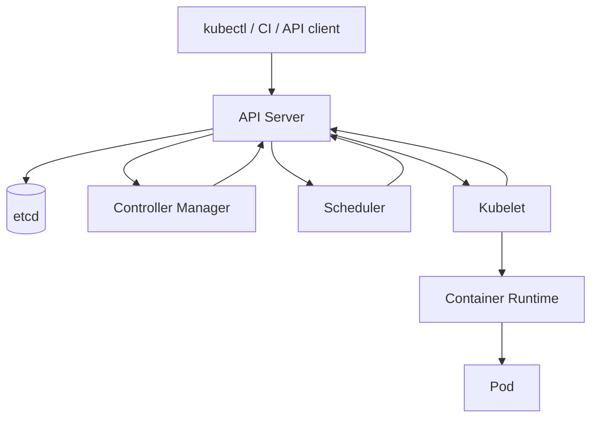

# Cluster Architecture và Reconciliation

> [← Kubernetes overview](README.md) · [References](references.md)

## Hiểu trong 5 phút

Kubernetes không "chạy YAML". Kubernetes lưu desired state rồi nhiều control loops liên tục reconcile observed state về desired state.



Ví dụ desired state:

```yaml
spec:
  replicas: 3
```

Nếu observed state chỉ còn 2 Pods, controller tạo thêm work để quay lại 3.

---

# 1. API Server là front door của control plane

Mọi client/control component làm việc qua Kubernetes API.

```bash
kubectl get deployment demo-api -o yaml
```

Bạn sẽ thấy hai nhóm quan trọng:

```text
spec   → desired state
status → observed state reported by controllers/kubelets
```

Không edit `status` để "fix" resource. Controller sẽ tiếp tục reconcile từ `spec` và external observations.

---

# 2. etcd giữ cluster state

Mental model:

```text
API objects / cluster state
        ↓
      etcd
```

etcd là critical control-plane dependency. Application Pods không query etcd trực tiếp.

Managed Kubernetes có thể ẩn control-plane operations, nhưng architectural fact vẫn quan trọng cho backup/availability/control-plane failure reasoning.

---

# 3. Controller là reconciliation loop

Conceptual pseudo-code:

```csharp
while (!cancellationToken.IsCancellationRequested)
{
    var desired = ReadDesiredState();
    var observed = ReadObservedState();

    var actions = Compare(desired, observed);

    foreach (var action in actions)
    {
        Apply(action);
    }

    await WaitForNextEventAsync(cancellationToken);
}
```

Kubernetes controllers thực tế event/watch/retry phức tạp hơn, nhưng mental model trên giải thích vì sao platform **eventually converges** thay vì một imperative script hoàn thành mọi thứ ngay lập tức.

---

# 4. Deployment → ReplicaSet → Pod

Apply:

```yaml
apiVersion: apps/v1
kind: Deployment
metadata:
  name: demo-api
spec:
  replicas: 3
  selector:
    matchLabels:
      app: demo-api
  template:
    metadata:
      labels:
        app: demo-api
    spec:
      containers:
        - name: api
          image: nginx:alpine
```

```bash
kubectl apply -f deployment.yaml
kubectl get deployment demo-api
kubectl get replicasets
kubectl get pods -l app=demo-api
```

Quan hệ:

```text
Deployment
   ↓ owns
ReplicaSet
   ↓ owns
Pods
```

Inspect owner references:

```bash
kubectl get pod <pod> -o jsonpath='{.metadata.ownerReferences}'
```

---

# 5. Self-healing lab

Delete một Pod:

```bash
kubectl delete pod <pod-name>
```

Ngay sau đó:

```bash
kubectl get pods -l app=demo-api -w
```

Expected:

```text
old Pod terminating
new Pod created
replica count returns to 3
```

Important: Kubernetes không "cứu" Pod identity cũ. Controller tạo replacement để thỏa desired state.

Do đó application state không nên mặc định gắn với ephemeral Pod filesystem/identity.

---

# 6. Scheduler làm gì?

Khi Pod chưa có node assignment:

```text
Pod Pending
↓
Scheduler evaluates feasible nodes
↓
resource requests + constraints + policies
↓
Pod bound to Node
```

Inspect:

```bash
kubectl get pod <pod> -o wide
kubectl describe pod <pod>
```

Nếu Pod Pending, Events có thể nói:

```text
Insufficient cpu
Insufficient memory
node selector mismatch
untolerated taint
PVC scheduling constraint
```

Không restart Pod trước khi đọc scheduling reason.

---

# 7. Kubelet làm gì?

Kubelet trên node quan sát Pods assigned cho node và làm việc với container runtime để hiện thực Pod spec.

Mental model:

```text
API says:
"Pod X belongs to Node A"

Kubelet Node A:
"ensure containers, volumes, probes and status for Pod X"
```

Kubelet report status về API server.

---

# 8. Desired state không có nghĩa instant state

Bạn apply:

```bash
kubectl scale deployment demo-api --replicas=10
```

Immediately:

```bash
kubectl get deployment demo-api
```

Có thể thấy:

```text
DESIRED 10
CURRENT 7
AVAILABLE 5
```

System đang converging.

Automation phải chờ condition, không assume `kubectl apply` return = rollout complete.

```bash
kubectl rollout status deployment/demo-api --timeout=2m
```

---

# 9. `metadata.generation` và observed rollout thinking

Khi spec thay đổi, controllers cần reconcile generation mới. Bạn không cần memorize every field, nhưng phải phân biệt:

```text
API accepted desired state
≠
controller observed it
≠
workload ready
```

CI/CD gate nên wait rollout/readiness, không chỉ exit code của `kubectl apply`.

---

# 10. Labels và selectors là control relationship

Deployment selector:

```yaml
selector:
  matchLabels:
    app: demo-api
```

Pod template labels:

```yaml
metadata:
  labels:
    app: demo-api
```

Selectors sai tạo behavior rất khác expectation.

Service cũng dùng labels để chọn Pods, nên labels không chỉ để "organize resources".

---

# 11. Reconciliation và manual mutation

Nếu GitOps/CI declares:

```yaml
replicas: 3
```

operator chạy:

```bash
kubectl scale deployment demo-api --replicas=10
```

Một automation khác có thể reconcile về 3 sau đó.

Bạn phải biết **source of truth**:

```text
Git manifest?
Helm release?
operator/custom controller?
manual cluster mutation?
```

Drift không thể giải quyết nếu nhiều actors cùng sở hữu desired state không rõ ràng.

---

# 12. Deployment rollout internals đơn giản

Khi Pod template đổi:

```text
Deployment
↓ creates new ReplicaSet
old ReplicaSet + new ReplicaSet coexist temporarily
↓ scale old down / new up
Pods transition readiness
```

Inspect:

```bash
kubectl get rs
kubectl rollout history deployment/demo-api
kubectl rollout status deployment/demo-api
```

---

# 13. Failure lab — broken image

```bash
kubectl set image deployment/demo-api \
  api=registry.example/not-found:v999
```

Watch:

```bash
kubectl get pods -w
kubectl describe pod <new-pod>
kubectl rollout status deployment/demo-api --timeout=60s
```

Expected: rollout không hoàn tất vì new Pods cannot pull/run image.

Rollback:

```bash
kubectl rollout undo deployment/demo-api
```

Evidence:

```text
Events
Pod status
Deployment conditions
ReplicaSets
rollback result
```

---

# 14. Failure lab — insufficient resources

Set impossible request local cluster:

```yaml
resources:
  requests:
    cpu: "100"
    memory: 100Gi
```

Apply rồi:

```bash
kubectl describe pod <pod>
```

Expected: Pod Pending; scheduler Events explain no feasible node.

Lesson:

```text
container can be perfectly valid
but workload cannot be scheduled
```

---

# 15. Node operations

Inspect nodes:

```bash
kubectl get nodes
kubectl describe node <node>
```

Cordon:

```bash
kubectl cordon <node>
```

Node becomes unschedulable for new Pods.

Drain in a disposable/local lab only:

```bash
kubectl drain <node> --ignore-daemonsets
```

Drain can disrupt workloads; understand PodDisruptionBudget/stateful behavior before production use.

---

# 16. Control plane failure thinking

If API server temporarily unavailable:

```text
existing application containers may continue running
but new desired-state changes/status/control operations are impaired
```

If scheduler unavailable:

```text
already-scheduled Pods may continue
new unscheduled Pods cannot be placed normally
```

If a node/kubelet fails:

```text
workload availability depends on controllers, node detection and replacement capacity
```

Architect must separate **data-plane workload serving** from **control-plane reconciliation**.

---

# 17. Troubleshooting order

When "deployment doesn't work":

```text
1. kubectl get deployment
2. kubectl describe deployment
3. kubectl get rs
4. kubectl get pods -o wide
5. kubectl describe pod
6. kubectl logs / --previous
7. inspect Service/EndpointSlice if traffic issue
8. inspect node/resource/policy if scheduling issue
```

Đừng bắt đầu bằng delete/restart everything.

---

# 18. Architect perspective

Kubernetes adds:

```text
declarative desired state
continuous reconciliation
cluster scheduler
workload abstraction
service discovery primitives
policy/control plane
```

Nó cũng adds:

```text
control-plane complexity
YAML/API evolution
RBAC/policy complexity
cluster/network/storage operations
upgrade lifecycle
new failure modes
```

Question không phải "Kubernetes có powerful không?" mà là:

> Requirements có đáng để team sở hữu complexity này không?

---

# 19. Exit criteria

Bạn hoàn thành chapter khi có thể:

- giải thích API server/etcd/controller/scheduler/kubelet responsibility;
- phân biệt desired vs observed state;
- trace Deployment → ReplicaSet → Pod ownership;
- delete Pod và giải thích replacement;
- debug Pending từ scheduler Events;
- wait rollout thay vì assume apply = ready;
- rollback broken image rollout;
- giải thích control plane vs data plane;
- xác định source of truth tránh drift/manual ownership conflict.

## Official English Sources

- [Kubernetes components](https://kubernetes.io/docs/concepts/overview/components/)
- [Kubernetes object management](https://kubernetes.io/docs/concepts/overview/working-with-objects/object-management/)
- [Deployments](https://kubernetes.io/docs/concepts/workloads/controllers/deployment/)
- [Scheduling](https://kubernetes.io/docs/concepts/scheduling-eviction/)

## Verification metadata

- Verified: 2026-08-12.
- Baseline: Kubernetes 1.36.x.
- Status: code-first deep rewrite.
