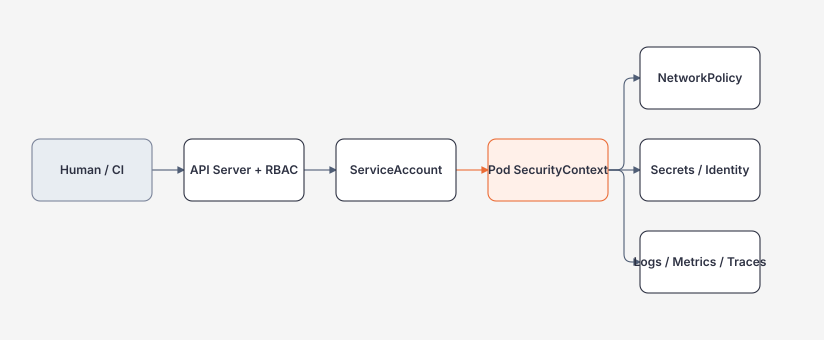

# Kubernetes Security, Observability và Operations

> [← Kubernetes overview](README.md) · [References](references.md)

## Hiểu trong 5 phút

Kubernetes security không phải một checkbox `runAsNonRoot: true`.

Bạn phải bảo vệ nhiều boundaries:



Operations cũng không phải chỉ `kubectl restart`.

Bạn cần:

```text
rollout
rollback
resource evidence
incident debugging
upgrade compatibility
backup/restore
policy ownership
```

---

# 1. Human/CI access: RBAC least privilege

Read-only Role trong namespace:

```yaml
apiVersion: rbac.authorization.k8s.io/v1
kind: Role
metadata:
  name: workload-reader
  namespace: orders
rules:
  - apiGroups: [""]
    resources: ["pods", "services", "configmaps"]
    verbs: ["get", "list", "watch"]
  - apiGroups: ["apps"]
    resources: ["deployments", "replicasets"]
    verbs: ["get", "list", "watch"]
```

Bind user/group example:

```yaml
apiVersion: rbac.authorization.k8s.io/v1
kind: RoleBinding
metadata:
  name: workload-readers
  namespace: orders
subjects:
  - kind: Group
    name: developers
    apiGroup: rbac.authorization.k8s.io
roleRef:
  kind: Role
  name: workload-reader
  apiGroup: rbac.authorization.k8s.io
```

Test authorization:

```bash
kubectl auth can-i get pods -n orders
kubectl auth can-i delete pods -n orders
```

Expected for read-only identity:

```text
yes
no
```

---

# 2. ServiceAccount cho workload

```yaml
apiVersion: v1
kind: ServiceAccount
metadata:
  name: orders-api
  namespace: orders
```

Deployment:

```yaml
spec:
  template:
    spec:
      serviceAccountName: orders-api
```

Đừng dùng default ServiceAccount permissions/credentials như assumption.

Nếu workload không cần Kubernetes API, không cấp Role chỉ vì "service account phải có quyền gì đó".

---

# 3. Workload identity tốt hơn static cloud credential

Bad:

```yaml
env:
  - name: AZURE_CLIENT_SECRET
    valueFrom:
      secretKeyRef:
        name: cloud-credentials
        key: client-secret
```

Nếu platform hỗ trợ workload identity/federated identity, ưu tiên short-lived platform identity thay long-lived static secret khi phù hợp.

Mental model:

```text
Pod identity
↓ federation
cloud identity
↓ policy
specific resource
```

Không biến Kubernetes Secret thành credential vault cho mọi external system.

---

# 4. Pod `securityContext`

Example baseline:

```yaml
spec:
  securityContext:
    seccompProfile:
      type: RuntimeDefault
  containers:
    - name: api
      image: registry.example/orders-api@sha256:replace-me
      securityContext:
        allowPrivilegeEscalation: false
        readOnlyRootFilesystem: true
        runAsNonRoot: true
        capabilities:
          drop:
            - ALL
```

Application phải tương thích với read-only filesystem. Nếu cần temp:

```yaml
volumes:
  - name: tmp
    emptyDir: {}

containers:
  - name: api
    volumeMounts:
      - name: tmp
        mountPath: /tmp
```

Security hardening phải được test, không copy rồi disable khi app fail mà không điều tra.

---

# 5. Privileged/host mounts là high blast radius

Avoid unless requirement cực rõ:

```yaml
securityContext:
  privileged: true
```

or:

```yaml
hostPID: true
hostNetwork: true
```

or hostPath sensitive mounts.

Mỗi exception phải có:

```text
owner
reason
scope
expiry/review
compensating controls
```

---

# 6. NetworkPolicy mental model

Without network policy enforcement/design, workload network may be more permissive than expected.

Example default deny ingress trong namespace:

```yaml
apiVersion: networking.k8s.io/v1
kind: NetworkPolicy
metadata:
  name: default-deny-ingress
  namespace: orders
spec:
  podSelector: {}
  policyTypes:
    - Ingress
```

Allow ingress to API from ingress-controller labeled Pods/namespaces depends on cluster topology/CNI labels.

Generic same-namespace example:

```yaml
apiVersion: networking.k8s.io/v1
kind: NetworkPolicy
metadata:
  name: allow-web-to-orders
  namespace: orders
spec:
  podSelector:
    matchLabels:
      app: orders-api
  policyTypes:
    - Ingress
  ingress:
    - from:
        - podSelector:
            matchLabels:
              app: web
      ports:
        - protocol: TCP
          port: 8080
```

NetworkPolicy behavior requires network plugin/CNI support.

---

# 7. Negative network test

Deploy two clients:

```text
web pod        → should reach orders-api
random pod     → should NOT reach orders-api
```

Test from Pods:

```bash
kubectl exec web-pod -- \
  wget -qO- http://orders-api

kubectl exec random-pod -- \
  wget -qO- http://orders-api
```

Security control phải có negative test, không chỉ manifest review.

---

# 8. Secret exposure review

Inspect who can read Secrets:

```bash
kubectl auth can-i get secrets -n orders
kubectl auth can-i list secrets -n orders
```

`list secrets` can be highly sensitive.

Also consider:

```text
secret values in environment
process dumps
application logs
kubectl describe output
CI logs
support bundles
```

Secret lifecycle includes creation → distribution → use → rotation → revocation → audit.

---

# 9. Image provenance / immutable identity

Deployment:

```yaml
image: registry.example/orders-api@sha256:abc123...
```

Avoid relying only on mutable `latest`.

Deployment evidence:

```text
git SHA
CI run
image digest
Kubernetes rollout revision
telemetry service.version
```

This supports rollback and incident correlation.

---

# 10. Logs

Basic:

```bash
kubectl logs deployment/orders-api
kubectl logs <pod> -c api
kubectl logs <pod> --previous
```

`--previous` rất quan trọng khi container crashed/restarted.

Application log structured:

```csharp
logger.LogError(
    exception,
    "Failed order {OrderId} for tenant {TenantId}",
    orderId,
    tenantId);
```

Avoid high-sensitive payload/token.

---

# 11. Events

```bash
kubectl get events --sort-by=.lastTimestamp
kubectl describe pod <pod>
```

Events hữu ích cho:

```text
scheduling
image pull
probe failures
mount failures
container restarts
```

Events không thay persistent observability backend; retention có thể ngắn.

---

# 12. Resource observability

Nếu Metrics Server available:

```bash
kubectl top pods -n orders
kubectl top nodes
```

But CPU/memory alone do not answer user impact.

Need application metrics:

```text
RPS
error rate
P95/P99 latency
queue depth
DB latency
business success
```

Platform + application telemetry phải correlate.

---

# 13. OpenTelemetry in Kubernetes

Application should export traces/metrics/logs to collector/backend architecture.

Concept:

```text
ASP.NET Pods
   ↓ OTLP
OpenTelemetry Collector
   ↓
observability backend
```

Collector deployment model can be gateway/agent/other topology depending requirements.

Don't add collector complexity without retention/export/ownership plan.

---

# 14. Rollout monitoring

```bash
kubectl rollout status deployment/orders-api --timeout=2m
```

Then verify app metrics, not just Kubernetes readiness.

Canary/rolling deployment can be technically ready but business error rate still regress.

Release gate should consider:

```text
Kubernetes conditions
+
application SLO
+
business/eval metrics where relevant
```

---

# 15. Rollback

```bash
kubectl rollout undo deployment/orders-api
```

Before trusting rollback, ask:

```text
DB migration backward-compatible?
message schema compatible?
cache format compatible?
external side effects already performed?
```

Container rollback cannot reverse committed external data automatically.

---

# 16. PodDisruptionBudget + node maintenance

```yaml
apiVersion: policy/v1
kind: PodDisruptionBudget
metadata:
  name: orders-api
spec:
  minAvailable: 2
  selector:
    matchLabels:
      app: orders-api
```

During node drain/voluntary disruption, PDB constrains eviction availability.

But if cluster only has capacity for two Pods and you demand minAvailable=3, maintenance/rollout can block.

Availability policy must match real capacity.

---

# 17. Upgrade thinking

Cluster upgrade includes multiple compatibility layers:

```text
Kubernetes version
API versions
CNI
CSI/storage
Ingress/Gateway/controller
operators/CRDs
Helm charts
workload manifests
```

Before upgrade:

```text
inventory deprecated APIs
compatibility matrix
staging rehearsal
backup/recovery
rollout plan
rollback/support plan
```

Do not treat managed Kubernetes upgrade button as zero-risk because control plane is managed.

---

# 18. Namespace and quota

ResourceQuota example:

```yaml
apiVersion: v1
kind: ResourceQuota
metadata:
  name: orders-quota
  namespace: orders
spec:
  hard:
    requests.cpu: "8"
    requests.memory: 16Gi
    limits.memory: 32Gi
    pods: "100"
```

Quota bounds blast radius/capacity consumption but can also cause deploy failures when exhausted.

Debug:

```bash
kubectl describe resourcequota -n orders
```

---

# 19. LimitRange

```yaml
apiVersion: v1
kind: LimitRange
metadata:
  name: default-container-resources
  namespace: orders
spec:
  limits:
    - type: Container
      defaultRequest:
        cpu: 100m
        memory: 128Mi
      default:
        memory: 256Mi
```

Defaults reduce unbounded workloads but may hide incorrect sizing. Teams still need explicit measurement.

---

# 20. Incident flow

Pod restarting:

```text
kubectl get pods
↓
kubectl describe pod
↓
kubectl logs --previous
↓
lastState / exit code / OOMKilled
↓
resource metrics / app traces
↓
deployment/config/image change
```

Service errors but Pods ready:

```text
SLO alert
↓
trace dependency latency
↓
DB/HTTP/queue failure
```

Don't assume Kubernetes issue just because app runs on Kubernetes.

---

# 21. Failure lab — RBAC

Create read-only ServiceAccount/Role.

Test:

```bash
kubectl auth can-i get pods \
  --as=system:serviceaccount:orders:reader \
  -n orders

kubectl auth can-i delete deployments \
  --as=system:serviceaccount:orders:reader \
  -n orders
```

Expected:

```text
yes
no
```

---

# 22. Failure lab — read-only filesystem

Deploy app with:

```yaml
readOnlyRootFilesystem: true
```

Trigger endpoint writing local file.

Expected: fail.

Then redesign explicit writable mount/path instead of disabling security globally.

---

# 23. Failure lab — network deny

Apply default-deny, verify clients fail. Then add least-permission allow rule and verify only approved caller succeeds.

Evidence:

```text
before policy
with deny
with explicit allow
```

---

# 24. Failure lab — rolling regression

Deploy v2 with 500ms artificial latency.

Observe:

```text
rollout status = successful
but P95 latency regresses
```

This teaches:

> Kubernetes readiness is necessary operational signal, not complete release-quality evidence.

Rollback and verify SLO recovery.

---

# 25. Backup/DR thinking

Kubernetes manifests alone are not full backup.

Need consider:

```text
cluster configuration / IaC
Secrets/identity configuration
PersistentVolume data
external managed DBs
CRDs/operator state
registry artifacts
restore procedure
```

RPO/RTO should drive backup/restore design.

Practice restore, not just backup creation.

---

# 26. Architect checklist

```text
[ ] Who can mutate cluster/workload?
[ ] Workload identity least privilege?
[ ] Container privilege/read-only/seccomp reviewed?
[ ] Network default/allow policy explicit?
[ ] Secret lifecycle and rotation defined?
[ ] Image digest traceable?
[ ] Resource requests/limits measured?
[ ] SLO + OTel evidence available?
[ ] Rollback compatible with DB/message schemas?
[ ] Upgrade ownership and cadence defined?
[ ] Backup restore rehearsed?
[ ] Kubernetes complexity justified by NFR?
```

---

# 27. Exit criteria

Bạn hoàn thành chapter khi có thể:

- viết/test least-privilege RBAC;
- assign dedicated ServiceAccount;
- harden Pod security context và negative-test writes/privilege;
- design/test NetworkPolicy;
- explain Secret vs workload identity;
- debug restart/OOM/probe/image issues;
- correlate Kubernetes rollout với app SLO;
- rollback workload và discuss schema compatibility;
- prepare upgrade/backup/restore runbook;
- review whether Kubernetes is still the simplest justified platform.

## Official English Sources

- [Kubernetes security](https://kubernetes.io/docs/concepts/security/)
- [RBAC](https://kubernetes.io/docs/reference/access-authn-authz/rbac/)
- [Security Context](https://kubernetes.io/docs/tasks/configure-pod-container/security-context/)
- [Network Policies](https://kubernetes.io/docs/concepts/services-networking/network-policies/)
- [Resource management](https://kubernetes.io/docs/concepts/configuration/manage-resources-containers/)
- [Observability](https://kubernetes.io/docs/concepts/cluster-administration/observability/)

## Verification metadata

- Verified: 2026-08-12.
- Baseline: Kubernetes 1.36.x.
- Status: code-first deep rewrite.
