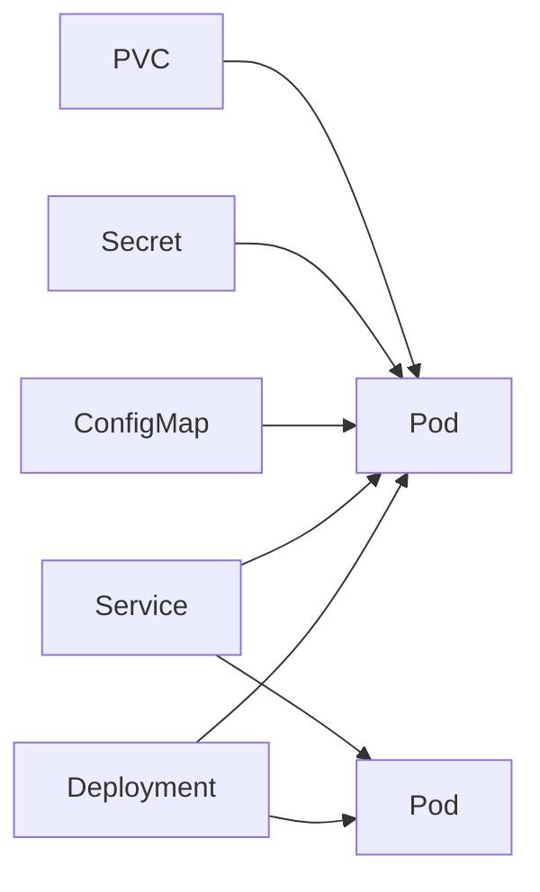

# Workloads, Networking và Storage

> [← Kubernetes overview](README.md) · [References](references.md)

## Hiểu trong 5 phút

Một web workload production tối thiểu thường nối các primitives:



Mỗi primitive giải một problem khác nhau. Đừng dùng Pod YAML đơn lẻ rồi gọi đó là deployment architecture.

---

# 1. Deployment production-like

```yaml
apiVersion: apps/v1
kind: Deployment
metadata:
  name: orders-api
spec:
  replicas: 3
  selector:
    matchLabels:
      app: orders-api
  strategy:
    type: RollingUpdate
    rollingUpdate:
      maxUnavailable: 0
      maxSurge: 1
  template:
    metadata:
      labels:
        app: orders-api
    spec:
      containers:
        - name: api
          image: registry.example/orders-api@sha256:replace-me
          ports:
            - name: http
              containerPort: 8080
          envFrom:
            - configMapRef:
                name: orders-config
          resources:
            requests:
              cpu: 250m
              memory: 256Mi
            limits:
              memory: 512Mi
          readinessProbe:
            httpGet:
              path: /health/ready
              port: http
            periodSeconds: 5
            timeoutSeconds: 2
            failureThreshold: 3
          livenessProbe:
            httpGet:
              path: /health/live
              port: http
            periodSeconds: 10
            timeoutSeconds: 2
            failureThreshold: 3
```

Các numbers chỉ là example. Production values phải từ measurement.

---

# 2. Service

```yaml
apiVersion: v1
kind: Service
metadata:
  name: orders-api
spec:
  selector:
    app: orders-api
  ports:
    - name: http
      port: 80
      targetPort: http
```

Caller trong cluster có thể dùng DNS:

```text
http://orders-api
```

Nếu khác namespace:

```text
orders-api.<namespace>.svc.cluster.local
```

Thường short service DNS đủ trong same namespace.

---

# 3. Debug Service selector

Pods:

```bash
kubectl get pods -l app=orders-api --show-labels
```

Service:

```bash
kubectl get service orders-api -o yaml
```

Endpoints:

```bash
kubectl get endpointslices \
  -l kubernetes.io/service-name=orders-api
```

Nếu Service có DNS nhưng không có ready endpoints, debug selector/readiness trước network magic.

---

# 4. App phải listen đúng interface

Nếu ASP.NET Core container chỉ listen `127.0.0.1:8080`, traffic từ Pod network bên ngoài process namespace có thể không tới như expected.

Typical container binding:

```text
http://0.0.0.0:8080
```

.NET container config có thể dùng environment/config appropriate to image/app.

Verify trong Pod:

```bash
kubectl logs <pod>
```

và endpoint/probe behavior, thay vì assume `containerPort` tự làm app listen.

`containerPort` là metadata/config hint; nó không mở port nếu process không listen.

---

# 5. ConfigMap

```yaml
apiVersion: v1
kind: ConfigMap
metadata:
  name: orders-config
data:
  Features__NewCheckout: "true"
  ExternalApis__Catalog__BaseUrl: "http://catalog-api"
```

Use:

```yaml
envFrom:
  - configMapRef:
      name: orders-config
```

.NET reads environment variables via normal configuration pipeline.

```csharp
var enabled = builder.Configuration
    .GetValue<bool>("Features:NewCheckout");
```

Double underscore maps nested configuration keys in environment variables.

---

# 6. Secret

```yaml
apiVersion: v1
kind: Secret
metadata:
  name: orders-secret
type: Opaque
stringData:
  ConnectionStrings__Sql: "replace-at-deploy"
```

Use:

```yaml
envFrom:
  - secretRef:
      name: orders-secret
```

Do not commit real secret manifest values to Git.

Base64 encoding in YAML is not encryption.

Production secret design cần xem external secret store/workload identity/RBAC/rotation/encryption-at-rest.

---

# 7. Secret as file

```yaml
volumes:
  - name: signing-key
    secret:
      secretName: signing-key

containers:
  - name: api
    volumeMounts:
      - name: signing-key
        mountPath: /var/run/secrets/signing
        readOnly: true
```

App:

```csharp
var pem = await File.ReadAllTextAsync(
    "/var/run/secrets/signing/key.pem",
    cancellationToken);
```

File-based secret có rotation/update semantics riêng; app phải biết có reload hay cần restart.

---

# 8. Readiness probe

ASP.NET Core:

```csharp
builder.Services
    .AddHealthChecks()
    .AddCheck<StartupHealthCheck>("startup", tags: ["ready"]);
```

```csharp
app.MapHealthChecks("/health/ready", new HealthCheckOptions
{
    Predicate = x => x.Tags.Contains("ready")
});
```

Kubernetes:

```yaml
readinessProbe:
  httpGet:
    path: /health/ready
    port: http
```

When readiness fails:

```text
Pod may remain Running
but should stop receiving normal Service traffic
```

Đây khác liveness restart semantics.

---

# 9. Startup probe

Nếu app legitimately startup lâu:

```yaml
startupProbe:
  httpGet:
    path: /health/live
    port: http
  periodSeconds: 5
  failureThreshold: 30
```

Trong startup period, startup probe giúp tránh liveness giết app quá sớm.

Nhưng app startup 10 phút vẫn cần architecture review; đừng dùng startupProbe để che pathological startup.

---

# 10. Requests và scheduler

```yaml
resources:
  requests:
    cpu: 250m
    memory: 256Mi
```

Scheduler uses requests as input for placement/capacity.

If request quá cao:

```text
Pod Pending
Events: Insufficient cpu/memory
```

If request quá thấp so reality:

```text
node overcommit / contention
latency noisy
capacity planning misleading
```

---

# 11. Memory limit và OOM

```yaml
limits:
  memory: 512Mi
```

Load test endpoint/worker. Observe:

```bash
kubectl top pod
kubectl describe pod <pod>
```

After restart:

```bash
kubectl get pod <pod> \
  -o jsonpath='{.status.containerStatuses[0].lastState.terminated.reason}'
```

Possible evidence:

```text
OOMKilled
```

Tune .NET allocations/GC/workload and limit based on measurement, not random increase.

---

# 12. PersistentVolumeClaim

Example claim:

```yaml
apiVersion: v1
kind: PersistentVolumeClaim
metadata:
  name: app-data
spec:
  accessModes:
    - ReadWriteOnce
  resources:
    requests:
      storage: 10Gi
```

Mount:

```yaml
volumes:
  - name: data
    persistentVolumeClaim:
      claimName: app-data

containers:
  - name: app
    volumeMounts:
      - name: data
        mountPath: /data
```

PVC is request/binding abstraction. It does not guarantee your data model is safe for multiple replicas.

A SQLite file on one PVC is not magically a distributed database.

---

# 13. StatefulSets: only when identity/storage semantics need it

Do not use StatefulSet because "database-like name" sounds production.

StatefulSet provides stable ordinal identity/storage association patterns useful for some stateful apps.

But managed databases often remain simpler/better than operating your own DB in Kubernetes unless team has strong reasons/skills.

---

# 14. Ingress vs Service

Service:

```text
stable service abstraction inside/external depending type
```

Ingress/Gateway:

```text
HTTP routing from ingress boundary to Services
```

Example conceptual Ingress:

```yaml
apiVersion: networking.k8s.io/v1
kind: Ingress
metadata:
  name: app
spec:
  rules:
    - host: api.example.com
      http:
        paths:
          - path: /
            pathType: Prefix
            backend:
              service:
                name: orders-api
                port:
                  number: 80
```

Actual controller/TLS/annotations are implementation-specific; don't copy cloud/controller config blindly.

---

# 15. Service types

```text
ClusterIP
→ internal cluster service default

LoadBalancer
→ request external load balancer integration on supported platform

NodePort
→ exposes port on nodes; usually lower-level building block
```

Choose based on ingress/network architecture, not preference.

---

# 16. PodDisruptionBudget thinking

For replicated API:

```yaml
apiVersion: policy/v1
kind: PodDisruptionBudget
metadata:
  name: orders-api
spec:
  minAvailable: 2
  selector:
    matchLabels:
      app: orders-api
```

PDB affects voluntary disruptions; it is not general HA guarantee and cannot create capacity that doesn't exist.

Use with understanding of replica count, rollout and node maintenance.

---

# 17. Horizontal autoscaling mental model

```text
metric signal
↓
HPA computes desired replicas
↓
Deployment replicas change
↓
Scheduler places new Pods
↓
Pods become ready
```

Autoscaling has lag.

If startup takes 2 minutes and traffic spike lasts 30 seconds, HPA may not save latency alone.

Before autoscaling:

```text
resource requests accurate?
metric meaningful?
startup time?
downstream DB capacity?
```

Scaling API 10x may overload SQL 10x.

---

# 18. Failure lab — broken Service selector

Service:

```yaml
selector:
  app: wrong-label
```

Observe:

```bash
kubectl get endpointslices \
  -l kubernetes.io/service-name=orders-api
```

Expected: no matching endpoints.

Fix selector and observe recovery without restarting Pods.

---

# 19. Failure lab — readiness false

Make `/health/ready` return 503.

Observe:

```bash
kubectl get pods
kubectl describe pod <pod>
kubectl get endpointslices
```

Lesson:

```text
Running != Ready
```

---

# 20. Failure lab — config rollout

ConfigMap changes don't always imply application process reload semantics you want.

For env-var config, Pods generally need replacement to get new env values.

Safe pattern often includes config checksum/version in deployment process or explicit rollout:

```bash
kubectl rollout restart deployment/orders-api
kubectl rollout status deployment/orders-api
```

But controlled deployment/versioning is better than manual restart folklore.

---

# 21. Troubleshooting Service path

```text
Client
↓
DNS resolves Service?
↓
Service selector correct?
↓
EndpointSlice has ready endpoints?
↓
Pod Ready?
↓
targetPort correct?
↓
process listening on correct interface/port?
↓
NetworkPolicy permits traffic?
```

Debug layer by layer.

---

# 22. Exit criteria

Bạn hoàn thành chapter khi có thể:

- deploy replicated API;
- expose bằng Service và debug endpoints;
- inject ConfigMap/Secret đúng boundary;
- giải thích readiness/liveness/startup probes;
- set/measure requests và memory limit;
- reproduce OOM/scheduling issue;
- mount PVC và giải thích storage semantics;
- phân biệt Deployment/StatefulSet;
- debug Ingress→Service→Pod path;
- giải thích autoscaling không tự tăng downstream capacity.

## Official English Sources

- [Deployments](https://kubernetes.io/docs/concepts/workloads/controllers/deployment/)
- [Services](https://kubernetes.io/docs/concepts/services-networking/service/)
- [ConfigMaps](https://kubernetes.io/docs/concepts/configuration/configmap/)
- [Secrets](https://kubernetes.io/docs/concepts/configuration/secret/)
- [Probes](https://kubernetes.io/docs/concepts/configuration/liveness-readiness-startup-probes/)
- [Persistent Volumes](https://kubernetes.io/docs/concepts/storage/persistent-volumes/)

## Verification metadata

- Verified: 2026-08-12.
- Baseline: Kubernetes 1.36.x.
- Status: code-first deep rewrite.
