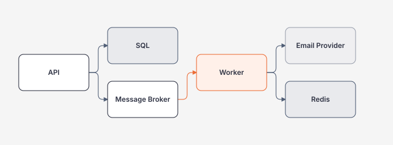

# Module 17 — Distributed Systems

> [← Kubernetes](../15-kubernetes/README.md) · [Roadmap](../00-roadmap/README.md)

Distributed Systems bắt đầu khi một business operation đi qua **process/network/storage boundary** và bạn không còn có thể giả định mọi thành phần cùng thành công hoặc cùng thất bại.

## Hiểu trong 5 phút

Một request đơn giản có thể thành:



Bây giờ có những trạng thái như:

```text
API timeout nhưng SQL đã commit
message delivered hai lần
worker crash sau side effect nhưng trước ACK
consumer B chậm hơn producer
message 10 xử lý trước message 9
email provider timeout nhưng email có thể đã được gửi
```

Distributed Systems không phải học tên pattern. Bạn phải thiết kế **failure semantics**.

---

# 1. Các invariant quan trọng

Ví dụ hệ thống notifications:

```text
Business event được lưu thành công
        ↓
phải eventually publish notification intent
        ↓
consumer có thể nhận duplicate
        ↓
user không được nhận duplicate business effect ngoài policy
```

Không đủ nói:

> "Broker reliable nên không mất message."

Bạn phải chỉ ra boundary:

```text
DB commit
message publish
consumer side effect
ACK
```

và failure giữa từng bước.

---

# 2. Mental model cốt lõi

```text
Local operation
    ↓ network boundary
Remote operation

Network result:
- success
- explicit failure
- timeout / unknown outcome
```

`timeout` đặc biệt nguy hiểm vì caller không biết chắc remote side đã thực hiện side effect hay chưa.

Ví dụ:

```text
POST /charge
↓
payment provider charges card
↓
response lost
↓
client sees timeout
```

Retry mù có thể charge lần hai.

---

# 3. Module learning slices

| Guide | Bạn phải làm được |
| --- | --- |
| [Partial Failure, Timeouts, Retries và Idempotency](partial-failure-timeouts-retries-and-idempotency.md) | phân loại failure, đặt deadline, retry có bound, chống duplicate side effect |
| [Messaging, Outbox, Inbox và Dedup](messaging-outbox-inbox-and-dedup.md) | publish reliable từ DB, consume at-least-once, dedup/inbox, DLQ/replay |
| [Consistency, Ordering, Saga và Backpressure](consistency-ordering-saga-and-backpressure.md) | chọn consistency, giữ ordering khi cần, compensation, capacity/backpressure |

---

# 4. Reliability vocabulary phải hiểu đúng

## At-most-once

```text
Có thể mất message
nhưng không retry delivery để tránh duplicate delivery
```

## At-least-once

```text
Message có thể được deliver lại
consumer phải chịu duplicate delivery
```

## Exactly-once

Đừng coi đây là magic broker switch cho toàn business workflow.

Ngay cả khi một platform cung cấp exactly-once semantics trong phạm vi cụ thể, business side effect qua DB/API khác vẫn cần boundary reasoning.

Câu hỏi đúng:

```text
Exactly once ở layer nào?
Trong transaction boundary nào?
Có bao gồm external side effect không?
Failure/replay semantics thế nào?
```

---

# 5. Idempotency example

```csharp
public sealed record PaymentRequest(
    string IdempotencyKey,
    decimal Amount);
```

Pseudo-flow:

```csharp
var existing = await store.FindAsync(
    tenantId,
    request.IdempotencyKey,
    cancellationToken);

if (existing is not null)
{
    return existing.Result;
}

var reservation = await store.TryStartAsync(
    tenantId,
    request.IdempotencyKey,
    requestHash,
    cancellationToken);

if (!reservation.Acquired)
{
    return await reservation.WaitForResultAsync(cancellationToken);
}

var result = await ExecuteBusinessOperationAsync(cancellationToken);

await store.CompleteAsync(
    tenantId,
    request.IdempotencyKey,
    result,
    cancellationToken);
```

Production implementation phải protect race trên cùng key, scope key theo principal/tenant và validate request hash.

---

# 6. Outbox mental model

Bad dual write:

```text
BEGIN SQL TX
INSERT Order
COMMIT

publish OrderCreated
```

Crash sau commit trước publish:

```text
Order exists
message missing
```

Outbox:

```text
BEGIN SQL TX
  INSERT Order
  INSERT Outbox(OrderCreated)
COMMIT
        ↓
Publisher reads Outbox
        ↓
Broker
```

Business state + intent to publish nằm trong cùng local transaction.

---

# 7. Consumer at-least-once mental model

```text
Broker delivers M1
↓
Consumer performs DB update
↓
Consumer crashes before ACK
↓
Broker redelivers M1
```

Nếu update không idempotent/dedup:

```text
business effect can happen twice
```

Consumer cần:

```text
message identity
processed/inbox record or idempotent state transition
transaction boundary
ACK after durable effect
```

---

# 8. Backpressure

Nếu producer trung bình tạo 10,000 msg/s nhưng consumers xử lý 5,000 msg/s:

```text
queue depth grows forever
```

Queue không tạo capacity.

Need:

```text
producer rate
consumer throughput
queue depth
oldest-message age
retry rate
DLQ rate
```

Architect phải biết khi nào:

```text
scale consumers
shed/limit producer
batch
prioritize
partition
reduce work per message
```

---

# 9. Ordering

Global ordering thường đắt và làm giảm parallelism.

Nhiều hệ thống chỉ cần ordering theo aggregate/key:

```text
Customer 42 messages ordered
Customer 43 messages ordered independently
```

Partition key/session key thường được dùng để giữ local ordering while allowing parallelism across keys.

---

# 10. Saga / compensation

Một workflow:

```text
Create Order
↓
Reserve Inventory
↓
Charge Payment
↓
Arrange Shipment
```

Không nên giữ một SQL transaction xuyên qua 4 services.

Nếu shipment fail sau payment, có thể cần compensation:

```text
cancel reservation
refund payment
mark order failed
```

Compensation không phải database rollback. Nó là **new business action** và có thể tự fail/retry.

---

# 11. Failure drills bắt buộc

## Drill A — timeout after commit

Server commit DB rồi delay response. Client timeout/retry. Verify idempotency prevents duplicate business record.

## Drill B — crash before ACK

Consumer commit DB rồi terminate process trước ACK. Restart and verify duplicate delivery does not duplicate effect.

## Drill C — broker unavailable

Business transaction writes outbox while broker down. Restore broker and verify publisher catches up.

## Drill D — consumer slower than producer

Increase producer rate; observe queue depth/oldest age and scaling/backpressure behavior.

## Drill E — poison message

Message repeatedly fails deterministic validation. Verify bounded retry → DLQ/quarantine instead of infinite retry storm.

---

# 12. Observability

Một distributed operation cần correlation across boundaries:

```text
HTTP trace
  ↓
DB operation
  ↓
outbox event id
  ↓
broker message id
  ↓
consumer trace
  ↓
external side effect
```

Useful fields:

```text
trace_id
message_id
causation_id
correlation_id
tenant_id
attempt
handler
outcome
```

Không dùng message ID/correlation ID làm metric label cardinality cao.

---

# 13. Architecture questions

Trước khi thêm broker/microservice:

- synchronous request có đủ không?
- business có chấp nhận eventual consistency không?
- retry duplicate side effect có nguy hiểm không?
- ordering cần global hay per key?
- queue backlog tối đa chấp nhận bao lâu?
- DLQ ai sở hữu và replay ra sao?
- schema/event evolution strategy là gì?
- broker outage có chặn core write path không?
- local transaction + outbox có đơn giản hơn distributed transaction không?

---

# 14. Exit criteria

Bạn hoàn thành module khi có thể:

- phân biệt explicit failure và unknown outcome timeout;
- thiết kế retry có bound/jitter và không amplification;
- thiết kế idempotency cho write side effect;
- giải thích at-least-once bằng crash-before-ACK;
- implement outbox/inbox/dedup boundary;
- thiết kế DLQ/replay có audit;
- chọn ordering scope;
- giải thích eventual consistency bằng user-visible behavior;
- thiết kế saga/compensation;
- tính consumer capacity và backpressure từ workload;
- chạy failure drills và lưu evidence.

## Official references

Xem [references.md](references.md).

## Verification metadata

- Verified: 2026-08-12.
- Status: code-first v1.
- Focus: .NET backend + messaging/reliability patterns, broker-neutral concepts first.
