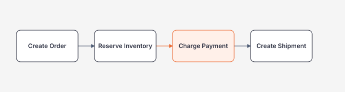
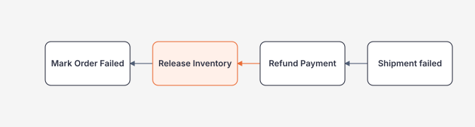

# Consistency, Ordering, Saga và Backpressure

> [← Distributed Systems](README.md)

## Hiểu trong 5 phút

Khi tách hệ thống thành nhiều services/processes, bạn thường đổi:

```text
single local transaction
```

thành:

```text
multiple local transactions
+
messages/network
+
eventual consistency
```

Từ đó xuất hiện bốn câu hỏi:

1. User có thể thấy state "chưa đồng bộ" bao lâu?
2. Message nào bắt buộc đúng thứ tự?
3. Nếu step 3 fail sau step 1–2 đã commit thì undo bằng gì?
4. Nếu producer nhanh hơn consumer thì hệ thống phản ứng ra sao?

---

# 1. Eventual consistency phải mô tả user-visible behavior

Không đủ ghi trong ADR:

> "System is eventually consistent."

Phải rõ:

```text
Order API returns Created
↓
search index may update within 5 seconds
↓
notification may arrive within 30 seconds
```

NFR:

```text
99.9% order-created events reflected in read model < 5s
oldest queue message < 30s
```

Consistency phải đo được.

---

# 2. Read-your-own-write problem

User creates order:

```http
POST /orders
→ 201 Created { "id": 123 }
```

Immediately:

```http
GET /search/orders?q=123
→ not found
```

Nếu search read model async, đây có thể là expected eventual behavior.

UX options:

```text
return authoritative resource URL
show "processing"
read from source-of-truth for immediate confirmation
client temporary merge of just-created item
```

Do not pretend async projection is strongly consistent.

---

# 3. Source of truth vs read model

```text
Orders SQL
→ authoritative transaction state

Search index
→ optimized derived read model

Redis cache
→ disposable performance copy
```

Recovery reasoning:

```text
If cache deleted → rebuild/refill
If search index lost → reindex from authoritative data/events
If SQL source lost → backup/restore/DR problem
```

Architecture improves when derived state can be recreated.

---

# 4. Ordering: global vs per aggregate

Suppose events:

```text
OrderCreated      sequence 1
OrderPaid         sequence 2
OrderCancelled    sequence 3
```

For one Order, order may matter.

But requiring one global sequence for **all orders** can destroy parallelism.

Better partition scope:

```text
partition key = OrderId
```

Then:

```text
Order 123 events serialized
Order 456 events serialized independently
```

This gives parallelism across aggregates.

---

# 5. Sequence number for stale/out-of-order events

Contract:

```csharp
public sealed record OrderStatusChangedV1(
    long OrderId,
    long Sequence,
    string Status);
```

Projection table:

```sql
CREATE TABLE dbo.OrderReadModel
(
    OrderId      bigint      NOT NULL PRIMARY KEY,
    Sequence     bigint      NOT NULL,
    Status       varchar(30) NOT NULL
);
```

Consumer:

```sql
UPDATE dbo.OrderReadModel
SET
    Sequence = @sequence,
    Status = @status
WHERE OrderId = @orderId
  AND Sequence < @sequence;
```

If affected rows = 0, event may be duplicate/stale or row absent.

Insert/update logic must still handle races atomically.

---

# 6. Don't rely only on arrival time

Bad:

```text
"Message arrived later, therefore it is newer."
```

Network/retry can reorder delivery.

Use domain sequence/version when business ordering matters.

```text
OccurredAt timestamps can help audit
but clocks/network order are not enough for strict aggregate ordering
```

---

# 7. Competing consumers and ordering

Queue with 4 consumers increases throughput:

```text
Q → C1
  → C2
  → C3
  → C4
```

But messages may complete out of order due to different processing times/retries.

If per-key ordering required, use broker partition/session/group semantics or application serialization by key.

Trade-off:

```text
more ordering constraint
→ less parallelism within ordered key
```

---

# 8. Saga example

Checkout:



Each step commits locally.

If shipment fails:

```text
Cannot SQL ROLLBACK payment in another service.
```

Compensation:



Compensation is another distributed workflow and can fail independently.

---

# 9. Saga state machine

Persist workflow state:

```csharp
public enum CheckoutState
{
    Started,
    InventoryReserved,
    PaymentCharged,
    ShipmentCreated,
    Compensating,
    Failed,
    Completed
}
```

State table:

```sql
CREATE TABLE dbo.CheckoutSagas
(
    SagaId           uniqueidentifier NOT NULL PRIMARY KEY,
    OrderId          bigint           NOT NULL,
    State            varchar(50)      NOT NULL,
    Version          int              NOT NULL,
    UpdatedAt        datetime2        NOT NULL
);
```

Persisting saga state supports crash recovery/reconciliation.

Do not keep saga state only in process memory.

---

# 10. Orchestration vs choreography

## Orchestration

```text
Saga orchestrator
  ↓ command ReserveInventory
  ↓ event Reserved
  ↓ command ChargePayment
  ↓ ...
```

Pros:

```text
workflow visible centrally
easier state/recovery reasoning
```

Cons:

```text
orchestrator coupling / central workflow logic
```

## Choreography

```text
OrderCreated
  → Inventory listens
InventoryReserved
  → Payment listens
PaymentCharged
  → Shipping listens
```

Pros:

```text
looser direct service knowledge
```

Cons:

```text
workflow becomes implicit across handlers
harder global visibility/change impact
```

Choose based on workflow complexity/team ownership, not fashion.

---

# 11. Compensation is not perfect undo

Payment refund may:

```text
incur fee
appear later
fail
require manual review
```

Email cannot be "unsent" reliably.

Therefore compensation semantics must be business-specific:

```text
cancel
refund
reverse
issue correction
mark manual intervention
```

Don't name every compensation `RollbackAsync` as if it restores history.

---

# 12. Backpressure math

Let:

```text
producer = 1000 msg/s
consumer total = 800 msg/s
```

Backlog growth:

```text
200 msg/s
12,000 msg/min
720,000 msg/hour
```

Queue buys time but not sustainable capacity.

If producer spike lasts 5 minutes:

```text
200 × 300 = 60,000 backlog
```

After spike, if consumer capacity remains 800 and producer returns 500:

```text
spare capacity = 300 msg/s
catch-up ≈ 60,000 / 300 = 200s
```

Capacity planning should include catch-up time.

---

# 13. Metrics for queue system

Do not monitor only current queue length.

Track:

```text
publish rate
consume rate
queue depth
oldest message age
processing latency
retry count
DLQ rate
consumer utilization
success/failure
```

`oldest message age` often maps better to user delay than count alone.

---

# 14. Bounded in-process Channel

For non-durable local pipeline:

```csharp
var channel = Channel.CreateBounded<WorkItem>(
    new BoundedChannelOptions(1000)
    {
        FullMode = BoundedChannelFullMode.Wait,
        SingleReader = false,
        SingleWriter = false
    });
```

Producer:

```csharp
await channel.Writer.WriteAsync(
    workItem,
    cancellationToken);
```

When full, producer waits: backpressure propagates.

Alternative full modes can drop items, but only if business semantics permit loss.

Channel is in-memory: process crash loses queued items. Use durable broker if durability required.

---

# 15. HTTP backpressure / load shedding

If downstream capacity full, returning fast 429/503 can be better than accepting unlimited work.

Bad:

```text
accept every request
↓
queue in memory without bound
↓
latency minutes
↓
OOM
```

Better:

```text
bounded queue/concurrency
↓ full
reject with clear retry policy
```

Not every system should queue writes indefinitely.

---

# 16. Consumer scaling limit

Adding consumers helps until another bottleneck dominates:

```text
broker partition count
SQL write locks
external provider rate limit
CPU
network
ordered-key serialization
```

Example:

```text
1 consumer: 500 msg/s
4 consumers: 1800 msg/s
8 consumers: 1900 msg/s
```

At 8, likely downstream saturation/partition limit.

Scale with measurement.

---

# 17. Hot partition / hot key

Partition by `TenantId` may create one huge tenant that dominates a partition.

```text
Tenant A = 80% messages
other tenants = 20%
```

Ordering/partition strategy should account for skew.

Possible designs:

```text
partition by aggregate ID
split hot tenant workload
priority lanes
separate dedicated capacity
```

But don't sacrifice required ordering blindly.

---

# 18. Failure drill — out-of-order delivery

Send events:

```text
Seq 1: Created
Seq 2: Paid
Seq 3: Cancelled
```

Deliver intentionally:

```text
1, 3, 2
```

Naive consumer ends at `Paid` incorrectly.

Sequence-aware consumer should ignore stale Seq 2 after Seq 3.

Test:

```csharp
await HandleAsync(new Event(orderId, 1, "Created"));
await HandleAsync(new Event(orderId, 3, "Cancelled"));
await HandleAsync(new Event(orderId, 2, "Paid"));

var state = await LoadAsync(orderId);
Assert.Equal("Cancelled", state.Status);
Assert.Equal(3, state.Sequence);
```

---

# 19. Failure drill — compensation failure

Simulate:

```text
Inventory Reserved
Payment Charged
Shipment Failed
Refund Payment also fails first 3 attempts
```

Saga must persist:

```text
Compensating / ManualInterventionNeeded
```

not silently mark Failed while money remains charged.

Metrics/alerts should surface stuck saga age.

---

# 20. Failure drill — backlog growth

Producer publishes 1000 msg/s, consumer artificial limit 500 msg/s.

Observe 2 minutes:

```text
queue depth slope
oldest message age
consumer utilization
```

Then scale consumers or reduce producer rate and measure recovery time.

---

# 21. Priority queues

Not all messages equal.

```text
password reset / security alert
vs
weekly digest
```

If same FIFO queue backlog contains millions of low-priority digests, urgent message latency may be unacceptable.

Options:

```text
separate queues
priority mechanism
separate consumer pools
```

Priority increases operational complexity and fairness concerns.

---

# 22. Backlog expiry / TTL

Some messages lose value after a deadline.

Example:

```text
"stock price alert older than 24h"
```

Instead of delivering stale notification days later, policy may expire/discard/recompute.

But expiry must be explicit business rule and auditable where needed.

---

# 23. Reconciliation job

Distributed events can fail despite careful handling. For critical business invariants, periodic reconciliation is powerful.

Example:

```text
Orders marked Paid
but Shipment missing > 10 minutes
```

Query authoritative stores and create repair/manual tasks.

```csharp
var stuckOrders = await db.Orders
    .Where(x =>
        x.Status == OrderStatus.Paid &&
        !x.ShipmentCreated &&
        x.PaidAt < cutoff)
    .Take(1000)
    .ToListAsync(cancellationToken);
```

Reconciliation is defense-in-depth, not replacement for correct event handling.

---

# 24. Architect checklist

```text
[ ] Authoritative source identified?
[ ] Eventual-consistency delay has SLO?
[ ] User read-your-write behavior designed?
[ ] Ordering scope global/per-key/none explicit?
[ ] Domain sequence/version exists if needed?
[ ] Saga state durable?
[ ] Compensation business semantics defined?
[ ] Stuck saga alert/reconciliation?
[ ] Producer/consumer rates measured?
[ ] Queue depth + oldest age monitored?
[ ] Queue/buffer bounded?
[ ] Hot key/partition skew considered?
[ ] Priority/TTL requirements explicit?
```

---

# 25. Exit criteria

Bạn hoàn thành khi có thể:

- turn eventual consistency into measurable user-visible SLO;
- distinguish source-of-truth/read-model/cache;
- design per-key ordering and stale-event protection;
- explain competing-consumer ordering trade-off;
- model saga as durable state machine;
- choose orchestration/choreography with trade-offs;
- define real compensation behavior;
- calculate backlog growth and catch-up time;
- implement bounded Channel/backpressure concept;
- detect hot partition;
- run out-of-order, compensation-failure and backlog drills.

## Official English Sources

- [Queue-Based Load Leveling](https://learn.microsoft.com/en-us/azure/architecture/patterns/queue-based-load-leveling)
- [Sequential Convoy / message ordering](https://learn.microsoft.com/en-us/azure/architecture/patterns/sequential-convoy)
- [Cloud design patterns](https://learn.microsoft.com/en-us/azure/architecture/patterns/)

## Verification metadata

- Verified: 2026-08-12.
- Broker-neutral concepts; ordering/partition APIs depend on selected broker.
- Status: code-first v1.
