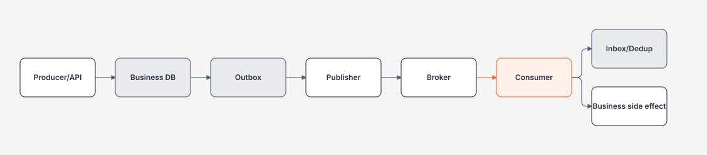

# Messaging, Outbox, Inbox và Dedup

> [← Distributed Systems](README.md)

## Hiểu trong 5 phút

Broker tách producer và consumer theo thời gian/capacity, nhưng tạo delivery semantics mới.



Hai failure quan trọng:

```text
Producer committed DB but message not published
Consumer committed side effect but ACK not recorded
```

Outbox giải failure đầu. Inbox/idempotent consumer giải failure hai.

---

# 1. Vì sao dual write nguy hiểm

Naive:

```csharp
await db.SaveChangesAsync(cancellationToken);
await broker.PublishAsync(orderCreated, cancellationToken);
```

Failure window:

```text
DB commit succeeds
↓
process crashes
↓
publish never happens
```

Reverse order cũng có problem:

```text
message published
↓
DB commit fails
↓
consumer sees event for state that does not exist
```

Không có atomicity mặc định giữa SQL transaction và arbitrary broker call.

---

# 2. Transactional Outbox schema

```sql
CREATE TABLE dbo.OutboxMessages
(
    Id             uniqueidentifier NOT NULL PRIMARY KEY,
    OccurredAt     datetime2        NOT NULL,
    Type           nvarchar(200)    NOT NULL,
    Payload        nvarchar(max)    NOT NULL,
    CorrelationId  nvarchar(100)    NULL,
    Attempts       int              NOT NULL DEFAULT 0,
    PublishedAt    datetime2        NULL,
    LastError      nvarchar(2000)   NULL
);

CREATE INDEX IX_OutboxMessages_Unpublished
ON dbo.OutboxMessages(PublishedAt, OccurredAt)
WHERE PublishedAt IS NULL;
```

Business transaction:

```sql
BEGIN TRANSACTION;

INSERT INTO dbo.Orders(...)
VALUES (...);

INSERT INTO dbo.OutboxMessages
(
    Id,
    OccurredAt,
    Type,
    Payload,
    CorrelationId
)
VALUES
(
    @eventId,
    SYSUTCDATETIME(),
    'OrderCreated.v1',
    @payload,
    @correlationId
);

COMMIT;
```

Now state + publish intent are durable together.

---

# 3. EF Core outbox write

Entities:

```csharp
public sealed class OutboxMessage
{
    public Guid Id { get; set; }
    public DateTimeOffset OccurredAt { get; set; }
    public string Type { get; set; } = null!;
    public string Payload { get; set; } = null!;
    public string? CorrelationId { get; set; }
    public int Attempts { get; set; }
    public DateTimeOffset? PublishedAt { get; set; }
    public string? LastError { get; set; }
}
```

Application transaction:

```csharp
await using var tx =
    await db.Database.BeginTransactionAsync(cancellationToken);

var order = Order.Create(request);
db.Orders.Add(order);

var integrationEvent = new OrderCreatedV1(
    order.Id,
    order.CustomerId,
    order.TotalAmount);

var outbox = new OutboxMessage
{
    Id = Guid.NewGuid(),
    OccurredAt = DateTimeOffset.UtcNow,
    Type = "OrderCreated.v1",
    Payload = JsonSerializer.Serialize(integrationEvent),
    CorrelationId = correlationId
};

db.OutboxMessages.Add(outbox);

await db.SaveChangesAsync(cancellationToken);
await tx.CommitAsync(cancellationToken);
```

No broker call inside transaction.

---

# 4. Outbox publisher

Simple learning worker:

```csharp
public sealed class OutboxPublisher(
    IServiceScopeFactory scopeFactory,
    IMessageBus bus,
    ILogger<OutboxPublisher> logger) : BackgroundService
{
    protected override async Task ExecuteAsync(
        CancellationToken stoppingToken)
    {
        while (!stoppingToken.IsCancellationRequested)
        {
            await PublishBatchAsync(stoppingToken);
            await Task.Delay(500, stoppingToken);
        }
    }

    private async Task PublishBatchAsync(
        CancellationToken cancellationToken)
    {
        await using var scope = scopeFactory.CreateAsyncScope();
        var db = scope.ServiceProvider.GetRequiredService<AppDbContext>();

        var messages = await db.OutboxMessages
            .Where(x => x.PublishedAt == null)
            .OrderBy(x => x.OccurredAt)
            .Take(100)
            .ToListAsync(cancellationToken);

        foreach (var message in messages)
        {
            try
            {
                await bus.PublishAsync(
                    message.Id,
                    message.Type,
                    message.Payload,
                    cancellationToken);

                message.PublishedAt = DateTimeOffset.UtcNow;
                message.LastError = null;
            }
            catch (Exception ex)
            {
                message.Attempts++;
                message.LastError = ex.Message;
                logger.LogError(
                    ex,
                    "Failed publishing outbox {OutboxId}",
                    message.Id);
            }
        }

        await db.SaveChangesAsync(cancellationToken);
    }
}
```

This is not yet perfect production code.

Critical failure window remains:

```text
broker accepted publish
↓
process crashes before PublishedAt saved
↓
message published again later
```

Therefore downstream consumer must tolerate duplicates.

---

# 5. At-least-once consumer failure

```text
Broker delivers Message M1
↓
Consumer inserts Notification
↓
DB commit
↓
process crashes before ACK
↓
Broker redelivers M1
```

Naive consumer:

```csharp
public async Task HandleAsync(
    OrderCreatedV1 message,
    CancellationToken cancellationToken)
{
    db.Notifications.Add(new Notification
    {
        OrderId = message.OrderId
    });

    await db.SaveChangesAsync(cancellationToken);
}
```

Duplicate delivery can insert duplicate notification.

---

# 6. Inbox / processed-message table

```sql
CREATE TABLE dbo.InboxMessages
(
    Consumer        nvarchar(200)    NOT NULL,
    MessageId       uniqueidentifier NOT NULL,
    ProcessedAt     datetime2        NOT NULL,

    CONSTRAINT PK_InboxMessages
        PRIMARY KEY (Consumer, MessageId)
);
```

Consumer transaction:

```csharp
await using var tx =
    await db.Database.BeginTransactionAsync(cancellationToken);

var inboxEntry = new InboxMessage
{
    Consumer = "notifications.order-created.v1",
    MessageId = envelope.MessageId,
    ProcessedAt = DateTimeOffset.UtcNow
};

db.InboxMessages.Add(inboxEntry);

try
{
    await db.SaveChangesAsync(cancellationToken);
}
catch (DbUpdateException ex) when (IsDuplicateKey(ex))
{
    await tx.RollbackAsync(CancellationToken.None);
    return; // already processed
}

await ApplyBusinessEffectAsync(
    envelope.Message,
    cancellationToken);

await db.SaveChangesAsync(cancellationToken);
await tx.CommitAsync(cancellationToken);
```

Inbox record + business side effect must share local transaction to avoid another dual-write gap.

---

# 7. Idempotent state transition can be simpler than inbox

Sometimes business table itself can enforce idempotency.

Example notification unique invariant:

```sql
CREATE UNIQUE INDEX UX_Notifications_Event_Recipient
ON dbo.Notifications(SourceEventId, RecipientId);
```

Consumer can insert and treat duplicate key as already-applied effect.

This may be simpler than generic inbox if semantics align.

Question:

```text
Can business state itself prove this message effect already happened?
```

---

# 8. Message envelope

Avoid sending raw anonymous payload without metadata.

```csharp
public sealed record MessageEnvelope<T>(
    Guid MessageId,
    string Type,
    int Version,
    DateTimeOffset OccurredAt,
    string? CorrelationId,
    string? CausationId,
    T Data);
```

Example:

```json
{
  "messageId": "c1639e47-122a-4f89-8c61-5398188cc546",
  "type": "OrderCreated",
  "version": 1,
  "occurredAt": "2026-08-12T10:00:00Z",
  "correlationId": "checkout-42",
  "causationId": "command-17",
  "data": {
    "orderId": 1234,
    "customerId": 88,
    "totalAmount": 125.50
  }
}
```

Message ID supports dedup/audit. Correlation/causation support tracing/business investigation.

---

# 9. Event contract != database entity

Bad:

```csharp
await bus.PublishAsync(orderEntity);
```

This couples consumers to internal persistence shape/navigation/properties.

Prefer explicit integration contract:

```csharp
public sealed record OrderCreatedV1(
    long OrderId,
    long CustomerId,
    decimal TotalAmount);
```

Version/evolution belongs message contract, not EF entity.

---

# 10. Event schema evolution

Version 1:

```json
{
  "orderId": 1,
  "totalAmount": 100.0
}
```

Safe additive evolution often easier:

```json
{
  "orderId": 1,
  "totalAmount": 100.0,
  "currency": "USD"
}
```

But compatibility depends serializers/consumers/schema rules.

Breaking semantic change may warrant new event version/type:

```text
OrderCreated.v1
OrderCreated.v2
```

Do not silently change meaning of an existing field while keeping same contract identity.

---

# 11. Retry and DLQ

Consumer failure classes:

```text
transient network  → bounded retry/backoff
rate limit          → delayed retry respecting provider policy
invalid schema      → likely non-transient
business invariant  → usually no blind retry
bug                 → retry won't repair code
```

After bounded attempts, move/quarantine to dead-letter path.

DLQ is not trash.

Need:

```text
owner
alert
reason
original message
attempt history
safe replay procedure
retention
```

---

# 12. Poison message infinite retry

Bad:

```text
Message invalid
↓ fail
immediate retry
↓ fail
immediate retry forever
```

Effects:

```text
consumer capacity wasted
logs explode
other messages starve
provider pressure increases
```

Bound retries and quarantine deterministic failures.

---

# 13. Replay safety

If operator replays DLQ message:

```text
Can it duplicate side effect?
Does consumer dedup record still exist?
Did contract/schema change?
Is downstream endpoint still valid?
```

Replay tool needs dry-run/preview where possible and audit trail.

Conceptual CLI:

```bash
notifications replay \
  --message-id c1639e47-122a-4f89-8c61-5398188cc546 \
  --dry-run
```

Then explicit execution.

---

# 14. Outbox concurrency

Multiple publisher instances may read same unpublished rows.

You need a concurrency strategy:

```text
claim/lease rows
locking hints/provider-specific mechanism
status transition
partition ownership
or tolerate duplicate publishes and rely on consumer dedup
```

Do not invent a complex distributed lock if duplicate publish is harmless and consumer idempotency already required.

---

# 15. Outbox cleanup

Outbox grows forever without retention.

Policy:

```text
PublishedAt older than retention
+ not needed for audit/replay
→ archive/delete in batches
```

Avoid huge single delete transaction.

Example:

```sql
DELETE TOP (1000)
FROM dbo.OutboxMessages
WHERE PublishedAt < DATEADD(day, -7, SYSUTCDATETIME());
```

Run repeatedly with operational bounds.

---

# 16. Polling frequency trade-off

```text
poll every 10 ms
→ low publish latency
→ more DB queries/CPU

poll every 10 s
→ low DB pressure
→ high event latency
```

Options include:

```text
poll + backoff
DB notification/CDC mechanism
broker-integrated outbox library
change feed
```

Choose based on latency, complexity and DB load.

---

# 17. Broker does not guarantee business success

Broker ACK often only says message accepted/delivered under broker semantics.

It does not mean:

```text
email sent
payment completed
DB updated
human saw notification
```

Business success telemetry must come from consumer/side effect layers.

---

# 18. Failure drill — broker outage

1. Start API/DB/worker.
2. Stop broker.
3. Create 100 Orders.
4. Verify Orders + outbox rows commit.
5. Restart broker.
6. Verify publisher catches up.
7. Verify each business notification effect is correct despite potential duplicate publishes.

Evidence:

```text
outbox unpublished count
oldest outbox age
publish attempts
consumer processed count
duplicate suppression count
```

---

# 19. Failure drill — crash after publish before mark

In publisher:

```csharp
await bus.PublishAsync(...);
Environment.FailFast("crash after publish");
```

Restart publisher.

Expected:

```text
same message may publish again
consumer dedup prevents duplicate business effect
```

---

# 20. Failure drill — crash after consumer commit before ACK

Inject process termination after DB transaction commits but before broker ACK.

Restart consumer.

Expected:

```text
message redelivered
inbox/business uniqueness catches duplicate
ACK after confirmed durable state
```

---

# 21. Review checklist

```text
[ ] DB + publish dual write eliminated?
[ ] Outbox rows bounded/indexed?
[ ] Publisher duplicate publish tolerated?
[ ] Stable MessageId exists?
[ ] Consumer idempotent/dedup?
[ ] Inbox + business effect same transaction?
[ ] Event contract independent from DB entity?
[ ] Schema version/evolution documented?
[ ] Retry classification bounded?
[ ] DLQ owner + replay procedure?
[ ] Outbox/inbox retention policy?
[ ] Metrics for backlog/oldest age/duplicate/DLQ?
```

---

# 22. Exit criteria

Bạn hoàn thành khi có thể:

- explain producer dual-write gap;
- implement SQL/EF outbox;
- explain duplicate publish window;
- implement idempotent consumer/inbox;
- use business uniqueness as dedup when simpler;
- define message envelope/version;
- distinguish transient/poison failures;
- design DLQ + replay safely;
- handle publisher concurrency/retention;
- reproduce broker outage and crash-before-ACK scenarios.

## Official English Sources

- [Asynchronous message-based communication](https://learn.microsoft.com/en-us/dotnet/architecture/microservices/architect-microservice-container-applications/asynchronous-message-based-communication)
- [Queue-Based Load Leveling](https://learn.microsoft.com/en-us/azure/architecture/patterns/queue-based-load-leveling)
- [Transactional Outbox pattern guidance](https://learn.microsoft.com/en-us/azure/architecture/databases/guide/transactional-outbox-cosmos)

## Verification metadata

- Verified: 2026-08-12.
- Broker-neutral concepts; adapt locking/ACK APIs to actual broker/library.
- Status: code-first v1.
