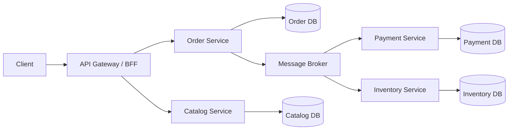
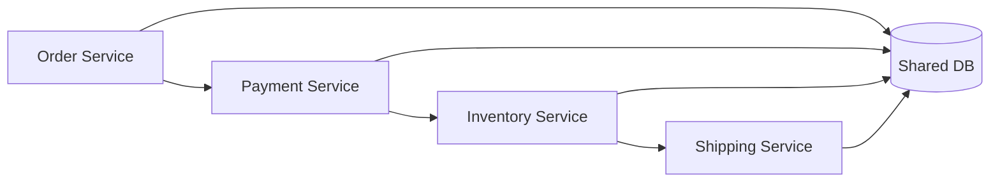

# Module 18 — Microservices Architecture

> [← Module 17 — Distributed Systems](../17-distributed-systems/README.md) · [Roadmap](../00-roadmap/README.md)

## Hiểu trong 5 phút

Microservices không đơn giản là:

```text
monolith
→ tách thành nhiều API nhỏ
```

Một microservice đúng nghĩa cần có **business boundary**, **data ownership**, **contract riêng**, **deployment lifecycle riêng** và **operational ownership** đủ độc lập để service có thể thay đổi mà không buộc toàn hệ thống phải release cùng lúc.



Nếu hai service:

- share cùng DB schema;
- import domain model của nhau;
- luôn phải deploy cùng nhau;
- gọi sync theo một chuỗi dài để hoàn thành mọi request;

thì boundary thực tế chưa độc lập, dù chúng chạy trong nhiều container khác nhau.

---

# 1. Tại sao cần module riêng ngoài Distributed Systems?

**Distributed Systems** trả lời:

```text
network fail thế nào?
timeout/retry/idempotency ra sao?
message duplicate/out-of-order xử lý thế nào?
outbox/inbox/saga/backpressure hoạt động thế nào?
```

**Microservices Architecture** trả lời thêm:

```text
Tại sao phải tách service?
Boundary nằm ở đâu?
Ai sở hữu data?
Contract nào được public?
Sync hay async giữa services?
Gateway/service discovery đặt ở đâu?
Team nào own service?
Deploy độc lập thật hay chỉ trên sơ đồ?
Khi nào KHÔNG nên dùng microservices?
Làm sao migrate từ modular monolith?
```

Microsoft mô tả microservices như các service nhỏ, tự chủ, loosely coupled, thường map theo business capability/bounded context; mỗi service có lifecycle và data ownership riêng. Xem [references](references.md).

---

# 2. Learning path

| Chapter | Priority | Mục tiêu |
| --- | --- | --- |
| [Service Boundaries, Data Ownership & Contracts](service-boundaries-data-ownership-and-contracts.md) | P0 | tách đúng boundary, không share DB/domain model |
| [Checkout Saga: Unknown Outcome & Reconciliation](checkout-saga-unknown-outcome-and-reconciliation.md) | P0 | xử lý checkout, timeout payment, compensation, reconciliation |
| [Communication, Gateway, Discovery & Deployment](communication-gateway-discovery-and-deployment.md) | P0/P1 | sync/async, API gateway, discovery, independent deployment |
| [Testing, Observability & Migration](testing-observability-and-migration.md) | P1 | contract tests, traces, failure drills, modular-monolith → microservices |

Prerequisite bắt buộc:

```text
Module 17 Distributed Systems
```

vì microservices kế thừa toàn bộ vấn đề partial failure, retry, idempotency, messaging, consistency và backpressure.

---

# 3. Microservices không giải quyết mọi bài toán

Microservices đáng cân nhắc khi có áp lực thật như:

```text
large/complex domain
+ multiple teams
+ independent release cadence
+ independent scaling needs
+ clear domain boundaries
+ organization willing to own distributed operations
```

Không nên mặc định dùng nếu:

```text
team nhỏ
simple domain
release cùng cadence
traffic không yêu cầu scale riêng
boundary chưa rõ
observability/CI/CD còn yếu
```

Trong trường hợp đó, **Modular Monolith** thường là baseline tốt hơn:

```text
one deployable
+ strong module boundaries
+ local transactions
+ lower operational cost
```

Sau này có thể extract module có pressure thật thành service.

---

# 4. Architecture invariants

Một microservice production nên trả lời được:

```text
1. Business capability nào service sở hữu?
2. Data nào là authoritative của service?
3. Service khác được đọc data bằng contract nào?
4. Contract version/evolution thế nào?
5. Sync call nào bắt buộc?
6. Async event nào phù hợp hơn?
7. Timeout có nghĩa gì cho business operation?
8. Idempotency key nằm ở boundary nào?
9. Deploy service này có buộc deploy service khác không?
10. Team nào on-call và sở hữu runbook/SLO?
```

Nếu không trả lời được, boundary có thể đang được vẽ theo technical layer thay vì business capability.

---

# 5. Anti-pattern — distributed monolith



Dấu hiệu:

```text
shared database tables
shared domain library
lock-step releases
synchronous call chain dài
cross-service joins
one service cannot start without all others
```

Bạn có network/distributed failure nhưng **không có autonomy** — thường là tình trạng tệ hơn monolith.

---

# 6. Desired architecture mental model

```text
Business capability
        ↓
Bounded Context
        ↓
Service boundary
        ↓
Owned data/schema
        ↓
Versioned API/events
        ↓
Independent deploy/scale
        ↓
SLO + telemetry + runbook
```

Autonomy không có nghĩa service không bao giờ phụ thuộc nhau. Nó có nghĩa dependency được thể hiện qua **explicit contracts** và failure semantics được thiết kế rõ.

---

# 7. Checkout case study của module

Module dùng xuyên suốt scenario:

```text
Order Service
Payment Service
Inventory Service
Shipping Service
```

Happy path:


Nhưng production phải xử lý:

```text
duplicate checkout
inventory conflict
payment declined
payment timeout
response lost after charge
process crash
message duplicate
message out-of-order
shipment failure
refund failure
stuck saga
```

Chapter checkout sẽ implement state machine, `PENDING_PAYMENT`, reconciliation và compensation thay vì coi timeout là rollback.

---

# 8. Exit criteria

Bạn hoàn thành Module 18 khi có thể:

- phân biệt Microservices với Distributed Systems;
- giải thích khi nào Modular Monolith tốt hơn;
- define service boundary bằng business capability/bounded context;
- enforce data ownership, tránh shared DB schema;
- dùng local contract thay vì import internal enum/entity từ service khác;
- thiết kế sync vs async communication;
- giải thích API Gateway/BFF/service discovery;
- chứng minh independent deployment bằng compatibility strategy;
- implement checkout Saga có unknown payment outcome + reconciliation;
- define compensation failure/manual intervention;
- design contract/integration/failure tests;
- trace một request xuyên nhiều services;
- mô tả migration từ modular monolith sang services theo Strangler-style extraction.

## Official English Sources

- [Microservices architecture style — Azure Architecture Center](https://learn.microsoft.com/en-us/azure/architecture/microservices/)
- [.NET Microservices architecture](https://learn.microsoft.com/en-us/dotnet/architecture/microservices/architect-microservice-container-applications/microservices-architecture)
- [Design a microservices architecture](https://learn.microsoft.com/en-us/azure/architecture/microservices/design/)
- [Data sovereignty per microservice](https://learn.microsoft.com/en-us/dotnet/architecture/microservices/architect-microservice-container-applications/data-sovereignty-per-microservice)

## Verification metadata

- Verified: 2026-08-13.
- Prerequisite: Module 17 — Distributed Systems.
- Status: code-first v1 module in progress.
