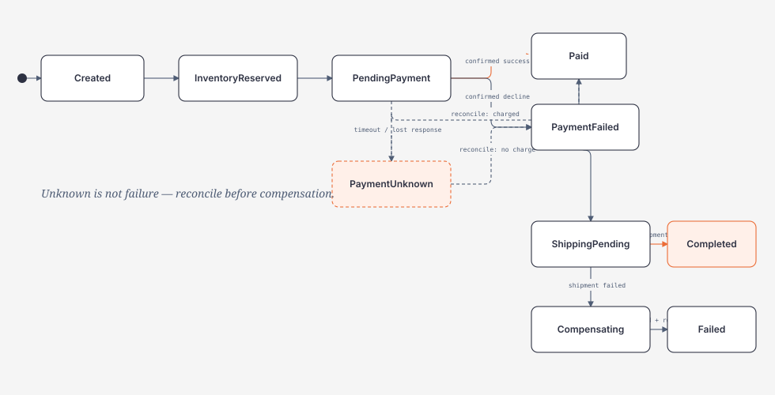
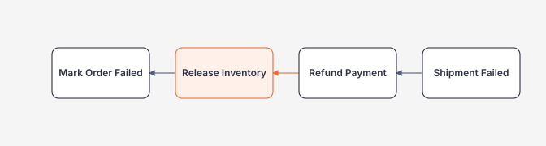

# Checkout Saga: Unknown Outcome, Compensation và Reconciliation

> [← Microservices Architecture](README.md)

## Hiểu trong 5 phút

Checkout qua nhiều microservices không còn là một ACID transaction duy nhất.

```text
Order
→ Inventory
→ Payment
→ Shipping
```

Mỗi service commit local state riêng. Vì vậy:

```text
HTTP timeout
≠ remote transaction rollback
```

Payment có thể đã charge nhưng response bị mất. Trong trường hợp đó trạng thái đúng không phải `FAILED` mà là **UNKNOWN / PENDING_RECONCILIATION**.



Điểm quan trọng:

```text
FAILED != UNKNOWN
```

---

# 1. Checkout invariants

Business invariants ví dụ:

```text
same checkout idempotency key → at most one Order
same payment attempt → at most one effective charge
inventory reservation has explicit ownership/expiry
order cannot become Completed before payment + shipment confirmed
unknown payment outcome must not trigger destructive compensation blindly
```

---

# 2. Idempotent checkout entry

Request:

```http
POST /checkout
Idempotency-Key: checkout-7f2d
```

Order table:

```sql
CREATE UNIQUE INDEX UX_Orders_IdempotencyKey
ON dbo.Orders(IdempotencyKey);
```

Service code shape:

```csharp
public async Task<OrderResponse> CheckoutAsync(
    CheckoutRequest request,
    CancellationToken cancellationToken)
{
    var existing = await db.Orders
        .SingleOrDefaultAsync(
            x => x.IdempotencyKey == request.IdempotencyKey,
            cancellationToken);

    if (existing is not null)
        return mapper.ToResponse(existing);

    try
    {
        var order = Order.CreatePending(
            request.Order,
            request.IdempotencyKey);

        db.Orders.Add(order);
        await db.SaveChangesAsync(cancellationToken);
        return mapper.ToResponse(order);
    }
    catch (DbUpdateException ex) when (IsUniqueViolation(ex))
    {
        var winner = await db.Orders.SingleAsync(
            x => x.IdempotencyKey == request.IdempotencyKey,
            cancellationToken);

        return mapper.ToResponse(winner);
    }
}
```

`check then insert` một mình không chống concurrent duplicate; unique constraint mới là race-safe invariant.

---

# 3. Inventory reservation

Inventory không nên chỉ decrement stock vô thời hạn.

Reservation record:

```sql
CREATE TABLE dbo.InventoryReservations
(
    ReservationId uniqueidentifier NOT NULL PRIMARY KEY,
    OrderId        uniqueidentifier NOT NULL,
    ProductId      uniqueidentifier NOT NULL,
    Quantity       int              NOT NULL,
    Status         varchar(30)      NOT NULL,
    ExpiresAt      datetime2        NOT NULL,
    CreatedAt      datetime2        NOT NULL
);
```

State:

```text
Reserved
Committed
Released
Expired
```

Reservation giúp phân biệt:

```text
hold stock temporarily
vs
final stock consumption
```

---

# 4. Stable PaymentAttemptId

Order Service tạo identity ổn định trước khi call Payment:

```csharp
var paymentAttemptId = Guid.NewGuid();
```

Persist:

```sql
UPDATE dbo.Orders
SET
    PaymentAttemptId = @paymentAttemptId,
    Status = 'PENDING_PAYMENT'
WHERE Id = @orderId;
```

Call provider/service:

```csharp
var request = new ChargeRequest(
    PaymentAttemptId: paymentAttemptId,
    OrderId: order.Id,
    Amount: order.Total,
    Currency: order.Currency);

var result = await paymentClient.ChargeAsync(
    request,
    cancellationToken);
```

Payment Service/provider phải dùng `PaymentAttemptId` như idempotency identity cho charge.

---

# 5. Payment outcomes

Model local:

```csharp
public enum PaymentOutcome
{
    Succeeded,
    Failed,
    Pending,
    Unknown
}
```

Mapping:

```text
HTTP 200 + SUCCEEDED     → Succeeded
HTTP 200 + DECLINED      → Failed
HTTP 202 + PROCESSING    → Pending
HTTP timeout/reset       → Unknown
5xx before known commit  → maybe transient/Unknown depending contract
```

Không map mọi exception thành `Failed`.

---

# 6. Timeout after charge

Timeline:

```text
Order Service       Payment Service       Provider
     |                    |                  |
     |---- Charge -------> |                  |
     |                    |---- capture ---->|
     |                    |<--- success ------|
     |                    | COMMIT SUCCEEDED  |
     |      X response lost / timeout          |
     |<------- timeout ---|                  |
```

Caller chỉ biết:

```text
request outcome unknown
```

Nếu Order Service ngay lập tức:

```text
release inventory
+ retry charge with new ID
```

có nguy cơ:

```text
double charge
inventory inconsistency
```

---

# 7. Correct unknown-outcome handling

```csharp
try
{
    var result = await paymentClient.ChargeAsync(
        chargeRequest,
        cancellationToken);

    await ApplyKnownPaymentResultAsync(
        order,
        result,
        cancellationToken);
}
catch (TimeoutException)
{
    order.MarkPaymentUnknown();
    await db.SaveChangesAsync(CancellationToken.None);

    // Do not release inventory yet.
    // Reconciliation owns the next decision.
}
```

Production code cần phân loại cancellation/timeout kỹ hơn; đây là shape để thể hiện business semantic.

---

# 8. Reconciliation endpoint

Payment Service nên hỗ trợ lookup bằng stable operation identity:

```http
GET /payments/by-attempt/{paymentAttemptId}
```

Response:

```json
{
  "paymentAttemptId": "9f2...",
  "status": "SUCCEEDED",
  "providerReference": "pay_123"
}
```

Nếu chưa biết:

```json
{
  "paymentAttemptId": "9f2...",
  "status": "PROCESSING"
}
```

---

# 9. Reconciliation job

```csharp
public sealed class PaymentReconciliationWorker(
    IServiceScopeFactory scopeFactory,
    IPaymentClient paymentClient,
    ILogger<PaymentReconciliationWorker> logger)
    : BackgroundService
{
    protected override async Task ExecuteAsync(
        CancellationToken stoppingToken)
    {
        while (!stoppingToken.IsCancellationRequested)
        {
            await ReconcileBatchAsync(stoppingToken);
            await Task.Delay(TimeSpan.FromSeconds(10), stoppingToken);
        }
    }

    private async Task ReconcileBatchAsync(
        CancellationToken cancellationToken)
    {
        await using var scope = scopeFactory.CreateAsyncScope();
        var db = scope.ServiceProvider.GetRequiredService<OrderDbContext>();

        var candidates = await db.Orders
            .Where(x => x.Status == "PAYMENT_UNKNOWN")
            .OrderBy(x => x.UpdatedAt)
            .Take(100)
            .ToListAsync(cancellationToken);

        foreach (var order in candidates)
        {
            var result = await paymentClient.GetByAttemptAsync(
                order.PaymentAttemptId!.Value,
                cancellationToken);

            switch (result.Status)
            {
                case "SUCCEEDED":
                    order.MarkPaid(result.ProviderReference);
                    break;

                case "FAILED":
                    order.MarkPaymentFailed();
                    break;

                case "PROCESSING":
                    break;

                default:
                    logger.LogWarning(
                        "Unknown payment status {Status} for {OrderId}",
                        result.Status,
                        order.Id);
                    break;
            }
        }

        await db.SaveChangesAsync(cancellationToken);
    }
}
```

Job phải bounded, observable và idempotent.

---

# 10. Reconciliation age policy

Không để `PAYMENT_UNKNOWN` vô hạn mà không alert.

Metrics:

```text
payment_unknown_count
oldest_payment_unknown_age
reconciliation_success
reconciliation_failure
manual_intervention_count
```

Policy ví dụ:

```text
< 2 min    automatic reconciliation
2–30 min   retry + warning
> 30 min   alert/manual intervention
```

Threshold phụ thuộc business/provider SLA.

---

# 11. Saga orchestration

Orchestrator state:

```csharp
public enum CheckoutSagaState
{
    Started,
    InventoryReserved,
    PaymentPending,
    PaymentUnknown,
    PaymentConfirmed,
    ShippingPending,
    Compensating,
    ManualIntervention,
    Failed,
    Completed
}
```

Persist state:

```sql
CREATE TABLE dbo.CheckoutSagas
(
    SagaId           uniqueidentifier NOT NULL PRIMARY KEY,
    OrderId          uniqueidentifier NOT NULL,
    State            varchar(40)      NOT NULL,
    Version          int              NOT NULL,
    UpdatedAt        datetime2        NOT NULL,
    LastError        nvarchar(2000)   NULL
);
```

Không giữ saga state chỉ trong process memory.

---

# 12. Orchestration pseudo-flow

```csharp
switch (saga.State)
{
    case CheckoutSagaState.Started:
        await SendReserveInventoryAsync(saga);
        break;

    case CheckoutSagaState.InventoryReserved:
        await SendChargePaymentAsync(saga);
        break;

    case CheckoutSagaState.PaymentConfirmed:
        await SendCreateShipmentAsync(saga);
        break;

    case CheckoutSagaState.PaymentUnknown:
        await ScheduleReconciliationAsync(saga);
        break;
}
```

Commands/events phải idempotent/deduplicated theo Module 17.

---

# 13. Choreography alternative

```text
OrderCreated
→ InventoryReserved
→ PaymentRequested
→ PaymentSucceeded
→ ShipmentRequested
→ ShipmentCreated
```

Có thể phù hợp workflow đơn giản, nhưng khi checkout có nhiều branch:

```text
unknown payment
manual review
refund failure
inventory expiry
```

central saga state thường dễ reasoning/operations hơn.

Không có một đáp án universal; chọn dựa vào workflow complexity và ownership.

---

# 14. Compensation flow

Shipment fail sau payment success:



Nhưng compensation không phải rollback hoàn hảo.

Refund có thể:

```text
fail
be asynchronous
incur fee
require human review
```

Do đó saga cần trạng thái:

```text
COMPENSATING
REFUND_PENDING
MANUAL_INTERVENTION
```

---

# 15. Compensation failure

Bad:

```csharp
try
{
    await paymentClient.RefundAsync(...);
}
catch
{
    order.Status = "FAILED";
}
```

Order `FAILED` có thể che việc user vẫn bị charge.

Safer:

```csharp
catch (Exception ex)
{
    saga.MarkManualIntervention(ex.Message);
    await db.SaveChangesAsync(CancellationToken.None);
    throw;
}
```

Alert phải dựa trên stuck compensation state.

---

# 16. Outbox integration

State change + integration event intent cùng local transaction:

```csharp
await using var tx =
    await db.Database.BeginTransactionAsync(cancellationToken);

order.MarkPaid(payment.ProviderReference);

db.OutboxMessages.Add(OutboxMessage.From(
    new PaymentConfirmedV1(
        order.Id,
        order.PaymentAttemptId!.Value)));

await db.SaveChangesAsync(cancellationToken);
await tx.CommitAsync(cancellationToken);
```

Không gọi broker trực tiếp như dual write.

---

# 17. Inbox/dedup on consumers

Inventory receives duplicate release event:

```text
ReleaseInventory message M1
→ processed
→ ACK lost
→ M1 redelivered
```

Consumer phải đảm bảo second delivery không tăng stock lần nữa.

Business uniqueness/inbox table là options từ Module 17.

---

# 18. Event ordering

Events:

```text
Seq 1 PaymentPending
Seq 2 PaymentSucceeded
Seq 3 RefundRequested
```

Nếu delivery:

```text
1, 3, 2
```

consumer không được blindly apply arrival order.

Use aggregate sequence/version nếu domain ordering yêu cầu.

---

# 19. Failure drill — duplicate checkout

Run 20 concurrent requests cùng idempotency key.

Expected:

```text
20 HTTP requests
1 Order row
1 payment attempt identity
no duplicate charge
```

Evidence:

```sql
SELECT IdempotencyKey, COUNT(*)
FROM dbo.Orders
GROUP BY IdempotencyKey;
```

---

# 20. Failure drill — payment timeout after commit

Fake Payment Service:

```csharp
app.MapPost("/payments", async (
    ChargeRequest request,
    PaymentDbContext db,
    CancellationToken cancellationToken) =>
{
    var payment = Payment.Succeed(request.PaymentAttemptId);
    db.Payments.Add(payment);
    await db.SaveChangesAsync(cancellationToken);

    await Task.Delay(TimeSpan.FromSeconds(10), cancellationToken);

    return Results.Ok(new { status = "SUCCEEDED" });
});
```

Order client timeout = 500 ms.

Expected:

```text
Payment DB: SUCCEEDED
Order: PAYMENT_UNKNOWN
Inventory: still reserved
Reconciliation later: Order → PAID
```

Not:

```text
Order FAILED
Inventory released
new payment attempt auto-created
```

---

# 21. Failure drill — refund failure

Scenario:

```text
inventory reserved
payment succeeded
shipping failed
refund endpoint fails 3 times
```

Expected:

```text
Saga = MANUAL_INTERVENTION or REFUND_PENDING
Order not falsely considered financially clean
alert emitted
```

---

# 22. Failure drill — reconciliation provider unavailable

Stop Payment Service/provider lookup for 10 minutes.

Observe:

```text
unknown count
oldest unknown age
retry pressure
alerts
```

Reconciliation retries must be bounded and should not create a thundering herd.

---

# 23. API response to user

Checkout may return asynchronous status:

```http
POST /checkout
→ 202 Accepted
Location: /orders/{orderId}
```

Response:

```json
{
  "orderId": "...",
  "status": "PENDING_PAYMENT"
}
```

Client polls/subscribes to final state instead of assuming synchronous completion of all distributed steps.

---

# 24. Architect checklist

```text
[ ] checkout idempotency race-safe?
[ ] payment attempt identity stable?
[ ] payment provider/service supports idempotency?
[ ] timeout mapped to Unknown when outcome cannot be proven?
[ ] inventory reservation expiry/release policy explicit?
[ ] reconciliation lookup available?
[ ] unknown state age SLO + alert?
[ ] saga state durable?
[ ] compensation can itself fail?
[ ] manual intervention modeled?
[ ] state changes + events use outbox?
[ ] consumers dedup duplicate events?
[ ] event ordering/version handled where necessary?
```

---

# 25. Exit criteria

Bạn hoàn thành khi có thể:

- implement race-safe checkout idempotency;
- model reservation rather than blind stock decrement;
- persist stable payment attempt identity;
- distinguish Failed/Pending/Unknown;
- explain timeout-after-commit scenario;
- implement reconciliation worker;
- define age/alert/manual policy for unknown payment;
- persist saga state;
- design compensation and compensation failure;
- connect Saga with Outbox/Inbox/Dedup;
- reproduce duplicate checkout, timeout-after-charge and refund-failure drills.

## Official English Sources

- [Saga pattern — Azure Architecture Center](https://learn.microsoft.com/en-us/azure/architecture/reference-architectures/saga/saga)
- [Microservices design patterns](https://learn.microsoft.com/en-us/azure/architecture/microservices/design/patterns)
- [Asynchronous message-based communication](https://learn.microsoft.com/en-us/dotnet/architecture/microservices/architect-microservice-container-applications/asynchronous-message-based-communication)
- [Data sovereignty per microservice](https://learn.microsoft.com/en-us/dotnet/architecture/microservices/architect-microservice-container-applications/data-sovereignty-per-microservice)

## Verification metadata

- Verified: 2026-08-13.
- Depends on Module 17 idempotency/outbox/inbox/ordering concepts.
- Status: code-first v1.
