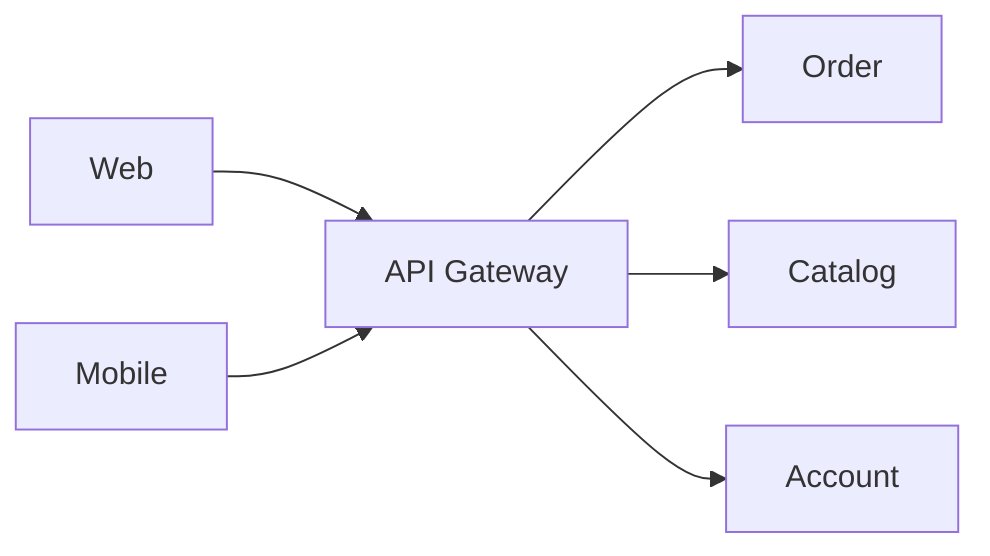

# Communication, API Gateway, Discovery và Independent Deployment

> [← Microservices Architecture](README.md)

## Hiểu trong 5 phút

Microservices tạo nhiều network boundary hơn. Vì vậy câu hỏi không phải chỉ là:

```text
REST hay Kafka?
```

Mà là:

```text
operation cần response ngay không?
outcome có thể chậm không?
caller có chấp nhận eventual consistency không?
request có side effect không?
retry có an toàn không?
service endpoint thay đổi thế nào?
client có nên biết mọi service không?
```

Mental model:

```text
Client
  ↓
Gateway / BFF
  ↓
Service A
  ├── sync HTTP/gRPC → Service B
  └── async message → Broker → Service C
```

---

# 1. Sync communication

Phù hợp khi caller cần kết quả để tiếp tục current interaction.

```csharp
public async Task<ProductPrice> GetPriceAsync(
    Guid productId,
    CancellationToken cancellationToken)
{
    using var response = await httpClient.GetAsync(
        $"/products/{productId}/price",
        cancellationToken);

    response.EnsureSuccessStatusCode();

    return (await response.Content
        .ReadFromJsonAsync<ProductPrice>(cancellationToken))!;
}
```

Nhưng sync call tạo temporal coupling:

```text
A request succeeds
only while B is reachable and fast enough
```

---

# 2. Sync call-chain latency

Suppose:

```text
Gateway → Order → Pricing → Inventory → Promotion
```

P95 per hop không cộng đơn giản hoàn hảo, nhưng long chain tăng:

```text
latency budget pressure
failure probability
retry amplification
trace complexity
```

Rule:

```text
Do not turn microservices into remote method calls everywhere.
```

---

# 3. Async communication

Phù hợp khi operation có thể decouple theo time:

```text
OrderCreated
→ Notification
→ Analytics
→ Search projection
```

Producer không cần các consumers online cùng lúc.

```csharp
public sealed record OrderCreatedV1(
    Guid OrderId,
    Guid CustomerId,
    decimal Total);
```

Publish intent nên dùng Outbox nếu business DB commit + event cần consistency.

---

# 4. Command vs event

Command:

```text
ReserveInventory
```

Ý nghĩa:

```text
please do this
```

Event:

```text
InventoryReserved
```

Ý nghĩa:

```text
this already happened
```

Không dùng event naming để che command semantics.

---

# 5. API Gateway

Client không nhất thiết biết topology nội bộ.



Gateway có thể handle:

```text
routing
TLS termination
external authentication/policy
rate limiting
request aggregation
client-specific facade
```

Nhưng gateway **không nên chứa domain logic** của Order/Payment.

---

# 6. BFF — Backend for Frontend

Nếu mobile và web có nhu cầu rất khác:

```text
Mobile → Mobile BFF
Web    → Web BFF
```

BFF có thể aggregate service calls theo UI shape mà không làm domain services phụ thuộc presentation-specific contract.

Trade-off:

```text
better client fit
but more deployables + ownership
```

---

# 7. Gateway aggregation

Instead of client:

```text
GET Order
GET Payment
GET Shipment
```

Gateway/BFF:

```http
GET /order-details/{id}
```

Aggregator:

```csharp
var orderTask = orderClient.GetAsync(id, ct);
var paymentTask = paymentClient.GetByOrderAsync(id, ct);
var shipmentTask = shippingClient.GetByOrderAsync(id, ct);

await Task.WhenAll(orderTask, paymentTask, shipmentTask);
```

Need define partial failure:

```text
Order available
Payment unavailable
Shipment available
```

Options:

```text
fail whole response
degrade payment section
serve stale cached summary
```

depending contract/NFR.

---

# 8. Service discovery

Hard-coded endpoint:

```text
http://10.0.0.37:8080
```

không phù hợp dynamic platform.

Typical:

```text
logical service name
→ platform/service registry/DNS
→ healthy instances
```

Kubernetes example:

```text
http://payment-service
```

Service DNS abstracts Pod IP churn.

---

# 9. Health vs discovery

A process running không đồng nghĩa ready.

```text
Liveness: process should be restarted?
Readiness: can receive traffic now?
```

If DB migration/setup incomplete:

```text
alive = true
ready = false
```

Load balancer/service discovery should avoid routing traffic to unready instances.

---

# 10. Timeouts are per boundary

Client timeout:

```csharp
builder.Services.AddHttpClient<IPaymentClient, PaymentClient>(client =>
{
    client.BaseAddress = new Uri(paymentBaseUrl);
    client.Timeout = TimeSpan.FromSeconds(2);
});
```

But total request deadline matters more than each local timeout.

```text
Gateway budget 3s
Order already spent 2.5s
Payment retry with 2s timeout
→ violates user deadline
```

Propagate cancellation/deadline where platform supports it.

---

# 11. Retry ownership

Bad:

```text
Gateway retries 3x
Order retries 3x
Payment SDK retries 3x
```

Potential amplification.

Choose retry owner deliberately based on:

```text
operation semantics
idempotency
failure classification
caller deadline
```

See Module 17.

---

# 12. Independent deployment means compatibility overlap

Service A and B can only deploy independently if:

```text
A-old works with B-new
A-new works with B-old
```

for a rollout window, or there is a controlled migration mechanism.

API evolution:

```text
expand
→ deploy provider
→ migrate consumers
→ observe
→ contract/remove old behavior
```

---

# 13. Bad shared package deployment coupling

Suppose:

```text
Contracts.dll version 1
used by Order + Payment + Inventory
```

Then changing shared DTO requires synchronized package upgrade in all services.

A shared contract package can sometimes be acceptable if strictly versioned and compatibility-managed, but it often encourages lock-step releases.

Prefer contracts that are interoperable across independent codebases/protocol boundaries.

---

# 14. Database migration rollout

Bad migration:

```sql
ALTER TABLE Orders DROP COLUMN OldStatus;
```

while old app version still reads it.

Safer:

```text
1 add replacement column
2 deploy app writing old + new if required
3 backfill
4 deploy readers using new
5 verify
6 remove old later
```

Same expand/migrate/contract principle applies inside one service during zero-downtime deployment.

---

# 15. Canary deployment

```text
v1 = 95% traffic
v2 = 5% traffic
```

Compare:

```text
error rate
P95/P99 latency
business success
DB errors
contract errors
resource usage
```

Rollback based on observable gates, not only pod/process health.

---

# 16. Deployment topology

A service is not automatically one container.

Example logical service:

```text
Order API
Order Worker
Order Outbox Publisher
Order DB
```

Could share ownership/lifecycle but have multiple process roles.

Architecture boundary should be based on capability/ownership, not Kubernetes Deployment count.

---

# 17. Failure drill — one downstream unavailable

Stop Payment Service.

Call Checkout.

Observe:

```text
Does Order thread hang?
Timeout duration?
Retry attempts?
Does status become Unknown/Pending?
Are resources bounded?
Does trace show dependency failure?
```

Expected behavior depends payment contract; no generic `catch => 500` should hide semantics.

---

# 18. Failure drill — incompatible deployment

Version B2 removes/renames a required response field.

Deploy B2 while A1 remains.

Contract test should fail before production or canary metrics should detect it immediately.

Then implement additive/compatible rollout.

---

# 19. Failure drill — gateway partial aggregation

Stop Shipment Service while Order and Payment healthy.

For `/order-details/{id}` decide explicitly:

```text
503 entire endpoint
or
200 with shipmentStatus = unavailable
```

Write contract test for chosen behavior.

---

# 20. Architect checklist

```text
[ ] Sync dependency actually required?
[ ] Async event better for non-immediate side effect?
[ ] Long synchronous chains minimized?
[ ] Command/event semantics explicit?
[ ] Gateway owns cross-cutting only, not domain logic?
[ ] BFF justified by client differences?
[ ] Service discovery platform-owned?
[ ] Readiness reflects ability to serve?
[ ] End-to-end deadline bounded?
[ ] Retry ownership explicit?
[ ] Old/new service versions overlap safely?
[ ] DB migration compatible with rolling deployment?
[ ] Canary/business metrics defined?
```

---

# 21. Exit criteria

Bạn hoàn thành khi có thể:

- choose sync vs async from business semantics;
- explain temporal coupling and sync-call-chain cost;
- distinguish commands/events;
- design API Gateway/BFF without domain leakage;
- explain service discovery/readiness;
- design deadline/retry ownership;
- prove independent deployment through compatibility overlap;
- plan expand/migrate/contract API and DB rollout;
- run downstream outage/incompatible deployment/partial aggregation drills.

## Official English Sources

- [Design a microservices architecture](https://learn.microsoft.com/en-us/azure/architecture/microservices/design/)
- [API gateways in microservices](https://learn.microsoft.com/en-us/azure/architecture/microservices/design/gateway)
- [API gateway vs direct client communication](https://learn.microsoft.com/en-us/dotnet/architecture/microservices/architect-microservice-container-applications/direct-client-to-microservice-communication-versus-the-api-gateway-pattern)
- [Microservices design patterns](https://learn.microsoft.com/en-us/azure/architecture/microservices/design/patterns)

## Verification metadata

- Verified: 2026-08-13.
- Status: code-first v1.
