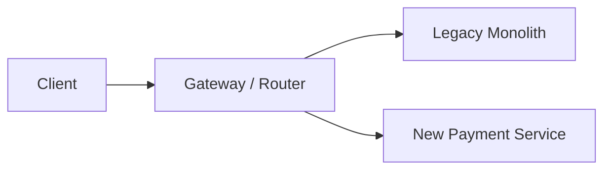

# Testing, Observability và Migration to Microservices

> [← Microservices Architecture](README.md)

## Hiểu trong 5 phút

Microservices làm tăng số boundary và failure mode. Vì vậy test strategy phải mở rộng từ:

```text
unit test
```

sang:

```text
unit
+ component
+ contract
+ integration
+ end-to-end selective
+ failure/chaos drills
```

Observability cũng phải nối request xuyên service boundary:

```text
TraceId
→ Gateway
→ Order
→ Payment
→ Inventory
→ Broker consumer
```

Migration nên evolutionary:

```text
Modular Monolith
→ identify pressure/boundary
→ extract one capability
→ route gradually
→ observe
→ continue only if value proven
```

---

# 1. Test pyramid không đủ nếu bỏ contract boundary

Unit tests prove local code.

Nhưng microservices có thể fail dù từng service unit-test xanh:

```text
field renamed
status semantics changed
HTTP status changed
message schema incompatible
retry assumption wrong
```

Do đó cần contract/integration tests.

---

# 2. Component test

Run one service with controlled dependencies.

Example ASP.NET Core:

```csharp
public sealed class CheckoutApiTests
    : IClassFixture<WebApplicationFactory<Program>>
{
    private readonly HttpClient _client;

    public CheckoutApiTests(WebApplicationFactory<Program> factory)
    {
        _client = factory.CreateClient();
    }

    [Fact]
    public async Task Duplicate_idempotency_key_returns_same_order()
    {
        var request = new HttpRequestMessage(HttpMethod.Post, "/checkout");
        request.Headers.Add("Idempotency-Key", "test-123");
        request.Content = JsonContent.Create(new { /* ... */ });

        var first = await _client.SendAsync(request);

        var secondRequest = new HttpRequestMessage(HttpMethod.Post, "/checkout");
        secondRequest.Headers.Add("Idempotency-Key", "test-123");
        secondRequest.Content = JsonContent.Create(new { /* same body */ });

        var second = await _client.SendAsync(secondRequest);

        first.EnsureSuccessStatusCode();
        second.EnsureSuccessStatusCode();
    }
}
```

Production test should assert same order identity and one persisted business effect.

---

# 3. Contract test

Provider contract:

```json
{
  "paymentId": "pay-1",
  "status": "SUCCEEDED",
  "amount": 10,
  "currency": "USD"
}
```

Consumer cares about:

```text
paymentId
status
amount
currency
```

Test should run in CI against provider contract/schema or generated fixture.

Goal:

```text
provider change
→ incompatible consumer assumption detected before production
```

---

# 4. Message contract test

Event:

```csharp
public sealed record PaymentConfirmedV1(
    Guid OrderId,
    Guid PaymentAttemptId,
    string ProviderReference);
```

Serialization test:

```csharp
[Fact]
public void PaymentConfirmedV1_should_keep_wire_contract()
{
    var evt = new PaymentConfirmedV1(
        Guid.Parse("11111111-1111-1111-1111-111111111111"),
        Guid.Parse("22222222-2222-2222-2222-222222222222"),
        "pay_123");

    var json = JsonSerializer.Serialize(evt);

    Assert.Contains("OrderId", json);
    Assert.Contains("PaymentAttemptId", json);
    Assert.Contains("ProviderReference", json);
}
```

A stronger system can use schema registry/contract tooling; principle remains explicit compatibility.

---

# 5. Avoid giant end-to-end suite

Bad:

```text
Every change
→ boot 30 services
→ run thousands of UI E2E tests
```

Result often:

```text
slow
flaky
hard to diagnose
```

Prefer:

```text
many local tests
+ strong contract tests
+ focused integration tests
+ small set of critical E2E journeys
```

Critical checkout E2E can still be valuable.

---

# 6. Failure tests are first-class

Must test:

```text
Payment timeout after charge
Broker outage
Consumer crash before ACK
Duplicate message
Out-of-order event
Inventory unavailable
Refund failure
Gateway downstream timeout
```

These are not edge cases in distributed systems; they are expected operating conditions.

---

# 7. Distributed tracing

Each request carries correlation context.

ASP.NET/OpenTelemetry setup shape:

```csharp
builder.Services
    .AddOpenTelemetry()
    .WithTracing(tracing => tracing
        .AddAspNetCoreInstrumentation()
        .AddHttpClientInstrumentation());
```

Trace:

```text
checkout HTTP
  ├─ Order DB
  ├─ Inventory HTTP
  ├─ Payment HTTP timeout
  └─ reconciliation later
```

Async messaging should preserve correlation/causation metadata where practical.

---

# 8. Business observability

Infrastructure metrics alone:

```text
CPU 30%
memory 45%
HTTP 200 rate 99%
```

không cho biết checkout đúng không.

Add business metrics:

```text
checkout_started
checkout_completed
payment_unknown
inventory_release_failed
refund_pending
saga_stuck
reconciliation_age
```

Business state is often the fastest way to detect money/inventory inconsistency.

---

# 9. SLO per service and journey

Service SLO:

```text
Payment lookup availability 99.95%
P95 < 300ms
```

Journey SLO:

```text
99% checkouts reach final state < 30s
99.9% PAYMENT_UNKNOWN reconciled < 5 min
```

A green service dashboard can coexist with broken end-to-end business flow, so both levels matter.

---

# 10. Log fields

Useful structured fields:

```text
TraceId
CorrelationId
OrderId
PaymentAttemptId
SagaId
MessageId
ServiceName
DeploymentVersion
Outcome
```

Avoid logging:

```text
card data
access tokens
full secrets
sensitive provider payload
```

---

# 11. Deployment marker

Telemetry should include service version/commit SHA.

Example environment:

```text
SERVICE_VERSION=2026.08.13.4
GIT_SHA=abc123
```

Log/trace resource attributes allow:

```text
errors started after Payment v2.4 rollout
```

instead of guessing.

---

# 12. Incident query — stuck payments

Operational query:

```sql
SELECT TOP (100)
    Id,
    PaymentAttemptId,
    Status,
    UpdatedAt
FROM dbo.Orders
WHERE Status = 'PAYMENT_UNKNOWN'
ORDER BY UpdatedAt;
```

Runbook should say:

```text
how to inspect
how to reconcile
actions that are read-only
when manual refund/repair allowed
who approves it
```

---

# 13. Migration: do not start with a big-bang rewrite

Safer path:

```text
existing monolith
→ establish module boundary
→ measure change/scale pain
→ extract one high-value capability
→ route traffic
→ preserve fallback
→ observe
→ repeat
```

This is consistent with Strangler-style evolutionary replacement.

---

# 14. First make the monolith modular

Before extraction:

```text
Orders module
Payments module
Inventory module
```

Enforce boundaries inside one process:

```text
no direct table access across modules
explicit interfaces/events
separate migrations/schema where useful
```

If boundary cannot survive inside a monolith, network separation will not magically improve it.

---

# 15. Extraction candidate scoring

Choose service based on pressure:

| Signal | Example |
| --- | --- |
| independent scale | image processing 20x CPU |
| independent release | payment integration changes weekly |
| security boundary | highly sensitive payment data |
| team ownership | dedicated fulfillment team |
| clear domain boundary | notifications |
| reliability isolation | expensive report generation |

Do not extract only because class count is large.

---

# 16. Strangler routing



Initially:

```text
most routes → monolith
/payment/* → new service
```

Canary/feature flag allows controlled migration.

---

# 17. Data migration challenge

Legacy shared table:

```text
Orders + Payment columns together
```

Need establish new ownership.

Possible migration:

```text
1 create Payment DB/schema
2 backfill payment data
3 dual-read comparison / shadow verification
4 switch writes through Payment boundary
5 remove legacy access later
```

Dual writes can introduce consistency gaps; use migration mechanism carefully and keep rollback/reconciliation plan.

---

# 18. Shadow comparison

Before switching production reads:

```csharp
var legacy = await legacyPaymentReader.GetAsync(orderId, ct);
var candidate = await paymentClient.GetByOrderAsync(orderId, ct);

if (!Equivalent(legacy, candidate))
{
    logger.LogWarning(
        "Payment migration mismatch for {OrderId}",
        orderId);
}
```

Do not expose candidate response to user yet.

Metrics:

```text
comparison_count
mismatch_count
mismatch_reason
```

---

# 19. Rollback plan

Before cutover define:

```text
Can traffic route back?
Is old data still current enough?
Did new service introduce writes old path cannot understand?
How to reconcile writes during rollback?
```

A route switch alone is not rollback if data models diverged irreversibly.

---

# 20. Organizational readiness

Microservices require ownership beyond coding:

```text
CI/CD per service
service catalog
on-call ownership
SLO/dashboard/runbook
security patching
dependency/version governance
incident response
cost visibility
```

If organization cannot own these, adding services increases operational risk.

---

# 21. Failure drill — contract break

1. Change Payment response incompatibly.
2. Run consumer contract test.
3. Confirm CI blocks rollout.
4. Implement additive compatible version.
5. Deploy old/new consumers overlap.

Evidence: CI report + compatibility note.

---

# 22. Failure drill — trace timeout

1. Inject 3s latency in Payment.
2. Checkout timeout at 1s.
3. Inspect distributed trace.
4. Confirm Order transitions to unknown/pending semantic.
5. Confirm reconciliation trace later closes the business flow.

Evidence:

```text
TraceId
OrderId
PaymentAttemptId
initial timeout span
reconciliation span
final state
```

---

# 23. Failure drill — extraction rollback

Route 5% payment traffic to new service.

Inject high error rate.

Expected:

```text
alert
canary gate fails
route returns to legacy path
no lost/duplicate payment writes
```

If rollback corrupts data, migration design is incomplete.

---

# 24. Architect checklist

```text
[ ] Unit/component/contract test layers exist?
[ ] Critical E2E journeys small and meaningful?
[ ] Distributed failure drills automated/manual reproducible?
[ ] Trace context crosses HTTP/message boundaries?
[ ] Business metrics exist, not only infrastructure metrics?
[ ] Journey SLO defined?
[ ] Service version attached to telemetry?
[ ] Runbook for stuck business states?
[ ] Monolith boundary modularized before extraction?
[ ] Extraction driven by measurable pressure?
[ ] Data migration/reconciliation explicit?
[ ] Canary + rollback proven?
[ ] Team owns service lifecycle/on-call/cost?
```

---

# 25. Exit criteria

Bạn hoàn thành khi có thể:

- design component/contract/integration/E2E test boundaries;
- add distributed tracing and correlation identifiers;
- define business metrics and journey SLO;
- create stuck-state operational query/runbook;
- identify a justified service extraction candidate;
- explain why modular monolith is useful before extraction;
- design Strangler-style routing;
- plan data migration/shadow comparison/cutover;
- prove rollback under injected failure;
- assess organizational readiness for microservices.

## Official English Sources

- [Microservices architecture style](https://learn.microsoft.com/en-us/azure/architecture/microservices/)
- [Microservices assessment and readiness](https://learn.microsoft.com/en-us/azure/architecture/guide/technology-choices/microservices-assessment)
- [Microservices design patterns](https://learn.microsoft.com/en-us/azure/architecture/microservices/design/patterns)
- [Architecture styles](https://learn.microsoft.com/en-us/azure/architecture/guide/architecture-styles/)

## Verification metadata

- Verified: 2026-08-13.
- Status: code-first v1.
