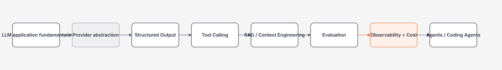

# Module 19 — AI Engineering cho .NET Backend Engineer

> Mục tiêu: xây AI application **có thể test, quan sát, bảo vệ và thay đổi provider/model**; không dừng ở việc gọi một model API.

## Hiểu trong 5 phút

AI Engineering trong roadmap này là:

```text
Business capability
        ↓
.NET application
        ↓
AI abstraction / orchestration
        ↓
Model + Retrieval + Tools
        ↓
Evaluation + Security + Observability
        ↓
Production operation
```

Không phải:

```text
prompt → model → string
```

Một AI Engineer production phải kiểm soát ít nhất 6 biến:

1. **Model** — chất lượng, latency, cost, availability.
2. **Context** — system instruction, conversation, business data.
3. **Output** — text hay structured contract.
4. **Tools** — model được phép hành động tới đâu.
5. **Evaluation** — làm sao biết version mới tốt hơn.
6. **Operations** — logs, traces, rate limit, fallback, rollback.

## Dependency

Nên biết trước:

- C#/.NET async + DI;
- HTTP/API Design;
- Security/AuthZ;
- Observability;
- Distributed Systems fundamentals.

RAG, Agents và AI Coding Agents học sau foundation này.

## Learning map



## Code đầu tiên — dùng `IChatClient`

`Microsoft.Extensions.AI` cung cấp abstraction `IChatClient` để application code không cần phụ thuộc trực tiếp vào một provider cụ thể.

```csharp
using Microsoft.Extensions.AI;

public sealed class ArchitectureTutor(IChatClient chatClient)
{
    public async Task<string> ExplainAsync(
        string topic,
        CancellationToken cancellationToken)
    {
        ChatResponse response = await chatClient.GetResponseAsync(
            [
                new(ChatRole.System,
                    "Bạn là software architect. Giải thích ngắn, có ví dụ .NET production."),
                new(ChatRole.User, topic)
            ],
            cancellationToken: cancellationToken);

        return response.Text;
    }
}
```

Điểm quan trọng không phải syntax. Boundary là:

```text
ArchitectureTutor
      ↓ depends on
IChatClient
      ↓ implemented by
OpenAI / Azure OpenAI / Ollama / another provider
```

Application service có thể được test/fake mà không gắn cứng vào SDK provider.

## Wiring với OpenAI .NET + Microsoft.Extensions.AI

Ví dụ dưới đây đọc model và API key từ environment thay vì hard-code secret:

```csharp
using Microsoft.Extensions.AI;
using OpenAI.Chat;

string model = Environment.GetEnvironmentVariable("OPENAI_MODEL")
    ?? throw new InvalidOperationException("OPENAI_MODEL is missing");

string apiKey = Environment.GetEnvironmentVariable("OPENAI_API_KEY")
    ?? throw new InvalidOperationException("OPENAI_API_KEY is missing");

ChatClient providerClient = new(model: model, apiKey: apiKey);
IChatClient chatClient = providerClient.AsIChatClient();

ChatResponse response = await chatClient.GetResponseAsync(
    "Giải thích khác nhau giữa timeout và cancellation trong distributed system.");

Console.WriteLine(response.Text);
```

Packages tương ứng cần được kiểm tra theo baseline hiện tại trước khi pin version:

```bash
dotnet add package OpenAI
dotnet add package Microsoft.Extensions.AI
dotnet add package Microsoft.Extensions.AI.OpenAI
```

## Tại sao abstraction quan trọng?

Bad:

```csharp
public sealed class OrderService
{
    private readonly ChatClient _openAi;

    // Business service phụ thuộc trực tiếp provider SDK.
}
```

Better:

```csharp
public interface IOrderRiskClassifier
{
    Task<RiskDecision> ClassifyAsync(
        OrderRiskInput input,
        CancellationToken cancellationToken);
}
```

Implementation AI nằm sau business capability:

```csharp
public sealed class AiOrderRiskClassifier(IChatClient chatClient)
    : IOrderRiskClassifier
{
    public async Task<RiskDecision> ClassifyAsync(
        OrderRiskInput input,
        CancellationToken cancellationToken)
    {
        ChatResponse<RiskDecision> result =
            await chatClient.GetResponseAsync<RiskDecision>(
                $"""
                Evaluate the order risk.
                CustomerId: {input.CustomerId}
                Amount: {input.Amount}
                Country: {input.Country}
                """,
                cancellationToken: cancellationToken);

        return result.Result;
    }
}

public sealed record OrderRiskInput(
    string CustomerId,
    decimal Amount,
    string Country);

public sealed record RiskDecision(
    string Level,
    string Reason,
    bool RequiresHumanReview);
```

Business code dùng `IOrderRiskClassifier`, không biết model/provider nào đứng sau.

## Những thứ phải học trong module

### P0

- tokens/context window ở mức application engineering;
- `IChatClient` và provider abstraction;
- streaming vs non-streaming;
- structured output;
- tool calling;
- cancellation/timeouts;
- evaluation/regression;
- AI security basics;
- telemetry, latency, token/cost.

### P1

- embeddings;
- semantic/vector search;
- RAG pipeline;
- model fallback/routing;
- prompt/model/config versioning;
- caching và rate limiting.

### P2

- fine-tuning lifecycle;
- custom model hosting;
- advanced MLOps/training infrastructure.

## Common mistakes

### 1. Trả string rồi parse thủ công

```csharp
string text = response.Text;
string level = text.Split(':')[1]; // fragile
```

Ưu tiên structured output nếu contract có cấu trúc.

### 2. Đưa authorization vào prompt

Sai:

```text
"Only delete invoices if the user is admin."
```

Prompt không phải security boundary. Tool/application service phải kiểm tra identity và policy thật.

### 3. Không truyền `CancellationToken`

AI call có thể có latency lớn hơn API/database call thông thường. Cancellation từ HTTP request phải propagate xuống provider/tool call.

### 4. Không có eval trước khi đổi prompt/model

Nếu không có dataset + metric, câu "model mới tốt hơn" chỉ là cảm giác.

## Production checklist

- [ ] secret không nằm trong source control;
- [ ] model/config lấy từ configuration;
- [ ] timeout/cancellation rõ ràng;
- [ ] structured output cho business contract;
- [ ] tool có authorization riêng;
- [ ] request/response telemetry không leak PII;
- [ ] latency/token/cost có metric;
- [ ] eval regression chạy trước release;
- [ ] có fallback/degradation strategy khi model provider lỗi;
- [ ] prompt/model/retrieval config có version.

## Học tiếp

1. [Structured Output và Tool Calling](structured-output-and-tool-calling.md)
2. [RAG, Evaluation và Observability](rag-evaluation-and-observability.md)
3. Module AI Coding Agents để hiểu agent loop, repository context, MCP, tests và PR workflow.

## Official English Sources

- Microsoft Learn — AI apps for .NET developers: https://learn.microsoft.com/en-us/dotnet/ai/
- Microsoft Learn — `IChatClient`: https://learn.microsoft.com/en-us/dotnet/ai/ichatclient
- OpenAI official .NET SDK: https://github.com/openai/openai-dotnet
- roadmap.sh AI Engineer: https://roadmap.sh/ai-engineer

## Verification metadata

- Verified: 2026-08-12
- Target: .NET 10-oriented examples
- Stable concept vs version-specific APIs: package/API versions must follow `technology-baseline.md`.
