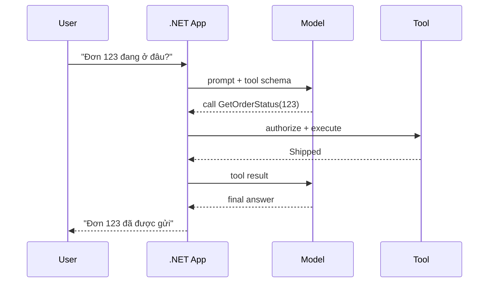

# Structured Output và Tool Calling trong .NET

## Hiểu trong 5 phút

Hai capability này giải quyết hai bài toán khác nhau:

```text
Structured Output
Model → dữ liệu có schema → application

Tool Calling
Model → yêu cầu gọi capability → application/tool → result → model
```

Nếu AI chỉ cần trả lời text, chưa cần tool.
Nếu business code cần dữ liệu chắc chắn có field, dùng structured output.
Nếu AI cần đọc/ghi hệ thống bên ngoài, dùng tool calling **nhưng authorization vẫn nằm ở application**.

---

# 1. Structured Output

## Bài toán

Không nên để business logic parse prose:

```text
Risk: HIGH
Reason: suspicious transaction
Manual review: yes
```

rồi viết:

```csharp
string[] lines = response.Text.Split('\n');
```

Contract nên là type:

```csharp
public sealed record RiskDecision(
    string Level,
    string Reason,
    bool RequiresHumanReview);
```

## Code

```csharp
using Microsoft.Extensions.AI;

public sealed class RiskClassifier(IChatClient chatClient)
{
    public async Task<RiskDecision> ClassifyAsync(
        string description,
        CancellationToken cancellationToken)
    {
        ChatResponse<RiskDecision> response =
            await chatClient.GetResponseAsync<RiskDecision>(
                $"""
                Classify this transaction risk.

                Transaction:
                {description}

                Return a concise reason.
                """,
                useJsonSchemaResponseFormat: true,
                cancellationToken: cancellationToken);

        return response.Result;
    }
}
```

### Vì sao tốt hơn string parsing?

Application nhận:

```csharp
RiskDecision decision = await classifier.ClassifyAsync(...);

if (decision.RequiresHumanReview)
{
    await reviewQueue.EnqueueAsync(decision, cancellationToken);
}
```

Business flow không phụ thuộc wording của model.

## Guardrail sau model

Structured output **không có nghĩa dữ liệu luôn hợp lệ về business**.

```csharp
private static RiskDecision Validate(RiskDecision decision)
{
    string[] allowed = ["LOW", "MEDIUM", "HIGH"];

    if (!allowed.Contains(decision.Level, StringComparer.OrdinalIgnoreCase))
    {
        throw new InvalidOperationException(
            $"Unsupported risk level: {decision.Level}");
    }

    return decision;
}
```

Có hai lớp validation:

```text
JSON/schema validation
        ↓
Business/domain validation
```

Đừng nhầm hai lớp này.

---

# 2. Tool Calling

## Mental model



Model **đề xuất** tool call.
Application **quyết định có cho phép và thực thi hay không**.

## Tool đơn giản

```csharp
using Microsoft.Extensions.AI;

static string GetOrderStatus(string orderId)
{
    return orderId switch
    {
        "123" => "Shipped",
        "456" => "Processing",
        _ => "NotFound"
    };
}

AIFunction getOrderStatus = AIFunctionFactory.Create(
    GetOrderStatus,
    name: "get_order_status",
    description: "Get current status for an order ID.");
```

Đưa tool vào options:

```csharp
ChatOptions options = new()
{
    Tools = [getOrderStatus]
};
```

Nếu pipeline dùng `FunctionInvokingChatClient`, function call có thể được thực thi tự động dựa trên `Tools`.

Application call:

```csharp
ChatResponse response = await chatClient.GetResponseAsync(
    "Order 123 đang ở trạng thái nào?",
    options,
    cancellationToken);

Console.WriteLine(response.Text);
```

## Tool production — capability-oriented

Bad:

```csharp
AIFunctionFactory.Create((string sql) => ExecuteSql(sql));
```

Bad:

```csharp
AIFunctionFactory.Create((string command) => RunShell(command));
```

Better:

```csharp
public sealed class OrderTools(
    IOrderQueryService orders,
    IAuthorizationService authorization,
    IHttpContextAccessor httpContextAccessor)
{
    public async Task<OrderStatusDto> GetOrderStatusAsync(
        string orderId,
        CancellationToken cancellationToken)
    {
        ClaimsPrincipal user =
            httpContextAccessor.HttpContext?.User
            ?? throw new UnauthorizedAccessException();

        AuthorizationResult result = await authorization.AuthorizeAsync(
            user,
            orderId,
            "CanReadOrder");

        if (!result.Succeeded)
            throw new UnauthorizedAccessException();

        return await orders.GetStatusAsync(orderId, cancellationToken);
    }
}
```

Model-facing function vẫn nhỏ:

```csharp
AIFunction function = AIFunctionFactory.Create(
    orderTools.GetOrderStatusAsync,
    name: "get_order_status",
    description: "Read the current status of an order the signed-in user is allowed to view.");
```

Architecture:

```text
Model
 ↓ requests
AI Tool
 ↓
Authorization
 ↓
Application Service
 ↓
Database/API
```

Không:

```text
Model → Database
```

---

# 3. Read tool vs Write tool

Không phải tool nào cũng cùng risk.

| Loại | Ví dụ | Default |
| --- | --- | --- |
| Read-only | get order, search docs | auto nếu AuthZ pass |
| Low-risk write | create draft | policy dependent |
| External side effect | send email | approval/rule |
| Financial/security write | refund, delete, rotate key | explicit human approval |

Ví dụ write tool cần approval token:

```csharp
public sealed record RefundRequest(
    string PaymentId,
    decimal Amount,
    string ApprovalToken);

public async Task<RefundResult> RefundAsync(
    RefundRequest request,
    CancellationToken cancellationToken)
{
    await approvalService.ValidateAsync(
        request.ApprovalToken,
        action: "refund",
        resourceId: request.PaymentId,
        cancellationToken);

    return await paymentService.RefundAsync(
        request.PaymentId,
        request.Amount,
        cancellationToken);
}
```

Agent không tự tạo ra authority chỉ vì nó sinh được `ApprovalToken` dạng text.
Token phải được backend xác minh.

---

# 4. Idempotency cho tool có side effect

Agent/model có thể retry hoặc lặp tool call.
Write tool phải nghĩ như distributed system.

```csharp
public sealed record SendInvoiceCommand(
    string InvoiceId,
    string IdempotencyKey);

public async Task<SendResult> SendInvoiceAsync(
    SendInvoiceCommand command,
    CancellationToken cancellationToken)
{
    SendResult? existing = await store.FindByKeyAsync(
        command.IdempotencyKey,
        cancellationToken);

    if (existing is not null)
        return existing;

    SendResult sent = await mailer.SendInvoiceAsync(
        command.InvoiceId,
        cancellationToken);

    await store.SaveAsync(
        command.IdempotencyKey,
        sent,
        cancellationToken);

    return sent;
}
```

Nếu không có idempotency:

```text
model retry
  ↓
SendInvoice
  ↓
email gửi 2 lần
```

---

# 5. Timeout và Cancellation

```csharp
using CancellationTokenSource timeoutCts =
    CancellationTokenSource.CreateLinkedTokenSource(requestAborted);

timeoutCts.CancelAfter(TimeSpan.FromSeconds(8));

ChatResponse response = await chatClient.GetResponseAsync(
    messages,
    options,
    timeoutCts.Token);
```

Tool cũng phải nhận token:

```csharp
public Task<OrderDto> GetOrderAsync(
    string id,
    CancellationToken cancellationToken)
{
    return repository.GetAsync(id, cancellationToken);
}
```

Nếu HTTP client đã disconnect mà tool vẫn chạy 30 giây, bạn đang đốt resource/cost không cần thiết.

---

# 6. Failure experiment

## Experiment A — model trả structured output sai

Tạm dùng provider/model không support schema hoặc tạo incompatible schema.

Quan sát:

- exception type;
- retry behavior;
- telemetry;
- API response nên là 5xx hay fallback?

## Experiment B — tool timeout

```csharp
static async Task<string> SlowTool(
    CancellationToken cancellationToken)
{
    await Task.Delay(TimeSpan.FromSeconds(30), cancellationToken);
    return "done";
}
```

Set request timeout 2 giây.

Expected:

```text
HTTP cancellation
    ↓
AI call/tool call canceled
    ↓
no orphan work
```

## Experiment C — duplicate side effect

Gọi cùng `IdempotencyKey` hai lần và chứng minh external side effect chỉ xảy ra một lần.

---

# 7. Logging nên log gì?

Nên:

```csharp
logger.LogInformation(
    "AI tool {ToolName} completed in {ElapsedMs}ms with {Status}",
    toolName,
    elapsed.TotalMilliseconds,
    status);
```

Không nên mặc định log toàn bộ:

```csharp
logger.LogInformation("Prompt: {Prompt}", prompt);
```

vì prompt/context/tool result có thể chứa PII, token, internal data.

Telemetry nên ưu tiên metadata:

```text
request id
model/provider
tool name
latency
token usage
result status
retry count
error category
```

---

# 8. Architect Perspective

Structured Output giúp giảm coupling vào prose nhưng tăng coupling vào schema.

Tool Calling giúp model hành động nhưng biến model từ "text generator" thành một actor trong trust boundary.

Mỗi tool phải trả lời:

1. identity nào đang gọi;
2. permission nào cần;
3. side effect gì;
4. retry có an toàn không;
5. timeout/cancel thế nào;
6. audit log ở đâu;
7. blast radius nếu model chọn sai tool.

## Khi không nên dùng tool calling

Nếu flow luôn cố định:

```text
validate → query DB → calculate → save
```

thì code deterministic thường tốt hơn việc để LLM quyết định bước tiếp theo.

Dùng model khi bước chọn hành động thật sự cần semantic reasoning/open-ended interpretation.

## Official English Sources

- Microsoft Learn — `IChatClient`: https://learn.microsoft.com/en-us/dotnet/ai/ichatclient
- Microsoft Learn — structured output extensions: https://learn.microsoft.com/en-us/dotnet/api/microsoft.extensions.ai.chatclientstructuredoutputextensions.getresponseasync
- Microsoft Learn — accessing data in AI functions: https://learn.microsoft.com/en-us/dotnet/ai/how-to/access-data-in-functions

## Exit Criteria

Bạn đạt chapter này khi có thể:

- [ ] viết strongly typed AI output thay vì parse text;
- [ ] tạo read-only tool;
- [ ] đặt AuthZ sau tool boundary;
- [ ] làm một write tool idempotent;
- [ ] propagate cancellation;
- [ ] giải thích khi nào deterministic workflow tốt hơn tool-calling agent.
