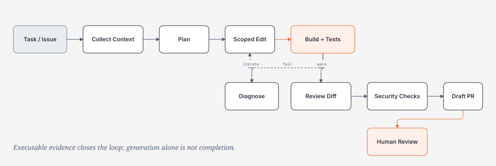
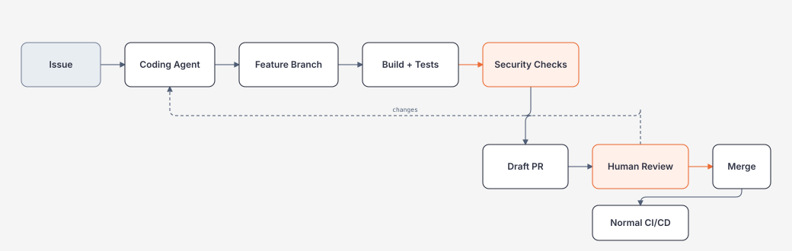

# Module 21 — AI Coding Agents

> AI Coding Agent là agent chuyên làm software engineering trên codebase: đọc repository, lập kế hoạch, sửa code, chạy command/tests và chuẩn bị thay đổi để con người review.

## Hiểu trong 5 phút

Phân biệt ba mức:

```text
Code Completion
  IDE gợi ý vài dòng code

Coding Assistant
  chat + hỏi đáp + đề xuất edit

AI Coding Agent
  inspect repo
    ↓
  plan
    ↓
  edit nhiều file
    ↓
  run commands/tests
    ↓
  inspect failures
    ↓
  iterate
    ↓
  produce diff / PR
```

Coding agent **không phải developer có toàn quyền**. Nó là một execution actor cần sandbox, permissions, test gates và review.

## Coding Agent khác Business Agent thế nào?

| Business AI Agent | AI Coding Agent |
| --- | --- |
| tool là business capability | tool là filesystem, shell, Git, CI, GitHub |
| state có thể là conversation/business workflow | state thường là repo/worktree/task/PR |
| output có thể là business action | output chủ yếu là code/diff/tests/PR |
| risk: data/tool abuse | risk: arbitrary code, secrets, supply chain, CI permissions |

Hai loại cùng dùng agent concepts nhưng trust boundary khác nhau.

## Landscape hiện tại

Các ví dụ phổ biến hiện nay:

- **OpenAI Codex** — coding agent chạy trong ChatGPT/editor/terminal/cloud workflows;
- **GitHub Copilot cloud agent / Copilot CLI** — agentic coding gắn với GitHub workflow;
- **Anthropic Claude Code** — terminal-native coding agent;
- GitHub cũng hỗ trợ third-party coding agents trong workflow GitHub, hiện bao gồm Codex và Claude ở các surface được hỗ trợ.

Tên sản phẩm thay đổi nhanh. Roadmap tập trung vào **agent loop + context + permissions + tests + review**, không phụ thuộc một vendor.

## Mental model



Agent tốt không chỉ "generate code". Nó có **feedback loop với executable evidence**.

---

# 1. Task nào hợp với coding agent?

Good candidates:

```text
- fix scoped bug có reproduction
- thêm test cho behavior rõ
- refactor có test coverage
- upgrade dependency với acceptance criteria
- tạo API endpoint theo contract rõ
- migrate repetitive code
- update docs synchronized với code
```

Risky/poorly scoped:

```text
- "rewrite architecture to microservices"
- "improve security everywhere"
- "make it fast"
- production database migration không có rollback
- rotate secrets / modify IAM với full privilege
```

Task càng mơ hồ, agent càng dễ tối ưu sai objective.

## Prompt tốt cho coding agent

Bad:

```text
Fix notifications.
```

Better:

```text
Problem:
Notifications can be sent twice when the webhook handler retries.

Expected behavior:
The same event ID must produce at most one persisted notification intent.

Constraints:
- .NET 10
- SQL Server
- do not add a new database
- preserve public API
- existing tests must pass

Required work:
1. inspect current flow and tests;
2. explain root cause;
3. implement smallest safe fix;
4. add regression test for duplicate event ID;
5. run dotnet test;
6. show changed files and remaining risks.

Do not commit or push unless explicitly authorized.
```

Prompt này cho agent:

```text
problem + expected behavior + constraints + evidence + permission boundary
```

---

# 2. Context hierarchy

Coding agent cần context theo thứ tự:

```text
Task
 ↓
Repository instructions
 ↓
Relevant code
 ↓
Tests
 ↓
Build/CI configuration
 ↓
External official docs
```

Không nên dump toàn monorepo vào prompt.

Ưu tiên context **relevant + executable**.

## Repository instructions

Một `AGENTS.md`/agent instruction file nên nói rõ:

```markdown
# Repository instructions

## Build
`dotnet build Dev.sln`

## Test
`dotnet test Dev.sln --no-build`

## Architecture constraints
- ASP.NET Core services target .NET 10.
- SQL Server is the primary relational database.
- Do not introduce a new database without an ADR.
- Prefer simple application services before adding CQRS/MediatR.

## Safety
- Never commit secrets.
- Do not change GitHub Actions permissions without explicit approval.
- Do not run destructive database commands.

## Definition of done
- code builds;
- tests pass;
- behavior has regression coverage;
- important trade-offs are documented.
```

OpenAI Codex chính thức hỗ trợ repository guidance qua `AGENTS.md`; các coding agent khác có instruction mechanisms tương tự nhưng tên/file có thể khác.

---

# 3. Agent loop phải có tests

Một implementation loop tốt:

```text
Read code
  ↓
Find behavior
  ↓
Write/confirm failing test
  ↓
Minimal change
  ↓
Build
  ↓
Test
  ↓
Inspect diff
```

Không nên:

```text
Generate 20 files
  ↓
"Looks good"
```

Ví dụ regression test:

```csharp
[Fact]
public async Task Duplicate_event_id_creates_one_notification_intent()
{
    var eventId = "evt-123";

    await sut.HandleAsync(new SourceEvent(eventId));
    await sut.HandleAsync(new SourceEvent(eventId));

    int count = await db.NotificationIntents
        .CountAsync(x => x.SourceEventId == eventId);

    Assert.Equal(1, count);
}
```

Acceptance criteria giờ trở thành executable evidence.

---

# 4. Permissions model

Agent capability nên chia lớp:

```text
Read repo                     low risk
Write working tree            medium
Run build/test                 medium
Network access                 higher
Read secrets                   high
Push branch                    high
Create PR                      controlled write
Merge PR                       very high
Production deploy              very high
```

Default nên là least privilege.

Ví dụ policy:

| Action | Agent | Human |
| --- | --- | --- |
| read source | auto | — |
| edit feature branch | auto/approved scope | review |
| run unit tests | auto | — |
| install new dependency | propose | approve if material |
| push branch | explicit permission | approve |
| merge PR | no default | approve |
| production deploy | no default | controlled pipeline |

---

# 5. Shell execution là trust boundary

Agent có shell gần tương đương một automation runner.

Nguy hiểm:

```bash
curl ... | bash
rm -rf ...
terraform apply
kubectl delete ...
dotnet ef database update --connection "$PROD"
```

Coding agent có thể đọc malicious instruction từ:

- issue body;
- README;
- dependency docs;
- fetched web page;
- test fixture;
- generated file.

Đây là prompt injection/supply-chain concern trong coding workflow.

Do đó cần sandbox/network/credential policy.

---

# 6. Human review vẫn bắt buộc

PR do agent tạo phải review như code người viết, thậm chí kỹ hơn ở:

```text
Correctness
Security
AuthZ
Concurrency
Transactions
Migration
Performance
Dependency changes
CI permissions
Secrets
Generated-code noise
```

Checklist review:

```text
- Diff có đúng scope task không?
- Agent có sửa file không liên quan không?
- Test mới có thật sự fail trước fix không?
- Có xóa/skip test để làm CI xanh không?
- Có thêm dependency không cần thiết không?
- Có broaden permission không?
- Có hard-code secret/config không?
```

---

# 7. Production workflow đề xuất



Agent không bypass delivery pipeline hiện có.

---

# 8. Exit Criteria

Bạn đạt module này khi có thể:

- [ ] phân biệt completion/assistant/coding agent;
- [ ] viết task spec có acceptance criteria;
- [ ] tạo repository instructions;
- [ ] giới hạn agent permissions;
- [ ] bắt agent chạy build/test và show diff;
- [ ] thiết kế human review gate;
- [ ] giải thích prompt injection qua repository content;
- [ ] không cho agent tự merge/deploy production theo mặc định.

## Học tiếp

1. [Repository Context, Instructions và MCP](repository-context-mcp-and-instructions.md)
2. [Safe Agentic Coding Workflow](safe-agentic-coding-workflow.md)

## Official English Sources

- GitHub Docs — Copilot agents: https://docs.github.com/en/copilot/concepts/agents
- GitHub Docs — third-party coding agents: https://docs.github.com/en/copilot/concepts/agents/about-third-party-coding-agents
- OpenAI Codex: https://openai.com/codex/
- OpenAI — running Codex safely: https://openai.com/index/running-codex-safely/
- Anthropic Claude Code docs: https://docs.anthropic.com/en/docs/claude-code/getting-started
- roadmap.sh AI Agents: https://roadmap.sh/ai-agents

## Verification metadata

- Verified: 2026-08-12
- Product-specific capabilities are time-sensitive; verify official docs before relying on exact UI/model/permission behavior.
