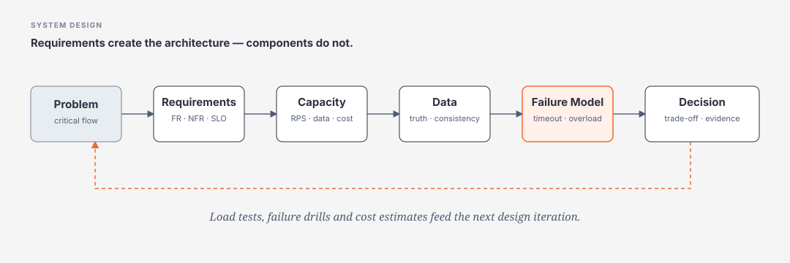

# Module 24 — System Design

> [← Master Roadmap](../00-roadmap/master-roadmap.md) · [Software Architecture →](../25-software-architecture/README.md)

<div class="lesson-meta">
  <span><strong>Priority</strong>&nbsp;P0</span>
  <span><strong>Mode</strong>&nbsp;requirements → evidence → trade-off</span>
  <span><strong>Use</strong>&nbsp;production design + interview + architecture review</span>
</div>

System Design là bước chuyển từ **“biết component”** sang **“biết ghép component thành hệ thống có thể chứng minh được”**.

Không học kiểu:

```text
Load Balancer + Cache + Queue + Database + CDN = scalable system
```

Mà luôn bắt đầu từ:

```text
Business problem
    ↓
Functional Requirements
    +
Non-functional Requirements
    ↓
Workload / Capacity Estimates
    ↓
Data + Consistency
    ↓
Failure Model
    ↓
Architecture Options
    ↓
Trade-offs
    ↓
Evidence / Tests / Cost
```



<div class="key-takeaway" markdown>
<strong>Rule quan trọng</strong>

Nếu chưa có workload, latency/SLO, source of truth và failure model thì chưa nên chọn Redis, Kafka, Kubernetes, sharding hay multi-region.
</div>

## Learning path

| Guide | Priority | Bạn phải làm được |
|---|---:|---|
| [36 Concepts & Trade-offs](concepts-and-tradeoffs.md) | **P0** | hiểu component bằng problem/failure/trade-off, không học thuộc |
| [Requirements, NFR & Capacity Estimation](requirements-nfr-and-capacity-estimation.md) | **P0** | chuyển yêu cầu mơ hồ thành numbers, limits và SLO |
| [Traffic, Load Balancing, CDN & Cache](traffic-load-balancing-cdn-and-cache.md) | **P0** | scale request path và tránh bottleneck/hotspot |
| [Data, Replication, Partitioning & Consistency](data-partitioning-replication-and-consistency.md) | **P0** | chọn source of truth, shard key, consistency và query shape |
| [Async, Queue, Backpressure & Reliability](async-queues-backpressure-and-reliability.md) | **P0** | tách arrival rate khỏi processing rate và thiết kế failure semantics |
| [Availability, Multi-region, DR, Security & Cost](availability-multiregion-dr-security-and-cost.md) | **P0/P1** | thiết kế theo SLO/RTO/RPO thay vì mặc định active-active |
| [Case Studies & Design Review Workflow](case-studies-and-design-review.md) | **P0** | áp dụng framework vào URL Shortener, Notification, Checkout và AI Assistant |
| [Production Projects & Evidence](production-projects-and-evidence.md) | **P0** | biến design thành project runnable + metrics + failure drills |
| [References](references.md) | source | official/current sources + user-supplied breadth sources |

## Hiểu trong 5 phút — 10 câu hỏi phải trả lời

1. **Who** — ai dùng hệ thống, flow nào critical?
2. **What** — phải làm gì, không làm gì?
3. **How much** — RPS, concurrency, volume, bandwidth, growth?
4. **How fast** — P50/P95/P99, deadline?
5. **How reliable** — SLO, RTO, RPO, correctness?
6. **Where is truth** — source of truth và consistency ở đâu?
7. **How does it scale** — stateless, cache, partition, queue, replicas?
8. **How does it fail** — timeout, duplicate, stale, overload, zone/region loss?
9. **How is it operated** — deploy, observe, recover, replay, rollback?
10. **Why this design** — tại sao tốt hơn phương án đơn giản hơn?

## Framework 8 bước

### Step 1 — Clarify requirements

```text
Functional
- user actions
- admin/operator actions
- integrations
- critical flows

Non-functional
- scale
- latency
- availability
- consistency
- durability
- security/privacy
- compliance
- cost
```

### Step 2 — Estimate workload

```text
DAU
requests/user/day
average RPS
peak multiplier
peak RPS
read/write ratio
payload size
storage/day
retention
bandwidth
concurrency
```

Không cần số tuyệt đối chính xác; cần assumptions rõ và order-of-magnitude hợp lý.

### Step 3 — Define data and ownership

```text
entities
relationships
access patterns
source of truth
transaction boundary
partition key
retention
privacy class
```

### Step 4 — Draw simplest request path

```text
Client
  ↓
API
  ↓
Application
  ↓
Database
```

Chỉ thêm component khi requirement tạo pressure.

### Step 5 — Find bottlenecks

```text
CPU
memory
DB connections
DB IOPS
hot key
network bandwidth
external API quota
queue consumers
locks
single region
```

### Step 6 — Add scale/reliability mechanisms

```text
stateless scale-out
load balancing
cache/CDN
partitioning
queue/backpressure
replication
failure isolation
```

### Step 7 — Design failure behavior

```text
timeout
retry
unknown outcome
duplicate
partial commit
stale cache
queue backlog
node/zone/region loss
operator mistake
```

### Step 8 — Prove the design

```text
load test
failure injection
capacity model
trace
SLO dashboard
restore test
ADR
cost estimate
```

## Core component map

```text
Clients
DNS
CDN / Edge
Load Balancer / Gateway
Stateless API
Cache
SQL / NoSQL / Search
Object Storage
Queue / PubSub / Stream
Workers
Observability
Identity / Security
Multi-zone / Multi-region
```

Nhưng **component không phải mục tiêu**. Học [36 Concepts & Trade-offs](concepts-and-tradeoffs.md) để hiểu vì sao mỗi component tồn tại và failure nào nó tạo thêm.

## Ví dụ — từ requirement tới decision

Không viết:

```text
Use Redis because cache is fast.
Use Kafka because system is large.
Use microservices for scalability.
```

Viết:

```text
Requirement:
P95 GET /products < 150 ms at 20k RPS.
Catalog changes ~20 times/minute.
Staleness <= 30 seconds is acceptable.

Baseline:
Read SQL directly.
Measured DB saturation appears near target peak.

Option:
Cache-aside, TTL 20–30s + invalidation on write.

Gain:
reduce DB read load and latency.

New failures:
stale data, cache outage, stampede.

Decision:
Use cache only after load evidence justifies it;
bounded DB fallback and stampede protection required.
```

## Production System Design ≠ Interview-only

Interview có thể dừng ở diagram/trade-off. Production phải thêm:

```text
code
schema + constraints
IaC
deployment
observability
load test
failure drill
restore/recovery
security boundary
runbook
cost
migration path
```

Vì vậy module có [Production Projects & Evidence](production-projects-and-evidence.md).

## System Design ↔ Azure

System Design trả lời:

```text
we need a durable work queue with DLQ + duplicate handling
```

Azure track giúp map requirement đó sang candidate như Service Bus và review quota/operations.

Không đảo ngược thành:

```text
we have Service Bus → let's design around it
```

→ [Cloud & Azure](../14-cloud/README.md)

## System Design ↔ Software Architecture

System Design tập trung workload/system behavior:

```text
capacity
traffic
data
consistency
reliability
failure
cost
```

Software Architecture tập trung cấu trúc/evolution:

```text
boundaries
quality attributes
domain ownership
architecture styles
coupling
evolution/governance
```

→ [Module 25 — Software Architecture](../25-software-architecture/README.md)

## Scope từ các tài liệu tham khảo user cung cấp

Ba repo được dùng để audit coverage:

- `karanpratapsingh/system-design`: networking → data → messaging/architecture → reliability/security → case studies.
- `ashishps1/awesome-system-design-resources`: core concepts, API/database/cache, async/distributed patterns, trade-offs, interviews và engineering readings.
- `mehdihadeli/awesome-software-architecture`: styles/patterns, cloud/distributed/messaging/data architecture.

Course **không sao chép danh sách links**; nó chuyển scope thành các bài `problem → mechanism → failure → evidence → trade-off`.

## Quality gate

Một System Design exercise chỉ hoàn thành khi có:

```text
requirements
+ assumptions
+ capacity estimates
+ architecture diagram
+ data model
+ failure analysis
+ trade-offs
+ security/privacy
+ observability
+ cost
+ migration/evolution path
```

Một production project phải thêm runnable evidence.
